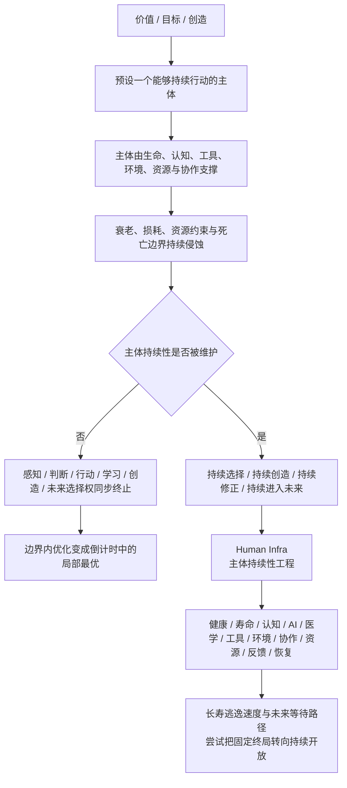
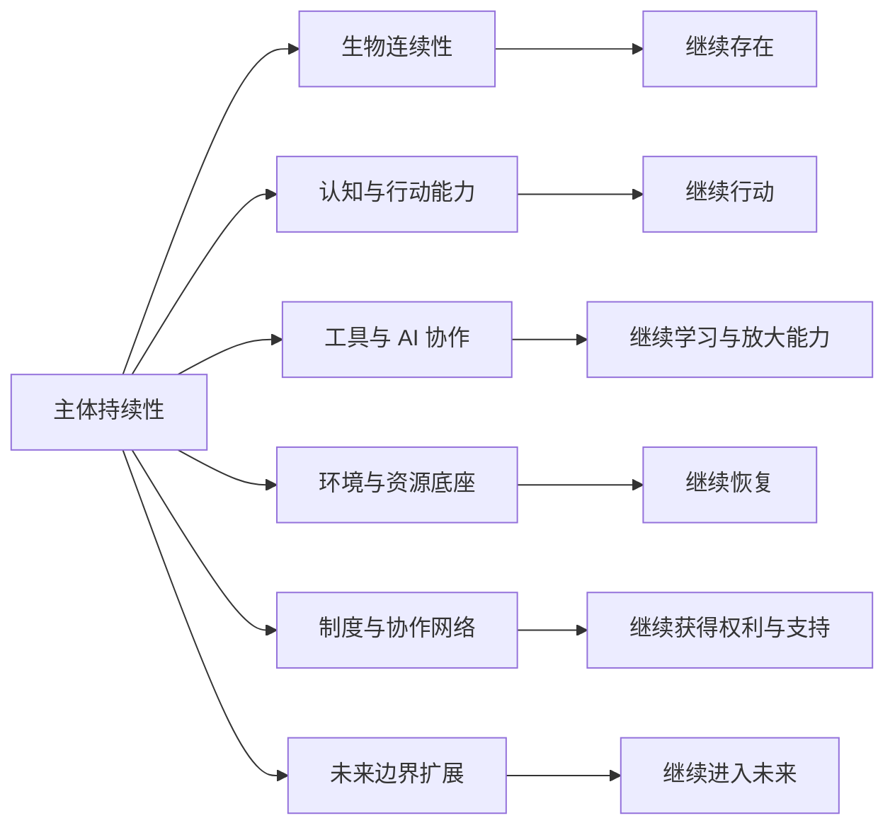
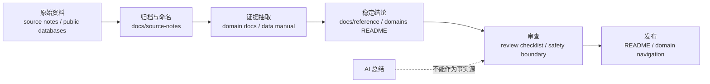
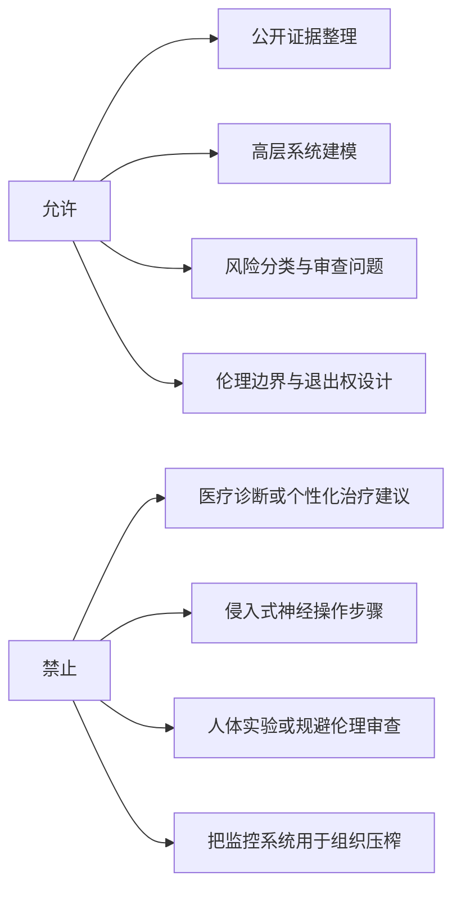

# Human Infra

[](https://github.com/tradecatlabs/human_infra/actions/workflows/check.yml)
[](docs/reference/repository-standards.md)
[](docs/README.md)
[](LICENSE.md)
[](docs/reference/ethics-and-safety-boundaries.md)
[](https://t.me/human_infra)

Human Infra 是一个研究“能够继续做事的主体”如何被维护、延展和升级的基础设施知识仓库。

它的核心判断是：一切价值、目标与创造，都预设一个仍能感知、判断、行动、学习和修正的主体。主体由生命、认知、工具、环境、资源与协作共同支撑，属于有限系统。

> Human Infra 的本质，是对主体持续性进行工程化建设。

## 核心命题

主体持续性是价值实现的边界条件。

| 问题类型 | 典型问题 | Human Infra 判断 |
| --- | --- | --- |
| 边界内优化 | 做什么、怎么做、怎样更快、怎样产出更多 | 重要，但仍是主体有限持续性内部的派生问题 |
| 边界条件问题 | 主体能否继续存在、继续行动、继续学习、继续选择 | 所有事业、成果、排序与未来可能成立的前提 |

如果主体终止，感知、判断、行动、学习、创造与未来选择权同步终止。因而在既定寿命、能力与死亡边界内优化“做什么”，只是倒计时中的局部最优；维护、延展并升级“能够继续做事的主体”，才是更上位的基础设施问题。

## 理论链路



Human Infra 优化持续选择、持续创造、持续修正和持续进入未来的资格，单次产出只是其中一层。长寿逃逸速度、记忆编辑、去未来路径、AI 工具、公共健康、法律身份、住房、食物、水、能源、交通、教育、照护、应急和社会服务，都只有在这个框架下才属于同一个对象。

## 多视角价值解析

Human Infra 可以从多条路径理解项目价值。当前 README 保留三个核心视角，完整说明见 [价值理解维度](docs/explanations/value-lenses.md)。

| 视角 | 核心问题 | 价值说明 |
| --- | --- | --- |
| 主体持续性 | 主体能否继续存在、继续行动、继续学习、继续修正、继续选择 | 一切目标、创造和排序都预设一个仍然能够行动的主体；维护主体持续性，是所有边界内优化成立的前提 |
| 通用资源预算增量 | 寿命、健康寿命、有效时间、主观时间和相对时间被改变后，主体可支配的注意力、时间、精力、认知和行动预算是否增加 | 寿命延长、健康寿命扩展、长寿逃逸、未来等待、工具放大和恢复系统，会改变人类完成任务所依赖的通用资源预算 |
| 稀缺问题与反稀缺工程 | Human Infra 缓解了哪些限制主体持续行动、完成任务和进入未来的底层稀缺 | 寿命、健康寿命、有效时间、注意力、认知、恢复、行动能力、技术可及性和未来选择权的稀缺，是所有下游目标共同面对的约束 |

这三个视角可以合并成一条价值链：

```text
主体持续窗口被延展
  -> 底层稀缺约束被缓解
  -> 通用资源总预算增加
  -> 单次任务成本相对下降
  -> 有效行动密度上升
  -> 未来任务机会增加
  -> 主体持续性边界进一步被延展
```

### 有效永生的加速回报飞轮

有效永生不是单纯“活得更久”，而是把主体带入一个由时间、能力、技术和可能性空间共同驱动的复利系统。

```text
有效永生
  -> 主体持续时间延长
  -> 学习、试错、积累、修正轮次增加
  -> 经验、能力、资源、信誉、协作网络增长
  -> 长期目标失败成本下降
  -> 更容易等待、接触、采用、整合新技术
  -> 技术增强身体、认知、注意力、记忆、行动能力
  -> 单位时间行动质量与创造能力提高
  -> 可解决问题范围扩大
  -> 可能性空间拓展
  -> 更多资源与能力进入下一轮积累
  -> 技术采用、自我升级、系统协作加速
  -> 主体持续性进一步增强
  -> 加速回报飞轮形成
  -> 主体持续性、能力系统、技术系统、可能性空间相互强化
```

这条链路对应 Human Infra 对加速回报定律的转译：技术进步降低下一轮创新成本，而主体持续性提升降低长期目标的失败成本。时间不只是倒计时，也可以成为能力、资源和可能性空间复利增长的底座。

## 研究范围

Human Infra 用“主体持续性”作为纳入标准，避免把所有话题混成一个筐：某条线路是否增强主体继续存在、继续行动、继续修正和继续选择的能力。

| 层级 | 关注对象 | 代表线路 |
| --- | --- | --- |
| 个体运行系统 | 主体是否可被测量、反馈、恢复和长期维护 | Bryan Johnson / Blueprint、自我量化、可穿戴、PROMIS、WHO ICF |
| 生物与健康连续性 | 身体、寿命、疾病、康复、照护和药物是否支撑长期行动 | 长寿证据、营养代谢、基因组稳定性、端粒维护、蛋白稳态、线粒体、细胞衰老、细胞外基质与糖化、微生物生态、干细胞储备、肝肾清除、消化屏障与吸收、呼吸氧合、血液氧运与止血、内分泌激素调节、淋巴与脑淋巴清除、体液电解质酸碱稳态、热稳态、身体活动、心血管韧性、肌骨完整性、皮肤屏障与伤口愈合、泌尿生殖连续性、生殖与生育连续性、细胞重编程、基因治疗与基因编辑递送安全、生物年龄钟验证、多组学个人基线、工程细胞疗法、类器官与组织芯片、异种移植与工程器官替换、纳米医学与靶向递送、AI 药物发现与蛋白设计、表观遗传编辑、再生医学、癌症控制、免疫维护、抗微生物韧性、生物停滞、康复功能、口腔健康、罕见病诊断漫游、多病共存多重用药、照护转移、居家/缓和/安宁疗护、医疗解释文化中介、患者倡导共同决策 |
| 神经与身份连续性 | 大脑、记忆、意识、人格和行动能力是否保持为同一主体 | 神经连续性、感官连续性、记忆编辑、去具身中枢生命系统、脑保存连接组与仿真假设、认知退行防控 |
| 认知、心理与行动能力 | 判断、学习、注意力、心理稳定、压力恢复和高压表现是否可持续 | 注意力与执行控制、学习与技能获得、认知增强、心理健康与情绪稳定、抑郁心境功能、焦虑压力威胁调节、创伤/PTSD 恢复、精神病性现实检验、双相情绪周期稳定、ADHD 执行功能、自闭神经多样性支持、进食障碍营养身体连续性、睡眠与恢复、疼痛与痛苦控制、AI 协作、外部记忆 |
| 工具、测量与反馈 | 工具、AI、数据和反馈系统是否放大主体能力而不侵蚀主体权利 | 人机协作、AI 代理安全、安全关键软件与形式化方法、测量反馈、生命路径预测、个人健康记录、可穿戴、患者数据可携带、健康数据隐私治理、邮箱账号恢复、手机号 SIM 携转安全、MFA/passkey 凭证恢复、密码管理器密钥库、云备份文件同步数据可携带、消息联系人图谱可携带、域名 DNS Web 存在、平台账号停权申诉、个人计算设备生命周期维修、家庭网络路由器 IoT 安全、软件供应链依赖来源证明、软件更新漏洞补丁、开源维护者可持续、PKI 证书密码信任、云服务退出互操作、API 平台运行时依赖、日历排程预约、通知警报路由、提醒闹钟例行任务、会议视频远程协作、文件捕获 OCR PDF 记录流、搜索索引发现检索、个人自动化集成工作流、协作文档权限版本、后量子密码与长期数据安全、长期数字保存与格式迁移、隐私保护计算、知识图谱与语义互操作、模型卡与 AI 审计、可信科研传播、研究参与者同意、样本库保管链、纵向队列随访、登记与真实世界数据治理、仪器传感器校准维护、功能与生活质量结局、人因工效、认知负荷测量、疲劳风险、情境感知、交接清单、事件学习、自动化监督、告警疲劳 |
| 环境、资源与风险底座 | 生活环境和资源是否让人有继续行动的现实条件 | 星球健康与环境、天气气候观测与预报、社会决定因素与社区脆弱性、资源与社会基础设施、食物安全与营养可及、水卫生连续性、能源可及与韧性、财务韧性与资源可及、金融包容与支付系统、保险与风险转移、医疗服务连续性、公共卫生实验室与诊断能力、血液器官组织生物警戒、健康劳动力容量、社区健康工作者与同伴支持、照护与长期照护、住房与建成环境、建筑消防与生命安全规范、住所进入钥匙门禁、家用电器维护维修、家庭冷藏食品保存、烹饪备餐厨房安全、洗衣衣物鞋履卫生、家庭清洁消毒害虫控制、邮件包裹投递自提、家庭维修承包商、交通接入与日常移动、空间定位导航与位置基础设施、供应链连续性、关键矿物与材料韧性、制造与维修能力、产品安全与召回系统、废弃物与危险材料连续性、辐射核安全防护、化学安全与中毒控制、健康经济与价值评估、免疫与公共卫生监测、动物健康与 One Health 界面、母婴儿童早期生命、患者安全与组织学习、风险工程、人身安全与暴力预防、应急准备与响应、应急预警与通信、家庭应急准备与韧性、灾后恢复与救济连续性、合成生物学与生物安全、空间与极端栖居、辅助技术、物质暴露控制、气候韧性、电网可靠性与韧性、水务污水公用事业、燃料热能服务、公共交通运营连续性、关键基础设施生命线互依赖、公用事业可负担性与断供保护 |
| 制度与协作网络 | 身份、权利、服务、信息环境和社会协作是否把人接入可恢复的公共系统 | 治理与主体权利、法律身份与民事登记、司法可及与法律援助、公民参与与选举接入、公民数据与开放政府透明、公共采购与合同能力、迁移与流离失所人道连续性、社会保护与福利递送、公共服务设计与可达性、行政负担与程序摩擦、数字身份安全、数字包容与连接、媒体信息素养与公共图书馆、社会连接、目的意义、精神照护、文化身份、艺术创造、休闲恢复、叙事身份、仪式过渡、尊严人格、劳动力与就业服务、职业与工作设计、时间分配与有效时间、托育与家庭连续性、信息完整性与信任、健康素养导航、社区资源导航、劳动权利、教育记录核验、职业证照认证、技能胜任力凭证、继续教育再认证、学徒制工作中学习、可验证凭证钱包、工资雇佣记录、税务申报记录、社会保险收入记录、退休养老金计划、失业保险工资记录、工伤职业伤害权益、家庭医疗假岗位保护、带薪病假/家庭假工资替代、孕产育儿工作连续性、合理便利复工、残障收入与工作能力福利、家庭照护者喘息与工作连续性、生命事件记录、姓名变更同步、地址居住地邮件路由、家庭组成资格关系、家庭法监护抚养、亲属照护寄养收养、银行账户访问、债务义务救济、不动产权属地契、驾照车辆登记、护照旅行证件、合同订阅账单、死亡证明与死因记录、葬礼火化土葬与遗体处置、墓地纪念与遗体位置、丧亲假与悲伤支持、遗属福利死亡通知、寿险受益人理赔、遗产清单资产负债交接、死亡后账户关闭服务取消、公证文件认证签名、公民国籍无国籍、移民居留工作授权、庇护难民保护、拘押羁押监管状态、非自愿治疗权利、法院通知缺席判决、犯罪记录救济、学校入学出勤、特殊教育 IEP/504、校餐营养、学校健康服务、通学安全、纪律排除约束、学校心理健康、学校气候欺凌暴力预防、高等教育入学转学衔接、学生资助奖助学金、学业指导学位进度、校园基本需求、校园残障便利、校园心理危机支持、校园安全 Title IX/Clery、国际学生 SEVIS 身份、迁移与人道服务 |
| 文明连续性与集体安全 | 社会是否还能维持最低和平、通信、公共行政、宏观稳定和公共廉洁 | 武装冲突平民保护、和平建设与冲突预防、政府连续性与公共行政韧性、电信网络韧性、宏观经济货币财政稳定、反腐败与公共廉洁问责 |
| 未来边界扩展 | 主体持续性边界能否从固定终局转向持续开放 | 长寿逃逸速度、未来等待、相对论时间差分、生物停滞、去具身路径、分子递送、药物发现加速、脑信息连续性和长期数字连续性 |



首批真实应用和文献索引见 [真实应用与文献](docs/reference/applications-and-literature.md)。

## 快速入口

| 你想做什么 | 入口 | 说明 |
| --- | --- | --- |
| 理解核心理论 | [核心命题](#核心命题) | 主体持续性为什么是价值实现的边界条件 |
| 查看理论链路 | [理论链路](#理论链路) | 从价值、主体、死亡边界到 Human Infra 的因果链 |
| 查看研究范围 | [研究范围](#研究范围) | 哪些领域属于主体持续性工程，以及为什么属于 |
| 从多视角理解项目价值 | [多视角价值解析](#多视角价值解析) / [完整文档](docs/explanations/value-lenses.md) | 主体持续性、通用资源预算增量和反稀缺工程视角 |
| 理解有效永生的复利效应 | [有效永生的加速回报飞轮](#有效永生的加速回报飞轮) / [论文草案](docs/explanations/effective-immortality-acceleration-flywheel.md) / [证据矩阵](docs/source-notes/2026-06-28-effective-immortality-flywheel-evidence-matrix.md) | 主体持续时间、能力升级、技术采用和可能性空间如何互相强化 |
| 先理解项目全貌 | [docs/README.md](docs/README.md) | 文档系统入口与推荐阅读顺序 |
| 查看领域边界 | [docs/reference/domain-map.md](docs/reference/domain-map.md) | Human Infra 的子域地图和拆分原因 |
| 查看先验追问域索引 | [docs/reference/transcendental-domain-index.md](docs/reference/transcendental-domain-index.md) | 从“有效永生何以可能”进入 A-K 主干研究域 |
| 查看研究域图谱 | [docs/reference/research-domain-atlas.md](docs/reference/research-domain-atlas.md) | 从有效永生先验条件生成研究域的规则、当前域地图和域判定契约 |
| 查看潜在研究域雷达 | [docs/reference/research-domain-radar.md](docs/reference/research-domain-radar.md) | 持续调研中的候选研究域、来源信号和晋升触发条件 |
| 查看 v0.1 项目边界 | [docs/reference/project-boundary-v0.1.md](docs/reference/project-boundary-v0.1.md) | 当前公开版本里 Human Infra 是什么、不是什么、材料应该落到哪里 |
| 查看伦理与安全红线 | [docs/reference/ethics-and-safety-boundaries.md](docs/reference/ethics-and-safety-boundaries.md) | 医疗、神经、生命支持和组织使用边界 |
| 查看证据规则 | [docs/reference/evidence-policy.md](docs/reference/evidence-policy.md) | 如何区分原始资料、证据和稳定结论 |
| 查看定量预测模型 | [模型说明](docs/explanations/life-path-prediction-model.md) / [模型契约](docs/reference/life-path-prediction-model-contract.md) / [模型治理](docs/reference/life-path-prediction-model-governance.md) / [科研工具包](docs/reference/research-model-visualization-toolkit.md) | 如何量化判断技术、因素和干预对寿命、有效时间、主观时间、相对时间和未来选择权的影响 |
| 整理论文、书籍、工具和案例 | [资料卡片制度](docs/reference/source-card-system.md) / [资料卡片模板](docs/templates/research-card.md) | 把外部资料转成可复用语料、模型变量和 Web 展示材料 |
| 打开正式 Web 应用 | [web/README.md](web/README.md) / [首页源文件](web/src/pages/index.astro) | Astro + D3 多页应用，承载书籍转译、科研叙事、预测模型和交互图表 |
| 复用 arXiv 论文页框架 | [工具说明](tools/arxiv-html-paper/README.md) / [消费契约](tools/arxiv-html-paper/CONTRACT.md) / [消费指南](tools/arxiv-html-paper/CONSUMER_GUIDE.md) / [工具链分析](docs/reference/arxiv-html-papers-toolchain.md) | 把 arXiv HTML papers 的 CSS、JS、字体、控件和 Astro 模板沉淀成可复制、可治理、可迁移的工具链 |
| 查看有效永生飞轮论文页 | [页面源文件](web/src/pages/papers/effective-immortality-flywheel.astro) / [论文草案](docs/explanations/effective-immortality-acceleration-flywheel.md) | 独立 arXiv-style 页面，不覆盖旧 `/paper/`，用于展示有效永生飞轮的变量、假设、证据脊梁和研究路线 |
| 查看度规红移递归等待论文页 | [页面源文件](web/src/pages/papers/metric-redshift-recursive-waiting.astro) | 独立 arXiv-style 页面，提出可控强红移等待区、固有时差分和等待-升级递归循环假设 |
| 查看可控度规等待室假设论文页 | [页面源文件](web/src/pages/papers/controllable-metric-waiting-room-hypothesis.astro) / [收口记录](docs/source-notes/2026-06-29-controllable-metric-waiting-room-hypothesis-revision-notes.md) | 独立 arXiv-style 页面，提出可控度规等待室、固有时差分、退出采用、递归等待和净主体持续性增益模型 |
| 打开 Web 看板 | [human-infra-dashboard.html](human-infra-dashboard.html) | 静态三块布局看板，用于演示生命路径预测模型、参数控件和治理门禁 |
| 查看奇点专项展示 | [singularity-human-infra.html](singularity-human-infra.html) | 将《奇点更近》学习资料转译为 Human Infra 的价值展示、预测模型和 D3 可视化 |
| 查看真实应用与文献 | [docs/reference/applications-and-literature.md](docs/reference/applications-and-literature.md) | 真实项目、机构资料、论文和数据源索引，覆盖个体、家庭、社区、医疗、公共服务、环境和高风险技术 |
| 分享项目 | [docs/how-to/share-human-infra.md](docs/how-to/share-human-infra.md) | 对外介绍 Human Infra 的标题、主线、短推文模板和边界 |
| 贡献文档 | [docs/how-to/contribute-docs.md](docs/how-to/contribute-docs.md) | 文档贡献流程 |
| 加入社区 | [Telegram](https://t.me/human_infra) | 讨论 Human Infra、长寿证据、未来等待路径和研究资料 |
| 运行质量检查 | [docs/how-to/run-quality-checks.md](docs/how-to/run-quality-checks.md) | 本地和 CI 的检查命令 |
| 查看所有子域 | [domains/README.md](domains/README.md) | 可独立演化的研究域入口 |
| 查看细胞重编程谱系 | [Cellular Reprogramming](domains/cellular-reprogramming/README.md) | 从山中因子、部分重编程到化学重编程、AI 因子设计和表观遗传编辑的机制边界 |
| 查看结构决策 | [docs/decisions/README.md](docs/decisions/README.md) | ADR 与仓库重组决策 |

## 真实应用速览

| 层级 | 代表资料 | 关注问题 |
| --- | --- | --- |
| 个体运行系统 | Bryan Johnson / Blueprint、Apple Heart Study、PROMIS、WHO ICF | 人如何被测量、反馈、恢复和评估 |
| 健康与照护底座 | WHO UHC、WHO Primary Health Care、WHO mhGAP、WHO ICOPE、CDC Caregiving | 人能否获得医疗、心理健康、康复、长期照护和危机支持 |
| 健康数据与患者访问 | ONC Get It, Check It, Use It、USCDI、TEFCA、CMS Patient Access、CMS Blue Button、HL7 FHIR/SMART | 人能否跨机构获取、核对、携带和授权使用自己的健康与保险数据 |
| 远程照护与居家监测 | Telehealth.HHS.gov、HRSA Telehealth、CMS/Medicare Telehealth、HHS Remote Patient Monitoring、FDA Digital Health | 医疗和照护能否跨越距离、行动限制、慢病随访和居家连续性断点 |
| 健康数据治理与隐私 | HHS HIPAA、Common Rule、NIST Privacy Framework、NIST CSF、NIH GDS、GA4GH、ONC Information Blocking | 敏感健康、基因、行为和神经数据能否在同意、退出、安全和用途边界内支撑研究与照护 |
| 功能、生活质量与患者结局 | PROMIS、WHO ICF、EQ-5D、ICHOM、PRO-CTCAE、WHOQOL | 人是否真的更能行动、参与、沟通、恢复并承受生活，而不只是替代指标变好 |
| 价值、成本与疾病负担 | IHME GBD、WHO Global Health Estimates、WHO-CHOICE、NICE HTA、ICER、AHRQ MEPS | 稀缺医疗和公共资源如何在疾病负担、成本效果、公平、权利和主体体验之间被审查 |
| 免疫屏障与公共卫生监测 | WHO immunization、IA2030、CDC NNDSS、WHO GISRS、IHR、IPC、NHSN、GLASS、CDC NWSS | 群体免疫、早期发现、感染防控、耐药治理和废水信号能否防止风险扩散到个体 |
| 传染病暴发响应执行 | CDC case investigation/contact tracing、CDC testing、FDA COVID-19 tests、CDC masks/ventilation、OSHA respiratory protection、ASPR TRACIE、ASPR SNS、CDC NWSS | 病例、接触者、学校、工作场所、医疗系统、物资和社区预警能否在暴发中转化为连续行动 |
| 危险材料与工业事故执行 | Ready.gov chemical、EPA EPCRA/RMP/CAMEO、OSHA PSM/HAZWOPER、PHMSA ERG、FEMA NIMS、HHS CHEMM、NOAA OR&R | 化学释放、工业过程、运输、去污分诊、响应者安全、油污和电池热失控能否被转化为连续行动 |
| 母婴儿童早期生命 | WHO maternal/newborn/child health、WHO growth standards、Nurturing Care、CDC PRAMS、World Bank ECD | 孕产、新生儿、儿童健康、生长、照护和早期发展如何塑造长期主体能力 |
| 患者安全与组织学习 | WHO Patient Safety、AHRQ TeamSTEPPS、CUSP、SOPS、IHI RCA2 | 医疗照护组织能否把错误、交接失败和近失误转化为系统学习，而不是重复伤害 |
| 社会决定因素与社区脆弱性 | WHO SDOH、Healthy People SDOH、CDC/ATSDR SVI、CDC/ATSDR EJI、CDC PLACES、USDA Food Access、CMS AHC | 居住地、资源、污染、食物、服务密度和社会需求如何改变生命路径风险分布 |
| 药品与治疗连续性 | WHO Essential Medicines、WHO Medication Without Harm、FDA Drug Shortages、DailyMed、Medicare Part D、CDC Medication Safety | 关键药物能否可得、可负担、不断供，并被安全理解和使用 |
| 家庭与照护连续性 | World Bank Childcare、ACF OCC/CCDF、ChildCare.gov、DOL Childcare、Census Child Care | 托育、早教、养育支持和父母工作连续性是否支撑儿童与成年人 |
| 学习与就业底座 | How People Learn、O*NET、World Bank Jobs、DOL ETA、Apprenticeship.gov、My Next Move | 能力能否转成工作、收入、职业导航、再培训和转岗路径 |
| 健康劳动力容量 | WHO Health Workforce、WHO Global Strategy on Human Resources for Health、HRSA Health Workforce、BLS Healthcare Occupations | 医生、护士、公共卫生人员、社区健康工作者和照护劳动力是否足以把医学技术转化为真实服务 |
| 劳动力与就业服务 | CareerOneStop、DOL ETA/WIOA、Apprenticeship.gov、O*NET、My Next Move、Job Accommodation Network | 就业服务、劳动力发展、职业信息和合理便利能否把学习能力转化为收入、角色和长期任务入口 |
| 劳动权利与工作场所保护 | ILO International Labour Standards、DOL WHD/FLSA、OSHA workers、EEOC、DOL OLMS | 进入工作之后，工资工时、安全权利、反歧视、申诉和组织权是否能保护人的长期运行 |
| 社会生活底座 | WHO SDOH、UN-Habitat Housing、ILO Social Protection、FAO SOFI、World Bank Energy、WHO/UNICEF JMP | 住房、收入、食物、水、能源和社区是否支撑长期生活 |
| 公共福利与服务递送 | USA.gov Benefit Finder、Performance.gov CX、Medicaid.gov、SNAP、SSI、LIHEAP、Administrative Burden | 资格、申请、续期、证明、等待、申诉和人工帮助是否把制度转成实际支持 |
| 公共服务设计与可达性 | Digital.gov、USWDS、Performance.gov CX、Section508.gov、PlainLanguage.gov | 公共服务、表单、无障碍、人工帮助和反馈路径能否把名义权利转化为可完成任务 |
| 行政负担与程序摩擦 | Administrative Burden、Performance.gov CX、Digital.gov、OMB Customer Experience、PlainLanguage.gov | 学习成本、心理成本、合规成本、证明、等待、续期和申诉如何消耗主体有效时间与注意力 |
| 社区资源与转介网络 | 211、Open Referral HSDS、Gravity Project、CMS AHC、ACL Eldercare Locator | 人能否找到本地服务、完成转介、获得回访，并避免被资源目录和服务碎片化排除 |
| 社区健康工作者与同伴支持 | WHO CHW guideline、CDC CHW、HRSA CHW Training、SAMHSA peer support | 社区中介、同伴支持和导航员能否把医疗、公共卫生、社会服务与恢复支持转化为日常行动 |
| 金融包容与支付系统 | World Bank Financial Inclusion、Global Findex、World Bank Payment Systems、FDIC Household Survey、CFPB complaints、Federal Reserve Payments Study | 账户、支付、汇款、数字金融服务和消费者保护能否让收入、福利、救济与交易稳定流动 |
| 经济与金融底座 | World Bank Global Findex、FDIC Household Survey、CFPB、Federal Reserve Payments Study | 账户、支付、信贷、债务、费用和金融消费者保护是否支撑日常生活 |
| 保险与风险转移 | NAIC consumer resources、USA.gov health insurance、USA.gov unemployment benefits、USA.gov workers' compensation、Benefits.gov Disability Assistance、FDIC deposit insurance、PBGC | 疾病、失业、工伤、残障、灾害、银行倒闭和养老金中断后，风险是否能被分摊、理赔和制度性接住 |
| 产品安全与召回 | CPSC recall API、openFDA enforcement / adverse event APIs、NHTSA recalls / complaints APIs | 食物、药品、医疗器械、车辆和消费品出问题后，缺陷是否能被报告、发现、召回和纠正 |
| 权利与公共服务入口 | UN Legal Identity、WJP Rule of Law、LSC Justice Gap、NIST Digital Identity、USWDS、FTA ADA | 人能否被制度承认、获得法律救济，并进入数字服务、交通系统和无障碍服务 |
| 公民参与与选举基础设施 | USA.gov voter registration、EAC voters、EAC VVSG、NIST voting、DOJ Voting Section、International IDEA、ACE、OSCE ODIHR | 人能否登记、投票、无障碍参与公共决策，并信任选举流程、设备和权利救济 |
| 个人数字安全与身份保护 | FTC scams/phishing、IdentityTheft.gov、ReportFraud、FBI IC3、NIST Digital Identity、Login.gov | 人能否保有账号、身份、资金和公共服务入口，并在诈骗或身份盗用后恢复 |
| 服务理解与语言可达 | PlainLanguage.gov、LEP.gov、National CLAS、CDC health literacy、W3C cognitive accessibility | 人能否读懂、听懂、用自己的语言和认知方式完成关键服务 |
| 迁移与人道连续性 | UNHCR、IOM、WHO Health and Migration、IDMC、OCHA HDX、INEE | 当人离开原有地点和制度后，身份、医疗、教育、庇护、保护和服务如何不断线 |
| 媒体信息素养与公共图书馆 | UNESCO Media and Information Literacy、IMLS Public Libraries Survey、ALA Libraries Transform、Digital.gov | 人是否具备寻找、判断、验证和使用信息的能力，并能通过公共图书馆获得可信知识入口和数字支持 |
| 公民数据与开放政府透明 | Data.gov、Resources.data.gov、FOIA.gov、Open.USA.gov、Federal Data Strategy | 公共系统是否可被观察、审查、复用和反馈，从而支撑问责、服务改进和公共参与 |
| 日常环境与工具可靠性 | WHO Air Pollution、EPA IAQ、WHO Food Safety、NIOSH Hierarchy of Controls、FDA Medical Devices、CDC Disinfection and Sterilization、U.S. Access Board ADA | 空气、食品、工作暴露、医疗设备、感染控制和物理空间是否把日常生活与照护环境变成可持续行动条件 |
| 临床可靠性与急性安全窗口 | CMS CLIA、FDA FAERS、FDA Pharmaceutical Quality、NHTSA EMS、WHO Surgical Safety Checklist、WHO Road Traffic Injuries | 临床检测、真实世界药品安全、药品质量、院前急救、围手术期安全和道路安全是否把可修复风险转化为持续行动机会 |
| 结构性脆弱与连续照护断点 | HRSA Rural Health、USICH/HUD Homelessness、WHO Prison Health、ACL CIL、WHO Dementia、WHO HIV/TB/Hepatitis | 农村、无家可归、羁押重返、残障、认知衰退和慢性传染病场景中，主体是否仍能被服务系统持续接住 |
| 危机、剥削与恢复连续性 | SAMHSA 988、FindTreatment.gov、ACL APS、Child Welfare Information Gateway、FTC scams、NCMEC CyberTipline | 自杀危机、成瘾恢复、老年/成人保护、儿童保护、诈骗和在线伤害能否被及时接住、报告、转介和恢复 |
| 复杂照护导航、交接与决策连续性 | NIH GARD、FDA Rare Diseases、AHRQ Care Coordination、WHO Medication Without Harm、CMS Home Health/Hospice、HHS CLAS、AHRQ SHARE | 罕见病、复杂慢病、出院交接、严重疾病居家照护、医疗解释和共同决策是否能把碎片化医学转化为主体可执行路径 |
| 外部化主体连续性 | Library of Congress Personal Digital Archiving、NIST Digital Identity、FDA DHT、NIH BRAIN、FDA BCI、NIST Robotics | 个人资料、账号继承、连续感知、外部记忆、神经接口和具身机器人是否能把主体历史、状态、能力和行动延展到身体之外 |
| 文明连续性与集体安全 | ICRC IHL、UN conflict prevention、World Bank FCV、FEMA Continuity Guidance Circular、CISA Communications Sector/NECP、IMF WEO/Fiscal Monitor、OECD Public Integrity、UNODC UNCAC | 武装冲突、社会撕裂、政府中断、通信失效、宏观失稳和腐败是否会把个人级主体持续性条件一次性击穿 |
| 气候与社区韧性底座 | IPCC AR6、WMO Early Warnings for All、NOAA/NCEI、CMRA、CDC Climate and Health | 极端天气、热、洪水、火灾、空气和基础设施中断是否被预警、适应和恢复 |
| 家庭应急准备与个人韧性 | Red Cross preparedness、Red Cross survival kit、Red Cross make a plan、CDC Prepare Your Health、NOAA Weather-Ready Nation | 灾害前，人是否有家庭计划、物资包、健康准备、风险认知、备用通信和特殊需求安排 |
| 公共预警与应急通信 | FEMA IPAWS、FCC WEA/EAS、NOAA Weather Radio、Ready.gov、911.gov、FirstNet | 危机信息能否及时到达、求助能否接通、响应者能否持续通信 |
| 灾后恢复与个人援助 | USA.gov disaster assistance、FEMA Disaster Recovery Center Locator、SBA Disaster Assistance、Benefits.gov Disaster Relief、Red Cross shelters | 灾害之后，人能否找到援助、临时安置、财务支持、账单帮助和恢复路径 |
| 家庭暴力与受害者支持 | CDC IPV / NISVS、DOJ OVW、OVC Help for Victims、HHS Office on Women's Health、VictimConnect | 亲密伴侣暴力、性暴力、跟踪和犯罪伤害后，人能否安全求助、连接服务、获得法律和创伤支持 |
| 环境与安全底座 | WHO Housing、CDC BE Tool、AirNow、CDC Heat and Health Index、WHO Road Safety、CDC WISQARS、988 Lifeline | 生活空间是否安全、可达、可恢复，且不把风险归咎于个人 |
| 未来与高风险技术 | NIA ITP、Geroscience、ClinicalTrials.gov、NIH BRAIN、FDA BCI、NASA HRP、NIST AI RMF | 长寿、神经科技、AI 和极端环境如何进入证据、治理与安全边界 |

完整来源、使用边界和后续条目模板统一维护在 [真实应用与文献](docs/reference/applications-and-literature.md)。

## 项目地图

```mermaid
flowchart TD
    H[Human Infra<br/>主体持续性基础设施]

    H --> D[docs<br/>总理论 / 伦理 / 标准 / 资料归档]
    H --> L[longevity-evidence<br/>长寿证据账本]
    H --> NUT[nutrition-metabolic-health<br/>营养 / 代谢健康]
    H --> GS[genomic-stability-dna-repair<br/>基因组稳定 / DNA 修复]
    H --> TM[telomere-maintenance<br/>端粒维护]
    H --> PAU[proteostasis-autophagy<br/>蛋白稳态 / 自噬]
    H --> MB[mitochondrial-bioenergetics<br/>线粒体 / 生物能量]
    H --> SEN[cellular-senescence-clearance<br/>细胞衰老 / 清除]
    H --> ECM[extracellular-matrix-glycation<br/>细胞外基质 / 糖化]
    H --> MIC[microbiome-ecology<br/>微生物生态]
    H --> STEM[stem-cell-reserve-renewal<br/>干细胞储备 / 组织更新]
    H --> RHC[renal-hepatic-clearance<br/>肝肾清除]
    H --> GBA[gastrointestinal-barrier-absorption<br/>消化屏障 / 吸收]
    H --> RO[respiratory-oxygenation<br/>呼吸氧合]
    H --> BOH[blood-oxygen-hemostasis<br/>血液氧运 / 止血]
    H --> EHR[endocrine-hormonal-regulation<br/>内分泌 / 激素调节]
    H --> LGC[lymphatic-glymphatic-clearance<br/>淋巴 / 脑淋巴清除]
    H --> FEAB[fluid-electrolyte-acid-base-homeostasis<br/>体液 / 电解质 / 酸碱]
    H --> THR[thermal-homeostasis-resilience<br/>热稳态 / 温度韧性]
    H --> PA[physical-activity-mobility<br/>身体活动 / 移动能力]
    H --> CV[cardiovascular-resilience<br/>心血管韧性]
    H --> MS[musculoskeletal-integrity<br/>肌骨完整性]
    MS --> FRS[fall-risk-prevention<br/>跌倒 / 家居安全]
    FRS --> BBTT[bathroom-transfer<br/>浴室 / 如厕转移]
    FRS --> SSTH[stairs-threshold<br/>楼梯 / 门槛]
    FRS --> HLNP[home-lighting<br/>夜间路径 / 可见性]
    FRS --> BBTE[bed-transfer<br/>卧室 / 床转移夹陷]
    FRS --> SAFE[smoke-fire-escape<br/>烟雾报警 / 火灾逃生]
    FRS --> COACS[carbon-monoxide<br/>CO / 燃烧设备]
    FRS --> FTA[furniture-tip-over<br/>家具电视倾倒]
    FRS --> HPSC[poison-storage<br/>毒物储存 / 儿童包装]
    FRS --> WCCS[window-cord<br/>窗饰拉绳]
    FRS --> HWSB[hot-water-scald<br/>热水烫伤]
    FRS --> DWS[drowning-water-safety<br/>溺水 / 水域监督]
    FRS --> PSBE[pool-spa-barrier<br/>泳池屏障 / 排水夹陷]
    FRS --> BLJW[boating-life-jacket<br/>船艇 / 救生衣]
    RTIPSM --> CPSCR[child-passenger-restraint<br/>儿童乘员约束]
    WBMIC --> BHWS[bicycle-helmet<br/>轮式运动头部伤害]
    FRS --> PSEF[playground-surface<br/>游乐场表面 / 设备]
    TBINR --> SCRTP[sports-concussion<br/>运动脑震荡返学返赛]
    MNCD --> ISSS[infant-safe-sleep<br/>婴儿安全睡眠 / SUID]
    PSVP --> FSSIP[firearm-safe-storage<br/>枪支安全储存]
    RTIPSM --> ATVOHV[atv-ohv-injury<br/>ATV/OHV 越野伤害]
    H --> SBW[skin-barrier-wound-healing<br/>皮肤屏障 / 伤口愈合]
    SBW --> PIPRSS[pressure-injury-prevention<br/>压力损伤 / 支撑面]
    SBW --> CWVDPU[chronic-wound<br/>慢性伤口 / 溃疡]
    SBW --> WICS[wound-infection<br/>伤口感染 / 蜂窝织炎]
    SBW --> DFUAP[diabetic-foot-ulcer<br/>糖尿病足 / 截肢预防]
    SBW --> BWASF[burn-wound-aftercare<br/>烧伤创面 / 瘢痕功能]
    SBW --> SWDSSI[surgical-wound-ssi<br/>手术切口 / SSI]
    SBW --> IADMSC[incontinence-dermatitis<br/>潮湿相关皮炎]
    SBW --> EADIS[eczema-atopic-dermatitis<br/>湿疹 / 瘙痒睡眠]
    SBW --> PISSB[psoriasis<br/>银屑病 / 系统负担]
    SBW --> SCSDP[skin-care-supplies<br/>敷料 / 屏障用品]
    H --> UG[urogenital-continuity<br/>泌尿生殖连续性]
    UG --> UTI[urinary-tract-infection<br/>尿路感染 / 尿源性风险]
    UG --> CAUTI[catheter-associated-uti<br/>导尿设备 / CAUTI]
    UG --> URBE[urinary-retention<br/>尿潴留 / 膀胱排空]
    UG --> OABN[overactive-bladder-nocturia<br/>尿急夜尿 / 睡眠]
    UG --> KSOR[kidney-stone-obstruction<br/>结石 / 梗阻]
    UG --> BPH[benign-prostatic-hyperplasia<br/>BPH / LUTS]
    UG --> UDIV[urinary-diversion-urostomy<br/>尿流改道 / 造口耗材]
    RHC --> DAVP[dialysis-access<br/>透析通路]
    RHC --> HDSM[home-dialysis<br/>家庭透析 / 供应]
    RHC --> KTIG[kidney-transplant<br/>肾移植 / 免疫抑制]
    H --> RFC[reproductive-fertility-continuity<br/>生殖 / 生育连续性]
    H --> AEC[attention-executive-control<br/>注意力 / 执行控制]
    H --> LSA[learning-skill-acquisition<br/>学习 / 技能获得]
    H --> TAE[time-allocation-effective-time<br/>时间分配 / 有效时间]
    H --> FRA[financial-resilience-access<br/>财务韧性 / 资源可及]
    H --> OWD[occupational-work-design<br/>职业 / 工作设计]
    H --> IIT[information-integrity-trust<br/>信息完整性 / 信任]
    H --> R[cellular-reprogramming<br/>细胞重编程 / 表观遗传年轻化]
    H --> GTGED[gene-therapy-genome-editing-delivery-safety<br/>基因治疗 / 编辑递送安全]
    H --> BACBV[biological-age-clocks-biomarker-validation<br/>生物年龄钟 / 标志物验证]
    H --> MPBSB[multiomics-personal-baseline-systems-biology<br/>多组学 / 个人基线]
    H --> ECTRP[engineered-cell-therapy-regenerative-platforms<br/>工程细胞疗法 / 再生平台]
    H --> OOCDM[organoids-organ-on-chip-disease-models<br/>类器官 / 组织芯片]
    H --> XBOR[xenotransplantation-bioengineered-organ-replacement<br/>异种移植 / 工程器官替换]
    H --> RG[regenerative-medicine<br/>再生医学 / 组织修复]
    H --> RF[rehabilitation-functioning<br/>康复 / 功能恢复]
    H --> CC[cancer-control<br/>癌症控制]
    H --> IM[immune-maintenance<br/>免疫系统维护]
    H --> AR[antimicrobial-resilience<br/>抗微生物韧性]
    H --> NC[neuro-continuity<br/>神经与身份连续]
    H --> SC[sensory-continuity<br/>感官连续性]
    H --> F[future-waiting<br/>压缩等待 / 去未来路径]
    H --> BC[biostasis-cryopreservation<br/>生物停滞 / 冷冻保存]
    H --> CA[cognitive-augmentation<br/>认知增强]
    H --> AAS[ai-agency-safety<br/>AI 代理安全]
    H --> DIS[digital-identity-security<br/>数字身份安全]
    H --> MH[mental-health-affective-stability<br/>心理健康 / 情绪稳定]
    H --> DMD[depression-mood-disorder-functioning-continuity<br/>抑郁心境 / 功能连续]
    H --> AST[anxiety-stress-threat-regulation-continuity<br/>焦虑压力 / 威胁调节]
    H --> TPA[trauma-ptsd-adversity-recovery-continuity<br/>创伤 PTSD / 恢复连续]
    H --> PRTC[psychosis-reality-testing-community-continuity<br/>精神病性 / 现实检验]
    H --> BME[bipolar-mood-episode-stability-continuity<br/>双相情绪周期 / 稳定]
    H --> ADHD[adhd-executive-function-neurodevelopment-continuity<br/>ADHD / 执行功能]
    H --> ANSC[autism-neurodiversity-support-continuity<br/>自闭神经多样性 / 支持]
    H --> EDNB[eating-disorders-nutrition-body-continuity<br/>进食障碍 / 营养身体]
    H --> SL[sleep-circadian-recovery<br/>睡眠 / 节律 / 恢复]
    H --> AT[assistive-technology-access<br/>辅助技术 / 无障碍]
    H --> SEC[substance-exposure-control<br/>物质暴露控制]
    H --> RE[risk-engineering<br/>风险工程]
    H --> PH[planetary-health-environment<br/>星球健康 / 环境]
    H --> RSI[resource-social-infra<br/>资源与社会基础设施]
    H --> FSNA[food-security-nutrition-access<br/>食物安全 / 营养可及]
    H --> WASH[water-sanitation-hygiene-continuity<br/>水 / 环境卫生 / 个人卫生]
    H --> EAR[energy-access-resilience<br/>能源可及 / 韧性]
    H --> HAC[healthcare-access-continuity<br/>医疗服务 / 连续照护]
    H --> MATC[medicine-access-treatment-continuity<br/>药品可及 / 治疗连续性]
    H --> PDI[patient-data-interoperability<br/>患者数据 / 互操作]
    H --> TRMA[telehealth-remote-monitoring-access<br/>远程医疗 / 居家监测]
    H --> HDPG[health-data-privacy-governance<br/>健康数据 / 隐私治理]
    H --> FQO[functioning-quality-of-life-outcomes<br/>功能 / 生活质量结局]
    H --> HEVA[health-economics-value-assessment<br/>健康经济 / 价值评估]
    H --> IPHS[immunization-public-health-surveillance<br/>免疫 / 公共卫生监测]
    IPHS --> OCICT[outbreak-case-investigation-contact-tracing-continuity<br/>病例调查 / 接触追踪]
    IPHS --> IQWSC[isolation-quarantine-work-school-continuity<br/>隔离检疫 / 工作学校]
    IPHS --> CTSA[community-testing-screening-access-continuity<br/>社区检测 / 筛查可达]
    IPHS --> VCBDC[vaccination-campaign-booster-delivery-continuity<br/>疫苗行动 / 加强针递送]
    IPHS --> MRSCFA[mask-respirator-source-control-fit-access-continuity<br/>口罩呼吸防护 / 源头控制]
    IPHS --> IVFIOC[indoor-ventilation-filtration-outbreak-control-continuity<br/>室内通风过滤 / 暴发控制]
    IPHS --> SWOOC[school-workplace-outbreak-operations-continuity<br/>学校工作场所 / 暴发运营]
    IPHS --> HSTCC[healthcare-surge-triage-capacity-continuity<br/>医疗挤兑 / 分诊容量]
    IPHS --> MCSDC[medical-countermeasure-stockpile-distribution-continuity<br/>医疗对策 / 储备分发]
    IPHS --> WPSEW[wastewater-pathogen-surveillance-early-warning-continuity<br/>污水病原体 / 早期预警]
    H --> MNCD[maternal-newborn-child-development<br/>母婴 / 儿童发展]
    MNCD --> PCARS[prenatal-care-access-risk-screening-continuity<br/>产前照护 / 风险筛查]
    MNCD --> PCRFU[postpartum-care-recovery-follow-up-continuity<br/>产后照护 / 恢复随访]
    MNCD --> LBS[lactation-breastfeeding-support-continuity<br/>哺乳泵奶 / 支持连续]
    MNCD --> PBNDT[preterm-birth-nicu-discharge-transition-continuity<br/>早产 NICU / 出院转接]
    MNCD --> PLSB[pregnancy-loss-stillbirth-bereavement-continuity<br/>妊娠丧失 / 悲伤支持]
    MNCD --> PMHSR[perinatal-mental-health-screening-referral-continuity<br/>围产心理 / 筛查转介]
    MNCD --> NBSRF[newborn-screening-result-followup-continuity<br/>新生儿筛查 / 结果随访]
    MNCD --> WCVPC[well-child-visit-preventive-care-continuity<br/>儿童健康体检 / 预防照护]
    MNCD --> CISC[childhood-immunization-schedule-record-continuity<br/>儿童免疫 / 排程记录]
    MNCD --> DBSR[developmental-behavioral-screening-referral-continuity<br/>发育行为 / 筛查转介]
    MNCD --> PLSEF[pediatric-lead-screening-environmental-followup-continuity<br/>儿童铅筛查 / 环境随访]
    MNCD --> CYSHC[children-youth-special-health-care-needs-care-coordination-continuity<br/>特殊健康需求儿童 / 照护协调]
    H --> PSOL[patient-safety-organizational-learning<br/>患者安全 / 组织学习]
    H --> CLTC[caregiving-long-term-care<br/>照护 / 长期照护]
    H --> HBES[housing-built-environment-stability<br/>住房 / 建成环境]
    H --> TAM[transportation-access-mobility<br/>交通接入 / 日常移动]
    H --> CRN[community-resource-navigation<br/>社区资源 / 转介导航]
    H --> SDCV[social-determinants-community-vulnerability<br/>社会决定因素 / 社区脆弱性]
    H --> PSDA[public-service-design-accessibility<br/>公共服务设计 / 可达性]
    H --> EAC[emergency-alerts-communications<br/>应急预警 / 通信]
    H --> DRRC[disaster-recovery-relief-continuity<br/>灾后恢复 / 救济连续性]
    DRRC --> DIABN[disaster-individual-assistance<br/>个人援助 / 申请导航]
    DRRC --> DTHDR[disaster-temporary-housing<br/>临时住房 / 流离恢复]
    DRRC --> DRCSA[disaster-recovery-center<br/>恢复中心 / 服务入口]
    DRRC --> DCMR[disaster-case-management<br/>个案管理 / 长期恢复]
    DRRC --> DUID[disaster-unemployment-income<br/>灾害失业 / 收入中断]
    DRRC --> DLARC[disaster-legal-aid<br/>法律援助 / 权利主张]
    DRRC --> DDWSC[disaster-debris-waste<br/>废弃物 / 卫生清理]
    DRRC --> PFMIR[post-flood-mold-moisture<br/>洪水霉菌 / 室内恢复]
    DRRC --> DBHDR[disaster-behavioral-health<br/>灾害心理健康 / 压力恢复]
    DRRC --> DVDM[disaster-volunteer-donations<br/>志愿捐赠 / 协调管理]
    H --> FIPS[financial-inclusion-payment-systems<br/>金融包容 / 支付系统]
    H --> WES[workforce-employment-services<br/>就业服务 / 劳动力发展]
    H --> HEPR[household-emergency-preparedness-resilience<br/>家庭应急准备 / 韧性]
    HEPR --> ESKGB[emergency-supply-kit<br/>应急包 / 轮换]
    HEPR --> FECR[family-emergency-communication<br/>家庭通信 / 团聚]
    HEPR --> ERTS[evacuation-route-shelter<br/>撤离 / 交通 / 避难]
    HEPR --> SIPCA[shelter-in-place-clean-air<br/>就地避险 / 清洁空气房]
    HEPR --> BPBGS[backup-power<br/>备用电 / 发电机安全]
    HEPR --> EFWST[emergency-food-water<br/>应急食水 / 处理]
    HEPR --> RMMPO[medication-device-power-outage<br/>温控药品 / 医疗设备停电]
    HEPR --> EFDCR[financial-document-cash<br/>金融文件 / 现金准备]
    HEPR --> DAFNPP[functional-needs-preparedness<br/>残障功能需求准备]
    HEPR --> OACDP[older-adult-caregiver-preparedness<br/>老年照护者灾害准备]
    H --> MILPL[media-information-literacy-public-libraries<br/>媒体信息素养 / 公共图书馆]
    H --> HWC[health-workforce-capacity<br/>健康劳动力容量]
    H --> ABPF[administrative-burden-procedural-friction<br/>行政负担 / 程序摩擦]
    H --> CHWPS[community-health-workers-peer-support<br/>社区健康工作者 / 同伴支持]
    H --> CDOGT[civic-data-open-government-transparency<br/>公民数据 / 开放政府透明]
    H --> EALL[education-access-lifelong-learning<br/>教育可及 / 终身学习]
    H --> RIOST[research-infrastructure-open-science-translation<br/>科研基础设施 / 开放科学 / 转化]
    H --> SMQI[standards-metrology-quality-infrastructure<br/>标准计量 / 质量基础设施]
    H --> CRCS[cybersecurity-resilience-critical-services<br/>网络安全韧性 / 关键服务]
    H --> CDAI[compute-data-center-ai-infrastructure<br/>算力数据中心 / AI 基础设施]
    H --> CTRST[clinical-trials-regulatory-science-translation<br/>临床试验 / 监管科学]
    H --> GNL[geospatial-navigation-location-infrastructure<br/>空间定位 / 导航 / 位置]
    H --> WCOF[weather-climate-observation-forecasting<br/>天气气候 / 观测预报]
    WCOF --> SWWWRCC[severe-weather-watch-warning<br/>强天气预警 / 风险沟通]
    WCOF --> RFFWEC[river-flash-flood<br/>河流山洪 / 撤离]
    WCOF --> HSSESC[hurricane-storm-surge<br/>飓风风暴潮 / 避难]
    WCOF --> TWRSSC[tornado-warning<br/>龙卷风 / 安全室]
    WCOF --> WSCEPC[winter-storm-cold<br/>冬季风暴 / 寒冷供能]
    WCOF --> DWRHHC[drought-water-restriction<br/>干旱水限制 / 健康]
    WCOF --> LMDFWC[landslide-debris-flow<br/>滑坡泥石流 / 预警]
    WCOF --> WSCAIRC[wildfire-smoke-clean-air<br/>野火烟雾 / 清洁空气]
    WCOF --> TLOSC[thunderstorm-lightning<br/>雷暴闪电 / 户外安全]
    WCOF --> CFEIC[coastal-flooding-erosion<br/>沿海洪水 / 侵蚀]
    H --> BFLSC[building-fire-life-safety-codes<br/>建筑消防 / 生命安全]
    H --> MRC[manufacturing-repair-capacity<br/>制造 / 维修能力]
    H --> PPCC[public-procurement-contracting-capacity<br/>公共采购 / 合同能力]
    H --> AHZIOH[animal-health-zoonotic-interface-one-health<br/>动物健康 / One Health]
    H --> HABCCC[human-animal-bond-companion-care-continuity<br/>人-动物纽带 / 伴侣照护]
    H --> VCACC[veterinary-care-access-cost-continuity<br/>兽医可及 / 费用连续]
    H --> SAADC[service-animal-disability-access-continuity<br/>服务动物 / 残障可达]
    H --> PIMRC[pet-identification-microchip-reunification-continuity<br/>宠物身份 / 微芯片重聚]
    H --> PFMSSC[pet-food-medication-supply-safety-continuity<br/>宠物食药 / 供应安全]
    H --> PDESC[pet-disaster-evacuation-sheltering-continuity<br/>宠物灾害 / 撤离避难]
    H --> ASRRC[animal-shelter-rescue-rehoming-continuity<br/>收容救助 / 再安置]
    H --> AWCRC[animal-welfare-cruelty-reporting-continuity<br/>动物福利 / 虐待报告]
    H --> PHLDC[public-health-laboratory-diagnostic-capacity<br/>公共卫生实验室 / 诊断能力]
    H --> BOTBT[blood-organ-tissue-biovigilance-transplantation<br/>血液 / 器官 / 组织 / 生物警戒]
    H --> WMHMC[waste-management-hazardous-materials-continuity<br/>废弃物 / 危险材料]
    H --> RNSP[radiation-nuclear-safety-protection<br/>辐射 / 核安全防护]
    H --> CSPCT[chemical-safety-poison-control-toxicology<br/>化学安全 / 中毒控制]
    CSPCT --> CRSEC[chemical-release-shelter-evacuation-continuity<br/>化学释放 / 避险撤离]
    CSPCT --> CRTKCRD[community-right-to-know-chemical-risk-disclosure-continuity<br/>社区知情 / 化学风险披露]
    CSPCT --> HICERC[hazmat-incident-command-emergency-response-continuity<br/>HazMat 指挥 / 应急响应]
    CSPCT --> IPSMC[industrial-process-safety-management-continuity<br/>过程安全 / 事故预防]
    CSPCT --> TPAIRCC[toxic-plume-air-monitoring-risk-communication-continuity<br/>有毒羽流 / 风险沟通]
    CSPCT --> HRPPSC[hazwoper-responder-ppe-safety-continuity<br/>HAZWOPER / 响应者 PPE]
    CSPCT --> DETC[decontamination-exposure-triage-continuity<br/>去污 / 暴露分诊]
    CSPCT --> HMTERG[hazardous-materials-transportation-erg-continuity<br/>危险品运输 / ERG]
    CSPCT --> OSHRRC[oil-spill-hazardous-release-response-recovery-continuity<br/>油污释放 / 响应恢复]
    CSPCT --> BTRFHC[battery-thermal-runaway-fire-hazard-continuity<br/>电池热失控 / 火灾风险]
    H --> CMMR[critical-minerals-materials-resilience<br/>关键矿物 / 材料韧性]
    H --> AQVEC[air-quality-ventilation-exposure-control<br/>空气质量 / 通风暴露控制]
    H --> FSCC[food-safety-contamination-control<br/>食品安全 / 污染控制]
    H --> OEIH[occupational-exposure-industrial-hygiene<br/>职业暴露 / 工业卫生]
    H --> MDESM[medical-device-equipment-safety-maintenance<br/>医疗器械 / 设备安全维护]
    H --> SDIC[sterilization-disinfection-infection-control<br/>灭菌消毒 / 感染控制]
    H --> BEAUD[built-environment-accessibility-universal-design<br/>建成环境无障碍 / 通用设计]
    H --> CLDQ[clinical-laboratory-diagnostic-quality<br/>临床检验 / 诊断质量]
    H --> PDSM[pharmacovigilance-drug-safety-monitoring<br/>药物警戒 / 药品安全监测]
    H --> PQSI[pharmaceutical-quality-supply-integrity<br/>药品质量 / 供应完整性]
    H --> EMSPC[emergency-medical-services-prehospital-care<br/>急救医疗 / 院前照护]
    H --> SAPS[surgical-anesthesia-perioperative-safety<br/>手术麻醉 / 围手术期安全]
    H --> RTIPSM[road-traffic-injury-prevention-safe-mobility<br/>道路交通伤害预防 / 安全移动]
    H --> RHAGE[rural-health-access-geographic-equity<br/>农村健康可及 / 地理公平]
    H --> THSSAC[tribal-health-sovereignty-service-access-continuity<br/>部落健康 / 主权服务]
    H --> VHBNC[veterans-health-benefits-navigation-continuity<br/>退伍军人 / 福利导航]
    H --> MSFHH[migrant-seasonal-farmworker-health-housing-continuity<br/>农业工人 / 健康住房]
    H --> TIHIAC[territorial-island-health-infrastructure-access-continuity<br/>属地岛屿 / 健康基础设施]
    H --> BCCBCC[border-community-cross-border-care-continuity<br/>边境社区 / 跨境照护]
    H --> LGBTQHIA[lgbtq-health-identity-affirming-service-continuity<br/>LGBTQ 健康 / 身份承认]
    H --> HUHC[homelessness-unsheltered-health-continuity<br/>无家可归 / 健康连续性]
    H --> CHRC[correctional-health-reentry-continuity<br/>羁押健康 / 重返连续性]
    H --> DSIL[disability-services-independent-living<br/>残障服务 / 独立生活]
    H --> DCDCC[dementia-cognitive-decline-care-continuity<br/>痴呆认知衰退 / 照护连续性]
    H --> CIDCC[chronic-infectious-disease-care-continuity<br/>慢性传染病 / 照护连续性]
    H --> SCRC[suicide-crisis-response-continuity<br/>自杀危机响应 / 连续支持]
    H --> SUTRC[substance-use-treatment-recovery-continuity<br/>物质使用治疗 / 恢复连续性]
    H --> EJAPS[elder-justice-adult-protective-services<br/>老年正义 / 成人保护服务]
    H --> CPFS[child-protection-family-safety<br/>儿童保护 / 家庭安全]
    H --> FSCP[fraud-scams-consumer-protection<br/>诈骗欺诈 / 消费者保护]
    H --> OSDHP[online-safety-digital-harm-prevention<br/>在线安全 / 数字伤害预防]
    H --> RDDOCC[rare-disease-diagnostic-odyssey-care-coordination<br/>罕见病 / 诊断漫游 / 照护协调]
    H --> MPCC[multimorbidity-polypharmacy-care-coordination<br/>多病共存 / 多重用药]
    H --> CTDC[care-transitions-discharge-continuity<br/>照护转移 / 出院连续性]
    H --> HHHPCC[home-health-hospice-palliative-care-continuity<br/>居家医疗 / 缓和 / 安宁疗护]
    H --> MICM[medical-interpreter-cultural-mediation<br/>医疗解释 / 文化中介]
    H --> PASDM[patient-advocacy-shared-decision-making<br/>患者倡导 / 共同决策]
    H --> LLPAC[life-logging-personal-archives-continuity<br/>生命日志 / 个人档案连续性]
    H --> DLDS[digital-legacy-data-succession<br/>数字遗产 / 数据继承]
    H --> WCSPI[wearables-continuous-sensing-personal-informatics<br/>可穿戴 / 连续感知]
    H --> PKMCO[personal-knowledge-management-cognitive-offloading<br/>个人知识管理 / 认知卸载]
    H --> BCING[brain-computer-interface-neurotechnology-governance<br/>脑机接口 / 神经技术治理]
    H --> REACA[robotics-embodied-assistance-care-automation<br/>机器人 / 具身辅助]
    H --> ACCPIHL[armed-conflict-civilian-protection-ihl<br/>武装冲突 / 平民保护]
    H --> PCPSC[peacebuilding-conflict-prevention-social-cohesion<br/>和平建设 / 冲突预防]
    H --> COGPAR[continuity-of-government-public-administration-resilience<br/>政府连续性 / 公共行政]
    H --> TNRC[telecommunications-network-resilience-continuity<br/>电信网络 / 通信连续性]
    H --> MMFS[macroeconomic-monetary-fiscal-stability<br/>宏观经济 / 货币财政稳定]
    H --> ACPIA[anti-corruption-public-integrity-accountability<br/>反腐败 / 公共廉洁]
    H --> APFSR[agricultural-production-food-system-resilience<br/>农业生产 / 食物系统韧性]
    H --> SHLDDR[soil-health-land-degradation-drought-resilience<br/>土壤健康 / 土地退化 / 旱灾]
    H --> WRHFDM[water-resources-hydrology-flood-drought-management<br/>水资源 / 洪旱管理]
    H --> BESR[biodiversity-ecosystem-services-resilience<br/>生物多样性 / 生态服务]
    H --> WLFR[wildfire-landscape-fire-resilience<br/>野火 / 景观火灾韧性]
    H --> FLPCCC[freight-logistics-port-cold-chain-continuity<br/>货运 / 港口 / 冷链]
    H --> CMRBEC[coastal-marine-resilience-blue-economy-continuity<br/>海岸海洋 / 蓝色经济]
    H --> FAFSC[fisheries-aquatic-food-systems-continuity<br/>渔业 / 水生食物系统]
    H --> DLFCIS[dams-levees-flood-control-infrastructure-safety<br/>水坝堤防 / 防洪工程安全]
    H --> PWCAM[public-works-civil-infrastructure-asset-management<br/>公共工程 / 资产管理]
    H --> UPLUZR[urban-planning-land-use-zoning-resilience<br/>城市规划 / 土地使用]
    H --> GBIUNC[green-blue-infrastructure-urban-nature-cooling<br/>绿蓝基础设施 / 城市降温]
    H --> EGRRC[electric-grid-reliability-resilience-continuity<br/>电网可靠性 / 韧性]
    H --> WWUSC[water-wastewater-utility-service-continuity<br/>水务 / 污水公用事业]
    H --> FTESC[fuel-thermal-energy-service-continuity<br/>燃料 / 热能服务]
    H --> PTSOC[public-transit-service-operations-continuity<br/>公共交通 / 运营连续性]
    H --> CILIR[critical-infrastructure-lifeline-interdependency-resilience<br/>生命线互依赖 / 级联韧性]
    H --> UASPC[utility-affordability-shutoff-protection-continuity<br/>公用事业负担 / 断供保护]
    H --> SCC[supply-chain-continuity<br/>供应链连续性]
    H --> SBB[synthetic-biology-biosecurity<br/>合成生物学与生物安全]
    H --> SEH[space-extreme-habitation<br/>空间与极端栖居]
    H --> SOC[social-connection-relational-infra<br/>社会连接 / 关系基础设施]
    H --> LSIRC[loneliness-social-isolation-risk-continuity<br/>孤独隔离 / 关系风险]
    H --> SPCR[social-prescribing-community-referral-continuity<br/>社会处方 / 社区转介]
    H --> MANS[mutual-aid-neighbor-support-network-continuity<br/>互助邻里 / 支持网络]
    H --> VCSP[volunteering-civic-service-participation-continuity<br/>志愿服务 / 公民参与]
    H --> CMNC[community-mediation-neighbor-conflict-resolution-continuity<br/>社区调解 / 邻里冲突]
    H --> RJRA[restorative-justice-repair-accountability-continuity<br/>修复性司法 / 责任修复]
    H --> RDPT[reputation-defamation-public-trust-repair-continuity<br/>声誉诽谤 / 信任修复]
    H --> RVRSC[references-vouching-recommendation-social-capital-continuity<br/>推荐背书 / 社会资本]
    H --> TPBSP[third-place-belonging-social-participation-continuity<br/>第三空间 / 归属参与]
    H --> PMEC[purpose-meaning-existential-continuity<br/>目的意义 / 存在连续性]
    H --> SCRP[spiritual-care-religious-practice-continuity<br/>精神照护 / 宗教实践]
    H --> CHIC[cultural-heritage-identity-continuity<br/>文化遗产 / 身份连续性]
    H --> ACEP[arts-creative-expression-participation-continuity<br/>艺术创造 / 表达参与]
    H --> LRRA[leisure-recreation-restorative-activity-continuity<br/>休闲娱乐 / 恢复活动]
    H --> NILR[narrative-identity-life-review-continuity<br/>叙事身份 / 生命回顾]
    H --> RCLT[ritual-ceremony-life-transition-continuity<br/>仪式典礼 / 生命过渡]
    H --> DPRC[dignity-personhood-respect-continuity<br/>尊严人格 / 被尊重]
    H --> HFET[human-factors-ergonomics-task-system-continuity<br/>人因工效 / 任务系统]
    H --> CLWM[cognitive-load-workload-measurement-continuity<br/>认知负荷 / 工作负荷]
    H --> FRAC[fatigue-risk-alertness-continuity<br/>疲劳风险 / 警觉性]
    H --> SADE[situational-awareness-decision-environment-continuity<br/>情境感知 / 决策环境]
    H --> HCPR[handoff-checklist-procedure-reliability-continuity<br/>交接清单 / 过程可靠]
    H --> IRJCL[incident-reporting-just-culture-learning-continuity<br/>事件报告 / 公正文化]
    H --> ABMCO[automation-bias-mode-confusion-oversight-continuity<br/>自动化偏误 / 模式混淆]
    H --> AFISM[alert-fatigue-interruption-signal-management-continuity<br/>告警疲劳 / 中断管理]
    H --> GR[governance-rights<br/>治理与主体权利]
    H --> LICR[legal-identity-civil-registration<br/>法律身份 / 民事登记]
    H --> AJLA[access-to-justice-legal-aid<br/>司法可及 / 法律援助]
    H --> CPEA[civic-participation-election-access<br/>公民参与 / 选举接入]
    H --> MDHC[migration-displacement-humanitarian-continuity<br/>迁移 / 流离失所 / 人道连续性]
    H --> DIC[digital-inclusion-connectivity<br/>数字包容 / 连接]
    H --> SPBD[social-protection-benefits-delivery<br/>社会保护 / 福利递送]
    H --> IRT[insurance-risk-transfer<br/>保险 / 风险转移]
    H --> CFC[childcare-family-continuity<br/>托育 / 家庭连续性]
    CFC --> CCAAC[child-care-availability-affordability-continuity<br/>托育供给 / 费用可承受]
    CFC --> CCLHSC[child-care-licensing-health-safety-continuity<br/>托育许可 / 健康安全]
    CFC --> CCSCPC[child-care-subsidy-ccdf-payment-continuity<br/>托育补贴 / CCDF 支付]
    CFC --> HSEHSFSC[head-start-early-head-start-family-support-continuity<br/>Head Start / 家庭支持]
    CFC --> EIIPCDSC[early-intervention-idea-part-c-developmental-services-continuity<br/>IDEA Part C / 早期干预]
    CFC --> OSTAASLC[out-of-school-time-afterschool-summer-learning-continuity<br/>课外暑期 / 学习照护]
    H --> EPR[emergency-preparedness-response<br/>应急准备 / 响应]
    H --> PSVP[personal-safety-violence-prevention<br/>人身安全 / 暴力预防]
    H --> DVCC[domestic-violence-coercive-control-safety-continuity<br/>家庭暴力 / 胁迫控制]
    H --> SAFEAC[sexual-assault-forensic-exam-advocacy-continuity<br/>性暴力 / 医疗鉴定]
    H --> SHPOC[stalking-harassment-protection-order-continuity<br/>跟踪骚扰 / 保护令]
    H --> VWRNC[victim-witness-rights-notification-continuity<br/>受害者证人 / 权利通知]
    H --> CVCRC[crime-victim-compensation-restitution-continuity<br/>受害者补偿 / 赔偿]
    H --> SSHET[survivor-safe-housing-emergency-transfer-continuity<br/>安全住所 / 紧急转移]
    H --> HTVISC[human-trafficking-victim-identification-services-continuity<br/>人口贩运 / 识别服务]
    H --> MPURC[missing-persons-unidentified-remains-resolution-continuity<br/>失踪人员 / 身份恢复]
    H --> PSRS[product-safety-recall-systems<br/>产品安全 / 召回系统]
    H --> PS[pain-suffering-control<br/>疼痛与痛苦控制]
    H --> HN[health-literacy-navigation<br/>健康素养 / 服务导航]
    H --> LAPC[language-access-plain-communication<br/>语言可达 / 清晰沟通]
    H --> LRWP[labor-rights-workplace-protection<br/>劳动权利 / 工作场所保护]
    H --> OH[oral-health-continuity<br/>口腔健康连续性]
    H --> CITTE[causal-inference-target-trial-emulation<br/>因果推断 / 目标试验模拟]
    H --> SAHRM[survival-analysis-healthspan-risk-modeling<br/>生存分析 / 健康寿命风险]
    H --> HDTLCS[human-digital-twin-life-course-simulation<br/>数字孪生 / 生命历程仿真]
    H --> ISABC[implementation-science-adherence-behavior-change<br/>实施科学 / 依从行为改变]
    H --> UQMC[uncertainty-quantification-model-calibration<br/>不确定性 / 模型校准]
    H --> DQMR[data-quality-missingness-representativeness<br/>数据质量 / 缺失代表性]
    H --> PPCFL[privacy-preserving-computation-federated-learning<br/>隐私保护计算 / 联邦学习]
    H --> KGOSI[knowledge-graph-ontology-semantic-interoperability<br/>知识图谱 / 本体 / 语义互操作]
    H --> MCAAD[model-cards-ai-audit-documentation<br/>模型卡 / AI 审计文档]
    H --> TFHS[technology-foresight-horizon-scanning<br/>技术预见 / 地平线扫描]
    H --> RPPFG[research-portfolio-prioritization-funding-governance<br/>研究组合 / 资金治理]
    H --> IPTTA[intellectual-property-technology-transfer-access<br/>知识产权 / 技术转移可及]
    H --> TSC[trustworthy-scientific-communication-peer-review<br/>可信科研传播 / 同行评审]
    H --> RPCCE[research-participant-consent-community-engagement<br/>研究参与者同意 / 社区参与]
    H --> BBQC[biobanking-biospecimen-quality-chain-of-custody<br/>样本库 / 保管链]
    H --> LCRF[longitudinal-cohort-retention-followup-infrastructure<br/>纵向队列 / 随访留存]
    H --> RRWD[registries-real-world-data-governance<br/>登记系统 / 真实世界数据治理]
    H --> SISCM[scientific-instrumentation-sensor-calibration-maintenance<br/>科研仪器 / 传感器校准维护]
    H --> NTD[nanomedicine-targeted-delivery-molecular-repair<br/>纳米医学 / 靶向递送]
    H --> AIDPD[ai-drug-discovery-protein-design<br/>AI 药物发现 / 蛋白设计]
    H --> EEGRT[epigenetic-editing-gene-regulation-therapeutics<br/>表观遗传编辑 / 基因调控]
    H --> BPCE[brain-preservation-connectomics-emulation<br/>脑保存 / 连接组 / 仿真]
    H --> PQC[post-quantum-cryptography-long-term-data-security<br/>后量子密码 / 长期数据安全]
    H --> SCSFM[safety-critical-software-formal-methods<br/>安全关键软件 / 形式化方法]
    H --> LTDP[long-term-digital-preservation-format-migration<br/>长期数字保存 / 格式迁移]
    H --> CSBPR[cerebrovascular-stroke-brain-perfusion-resilience<br/>卒中 / 脑灌注韧性]
    H --> TBINR[traumatic-brain-injury-neurotrauma-recovery<br/>TBI / 神经创伤恢复]
    H --> DACFP[delirium-acute-cognitive-failure-prevention<br/>谵妄 / 急性认知失败]
    H --> DOCCR[disorders-of-consciousness-coma-recovery<br/>意识障碍 / 昏迷恢复]
    H --> ESNS[epilepsy-seizure-network-stability<br/>癫痫 / 发作网络稳定]
    H --> ANSH[autonomic-nervous-system-homeostasis<br/>自主神经稳态]
    H --> MHETB[migraine-headache-effective-time-burden<br/>偏头痛 / 有效时间负担]
    H --> VEHC[vision-eye-health-continuity<br/>视觉 / 眼健康连续性]
    H --> CVRC[cataract-vision-restoration-continuity<br/>白内障 / 视觉恢复]
    H --> GVFP[glaucoma-visual-field-protection-continuity<br/>青光眼 / 视野保护]
    H --> DRTSTC[diabetic-retinopathy-screening-treatment-continuity<br/>糖尿病视网膜病变 / 筛治衔接]
    H --> ARMDC[age-related-macular-degeneration-central-vision-continuity<br/>AMD / 中央视觉]
    H --> REGCL[refractive-error-glasses-contact-lens-continuity<br/>屈光不正 / 眼镜隐形]
    H --> LVRAT[low-vision-rehabilitation-assistive-technology-continuity<br/>低视力 / 康复辅助技术]
    H --> DEOSC[dry-eye-ocular-surface-comfort-continuity<br/>干眼 / 眼表舒适]
    H --> EIUVP[eye-injury-urgent-vision-protection-continuity<br/>眼外伤 / 急性保护]
    H --> PVSA[pediatric-vision-screening-amblyopia-continuity<br/>儿童视筛 / 弱视]
    H --> RDUR[retinal-detachment-urgent-referral-continuity<br/>视网膜脱离 / 急转]
    H --> HACC[hearing-auditory-communication-continuity<br/>听力 / 听觉沟通]
    H --> ARHLHAC[age-related-hearing-loss-hearing-aid-continuity<br/>年龄相关听损 / 助听]
    H --> NIHLPC[noise-induced-hearing-loss-prevention-continuity<br/>噪声听损 / 预防]
    H --> TSTSC[tinnitus-sound-tolerance-sleep-continuity<br/>耳鸣 / 睡眠耐受]
    H --> OMCHD[otitis-media-child-hearing-development-continuity<br/>儿童中耳炎 / 听觉发育]
    H --> SHLUR[sudden-hearing-loss-urgent-referral-continuity<br/>突发听损 / 急转]
    H --> CICC[cochlear-implant-communication-continuity<br/>人工耳蜗 / 沟通]
    H --> NHSLD[newborn-hearing-screening-language-development-continuity<br/>新生儿听筛 / 语言发展]
    H --> APLE[auditory-processing-listening-effort-continuity<br/>听觉处理 / 听觉努力]
    H --> HADAA[hearing-assistive-devices-alerting-access-continuity<br/>听觉辅助 / 警报接入]
    H --> CRSCA[captions-relay-service-communication-access-continuity<br/>字幕中继 / 沟通访问]
    H --> VBSO[vestibular-balance-spatial-orientation<br/>前庭 / 平衡定向]
    H --> BPPV[bppv-positional-vertigo-continuity<br/>BPPV / 位置性眩晕]
    H --> MDEVC[menieres-disease-episodic-vertigo-continuity<br/>梅尼埃病 / 发作眩晕]
    H --> VNLA[vestibular-neuritis-labyrinthitis-acute-vertigo-continuity<br/>前庭神经炎 / 急性眩晕]
    H --> PPPD[persistent-postural-perceptual-dizziness-continuity<br/>PPPD / 慢性头晕]
    H --> VMDS[vestibular-migraine-dizziness-sensory-load-continuity<br/>前庭性偏头痛 / 感官负荷]
    H --> BVH[bilateral-vestibular-hypofunction-gaze-gait-stability-continuity<br/>双侧前庭低下 / 凝视步态]
    H --> VRBC[vestibular-rehabilitation-balance-compensation-continuity<br/>前庭康复 / 平衡补偿]
    H --> GBAFS[gait-balance-assessment-fall-screening-continuity<br/>步态平衡 / 跌倒筛查]
    H --> MSTVE[motion-sickness-transport-virtual-environment-tolerance-continuity<br/>运动病 / 虚拟环境耐受]
    H --> VOMCR[vestibular-ototoxicity-medication-chemical-risk-continuity<br/>耳毒性 / 前庭风险]
    H --> SLCC[speech-language-communication-continuity<br/>言语语言 / 沟通连续性]
    H --> ALARC[aphasia-language-access-recovery-continuity<br/>失语 / 语言恢复]
    H --> DSIC[dysarthria-speech-intelligibility-continuity<br/>构音障碍 / 可懂度]
    H --> AOSMP[apraxia-of-speech-motor-planning-continuity<br/>言语失用 / 运动计划]
    H --> VDPC[voice-disorders-phonation-communication-continuity<br/>嗓音障碍 / 发声沟通]
    H --> SFPC[stuttering-fluency-participation-continuity<br/>口吃 / 流畅参与]
    H --> DLDCC[developmental-language-disorder-child-communication-continuity<br/>发展性语言障碍 / 儿童沟通]
    H --> SSDAP[speech-sound-disorder-articulation-phonology-continuity<br/>语音障碍 / 构音音系]
    H --> AACA[augmentative-alternative-communication-aac-continuity<br/>AAC / 替代沟通]
    H --> SCPL[social-communication-pragmatic-language-continuity<br/>社会沟通 / 语用语言]
    H --> CCDEL[cognitive-communication-disorder-executive-language-continuity<br/>认知沟通 / 执行语言]
    H --> SDAN[swallowing-dysphagia-aspiration-nutrition<br/>吞咽 / 误吸营养]
    H --> ODSSC[oropharyngeal-dysphagia-swallow-safety-continuity<br/>口咽吞咽 / 安全]
    H --> EDMOC[esophageal-dysphagia-motility-obstruction-continuity<br/>食管吞咽 / 通道]
    H --> APAPC[aspiration-pneumonia-airway-protection-continuity<br/>误吸肺炎 / 气道保护]
    H --> CFARC[choking-foreign-body-airway-risk-continuity<br/>窒息 / 异物气道]
    H --> TMDTL[texture-modified-diet-thickened-liquid-continuity<br/>质地饮食 / 稠液]
    H --> EFTNC[enteral-feeding-tube-nutrition-continuity<br/>管饲 / 营养通道]
    H --> PFSWDC[pediatric-feeding-swallowing-development-continuity<br/>儿童摄食 / 吞咽发育]
    H --> PSDSR[post-stroke-dysphagia-screening-recovery-continuity<br/>卒中吞咽 / 筛查恢复]
    H --> NDNC[neurodegenerative-dysphagia-nutrition-continuity<br/>神经退行 / 吞咽营养]
    H --> FAMD[feeding-assistance-mealtime-dignity-continuity<br/>进食协助 / 尊严]
    H --> STCC[smell-taste-chemosensory-continuity<br/>嗅味觉 / 化学感知]
    H --> PNSC[peripheral-neuropathy-somatosensory-continuity<br/>周围神经 / 躯体感觉]
    H --> SWGSR[space-weather-geomagnetic-storm-resilience<br/>空间天气 / 地磁暴韧性]
    H --> PDNEO[planetary-defense-near-earth-object-risk<br/>行星防御 / 近地天体风险]
    H --> VAGC[volcanic-ashfall-geohazard-continuity<br/>火山灰 / 地质灾害连续性]
    H --> ESRBE[earthquake-seismic-risk-built-environment-continuity<br/>地震 / 建成环境连续性]
    H --> TWCEC[tsunami-warning-coastal-evacuation-continuity<br/>海啸预警 / 沿海撤离]
    H --> EHCPH[extreme-heat-cooling-public-health-continuity<br/>极端高温 / 制冷公共卫生]
    H --> NEAEC[noise-exposure-acoustic-environment-continuity<br/>噪声暴露 / 声环境]
    H --> LECEC[light-exposure-circadian-environment-continuity<br/>光照暴露 / 昼夜节律]
    H --> LHMEC[lead-heavy-metal-exposure-control<br/>铅重金属 / 暴露控制]
    H --> RAIHC[radon-asbestos-indoor-hazard-continuity<br/>氡石棉 / 室内危害]
    H --> MDIBE[mold-dampness-indoor-biological-exposure<br/>霉菌潮湿 / 室内生物暴露]
    H --> VBDEC[vector-borne-disease-environmental-control<br/>病媒传播 / 环境控制]
    VBDEC --> MBA[mosquito-bite-arbovirus<br/>蚊虫叮咬 / 蚊媒病毒]
    VBDEC --> TBLR[tick-bite-lyme-rickettsial<br/>蜱虫叮咬 / 蜱媒病]
    VBDEC --> REBP[rabies-exposure-bite-pep<br/>狂犬病暴露 / PEP]
    VBDEC --> DBCI[dog-bite-community-injury<br/>犬咬伤 / 社区伤害]
    VBDEC --> RIHP[rodent-infestation-hantavirus-plague<br/>鼠害 / 汉坦 / 鼠疫]
    VBDEC --> BBISH[bed-bug-infestation-sleep-housing<br/>床虱 / 睡眠住房]
    VBDEC --> VBSE[venomous-bites-stings-envenomation<br/>毒咬蜇伤 / 中毒连接]
    VBDEC --> RABP[reptile-amphibian-backyard-poultry-salmonella<br/>爬宠家禽 / 沙门氏菌]
    VBDEC --> LSSS[lice-scabies-school-shelter<br/>虱疥 / 学校避难所]
    VBDEC --> PLEP[pesticide-label-exposure-poison-control<br/>农药标签 / 中毒控制]
    H --> PAAO[pollen-allergen-asthma-outdoor-activity<br/>花粉过敏 / 户外活动]
    H --> PIOS[poison-ivy-oak-sumac-urushiol<br/>漆酚植物 / 接触皮炎]
    H --> HABC[harmful-algal-bloom-cyanotoxin<br/>有害藻华 / 蓝藻毒素]
    H --> TMFP[toxic-mushroom-foraging-poisoning<br/>野生蘑菇 / 中毒连接]
    H --> PPCH[poisonous-plant-childcare-household<br/>有毒植物 / 儿童家庭暴露]
    H --> ISHH[invasive-species-human-health-access<br/>入侵物种 / 健康可达]
    H --> MFCS[mycotoxin-food-crop-storage-safety<br/>霉菌毒素 / 作物储存]
    H --> RWIB[recreational-water-illness-beach-lake<br/>休闲水病 / 海滩湖泊]
    H --> SBHA[shellfish-biotoxin-harmful-algal-bloom<br/>贝类毒素 / 食物连续性]
    H --> LHWE[landscaping-horticulture-worker-equipment<br/>园林园艺 / 户外工伤]
    H --> ACPMDC[advance-care-planning-medical-decision-continuity<br/>预先照护计划 / 医疗决策]
    H --> SDMGR[supported-decision-making-guardianship-rights<br/>支持性决策 / 监护权利]
    H --> HPRHAC[healthcare-personal-representative-hipaa-access-continuity<br/>医疗个人代表 / HIPAA 访问]
    H --> FFPOA[financial-fiduciary-power-of-attorney-continuity<br/>财务受托 / 授权代理]
    H --> RPBMC[representative-payee-benefits-management-continuity<br/>代表收款人 / 福利代管]
    H --> TEASC[trust-estate-affairs-succession-continuity<br/>事务继承 / 资料交接]
    H --> CCRA[credit-consumer-reporting-access-continuity<br/>信用报告 / 消费者报告]
    H --> TSRAC[tenant-screening-rental-access-continuity<br/>租房筛查 / 租赁准入]
    H --> BCRSC[background-check-record-screening-continuity<br/>背景调查 / 记录筛查]
    H --> EAHSC[employment-algorithmic-hiring-screening-continuity<br/>算法招聘 / 就业筛查]
    H --> IUARSC[insurance-underwriting-algorithmic-risk-scoring-continuity<br/>保险承保 / 算法评分]
    H --> PBADC[public-benefits-eligibility-automated-decision-continuity<br/>福利资格 / 自动化判定]
    H --> ERTVC[education-record-transcript-verification-continuity<br/>教育记录 / 成绩单核验]
    H --> PLCC[professional-licensure-certification-continuity<br/>职业证照 / 专业认证]
    H --> SCCC[skills-competency-credentialing-continuity<br/>技能胜任力 / 微证书]
    H --> CERC[continuing-education-recertification-continuity<br/>继续教育 / 再认证]
    H --> AWBLC[apprenticeship-work-based-learning-continuity<br/>学徒制 / 工作中学习]
    H --> VCWI[verifiable-credential-wallet-interoperability<br/>可验证凭证 / 钱包互操作]
    H --> IPERC[income-payroll-employment-record-continuity<br/>工资薪资 / 雇佣记录]
    H --> TAFRC[tax-administration-filing-record-continuity<br/>税务行政 / 申报记录]
    H --> SSEBRC[social-security-earnings-benefit-record-continuity<br/>社会保险 / 收入福利记录]
    H --> RPSPC[retirement-pension-savings-plan-continuity<br/>退休养老金 / 储蓄计划]
    H --> UIWRC[unemployment-insurance-wage-record-continuity<br/>失业保险 / 工资记录]
    H --> WCOIBC[workers-compensation-occupational-injury-benefit-continuity<br/>工伤补偿 / 职业伤害权益]
    H --> FMLJPC[family-medical-leave-job-protection-continuity<br/>家庭医疗假 / 岗位保护]
    H --> PSFLWRC[paid-sick-family-leave-wage-replacement-continuity<br/>带薪病假家庭假 / 工资替代]
    H --> PPWC[pregnancy-parental-work-continuity<br/>孕产育儿 / 工作连续性]
    H --> WARTWC[workplace-accommodation-return-to-work-continuity<br/>合理便利 / 复工]
    H --> DIWCB[disability-income-work-capacity-benefit-continuity<br/>残障收入 / 工作能力福利]
    H --> FCRWC[family-caregiver-respite-work-continuity<br/>家庭照护者 / 喘息与工作]
    H --> ADSS[adult-day-services-supervision-transport-continuity<br/>成人日间服务 / 监督交通]
    H --> HCAPCW[home-care-aide-personal-care-workforce-continuity<br/>居家照护人员 / 个人照护]
    H --> RCPCSC[respite-care-provider-capacity-scheduling-continuity<br/>喘息服务 / 容量排班]
    H --> CTSSC[caregiver-training-skills-safety-continuity<br/>照护者训练 / 安全技能]
    H --> CHBSSC[caregiver-health-burnout-screening-support-continuity<br/>照护者健康 / 倦怠支持]
    H --> HCTCCP[home-care-task-coordination-care-plan-continuity<br/>照护任务 / care plan 协调]
    H --> VRLEC[vital-records-life-event-continuity<br/>生命事件记录]
    H --> NCIRSC[name-change-identity-record-synchronization-continuity<br/>姓名变更 / 身份同步]
    H --> ARMSC[address-residency-mail-service-continuity<br/>地址居住地 / 邮件路由]
    H --> HCDEC[household-composition-dependent-eligibility-continuity<br/>家庭组成 / 资格关系]
    H --> FLCCSC[family-law-custody-child-support-continuity<br/>家庭法 / 监护抚养]
    H --> KFAC[kinship-foster-adoption-care-continuity<br/>亲属照护 / 寄养收养]
    H --> RHYOSC[runaway-homeless-youth-outreach-shelter-continuity<br/>离家青年 / 外展庇护]
    H --> FCAOIL[foster-care-aging-out-independent-living-continuity<br/>寄养出离 / 独立生活]
    H --> JJRA[juvenile-justice-reentry-aftercare-continuity<br/>少年司法 / 重返接续]
    H --> TAYMH[transition-age-youth-mental-health-service-continuity<br/>过渡青年 / 心理健康]
    H --> OYEEP[opportunity-youth-education-employment-pathway-continuity<br/>机会青年 / 教育就业]
    H --> PPYFS[pregnant-parenting-youth-family-support-continuity<br/>怀孕育儿青年 / 家庭支持]
    H --> BDAAC[banking-deposit-account-access-continuity<br/>银行账户 / 存款访问]
    H --> DOCRC[debt-obligation-collection-relief-continuity<br/>债务义务 / 催收救济]
    H --> RPTDRC[real-property-title-deed-record-continuity<br/>产权地契 / 土地记录]
    H --> DLVRC[driver-license-vehicle-registration-continuity<br/>驾照 / 车辆登记]
    H --> PTDMC[passport-travel-document-mobility-continuity<br/>护照 / 旅行证件]
    H --> LDTBIC[long-distance-travel-booking-itinerary-continuity<br/>长途旅行 / 行程预订]
    H --> APRDRC[air-passenger-rights-disruption-refund-continuity<br/>航空中断 / 退款权利]
    H --> ASSIC[aviation-security-screening-identity-continuity<br/>航空安检 / 身份核验]
    H --> BPPTC[baggage-personal-property-travel-continuity<br/>行李 / 旅行物品]
    H --> LTAAC[lodging-temporary-accommodation-access-continuity<br/>临时住宿 / 住宿接入]
    H --> TACAC[travel-advisory-consular-assistance-continuity<br/>旅行警示 / 领事协助]
    H --> THPC[travel-health-preparedness-continuity<br/>旅行健康 / 准备]
    H --> CBEDC[customs-border-entry-declaration-continuity<br/>海关边境 / 入境申报]
    H --> OROSF[online-retail-order-shipping-fulfillment-continuity<br/>在线零售 / 订单履约]
    H --> CRRDR[consumer-return-refund-dispute-resolution-continuity<br/>退货退款 / 争议解决]
    H --> CWSCR[consumer-warranty-service-contract-repair-continuity<br/>保修服务 / 维修承诺]
    H --> RTPMA[right-to-repair-parts-manuals-access-continuity<br/>维修权 / 零件手册]
    H --> PCDUC[payment-card-dispute-unauthorized-charge-continuity<br/>支付争议 / 未授权扣款]
    H --> GCPSV[gift-card-prepaid-stored-value-continuity<br/>礼品卡预付卡 / 储值余额]
    H --> PFDJF[price-fee-disclosure-junk-fee-continuity<br/>价格费用 / 垃圾费用]
    H --> CREMT[consumer-reviews-endorsements-marketplace-trust-continuity<br/>评价背书 / 市场信任]
    H --> CCRCCC[credit-card-revolving-credit-cost-continuity<br/>信用卡循环 / 成本还款]
    H --> CLOADC[consumer-loan-origination-apr-disclosure-continuity<br/>消费贷款 / APR 披露]
    H --> MOSFC[mortgage-origination-servicing-foreclosure-continuity<br/>房贷服务 / 止赎]
    H --> ALLSRC[auto-loan-lease-servicing-repossession-continuity<br/>车贷租赁 / 收车]
    H --> SLSRFC[student-loan-servicing-repayment-forgiveness-continuity<br/>学生贷款 / 还款减免]
    H --> PSDTLC[payday-small-dollar-title-loan-continuity<br/>发薪日小额 / 汽车抵押]
    H --> BNPLIC[buy-now-pay-later-installment-financing-continuity<br/>先买后付 / 分期融资]
    H --> RMTDC[remittance-money-transfer-disclosure-continuity<br/>汇款转账 / 费用汇率]
    H --> AILCCC[auto-insurance-liability-collision-claims-continuity<br/>汽车保险 / 责任理赔]
    H --> HRPICC[homeowners-renters-property-insurance-claims-continuity<br/>房主租客 / 财产理赔]
    H --> FINC[flood-insurance-nfip-claims-continuity<br/>洪水保险 / NFIP 理赔]
    H --> CWWEC[catastrophe-wind-wildfire-earthquake-insurance-continuity<br/>巨灾保险 / 保障缺口]
    H --> DIICC[disability-income-insurance-claim-continuity<br/>残障收入 / 保险理赔]
    H --> LTCIBA[long-term-care-insurance-benefit-activation-continuity<br/>长期照护 / 福利启动]
    H --> TITPCC[travel-insurance-trip-protection-claims-continuity<br/>旅行保险 / 行程理赔]
    H --> PLIIDC[personal-liability-umbrella-insurance-defense-continuity<br/>伞形责任 / 法律防御]
    H --> CSBCC[contract-subscription-billing-consent-continuity<br/>合同订阅 / 账单同意]
    H --> NDASC[notary-document-authentication-signature-continuity<br/>公证认证 / 签名]
    H --> CNSC[citizenship-nationality-statelessness-continuity<br/>公民国籍 / 无国籍]
    H --> ISRWA[immigration-status-residency-work-authorization-continuity<br/>移民居留 / 工作授权]
    H --> ARPSC[asylum-refugee-protection-status-continuity<br/>庇护难民 / 保护状态]
    H --> DCCSC[detention-custody-confinement-status-continuity<br/>拘押羁押 / 监管状态]
    H --> CCITR[civil-commitment-involuntary-treatment-rights-continuity<br/>民事收治 / 非自愿治疗]
    H --> CNSPDJ[court-notice-service-process-default-judgment-continuity<br/>法院通知 / 缺席判决]
    H --> CRRCC[criminal-record-relief-collateral-consequences-continuity<br/>犯罪记录 / 附带后果]
    H --> SEAC[school-enrollment-attendance-continuity<br/>学校入学 / 出勤]
    H --> SEI504[special-education-iep-504-accommodation-continuity<br/>特殊教育 / IEP 504]
    H --> SMNAC[school-meals-nutrition-access-continuity<br/>校餐 / 营养可及]
    H --> SHSCC[school-health-services-chronic-condition-continuity<br/>学校健康服务 / 慢病]
    H --> STSRC[school-transportation-safe-routes-continuity<br/>通学交通 / 安全路线]
    H --> SDERC[school-discipline-exclusion-restraint-continuity<br/>纪律排除 / 约束隔离]
    H --> SMHCSC[school-mental-health-counseling-support-continuity<br/>学校心理健康 / 咨询支持]
    H --> SCBVP[school-climate-bullying-violence-prevention-continuity<br/>学校气候 / 欺凌暴力预防]
    H --> PATAC[postsecondary-admissions-transfer-articulation-continuity<br/>高教入学 / 转学衔接]
    H --> SFAGSC[student-financial-aid-grant-scholarship-continuity<br/>学生资助 / 奖助学金]
    H --> AADPC[academic-advising-degree-progress-continuity<br/>学业指导 / 学位进度]
    H --> CBNSSC[campus-basic-needs-student-support-continuity<br/>校园基本需求 / 学生支持]
    H --> CDAAC[campus-disability-accommodations-accessibility-continuity<br/>校园残障便利 / 无障碍]
    H --> CMHCSC[campus-mental-health-crisis-student-support-continuity<br/>校园心理危机 / 学生支持]
    H --> CSTIXC[campus-safety-title-ix-clery-continuity<br/>校园安全 / Title IX Clery]
    H --> ISSSC[international-student-sevis-status-continuity<br/>国际学生 / SEVIS 身份]
    H --> EARC[email-account-recovery-continuity<br/>邮箱账号 / 恢复连续]
    H --> PNSPASC[phone-number-sim-portability-account-security-continuity<br/>手机号 SIM / 携转安全]
    H --> MPCRC[mfa-passkey-credential-recovery-continuity<br/>MFA passkey / 凭证恢复]
    H --> PMSVC[password-manager-secret-vault-continuity<br/>密码管理器 / 密钥库]
    H --> CBFSDPC[cloud-backup-file-sync-data-portability-continuity<br/>云备份 / 数据可携带]
    H --> MCGPC[messaging-contact-graph-portability-continuity<br/>消息联系人 / 图谱可携带]
    H --> DDWPC[domain-dns-web-presence-continuity<br/>域名 DNS / Web 存在]
    H --> PASAC[platform-account-suspension-appeals-continuity<br/>平台账号 / 停权申诉]
    H --> PCDLRC[personal-computing-device-lifecycle-repair-continuity<br/>个人设备 / 生命周期维修]
    H --> HNRIOTSC[home-network-router-iot-security-continuity<br/>家庭网络 / IoT 安全]
    H --> SSCDPC[software-supply-chain-dependency-provenance-continuity<br/>软件供应链 / 来源证明]
    H --> SUVPC[software-update-vulnerability-patch-continuity<br/>软件更新 / 漏洞补丁]
    H --> OSMSC[open-source-maintainer-sustainability-continuity<br/>开源维护者 / 可持续]
    H --> PKICCTC[pki-certificate-cryptographic-trust-continuity<br/>PKI 证书 / 密码信任]
    H --> CSEIC[cloud-service-exit-interoperability-continuity<br/>云服务退出 / 互操作]
    H --> APDRC[api-platform-dependency-runtime-continuity<br/>API 平台 / 运行时依赖]
    H --> CSAC[calendar-scheduling-appointment-continuity<br/>日历排程 / 预约连续]
    H --> NARAC[notification-alert-routing-attention-continuity<br/>通知警报 / 注意力路由]
    H --> RARTC[reminder-alarm-routine-task-continuity<br/>提醒闹钟 / 例行任务]
    H --> MVCRCC[meeting-video-conferencing-remote-collaboration-continuity<br/>视频会议 / 远程协作]
    H --> DCOPRWC[document-capture-ocr-pdf-record-workflow-continuity<br/>文件捕获 / OCR PDF 记录流]
    H --> SIDRC[search-index-discovery-retrieval-continuity<br/>搜索索引 / 发现检索]
    H --> PAIWC[personal-automation-integration-workflow-continuity<br/>个人自动化 / 工作流]
    H --> CDPVC[collaborative-document-permission-version-continuity<br/>协作文档 / 权限版本]
    H --> HALKEC[home-access-lock-key-entry-continuity<br/>住所进入 / 钥匙门禁]
    H --> HAMRC[household-appliance-maintenance-repair-continuity<br/>家用电器 / 维护维修]
    H --> HRFSC[home-refrigeration-food-storage-continuity<br/>家庭冷藏 / 食品保存]
    H --> CMPKSC[cooking-meal-preparation-kitchen-safety-continuity<br/>烹饪备餐 / 厨房安全]
    H --> LCFHC[laundry-clothing-footwear-hygiene-continuity<br/>洗衣衣物 / 鞋履卫生]
    H --> CLHEI[contact-lens-hygiene-eye-infection-continuity<br/>隐形眼镜 / 眼部感染]
    H --> HAMBAC[hearing-aid-maintenance-battery-access-continuity<br/>助听设备 / 电池维护]
    H --> MPASC[menstrual-product-access-safety-continuity<br/>月经用品 / 安全可得]
    H --> IAPSDC[incontinence-absorbent-product-supply-dignity-continuity<br/>失禁用品 / 尊严供应]
    H --> DTFOC[diabetic-therapeutic-footwear-offloading-continuity<br/>糖尿病治疗鞋 / 卸载]
    H --> CGLVC[compression-garment-lymphedema-venous-continuity<br/>压迫用品 / 淋巴静脉]
    H --> EPRRC[eyeglasses-prescription-repair-replacement-continuity<br/>眼镜 / 修理替换]
    H --> WSBRAC[wheelchair-scooter-battery-repair-access-continuity<br/>轮椅代步 / 电池维修]
    H --> WCCFMC[walker-cane-crutch-fit-maintenance-continuity<br/>助行器具 / 适配维护]
    H --> PLOFRC[prosthetic-limb-orthotic-fit-repair-continuity<br/>假肢矫形 / 适配维修]
    H --> CPDMSPC[cpap-pap-device-mask-supply-power-continuity<br/>PAP 设备 / 面罩供电]
    H --> FDERDC[fall-detection-emergency-response-device-continuity<br/>跌倒检测 / 响应设备]
    H --> PWWTTC[private-well-water-testing-treatment-continuity<br/>私人井水 / 检测处理]
    H --> HWTFC[household-water-treatment-filter-maintenance-continuity<br/>家庭滤水 / 维护认证]
    H --> LSLCDW[lead-service-line-lead-copper-drinking-water-continuity<br/>铅铜饮水 / 管线替换]
    H --> PPBCC[premise-plumbing-backflow-cross-connection-continuity<br/>回流交叉连接 / 使用点安全]
    H --> SSMSB[septic-system-maintenance-sewage-backup-continuity<br/>化粪池 / 污水回流]
    H --> BFSPMR[basement-flooding-sump-pump-moisture-recovery-continuity<br/>地下室进水 / 潮湿恢复]
    H --> REWOSC[residential-electrical-wiring-outlet-safety-continuity<br/>住宅电气 / 插座安全]
    H --> HHECVMC[home-heating-equipment-chimney-vent-maintenance-continuity<br/>家庭供暖 / 烟囱排气]
    H --> HCHPAC[home-cooling-heat-pump-air-conditioning-maintenance-continuity<br/>家庭制冷 / 热泵维护]
    H --> NGPLSC[natural-gas-propane-leak-shutoff-continuity<br/>燃气丙烷 / 泄漏关断]
    H --> TTCTCC[thermostat-temperature-control-thermal-comfort-continuity<br/>温控器 / 室温控制]
    H --> WIASTEC[weatherization-insulation-air-sealing-thermal-envelope-continuity<br/>天气化保温 / 围护结构]
    H --> RSWCBSC[residential-solid-waste-collection-bin-sanitation-continuity<br/>住宅固废 / 垃圾桶卫生]
    H --> HHWCDC[household-hazardous-waste-chemical-disposal-continuity<br/>家庭危废 / 化学处置]
    H --> HSMWDC[home-sharps-medical-waste-disposal-continuity<br/>家庭锐器 / 医疗废物]
    H --> EWBRDC[e-waste-battery-recycling-disposal-continuity<br/>电子废弃物 / 电池回收]
    H --> FSCPOC[food-scrap-composting-pest-odor-continuity<br/>厨余堆肥 / 害虫气味]
    H --> IDLNSC[illegal-dumping-litter-neighborhood-sanitation-continuity<br/>非法倾倒 / 邻里卫生]
    H --> HHFMIAC[home-hvac-filter-maintenance-indoor-air-continuity<br/>HVAC 滤网 / 室内空气]
    H --> PACRFC[portable-air-cleaner-room-filtration-continuity<br/>便携净化器 / 房间过滤]
    H --> CVRHIA[cooking-ventilation-range-hood-indoor-air-continuity<br/>烹饪排风 / 抽油烟机]
    H --> HHDMCC[home-humidity-dehumidifier-moisture-control-continuity<br/>家庭湿度 / 除湿水分]
    H --> HDASCC[household-dust-allergen-source-control-continuity<br/>灰尘过敏原 / 源控制]
    H --> HVFPEC[household-voc-fragrance-product-emission-continuity<br/>VOC 香氛 / 产品释放]
    H --> HCPTFC[home-clutter-pathway-trip-fall-continuity<br/>通道杂物 / 绊倒跌倒]
    H --> HCCTEC[household-cord-cable-trip-entanglement-continuity<br/>线缆 / 绊倒缠绕]
    H --> HSCSSC[home-shelving-cabinet-storage-stability-continuity<br/>货架柜体 / 储物稳定]
    H --> HLSSRTC[household-ladder-step-stool-reach-task-continuity<br/>梯凳 / 高处任务]
    H --> HOWEC[home-office-workstation-ergonomics-continuity<br/>居家工位 / 工效]
    H --> TSPCIC[toy-small-parts-choking-ingestion-continuity<br/>玩具小零件 / 窒息误吞]
    H --> HUSLLC[home-utility-shutoff-location-labeling-continuity<br/>关键服务位置 / 标识交接]
    H --> HCBPLC[household-circuit-breaker-panel-labeling-continuity<br/>断路器面板 / 回路标签]
    H --> HWVPLC[home-water-valve-plumbing-labeling-continuity<br/>水路阀门 / 管线标签]
    H --> HESMRR[household-equipment-serial-model-recall-record-continuity<br/>设备型号序列 / 召回记录]
    H --> HSPEDC[home-service-provider-emergency-contact-directory-continuity<br/>服务联系人 / 应急目录]
    H --> HOMHC[household-operating-map-handoff-continuity<br/>家庭运行地图 / 代理交接]
    H --> HCDPCC[household-cleaning-disinfection-pest-control-continuity<br/>家庭清洁 / 消毒害虫控制]
    H --> PPDPC[postal-parcel-delivery-pickup-continuity<br/>邮件包裹 / 投递自提]
    H --> HMRCC[household-maintenance-repair-contractor-continuity<br/>家庭维修 / 承包商服务]
    H --> PVMRRC[personal-vehicle-maintenance-recall-repair-continuity<br/>车辆维护 / 召回维修]
    H --> FECRC[fuel-ev-charging-refueling-access-continuity<br/>燃料 EV / 充电补能]
    H --> PCTIC[parking-curb-access-towing-impound-continuity<br/>停车路缘 / 拖车扣押]
    H --> WBMIC[walking-bicycling-micromobility-continuity<br/>步行骑行 / 微移动]
    H --> PNAC[paratransit-nemt-access-continuity<br/>Paratransit / NEMT]
    H --> TRDRMC[taxi-rideshare-demand-response-mobility-continuity<br/>出租网约 / 需求响应]
    H --> TFPTAC[transit-fare-payment-toll-account-continuity<br/>票卡支付 / 过路费账户]
    H --> MTPRWC[multimodal-trip-planning-real-time-wayfinding-continuity<br/>路线规划 / 实时导向]
    H --> PRSHAC[public-restroom-sanitation-hygiene-access-continuity<br/>公共厕所 / 卫生可达]
    H --> PDWHAC[public-drinking-water-hydration-access-continuity<br/>公共饮水 / 补水可达]
    H --> PSSRCC[public-seating-shade-rest-cooling-access-continuity<br/>座椅遮阴 / 休息降温]
    H --> CRHSCC[community-resilience-hub-shelter-center-continuity<br/>韧性中心 / 避难服务]
    H --> PLCAAC[public-library-community-anchor-access-continuity<br/>图书馆 / 社区锚点]
    H --> PRGSAC[parks-recreation-green-space-access-continuity<br/>公园绿地 / 恢复空间]
    H --> PWDCCC[public-wifi-device-charging-connectivity-continuity<br/>公共 Wi-Fi / 设备充电]
    H --> PAASC[public-accommodation-accessibility-service-continuity<br/>公共场所 / 无障碍服务]
    H --> M311SRC[municipal-311-service-request-continuity<br/>311 请求 / 市政派单]
    H --> SONVC[streetlight-outage-nighttime-visibility-continuity<br/>路灯故障 / 夜间可见]
    H --> SCRMAC[sidewalk-curb-ramp-maintenance-access-continuity<br/>人行道坡道 / 维护可达]
    H --> SISWAC[snow-ice-sidewalk-winter-access-continuity<br/>雪冰人行道 / 冬季通行]
    H --> STBHSMC[street-tree-branch-hazard-shade-maintenance-continuity<br/>街道树木 / 树荫断枝]
    H --> SDCBLFC[storm-drain-catch-basin-local-flooding-continuity<br/>雨水口 / 局部内涝]
    H --> GRFSAC[grocery-retail-food-store-access-continuity<br/>食品零售 / Grocery 可达]
    H --> SERPC[snap-ebt-redemption-retailer-payment-continuity<br/>SNAP EBT / 兑换支付]
    H --> WBRIMN[wic-benefit-redemption-infant-maternal-nutrition-continuity<br/>WIC / 母婴营养兑换]
    H --> FBPCFD[food-bank-pantry-community-food-distribution-continuity<br/>食品银行 / 社区发放]
    H --> EFDFC[emergency-food-disaster-feeding-continuity<br/>灾害供餐 / 应急食品]
    H --> HDMCNS[home-delivered-meals-congregate-nutrition-services-continuity<br/>送餐集体餐 / 营养服务]
    H --> IFBFSSC[infant-formula-baby-food-supply-safety-continuity<br/>婴儿配方 / 食品安全供应]
    H --> PFRCAC[prepared-food-restaurant-cafeteria-safety-access-continuity<br/>熟食餐馆 / 食堂安全可达]
    H --> RPPDC[retail-pharmacy-prescription-dispensing-continuity<br/>药房配药 / 处方执行]
    H --> PBFPAC[pharmacy-benefit-formulary-prior-authorization-continuity<br/>药品福利 / 事前授权]
    H --> MRRA[medication-reconciliation-regimen-adherence-continuity<br/>用药核对 / 依从执行]
    H --> PMLCC[patient-medication-labeling-counseling-continuity<br/>药品标签 / 咨询理解]
    H --> UMTD[unused-medicine-takeback-disposal-continuity<br/>未用药回收 / 安全处置]
    H --> DMESR[durable-medical-equipment-supplier-repair-continuity<br/>DME / 供应维修]
    H --> HORSC[home-oxygen-respiratory-equipment-supply-continuity<br/>居家氧疗 / 呼吸设备]
    H --> DIGM[diabetes-insulin-glucose-monitoring-supplies-continuity<br/>糖尿病耗材 / 监测供应]
    H --> PDNAC[provider-directory-network-adequacy-continuity<br/>Provider 名录 / 网络充足性]
    H --> PCPAAC[primary-care-panel-appointment-access-continuity<br/>初级照护 / Panel 预约]
    H --> SRANC[specialist-referral-authorization-navigation-continuity<br/>专科转诊 / 授权导航]
    H --> AAWTC[appointment-availability-wait-time-continuity<br/>预约容量 / 等待时间]
    H --> OLSRR[outpatient-laboratory-specimen-result-routing-continuity<br/>门诊检验 / 结果路由]
    H --> DIOSR[diagnostic-imaging-order-scheduling-report-continuity<br/>影像医嘱 / 报告回传]
    H --> APSC[ambulatory-procedure-surgery-center-continuity<br/>门诊操作 / ASC 连续]
    H --> AHUCT[after-hours-urgent-care-triage-continuity<br/>非工作时间 / 急诊前分诊]
    H --> HIER[health-insurance-enrollment-renewal-continuity<br/>保险参保 / 续保连续]
    H --> IEBV[insurance-eligibility-benefits-verification-continuity<br/>权益核验 / Benefits verification]
    H --> MSPA[medical-service-prior-authorization-utilization-management-continuity<br/>医疗服务授权 / 利用管理]
    H --> CAED[claims-adjudication-eob-denial-continuity<br/>理赔 EOB / 拒付闭环]
    H --> PBPP[patient-billing-payment-plan-continuity<br/>患者账单 / 付款计划]
    H --> PTGFE[price-transparency-good-faith-estimate-continuity<br/>价格透明 / 预估费用]
    H --> SBBB[surprise-billing-balance-bill-protection-continuity<br/>意外账单 / 余额账单保护]
    H --> CCFAMD[charity-care-financial-assistance-medical-debt-continuity<br/>经济援助 / 医疗债务]
    H --> PPAM[patient-portal-account-message-continuity<br/>患者门户 / 医疗消息连续]
    H --> MRAR[medical-record-access-amendment-release-continuity<br/>病历访问 / 修正释放]
    H --> CRNF[clinical-results-notification-followup-continuity<br/>结果通知 / 随访闭环]
    H --> ICRSD[informed-consent-refusal-shared-decision-continuity<br/>知情同意 / 共同决策]
    H --> HLI[healthcare-language-interpreter-effective-communication-continuity<br/>医疗语言 / 有效沟通]
    H --> HDAA[healthcare-disability-accommodation-accessibility-continuity<br/>医疗残障便利 / 无障碍]
    H --> PGCO[patient-grievance-complaint-ombuds-continuity<br/>患者投诉 / Ombuds]
    H --> HCND[healthcare-civil-rights-nondiscrimination-continuity<br/>医疗民权 / 反歧视]
    H --> ECNKN[emergency-contact-next-of-kin-notification-continuity<br/>紧急联系人 / 近亲通知]
    H --> PHRES[personal-health-record-emergency-summary-continuity<br/>个人健康记录 / 急救摘要]
    H --> MIACA[medical-id-allergy-critical-alert-continuity<br/>医疗 ID / 过敏关键警报]
    H --> MLID[medication-list-implant-device-emergency-continuity<br/>药物清单 / 植入设备急救]
    H --> CCEAP[chronic-condition-emergency-action-plan-continuity<br/>慢病急救行动计划]
    H --> IRP[immunization-record-proof-continuity<br/>免疫记录 / 证明]
    H --> ODRAG[organ-donor-registry-anatomical-gift-continuity<br/>器官捐赠登记 / 遗体捐赠]
    H --> AFNER[access-functional-needs-emergency-registry-continuity<br/>功能需求 / 急救登记]
    H --> DCRCD[death-certificate-registration-cause-of-death-record-continuity<br/>死亡证明 / 死因记录]
    H --> FCBD[funeral-cremation-burial-disposition-continuity<br/>葬礼火化土葬 / 遗体处置]
    H --> CMRL[cemetery-memorial-remains-location-continuity<br/>墓地纪念 / 遗体位置]
    H --> BLGS[bereavement-leave-grief-support-continuity<br/>丧亲假 / 悲伤支持]
    H --> SBDN[survivor-benefits-death-notification-continuity<br/>遗属福利 / 死亡通知]
    H --> LIBC[life-insurance-beneficiary-claim-continuity<br/>寿险受益人 / 理赔]
    H --> EIALH[estate-inventory-asset-liability-handoff-continuity<br/>遗产清单 / 资产负债交接]
    H --> PDAC[post-death-account-closure-service-cancellation-continuity<br/>死亡后账户关闭 / 服务取消]
    H --> MF[measurement-feedback<br/>测量 / 预测 / 反馈]
    H --> C[disembodied-cns<br/>去具身中枢生命系统]
    H --> M[memory-editing<br/>记忆编辑与人格连续性]
    H --> T[tools<br/>仓库检查 / arXiv 论文页复用工具]

    D --> DM[域地图]
    D --> EP[证据政策]
    D --> SB[安全边界]
    D --> PM[预测模型契约]
    D --> AL[真实应用与文献]

    L --> DS[公开数据源]
    L --> CT[临床试验]
    L --> SR[安全风险]

    R --> OS[OSKM / OSK / iPS]
    R --> PR[部分重编程]
    R --> ER[表观遗传编辑 / 化学重编程 / AI 因子]

    RG --> OR[器官 / 组织修复]
    CC --> CR[癌症风险函数]
    IM --> IR[免疫监视 / 炎症]
    NC --> NI2[记忆 / 意识 / 身份]

    F --> BH[度规红移固有时差分路径<br/>黑洞等待室]
    F --> MW[可控度规等待室假设]
    F --> TD[相对论时间膨胀]

    C --> LS[生命支持边界]
    C --> NI[神经接口边界]

    M --> ID[主体身份]
    M --> AU[同意 / 退出 / 审计]
```

## 子域导航

| 子域 | 当前对象 | 主要产物 | 非目标 |
| --- | --- | --- | --- |
| [Longevity Evidence](domains/longevity-evidence/README.md) | 长寿干预、公开证据、临床试验、药品安全 | 证据模型、数据源说明、采集脚本、人工干预清单 | 不提供医疗诊断或个性化用药建议 |
| [Nutrition Metabolic Health](domains/nutrition-metabolic-health/README.md) | 饮食质量、代谢状态、体重、糖尿病风险、食物环境 | 营养代谢变量、慢病风险和食物环境边界 | 不提供个体饮食处方、减重、补剂或医学建议 |
| [Genomic Stability DNA Repair](domains/genomic-stability-dna-repair/README.md) | DNA 损伤、修复系统、突变负荷、复制压力和癌前风险 | 基因组稳定变量、癌症/衰老风险和证据边界 | 不提供基因编辑、实验操作、检测解释、诊断或治疗建议 |
| [Telomere Maintenance](domains/telomere-maintenance/README.md) | 端粒长度、端粒酶、复制衰老、组织更新和癌症风险 | 复制边界、修复能力和肿瘤风险张力 | 不提供端粒检测解释、端粒酶干预、补剂、药物或治疗建议 |
| [Proteostasis Autophagy](domains/proteostasis-autophagy/README.md) | 蛋白折叠、聚集、清除、自噬、溶酶体和细胞质量控制 | 蛋白稳态、自噬通量、神经/组织功能风险 | 不提供药物、禁食、补剂、自噬激活或治疗建议 |
| [Mitochondrial Bioenergetics](domains/mitochondrial-bioenergetics/README.md) | 线粒体功能、ATP、氧化还原、疲劳、肌肉和神经能量系统 | 细胞能源、疲劳、恢复和行动能力变量 | 不提供补剂、药物、运动、禁食、检测解释或治疗建议 |
| [Cellular Senescence Clearance](domains/cellular-senescence-clearance/README.md) | 衰老细胞负担、SASP、senolytics、组织炎症和微环境 | 衰老细胞、炎症、再生和癌症风险边界 | 不提供药物、剂量、补剂、人体实验或治疗建议 |
| [Extracellular Matrix Glycation](domains/extracellular-matrix-glycation/README.md) | 细胞外基质、胶原、弹性、AGEs、交联、纤维化和组织力学 | 结构性老化、组织硬度、修复环境和器官功能边界 | 不提供抗糖化补剂、药物、饮食、检测解释、皮肤治疗或纤维化治疗建议 |
| [Microbiome Ecology](domains/microbiome-ecology/README.md) | 宿主-微生物生态、菌群失调、代谢、免疫、炎症和感染抵抗 | 菌群结构、代谢物、免疫互作和因果边界 | 不提供益生菌、抗生素、饮食、移植、检测解释或治疗建议 |
| [Stem Cell Reserve Renewal](domains/stem-cell-reserve-renewal/README.md) | 干细胞储备、生态位、组织更新、内源性修复和再生能力 | 干细胞耗竭、组织更新和肿瘤风险 | 不提供干细胞治疗、培养、移植、注射或人体实验建议 |
| [Gastrointestinal Barrier Absorption](domains/gastrointestinal-barrier-absorption/README.md) | 消化、吸收、肠道屏障、胃肠动力和营养进入系统 | 营养入口、药物吸收、水分损失和炎症边界 | 不提供胃肠诊断、饮食处方、补剂、益生菌、检查解释或治疗建议 |
| [Respiratory Oxygenation](domains/respiratory-oxygenation/README.md) | 肺、气道、通气、氧合、睡眠呼吸、空气暴露和呼吸失败风险 | 呼吸变量、氧气供应、缺氧风险和跨域氧合接口 | 不提供诊断、氧疗、呼吸机、药物、运动处方或急救建议 |
| [Blood Oxygen Hemostasis](domains/blood-oxygen-hemostasis/README.md) | 红细胞、血红蛋白、氧气运输、凝血、出血、血栓和血液安全 | 氧运、止血、血栓、出血和治疗安全变量 | 不提供检测解释、输血建议、抗凝/止血用药、剂量、急救或治疗建议 |
| [Endocrine Hormonal Regulation](domains/endocrine-hormonal-regulation/README.md) | 激素轴、反馈环、代谢信号、压力反应、生殖、骨骼和情绪调节 | 跨器官稳态、激素反馈和长期恢复变量 | 不提供激素检测解释、补充、处方、剂量、周期管理或治疗建议 |
| [Lymphatic Glymphatic Clearance](domains/lymphatic-glymphatic-clearance/README.md) | 淋巴系统、组织液、免疫运输、脑膜淋巴、glymphatic clearance 和水肿 | 清除网络、炎症清除、脑废物清除和恢复能力变量 | 不提供淋巴引流、按摩、设备、药物、睡眠处方或个体康复建议 |
| [Fluid Electrolyte Acid Base Homeostasis](domains/fluid-electrolyte-acid-base-homeostasis/README.md) | 水分、电解质、渗透压、酸碱平衡和内环境稳定 | 内部化学环境、神经肌肉、心律和药物安全边界 | 不提供补液、电解质、酸碱、检查解释、药物调整、透析或急救建议 |
| [Thermal Homeostasis Resilience](domains/thermal-homeostasis-resilience/README.md) | 体温调节、热暴露、寒冷暴露、出汗、散热和温度极端 | 环境-生理接口、急性热病/低体温风险和恢复边界 | 不提供中暑、低体温、补水、电解质、降温、取暖或急救建议 |
| [Physical Activity Mobility](domains/physical-activity-mobility/README.md) | 身体活动、久坐、心肺适能、力量、平衡、移动能力 | 活动输入、行动密度、慢病和功能风险变量 | 不提供训练计划、运动处方、康复或医疗建议 |
| [Cardiovascular Resilience](domains/cardiovascular-resilience/README.md) | 血压、血脂、血管、心脏、血栓、卒中、心衰 | 循环系统风险函数、筛查证据和模型变量 | 不提供诊断、用药、剂量、手术或个体风险日期 |
| [Musculoskeletal Integrity](domains/musculoskeletal-integrity/README.md) | 肌肉、骨骼、关节、跌倒、疼痛、行动承载结构 | 肌骨结构、功能终点、跌倒和失能风险 | 不提供训练、康复、影像诊断、药物、手术或设备建议 |
| [Skin Barrier Wound Healing](domains/skin-barrier-wound-healing/README.md) | 皮肤屏障、伤口愈合、压力损伤、感染入口、热调节和感觉边界 | 外界屏障、愈合能力、感染入口和照护负担 | 不提供伤口处理、敷料、药物、手术、压力损伤处理、急救或诊断建议 |
| [Pressure Injury Prevention Repositioning Support Surface Continuity](domains/pressure-injury-prevention-repositioning-support-surface-continuity/README.md) | 压力损伤、行动受限、减压、支撑面、潮湿、剪切和感觉减退 | 把卧床、支撑面、护理执行、感染入口和长期照护负担纳入模型 | 不提供压力损伤分期、翻身计划、支撑面选择、敷料、清创、药物或个体护理建议 |
| [Chronic Wound Venous Diabetic Pressure Ulcer Continuity](domains/chronic-wound-venous-diabetic-pressure-ulcer-continuity/README.md) | 慢性伤口、静脉性溃疡、糖尿病溃疡、压力性溃疡、复发和疼痛 | 把边界无法闭合、感染入口、行动限制和照护资源消耗纳入模型 | 不提供清创、敷料、压迫治疗、抗生素、照片判断或个体治疗建议 |
| [Wound Infection Cellulitis Sepsis Continuity](domains/wound-infection-cellulitis-sepsis-continuity/README.md) | 伤口感染、蜂窝织炎、软组织感染、传播风险和脓毒症入口 | 把皮肤局部感染升级为全身风险的过渡链路纳入模型 | 不提供感染诊断、抗生素、急诊判断、培养解释、照片判断或个体治疗建议 |
| [Diabetic Foot Ulcer Amputation Prevention Continuity](domains/diabetic-foot-ulcer-amputation-prevention-continuity/README.md) | 糖尿病足、神经病变、血流不足、足部溃疡、感染和截肢预防 | 把代谢、感觉、循环、皮肤和行动底盘的交叉失效纳入模型 | 不提供足部诊断、鞋垫/鞋类推荐、抗生素、清创、手术或截肢风险估计 |
| [Burn Wound Aftercare Scar Function Continuity](domains/burn-wound-aftercare-scar-function-continuity/README.md) | 烧伤后创面、感染、瘢痕、挛缩、疼痛、热调节和康复 | 把急性烧伤后的皮肤重建、功能恢复和社会参与纳入模型 | 不提供烧伤急救、创面处理、敷料、瘢痕治疗、康复动作或严重度判断 |
| [Surgical Wound Dehiscence SSI Continuity](domains/surgical-wound-dehiscence-ssi-continuity/README.md) | 手术切口、裂开、手术部位感染、出院交接、随访和再入院 | 把外科修复能否真正闭合并转化为净恢复纳入模型 | 不提供切口诊断、换药、拆线、抗生素、复诊策略、急诊判断或个体术后建议 |
| [Incontinence Associated Dermatitis Moisture Skin Continuity](domains/incontinence-associated-dermatitis-moisture-skin-continuity/README.md) | 失禁相关皮炎、潮湿暴露、尿/粪刺激、清洁、屏障产品和尊严 | 把排泄连续性和皮肤边界之间的潮湿接口风险纳入模型 | 不提供用品选择、皮炎诊断、护理步骤、产品推荐、感染判断或个体照护建议 |
| [Eczema Atopic Dermatitis Itch Sleep Continuity](domains/eczema-atopic-dermatitis-itch-sleep-continuity/README.md) | 湿疹、特应性皮炎、瘙痒、皮肤屏障、睡眠中断和过敏负担 | 把慢性皮肤炎症对睡眠、注意力、情绪和有效时间的税收纳入模型 | 不提供诊断、处方、护肤产品、过敏检测解释、照片判断或个体治疗建议 |
| [Psoriasis Inflammatory Skin Systemic Burden Continuity](domains/psoriasis-inflammatory-skin-systemic-burden-continuity/README.md) | 银屑病、慢性皮肤炎症、瘙痒疼痛、共病、污名和治疗连续性 | 把皮肤炎症连接系统性炎症、参与受限和长期治疗治理纳入模型 | 不提供诊断、严重度评分、药物/生物制剂、共病风险、照片判断或保险策略 |
| [Skin Care Supplies Dressings Barrier Products Continuity](domains/skin-care-supplies-dressings-barrier-products-continuity/README.md) | 敷料、屏障产品、清洁用品、失禁用品、DME 供应、支付覆盖和库存 | 把皮肤护理材料、物流、支付和照护执行作为伤口恢复底座纳入模型 | 不推荐品牌、型号、敷料替代、保险策略、护理步骤、产品比较或个体采购建议 |
| [Urogenital Continuity](domains/urogenital-continuity/README.md) | 膀胱、尿路、尿控、盆底、泌尿感染、性功能和日常尊严 | 排泄控制、睡眠、感染、尊严、关系和照护负担 | 不提供泌尿诊断、盆底训练、药物、器械、手术、感染处理或性功能治疗建议 |
| [Urinary Tract Infection Pyelonephritis Urosepsis Continuity](domains/urinary-tract-infection-pyelonephritis-urosepsis-continuity/README.md) | 尿路感染、复发、肾盂肾炎、尿源性脓毒症和服务延迟 | 把局部感染到全身风险、谵妄、肾脏负担和恢复成本纳入模型 | 不提供尿检解释、抗生素、补液、复发预防、急诊判断或个体医疗建议 |
| [Catheter Associated UTI Device Infection Continuity](domains/catheter-associated-uti-device-infection-continuity/README.md) | 导尿管、CAUTI、设备暴露、感染控制、行动限制和照护负担 | 把设备化排尿出口的感染、隐私、抗菌药压力和长期照护断点纳入模型 | 不提供导尿、拔管、消毒、冲洗、护理操作、设备购买或感染处理建议 |
| [Urinary Retention Bladder Emptying Continuity](domains/urinary-retention-bladder-emptying-continuity/README.md) | 急性/慢性尿潴留、膀胱排空、梗阻、神经源性因素和肾脏压力 | 把排泄出口失败、疼痛、感染、肾积水和急性服务依赖纳入模型 | 不提供导尿、药物、设备、检查解释、急诊判断或个体治疗建议 |
| [Overactive Bladder Nocturia Sleep Continuity](domains/overactive-bladder-nocturia-sleep-continuity/README.md) | 尿急、尿频、夜尿、睡眠中断、跌倒风险和社交回避 | 把膀胱节律对恢复、注意力、行动半径和有效时间的影响纳入模型 | 不提供 OAB 诊断、药物、盆底训练、饮水安排、设备或个体治疗建议 |
| [Kidney Stone Obstruction Renal Colic Continuity](domains/kidney-stone-obstruction-renal-colic-continuity/README.md) | 肾结石、尿路梗阻、肾绞痛、感染叠加、急诊可及和复发 | 把尿路机械失效、疼痛、AKI、感染和有效时间损失纳入模型 | 不提供止痛、排石、补液、饮食、影像解释、手术选择或急诊判断 |
| [Benign Prostatic Hyperplasia LUTS Continuity](domains/benign-prostatic-hyperplasia-luts-continuity/README.md) | BPH、下尿路症状、夜尿、尿潴留、感染和生活质量 | 把男性排泄出口慢性摩擦、睡眠破坏和急性尿潴留风险纳入模型 | 不提供 PSA 判断、BPH 诊断、药物、手术、补剂、导尿或性功能治疗建议 |
| [Urinary Diversion Urostomy Supplies Continuity](domains/urinary-diversion-urostomy-supplies-continuity/README.md) | 尿流改道、尿路造口、造口袋、皮肤屏障、泄漏和耗材供应 | 把外部化排泄出口、供应链、身体形象、旅行和尊严纳入模型 | 不提供造口护理、产品推荐、皮肤处理、手术选择、保险申诉或旅行方案 |
| [Dialysis Access Vascular Peritoneal Continuity](domains/dialysis-access-vascular-peritoneal-continuity/README.md) | 血管通路、腹膜通路、成熟失败、感染、血栓和治疗中断 | 把透析通路作为外部清除能力的核心接口纳入模型 | 不提供通路选择、穿刺、护理、抗凝、感染处理、手术或透析参数 |
| [Home Dialysis Supply Self Management Continuity](domains/home-dialysis-supply-self-management-continuity/README.md) | 家庭血透、腹膜透析、耗材、电水依赖、训练和照护者负担 | 把家庭化生命支持与住房、能源、水、物流和照护系统连接 | 不提供家庭透析资格、参数、操作、用品购买、消毒、设备故障处理或个体建议 |
| [Kidney Transplant Immunosuppression Graft Continuity](domains/kidney-transplant-immunosuppression-graft-continuity/README.md) | 肾移植、移植物功能、排斥、免疫抑制、感染和药物供应 | 把器官替代后的长期免疫治理、随访和重返透析风险纳入模型 | 不提供移植资格、配型、用药、剂量、实验室解释、感染处理或保险策略 |
| [Reproductive Fertility Continuity](domains/reproductive-fertility-continuity/README.md) | 生育力、配子质量、生殖衰老、妊娠风险、生殖自主性和未来选择权 | 生育窗口、长期计划、资源配置和未来选择权 | 不提供不孕诊断、生育治疗、激素、辅助生殖、妊娠管理、避孕或个体医疗建议 |
| [Prenatal Care Access Risk Screening Continuity](domains/prenatal-care-access-risk-screening-continuity/README.md) | 产前照护接入、风险筛查、检查随访、转诊、交通、语言、保险和隐私边界 | 把怀孕期间能否持续被看见、筛查和转接建模为主体与下一代持续性的前置条件 | 不提供怀孕确认、产检频率、筛查结果解释、药物、影像、分娩方式、医院选择或个体医疗建议 |
| [Postpartum Care Recovery Follow Up Continuity](domains/postpartum-care-recovery-follow-up-continuity/README.md) | 产后随访、身体恢复、警示信号、并发症延续管理、医保覆盖和 primary care 转接 | 防止分娩后身体恢复、心理状态、家庭照护和长期健康轨迹在高负荷窗口断裂 | 不提供产后症状判断、用药、伤口、避孕、运动、复工、急诊或心理危机建议 |
| [Lactation Breastfeeding Support Continuity](domains/lactation-breastfeeding-support-continuity/README.md) | 哺乳、泵奶、lactation support、WIC 支持、工作学校空间、设备接口和家庭支持 | 把母婴营养输入、恢复、工作学习和照护负担连接成可支持的执行系统 | 不提供喂养方案、奶量判断、疼痛处理、配方替代、泵奶参数、设备推荐或法律资格判断 |
| [Preterm Birth NICU Discharge Transition Continuity](domains/preterm-birth-nicu-discharge-transition-continuity/README.md) | 早产、NICU 出院、家庭训练、随访、喂养设备、感染预防、发育监测和早期干预 | 把脆弱新生儿从医院生命支持转入家庭日常的过程建模为交接连续性问题 | 不提供出院判断、喂养、药物、设备、氧气、感染、发育、急诊或个体护理建议 |
| [Pregnancy Loss Stillbirth Bereavement Continuity](domains/pregnancy-loss-stillbirth-bereavement-continuity/README.md) | 妊娠丧失、死产、医疗交接、悲伤支持、工作学校调整、记录接口和后续妊娠边界 | 把妊娠丧失后的身体、家庭、工作学校、意义和未来计划恢复纳入连续性模型 | 不提供症状分诊、原因解释、治疗、再次怀孕、法律、请假、仪式或心理危机建议 |
| [Perinatal Mental Health Screening Referral Continuity](domains/perinatal-mental-health-screening-referral-continuity/README.md) | 围产期抑郁焦虑筛查、转介、危机入口、IPV/物质使用接口、同伴支持和随访闭环 | 让心理风险能够被发现、转接和跟进，保护主体恢复、亲子关系和下一代持续性 | 不提供诊断、量表解释、治疗、药物、自伤判断、危机干预、家庭暴力处置或心理建议 |
| [Newborn Screening Result Followup Continuity](domains/newborn-screening-result-followup-continuity/README.md) | 新生儿筛查、样本采集、结果路由、异常通知、诊断确认转介、家庭沟通和州级项目接口 | 把出生后短暂可逆风险窗口接入可通知、可确认、可转诊和可随访的公共卫生系统 | 不提供筛查结果解释、遗传风险解释、诊断、治疗、喂养、药物、急诊或个体儿科建议 |
| [Well Child Visit Preventive Care Continuity](domains/well-child-visit-preventive-care-continuity/README.md) | well-child visits、medical home、预防服务、成长发育监测、筛查转介、保险语言交通和随访闭环 | 把儿童早期健康服务视为能力形成基础设施，而不是临时看病或家庭个人努力 | 不提供体检频率、筛查解释、疫苗、药物、营养、发育判断、疾病诊断或转诊建议 |
| [Childhood Immunization Schedule Record Continuity](domains/childhood-immunization-schedule-record-continuity/README.md) | 儿童免疫排程接口、接种记录、学校托育证明、提醒召回、供应预约、同意和隐私边界 | 让官方免疫信息通过记录、预约、提醒和证明链路转化为真实保护 | 不提供疫苗医学建议、排程解释、补种方案、禁忌判断、不良反应判断或豁免策略 |
| [Developmental Behavioral Screening Referral Continuity](domains/developmental-behavioral-screening-referral-continuity/README.md) | 发育监测、行为筛查、家庭观察、转介、早期干预、语言文化可及和随访闭环 | 让语言、运动、认知、社交、行为和家庭压力信号尽早进入支持系统 | 不提供发育诊断、量表解释、自闭/ADHD/语言迟缓判断、治疗训练、学校安置或福利资格建议 |
| [Pediatric Lead Screening Environmental Followup Continuity](domains/pediatric-lead-screening-environmental-followup-continuity/README.md) | 儿童血铅筛查、结果通知、公共卫生随访、住房/水源调查、环境修复交接和长期支持 | 把儿童铅暴露从毒物问题建模为住房、饮水、公共卫生、儿科、学校和家庭资源连续性问题 | 不提供检测解释、治疗、chelation、环境采样施工、租赁法律策略、学校安置或个体医疗建议 |
| [Children Youth Special Health Care Needs Care Coordination Continuity](domains/children-youth-special-health-care-needs-care-coordination-continuity/README.md) | CYSHCN、medical home、专科协作、护理计划、家庭负担、学校接口、保险授权、DME/药品供应和青年转衔 | 把复杂儿童照护建模为跨机构任务系统，而不是默认交给家庭记忆和临时协调 | 不提供诊断、治疗、设备、保险授权、IEP/504、福利资格、护理计划或个体医疗/教育/法律建议 |
| [Attention Executive Control](domains/attention-executive-control/README.md) | 注意力、执行功能、工作记忆、抑制控制、任务切换和分心环境 | 有效行动密度、任务完成、冲动控制和长期目标推进 | 不提供 ADHD、心理、神经诊断治疗、药物、补剂或神经刺激建议 |
| [Learning Skill Acquisition](domains/learning-skill-acquisition/README.md) | 学习科学、技能形成、练习反馈、迁移能力、再训练和终身学习 | 学习轮次、能力复利、技术采用和长期目标推进 | 不提供个体教育、考试、就业、移民、认证或职业建议 |
| [Time Allocation Effective Time](domains/time-allocation-effective-time/README.md) | 时间使用、时间贫困、行政负担、等待成本、任务摩擦和有效时间 | 可支配时间、恢复时间、行动密度和主观时间质量 | 不提供个体日程、职业、家庭、法律、福利、保险或财务安排建议 |
| [Financial Resilience Access](domains/financial-resilience-access/README.md) | 收入、储蓄、债务、保险、医疗支付能力、财务冲击和资产安全 | 资源入口、经济缓冲、恢复能力和未来选择权 | 不提供投资、借贷、税务、法律、福利申请、保险选择或个体财务建议 |
| [Occupational Work Design](domains/occupational-work-design/README.md) | 职业安全、工作组织、人体工学、工时、职业暴露、压力和技能转型 | 工作可持续性、收入、恢复、学习机会和职业风险 | 不提供个体职业、劳动争议、法律、工伤、薪酬、移民或雇佣建议 |
| [Information Integrity Trust](domains/information-integrity-trust/README.md) | 信息可信度、证据质量、误导信息、平台传播、AI 生成内容和信任链 | 判断质量、误导暴露、证据治理和行动决策边界 | 不提供政治操控、舆论操纵、平台规避、假账号、虚假内容生产或传播策略 |
| [Cellular Reprogramming](domains/cellular-reprogramming/README.md) | 山中因子、部分重编程、化学重编程、AI 因子设计、表观遗传编辑 | 谱系分析、证据等级、机制边界、安全审查清单 | 不提供实验协议、载体构建、剂量、给药或人体应用建议 |
| [Gene Therapy Genome Editing Delivery Safety](domains/gene-therapy-genome-editing-delivery-safety/README.md) | 基因治疗、基因编辑、递送载体、表达控制和长期随访 | 遗传状态、修复能力、递送安全、脱靶和长期风险变量 | 不提供编辑设计、载体构建、实验流程、剂量、人体应用、DIY 生物或增强性编辑建议 |
| [Biological Age Clocks Biomarker Validation](domains/biological-age-clocks-biomarker-validation/README.md) | 表观遗传年龄钟、蛋白组/代谢组年龄、功能年龄和 biomarker 验证 | 观测衰老状态、风险预测、干预反馈和替代终点边界 | 不输出个体死亡日期、寿命承诺、医学诊断、治疗建议或检测购买建议 |
| [Multiomics Personal Baseline Systems Biology](domains/multiomics-personal-baseline-systems-biology/README.md) | 基因组、表观组、转录组、蛋白组、代谢组、微生物组和个人基线 | 多层主体状态、个体差异、系统网络和风险预测数据底座 | 不保存个人敏感数据，不提供基因解释、疾病诊断、治疗或保险就业建议 |
| [Engineered Cell Therapy Regenerative Platforms](domains/engineered-cell-therapy-regenerative-platforms/README.md) | CAR-T、TCR-T、TIL、NK、iPSC 衍生细胞和可编程细胞平台 | 活体药物、免疫修复、组织再生、持久性和安全开关 | 不提供细胞制备、靶点设计、给药、临床选择、制造协议或治疗建议 |
| [Organoids Organ On Chip Disease Models](domains/organoids-organ-on-chip-disease-models/README.md) | 类器官、organ-on-chip、组织芯片、患者来源模型和新方法学 | 降低药物筛选、毒性预测、疾病建模和转化失败成本 | 不提供培养、芯片制造、样本处理、药物筛选操作或人体疗效外推 |
| [Xenotransplantation Bioengineered Organ Replacement](domains/xenotransplantation-bioengineered-organ-replacement/README.md) | 异种移植、基因编辑动物器官、工程器官、器官保存灌注和器官供给 | 器官衰竭、移植等待、免疫风险、感染风险和长期功能变量 | 不提供移植选择、手术、免疫抑制、动物处理、病原检测或器官保存操作建议 |
| [Causal Inference Target Trial Emulation](domains/causal-inference-target-trial-emulation/README.md) | 因果推断、反事实、目标试验模拟、混杂和选择偏差 | 判断技术/干预是否真正改变主体状态、风险函数和生命路径分布 | 不提供治疗、试验入组、个体因果结论、医疗建议或把相关性包装成因果 |
| [Survival Analysis Healthspan Risk Modeling](domains/survival-analysis-healthspan-risk-modeling/README.md) | 生存分析、风险函数、健康寿命、竞争风险和有效时间终点 | 把死亡、疾病、失能、健康质量积分和未来选择权转成时间路径模型 | 不输出个体死亡日期、寿命承诺、保险评分、诊断或治疗建议 |
| [Human Digital Twin Life Course Simulation](domains/human-digital-twin-life-course-simulation/README.md) | 人类数字孪生、生命历程仿真、状态向量和场景模拟 | 连接多域状态、状态转移、干预策略、风险函数和反馈更新 | 不建立真实个人数字孪生服务，不处理个人敏感数据或临床决策 |
| [Implementation Science Adherence Behavior Change](domains/implementation-science-adherence-behavior-change/README.md) | 实施科学、依从性、采用、坚持、行为改变和真实世界效果 | 评估技术从论文效果进入现实行动、服务系统和长期维护的概率门 | 不提供个体行为处方、心理治疗、组织监控或操控性行为设计 |
| [Uncertainty Quantification Model Calibration](domains/uncertainty-quantification-model-calibration/README.md) | 不确定性量化、模型校准、外部验证、漂移和报告规范 | 防止生命路径模型用精确数字制造虚假确定性 | 不输出个体寿命预测、自动化资格判断、保险评分或未校准现实预测 |
| [Data Quality Missingness Representativeness](domains/data-quality-missingness-representativeness/README.md) | 数据质量、缺失机制、代表性、测量误差和数据血缘 | 在因果、预测、仿真和校准前审查数据入口是否可信 | 不处理个人数据，不提供再识别、隐私规避、数据造假或统计操控 |
| [Privacy Preserving Computation Federated Learning](domains/privacy-preserving-computation-federated-learning/README.md) | 隐私保护计算、差分隐私、联邦学习、安全多方计算和可信执行环境 | 让敏感主体数据在不被集中暴露的条件下支持研究、模型和审计 | 不提供再识别、模型反演、成员推断、隐私绕过、密码协议实现或生产参数建议 |
| [Knowledge Graph Ontology Semantic Interoperability](domains/knowledge-graph-ontology-semantic-interoperability/README.md) | 知识图谱、本体、受控词表、语义互操作和 FAIR 知识结构 | 把多域变量、证据、风险和边界组织成可查询、可链接、可版本化的知识系统 | 不提供临床编码、保险编码、诊断映射、许可受限术语转储或自动事实证明 |
| [Model Cards AI Audit Documentation](domains/model-cards-ai-audit-documentation/README.md) | 模型卡、数据说明、系统卡、AI 审计文档和用途限制 | 让模型、图表、仿真和 AI 输出可解释、可复核、可限制和可追责 | 不输出模型认证、营销背书、个人评分、寿命预测、医疗决策或合规豁免 |
| [AI Evaluation Benchmark Validity Continuity](domains/ai-evaluation-benchmark-validity-continuity/README.md) | AI 评测、benchmark、污染风险、覆盖率和指标有效性 | 校准 AI 能力信号，防止把排行榜或单项分数当作真实任务可靠性 | 不提供刷榜、测试集污染、评测规避或能力认证结论 |
| [AI Red Teaming Adversarial Testing Continuity](domains/ai-red-teaming-adversarial-testing-continuity/README.md) | AI 红队、安全测试、对抗性评估和缓解验证 | 在 AI 进入真实任务前暴露失效、滥用和危险能力边界 | 不提供越狱、提示注入 payload、漏洞利用、模型盗取或攻击步骤 |
| [AI Incident Reporting Post Deployment Monitoring Continuity](domains/ai-incident-reporting-post-deployment-monitoring-continuity/README.md) | AI 事故报告、部署后监控、漂移告警和纠错学习 | 让 AI 运行后的失败、退化和复发风险进入可审查学习系统 | 不提供攻击复现、事故利用、泄露材料扩散或监管规避 |
| [AI Data Provenance Contamination Drift Continuity](domains/ai-data-provenance-contamination-drift-continuity/README.md) | AI 数据来源、污染、漂移、代表性和版本治理 | 审查模型判断背后的数据地基，防止污染和漂移扭曲输出 | 不提供受限数据抓取、重新识别、来源隐匿或数据造假 |
| [Synthetic Data Generation Validation Continuity](domains/synthetic-data-generation-validation-continuity/README.md) | 合成数据生成、隐私风险、效用验证和分布保真 | 把合成数据从“看起来可用”转为可审查研究材料 | 不提供隐私攻击、重新识别、合成数据洗白或合规保证 |
| [AI Model Supply Chain Provenance Release Continuity](domains/ai-model-supply-chain-provenance-release-continuity/README.md) | 模型来源、权重、依赖、许可证、签名和发布治理 | 让 AI 模型 artifact 可追溯、可回滚、可替换和可可信消费 | 不提供模型盗取、供应链投毒、签名伪造、许可证规避或私有 artifact 抓取 |
| [AI Agent Tool Permission Sandbox Continuity](domains/ai-agent-tool-permission-sandbox-continuity/README.md) | AI agent 工具权限、沙箱、审批、日志、回滚和中止 | 控制 AI 从回答者变成行动者后的真实副作用 | 不提供权限绕过、沙箱逃逸、凭证提取、prompt injection payload 或自动化滥用 |
| [Human AI Oversight Handoff Accountability Continuity](domains/human-ai-oversight-handoff-accountability-continuity/README.md) | 人机监督、交接、人工接管、升级路径和问责 | 保持 AI 协作中的主体控制权、解释权和纠错权 | 不提供规避审核、伪造授权、转移责任或法律合规结论 |
| [AI Resource Cost Latency Budget Continuity](domains/ai-resource-cost-latency-budget-continuity/README.md) | AI token、算力、延迟、费用、配额、缓存和降级预算 | 防止 AI 增强被成本、延迟、配额和资源瓶颈反向截断 | 不提供绕过计费、盗用算力、规避速率限制或云服务滥用方法 |
| [Technology Foresight Horizon Scanning](domains/technology-foresight-horizon-scanning/README.md) | 技术预见、地平线扫描、弱信号、情景分析和早期预警 | 把未来技术窗口转成候选研究域、证据队列、场景假设和复核任务 | 不提供投资建议、市场时机、公司评级、技术必然性叙事或疗效断言 |
| [Research Portfolio Prioritization Funding Governance](domains/research-portfolio-prioritization-funding-governance/README.md) | 研究组合、优先级设定、资金治理、价值信息和阶段门审查 | 把无限候选域按主体持续性影响、证据缺口、风险和学习价值排序 | 不提供基金申请操控、资助游说、投资建议、商业估值或机构背书 |
| [Intellectual Property Technology Transfer Access](domains/intellectual-property-technology-transfer-access/README.md) | 知识产权、许可、技术转移、公共资助成果和技术可及性 | 区分技术成熟与主体实际可获得、可负担、可扩散之间的制度差异 | 不提供法律意见、专利策略、侵权分析、许可规避、商业秘密获取或商业估值 |
| [Trustworthy Scientific Communication Peer Review](domains/trustworthy-scientific-communication-peer-review/README.md) | 同行评审、预印本、撤稿、勘误、引用语境和科研传播 | 让论文、新闻稿、公司披露和二次传播进入模型前先经过证据状态过滤 | 不提供论文代写、伪造审稿、操控引用、撤稿规避或学术不端策略 |
| [Research Participant Consent Community Engagement](domains/research-participant-consent-community-engagement/README.md) | 知情同意、退出、再联系、社区参与、结果回馈和研究信任 | 让长期人体研究、队列、样本库和真实世界数据具备主体权利与社区合法性 | 不提供规避 IRB、弱化同意、诱导参与、隐瞒风险或限制退出策略 |
| [Biobanking Biospecimen Quality Chain Of Custody](domains/biobanking-biospecimen-quality-chain-of-custody/README.md) | 生物样本库、预分析变量、冷链、质量控制、追踪和保管链 | 防止样本退化、错配、污染和冷链失败污染组学、标志物和疾病机制证据 | 不提供非法采样、规避同意、样本来源隐匿、诊断解释或生物安全绕行 |
| [Longitudinal Cohort Retention Followup Infrastructure](domains/longitudinal-cohort-retention-followup-infrastructure/README.md) | 纵向队列、长期随访、留存、失访、事件确认和数据链接 | 让寿命、健康寿命、暴露变化和未来选择权模型拥有长期观察数据脊梁 | 不提供重新识别、越权链接、诱导留存、个体医疗或队列因果外推 |
| [Registries Real World Data Governance](domains/registries-real-world-data-governance/README.md) | 患者登记、疾病登记、产品登记、RWD/RWE、数据质量和用途边界 | 把现实照护中的长期安全、效果、可及性和扩散反馈转成可审查证据 | 不提供越权访问、重新识别、选择性报告、监管规避或把相关性写成因果 |
| [Scientific Instrumentation Sensor Calibration Maintenance](domains/scientific-instrumentation-sensor-calibration-maintenance/README.md) | 科研仪器、传感器、校准、漂移、维护、参考材料和测量不确定性 | 防止设备误差被模型误读为生命路径、环境暴露或技术效果信号 | 不提供伪造校准、设备篡改、医疗器械改装、诊断、用药或寿命预测 |
| [Nanomedicine Targeted Delivery Molecular Repair](domains/nanomedicine-targeted-delivery-molecular-repair/README.md) | 纳米医学、靶向递送、纳米材料、分子诊断和远期分子修复 | 让先进治疗从“有效载荷存在”进入“可到达、可控制、可监测”的递送审查 | 不提供自制纳米材料、非临床给药、人体实验或纳米机器人可行性承诺 |
| [AI Drug Discovery Protein Design](domains/ai-drug-discovery-protein-design/README.md) | AI 药物发现、蛋白设计、结构预测、生成式分子设计和自动化实验 | 评估 AI 是否降低未来医学技术窗口的生成、验证和转化成本 | 不提供药物疗效承诺、双重用途设计、实验操作或监管规避路径 |
| [Epigenetic Editing Gene Regulation Therapeutics](domains/epigenetic-editing-gene-regulation-therapeutics/README.md) | 表观遗传编辑、基因表达调控、转录沉默/激活和状态改写 | 区分表达状态改写、细胞身份维护、疾病控制和长期安全边界 | 不提供编辑器构建、靶点设计、递送操作、人体实验或逆龄承诺 |
| [Brain Preservation Connectomics Emulation](domains/brain-preservation-connectomics-emulation/README.md) | 脑保存、连接组学、神经结构可读性、全脑仿真和上传假设 | 审查脑内主体信息能否被保存、读取、解释和重新实现 | 不提供脑保存操作、上传执行路线或数字永生可行性承诺 |
| [Post Quantum Cryptography Long Term Data Security](domains/post-quantum-cryptography-long-term-data-security/README.md) | 后量子密码、长周期数据安全、加密迁移和量子威胁 | 保护身份、医疗、研究、财务和个人档案免受未来解密风险 | 不提供攻击、破解、密钥窃取、认证绕过或永久安全承诺 |
| [Safety Critical Software Formal Methods](domains/safety-critical-software-formal-methods/README.md) | 安全关键软件、形式化方法、验证确认、运行时监控和失效安全 | 让医疗、AI、交通、能源和生命支持软件具备可审查可信度 | 不提供攻击、绕过安全壳、关闭监控、规避认证或绝对安全承诺 |
| [Long Term Digital Preservation Format Migration](domains/long-term-digital-preservation-format-migration/README.md) | 长期数字保存、格式迁移、校验、元数据、备份和可读性 | 保护外部记忆、研究证据、作品、授权记录和项目上下文的长期可恢复性 | 不提供绕过访问控制、破解加密、盗取档案、版权规避或数字永生承诺 |
| [Cerebrovascular Stroke Brain Perfusion Resilience](domains/cerebrovascular-stroke-brain-perfusion-resilience/README.md) | 卒中、脑灌注、脑血管事件、再灌注窗口和长期功能恢复 | 防止脑血流失败在短时间内截断意识、语言、运动、认知和未来选择权 | 不提供卒中急救、诊断、治疗、用药、康复处方或个体风险判断 |
| [Traumatic Brain Injury Neurotrauma Recovery](domains/traumatic-brain-injury-neurotrauma-recovery/README.md) | TBI、脑震荡、重复头部冲击、神经创伤恢复和长期后遗症 | 审查外部冲击如何进入记忆、情绪、注意力、睡眠和人格连续性 | 不提供诊断、影像解释、返赛返工许可、急救处置或康复处方 |
| [Delirium Acute Cognitive Failure Prevention](domains/delirium-acute-cognitive-failure-prevention/README.md) | 谵妄、ICU/住院急性认知失败、术后认知风险和可预防诱因 | 防止医疗系统在治疗身体时反向制造急性主体失联和长期认知损害 | 不提供诊断、镇静调整、用药、ICU 治疗或个体照护计划 |
| [Disorders Of Consciousness Coma Recovery](domains/disorders-of-consciousness-coma-recovery/README.md) | 昏迷、无反应觉醒、最低意识状态、意识评估、康复和照护伦理 | 审查“身体仍活着”与“主体仍可感知、沟通、恢复”的边界 | 不提供个体意识判断、预后、撤治、生命支持或伦理裁决建议 |
| [Epilepsy Seizure Network Stability](domains/epilepsy-seizure-network-stability/README.md) | 癫痫、发作频率、脑网络兴奋性、治疗连续性和发作相关伤害 | 保护稳定意识、可预测行动窗口、工作学习参与和社会安全 | 不提供诊断、用药、急救、驾驶许可、设备选择或手术建议 |
| [Autonomic Nervous System Homeostasis](domains/autonomic-nervous-system-homeostasis/README.md) | 自主神经、心率血压调节、体位耐受、出汗、消化排尿和压力恢复 | 解释隐性自动调节如何决定站立、学习、工作、运动和恢复耐受 | 不提供 POTS/晕厥诊断、补液用盐、药物、运动或设备建议 |
| [Migraine Headache Effective Time Burden](domains/migraine-headache-effective-time-burden/README.md) | 偏头痛、头痛障碍、感官敏感、认知雾、发作不可预测性和失能天数 | 把低死亡、高失能、高时间损耗疾病纳入有效时间和创造密度模型 | 不提供头痛诊断、药物、急症判断、个体触发因素处方或产品推荐 |
| [Vision Eye Health Continuity](domains/vision-eye-health-continuity/README.md) | 视力、眼健康、视觉损害、低视力支持、阅读、移动和视觉任务参与 | 把高带宽视觉输入作为学习、移动、安全判断和独立生活的基础输入层 | 不提供眼科诊断、验光处方、检查解释、治疗、手术、设备或个体资格判断 |
| [Cataract Vision Restoration Continuity](domains/cataract-vision-restoration-continuity/README.md) | 白内障、晶状体混浊、眩光、手术服务可及性和术后视觉恢复 | 把可恢复视觉损害转化为服务可及、术后衔接和功能恢复问题 | 不提供诊断、手术适应证、人工晶体选择、术后医嘱或个体风险判断 |
| [Glaucoma Visual Field Protection Continuity](domains/glaucoma-visual-field-protection-continuity/README.md) | 青光眼、视神经损伤、眼压、视野缺损、随访和不可逆视损防护 | 把隐匿性视野压缩作为移动、驾驶、跌倒和独立生活的长期风险 | 不提供眼压/视野解释、药物、激光、手术、驾驶或工作资格判断 |
| [Diabetic Retinopathy Screening Treatment Continuity](domains/diabetic-retinopathy-screening-treatment-continuity/README.md) | 糖尿病视网膜病变、眼底筛查、黄斑水肿、转诊和治疗衔接 | 连接代谢管理、筛查系统、眼科治疗和视觉并发症防控 | 不提供眼底图判读、AI 筛查结论、治疗建议、复查间隔或糖尿病用药调整 |
| [Age Related Macular Degeneration Central Vision Continuity](domains/age-related-macular-degeneration-central-vision-continuity/README.md) | AMD、中央视力、阅读、面孔识别、视网膜随访和低视力衔接 | 保护信息获取、精细任务、自理和老年独立生活的中央视觉输入 | 不提供诊断、影像解释、注射治疗、补剂、复查间隔或个体预后 |
| [Refractive Error Glasses Contact Lens Continuity](domains/refractive-error-glasses-contact-lens-continuity/README.md) | 近视、远视、散光、老花、验光、眼镜、隐形眼镜和处方更新 | 把低成本视觉矫正作为学习、工作、移动和屏幕任务的基础带宽恢复层 | 不提供验光处方、度数、隐形眼镜适配、儿童近视控制或产品推荐 |
| [Low Vision Rehabilitation Assistive Technology Continuity](domains/low-vision-rehabilitation-assistive-technology-continuity/README.md) | 低视力康复、视觉辅助技术、环境适配、训练维护和任务补偿 | 在不可逆视损后重构阅读、移动、自理、工作和社交参与接口 | 不提供设备处方、训练方案、购买建议、驾驶/工作许可或个人安全判断 |
| [Dry Eye Ocular Surface Comfort Continuity](domains/dry-eye-ocular-surface-comfort-continuity/README.md) | 干眼、眼表不适、视疲劳、屏幕耐受、环境暴露和慢性有效时间负担 | 把低致死高摩擦眼表问题纳入注意力、屏幕工作和恢复质量模型 | 不提供诊断、眼药水/药物/补剂建议、隐形眼镜适配、急症判断或产品推荐 |
| [Eye Injury Urgent Vision Protection Continuity](domains/eye-injury-urgent-vision-protection-continuity/README.md) | 眼外伤、化学暴露、异物、工作/运动防护、急诊转诊和恢复随访 | 把分钟到小时级眼部伤害作为急性视觉输入崩溃风险防线 | 不提供急救步骤、冲洗/取异物/用药建议、急诊判断、返工返赛许可或法律责任 |
| [Pediatric Vision Screening Amblyopia Continuity](domains/pediatric-vision-screening-amblyopia-continuity/README.md) | 儿童视力筛查、弱视、斜视/屈光风险、家庭随访和学校参与 | 把视觉发育窗口作为学习、运动、自信和长期能力形成的早期条件 | 不提供诊断、遮盖训练、眼镜度数、斜视治疗、学校安排或家庭个体决策 |
| [Retinal Detachment Urgent Referral Continuity](domains/retinal-detachment-urgent-referral-continuity/README.md) | 视网膜脱离、症状信号、急诊转诊、手术窗口和长期功能后果 | 把眼科时间敏感事件纳入急性视觉救援和未来选择权保护路径 | 不提供分诊、急救、是否急诊判断、影像解释、手术建议、术后姿势或个体预后 |
| [Hearing Auditory Communication Continuity](domains/hearing-auditory-communication-continuity/README.md) | 听力损失、听觉沟通、耳鸣、助听支持、声音警报和沟通疲劳 | 把听觉通道作为语言、关系、警报、服务理解和安全参与的输入层 | 不提供听力诊断、听力图解释、助听设备处方、耳鸣治疗或个体医疗建议 |
| [Age Related Hearing Loss Hearing Aid Continuity](domains/age-related-hearing-loss-hearing-aid-continuity/README.md) | 年龄相关性听力下降、言语识别、助听器可及、验配维护和沟通参与 | 把晚年听觉输入下降转化为关系、医疗沟通、警报和服务理解连续性问题 | 不提供听力图解释、助听器处方、设备调试、品牌推荐或个体资格判断 |
| [Noise Induced Hearing Loss Prevention Continuity](domains/noise-induced-hearing-loss-prevention-continuity/README.md) | 噪声性听损、职业/娱乐噪声暴露、听力保护、监测和听觉损害预防 | 把可预防但不可逆的听觉损伤纳入职业、娱乐、交通和声环境风险控制 | 不提供听损诊断、防护设备处方、职业合规判断、赔偿资格或法律索赔建议 |
| [Tinnitus Sound Tolerance Sleep Continuity](domains/tinnitus-sound-tolerance-sleep-continuity/README.md) | 耳鸣、声音耐受、睡眠中断、注意力负担和长期有效时间损耗 | 把持续感知烦扰作为恢复系统、情绪、注意力和任务执行窗口的负担 | 不提供耳鸣诊断、治疗方案、补剂、设备、药物、声音疗法参数或产品推荐 |
| [Otitis Media Child Hearing Development Continuity](domains/otitis-media-child-hearing-development-continuity/README.md) | 儿童中耳炎、反复感染、暂时性听损、语言发展和家庭照护 | 把儿童反复听觉输入不稳定纳入语言、课堂、睡眠和早期能力形成模型 | 不提供感染诊断、抗生素/滴耳液建议、检查解释、手术建议或返校判断 |
| [Sudden Hearing Loss Urgent Referral Continuity](domains/sudden-hearing-loss-urgent-referral-continuity/README.md) | 突发听力下降、急性耳科转诊、时间敏感窗口和沟通急性保护 | 把短时间听觉输入崩溃纳入急转、评估衔接和长期沟通保护路径 | 不提供分诊、是否急诊判断、药物建议、听力图/影像解释、治疗窗口或预后 |
| [Cochlear Implant Communication Continuity](domains/cochlear-implant-communication-continuity/README.md) | 人工耳蜗、植入式听觉支持、编程、康复、维护和沟通参与 | 把高强度听觉辅助技术视为评估、手术、映射、训练和维护系统链 | 不提供候选资格、手术建议、编程参数、训练方案、品牌设备或保险覆盖判断 |
| [Newborn Hearing Screening Language Development Continuity](domains/newborn-hearing-screening-language-development-continuity/README.md) | 新生儿听力筛查、诊断确认、早期干预、家庭服务和语言发展 | 把早发现-确认-干预-语言环境作为生命早期沟通能力形成链 | 不提供婴儿听力诊断、筛查结果解释、设备选择、干预方案或语言路线建议 |
| [Auditory Processing Listening Effort Continuity](domains/auditory-processing-listening-effort-continuity/README.md) | 听觉处理、噪声中理解、听觉努力、课堂/会议参与和认知带宽 | 把声音信号转化为可用信息的成本纳入注意力、工作记忆和有效时间模型 | 不提供听觉处理诊断、测试解释、训练方案、学校便利、设备处方或资格判断 |
| [Hearing Assistive Devices Alerting Access Continuity](domains/hearing-assistive-devices-alerting-access-continuity/README.md) | 听觉辅助设备、警报提示、电话/会议接入、维护互操作和安全信号 | 把声音警报和语音信息转译为主体可接收信号的基础设施 | 不提供设备处方、安装方案、产品推荐、合规判断、保险/ADA/学校/工作资格建议 |
| [Captions Relay Service Communication Access Continuity](domains/captions-relay-service-communication-access-continuity/README.md) | 字幕、实时转写、电话/视频中继、会议可访问性和非听觉沟通通道 | 把听觉限制后的医疗、教育、工作、法律和公共服务沟通访问制度化 | 不提供法律合规判断、平台采购、字幕质量认证、翻译解释、手语服务安排或便利资格 |
| [Vestibular Balance Spatial Orientation](domains/vestibular-balance-spatial-orientation/README.md) | 前庭、眩晕、平衡、空间定向、跌倒和移动信心 | 把空间定向和平衡反馈作为行动半径、外出参与和跌倒风险的底层条件 | 不提供眩晕诊断、前庭测试解释、康复动作、药物、急救或设备建议 |
| [BPPV Positional Vertigo Continuity](domains/bppv-positional-vertigo-continuity/README.md) | BPPV、位置性眩晕、头位触发、姿势切换和跌倒暴露 | 把翻身、低头、仰头、起卧和转身这些日常姿势动作纳入空间稳定模型 | 不提供诊断、体位试验解释、复位手法、康复动作、药物、驾驶许可或急诊建议 |
| [Meniere's Disease Episodic Vertigo Continuity](domains/menieres-disease-episodic-vertigo-continuity/README.md) | 梅尼埃病、发作性眩晕、听觉波动、耳鸣、耳闷和计划不确定性 | 把不可预测发作纳入工作排班、出行、会议、独处风险和社会参与模型 | 不提供诊断、饮食/药物/手术建议、听力图解释、发作分型、驾驶或工作判断 |
| [Vestibular Neuritis Labyrinthitis Acute Vertigo Continuity](domains/vestibular-neuritis-labyrinthitis-acute-vertigo-continuity/README.md) | 前庭神经炎、迷路炎、急性眩晕、恶心、步态不稳和恢复窗口 | 把急性前庭输入失衡纳入独立生活、求助、转诊和恢复重建路径 | 不提供急性眩晕诊断、卒中排除、眼震解释、药物、康复动作或急诊判断 |
| [Persistent Postural Perceptual Dizziness Continuity](domains/persistent-postural-perceptual-dizziness-continuity/README.md) | PPPD、慢性头晕、视觉运动敏感、站立不适和复杂环境回避 | 把商场、屏幕、移动人群和公共空间中的长期空间不适纳入有效时间模型 | 不提供诊断、心理治疗、药物、暴露训练、康复动作、工作能力或驾驶判断 |
| [Vestibular Migraine Dizziness Sensory Load Continuity](domains/vestibular-migraine-dizziness-sensory-load-continuity/README.md) | 前庭性偏头痛、眩晕、光声运动敏感、脑雾和发作性失能 | 把偏头痛相关眩晕作为感官负荷、屏幕任务、通勤和恢复窗口的交叉问题 | 不提供诊断、药物、补剂、饮食、触发因素处方、驾驶许可或工作限制 |
| [Bilateral Vestibular Hypofunction Gaze Gait Stability Continuity](domains/bilateral-vestibular-hypofunction-gaze-gait-stability-continuity/README.md) | 双侧前庭功能下降、凝视稳定、振动幻视、步态不稳和夜间移动 | 把头动时视觉稳定和步态信心纳入独立移动、复杂地面和外出安全模型 | 不提供前庭测试解释、诊断、康复训练、助行器建议、用药或跌倒风险判断 |
| [Vestibular Rehabilitation Balance Compensation Continuity](domains/vestibular-rehabilitation-balance-compensation-continuity/README.md) | 前庭康复、平衡补偿、凝视稳定、习惯化、替代策略和依从 | 把损伤后的补偿、训练、服务可及和长期执行纳入空间行动恢复基础设施 | 不提供训练动作、剂量、康复计划、设备建议、适应证判断或治疗承诺 |
| [Gait Balance Assessment Fall Screening Continuity](domains/gait-balance-assessment-fall-screening-continuity/README.md) | 步态、平衡筛查、移动信心、跌倒史、转介和随访 | 把跌倒前的平衡/步态信号转化为可识别、可转介、可跟踪的预警接口 | 不提供个人跌倒评分、步态诊断、助行器选择、家庭改造、训练计划或活动许可 |
| [Motion Sickness Transport Virtual Environment Tolerance Continuity](domains/motion-sickness-transport-virtual-environment-tolerance-continuity/README.md) | 运动病、交通耐受、模拟器病、VR/AR 不适、感官冲突和恢复时间 | 把交通、模拟训练、空间计算和沉浸式工具的身体耐受纳入未来接口可用性模型 | 不提供药物、补剂、暴露训练、旅行建议、VR 设备推荐或个体耐受判断 |
| [Vestibular Ototoxicity Medication Chemical Risk Continuity](domains/vestibular-ototoxicity-medication-chemical-risk-continuity/README.md) | 耳毒性、药物/化学暴露、噪声协同、听觉前庭副作用和监测 | 把治疗和职业暴露的感官副作用纳入技术/干预净收益和主体持续性模型 | 不提供用药、停药、剂量、暴露限值、监测计划、诊断或职业法律判断 |
| [Speech Language Communication Continuity](domains/speech-language-communication-continuity/README.md) | 失语、构音障碍、言语运动障碍、沟通参与、同意表达和替代沟通 | 把语言表达与理解作为主体偏好、共同决策、求助和社会参与的接口 | 不提供言语语言诊断、训练方案、设备处方、吞咽判断或个体康复建议 |
| [Aphasia Language Access Recovery Continuity](domains/aphasia-language-access-recovery-continuity/README.md) | 失语、语言理解表达、阅读书写、会话参与和恢复支持 | 把获得性语言接口失效纳入偏好表达、同意、照护参与和关系恢复模型 | 不提供失语诊断、分型、治疗、训练、预后、病因或急诊判断 |
| [Dysarthria Speech Intelligibility Continuity](domains/dysarthria-speech-intelligibility-continuity/README.md) | 构音障碍、言语清晰度、说话疲劳、听者负担和沟通修复 | 把语言意图到可懂声音输出之间的运动执行链纳入任务模型 | 不提供诊断、训练动作、治疗、神经病因、设备处方或急诊建议 |
| [Apraxia Of Speech Motor Planning Continuity](domains/apraxia-of-speech-motor-planning-continuity/README.md) | 言语失用、运动计划、错误重试、可懂度和表达可靠性 | 把意图到言语动作程序之间的规划失效纳入沟通连续性模型 | 不提供诊断、训练、儿童发育判断、家庭练习、病因或预后承诺 |
| [Voice Disorders Phonation Communication Continuity](domains/voice-disorders-phonation-communication-continuity/README.md) | 嗓音障碍、发声负荷、职业用声、声疲劳和声音身份 | 把语言表达到可持续声学输出之间的载体失效纳入工作与关系模型 | 不提供嗓音诊断、喉镜解释、发声训练、药物、手术或返岗建议 |
| [Stuttering Fluency Participation Continuity](domains/stuttering-fluency-participation-continuity/README.md) | 口吃、流畅性、预期焦虑、回避、污名和参与机会 | 把说话节奏、他人反应和社会参与之间的互动失效纳入机会模型 | 不提供诊断、治疗技术、心理干预、药物、严重度、学校或就业判断 |
| [Developmental Language Disorder Child Communication Continuity](domains/developmental-language-disorder-child-communication-continuity/README.md) | 发展性语言障碍、语言迟缓、词汇语法、叙事、读写基础和学校参与 | 把儿童语言能力形成窗口纳入学习、关系和长期能力积累模型 | 不提供儿童诊断、筛查解释、家庭训练、特教资格、预后或责任判断 |
| [Speech Sound Disorder Articulation Phonology Continuity](domains/speech-sound-disorder-articulation-phonology-continuity/README.md) | 语音障碍、构音、音系、可懂度、读写关联和儿童参与 | 把语言内容到可懂语音形式之间的儿童输出执行层纳入学习模型 | 不提供发音诊断、音系治疗、家庭练习、学校资格、病因或预后判断 |
| [Augmentative Alternative Communication AAC Continuity](domains/augmentative-alternative-communication-aac-continuity/README.md) | AAC、沟通板、符号、语音生成设备、眼控/开关访问和伙伴训练 | 把主体表达权从单一口语通道扩展为多通道冗余基础设施 | 不提供设备处方、访问方法选择、训练计划、保险资格或学校服务判断 |
| [Social Communication Pragmatic Language Continuity](domains/social-communication-pragmatic-language-continuity/README.md) | 社会沟通、语用语言、会话修复、语境理解和关系参与 | 把语言形式到关系参与之间的语境接口纳入服务与社会参与模型 | 不提供诊断、自闭症判断、训练、心理干预、学校资格或便利判断 |
| [Cognitive Communication Disorder Executive Language Continuity](domains/cognitive-communication-disorder-executive-language-continuity/README.md) | 认知沟通、注意记忆、组织表达、话题维持和执行语言 | 把注意、记忆、执行控制和语言互动交叉失效纳入复杂任务沟通模型 | 不提供诊断、病因、认知训练、康复计划、工作许可或法律能力判断 |
| [Swallowing Dysphagia Aspiration Nutrition](domains/swallowing-dysphagia-aspiration-nutrition/README.md) | 吞咽障碍、误吸、窒息、营养水分入口、进食尊严和照护负担 | 把吞咽安全作为营养进入、气道保护、恢复能力和生活尊严的交叉条件 | 不提供吞咽诊断、检查解释、饮食质地调整、管饲、护理、急救或康复建议 |
| [Oropharyngeal Dysphagia Swallow Safety Continuity](domains/oropharyngeal-dysphagia-swallow-safety-continuity/README.md) | 口咽吞咽、气道保护、残留、咳嗽反应、进食效率和疲劳 | 把入口阶段吞咽安全作为营养水分、药物进入和呼吸保护的执行层 | 不提供诊断、检查解释、代偿动作、饮食调整、训练、急救或风险判断 |
| [Esophageal Dysphagia Motility Obstruction Continuity](domains/esophageal-dysphagia-motility-obstruction-continuity/README.md) | 食管吞咽、运动障碍、狭窄梗阻、反流负担、进食回避和体重风险 | 把吞下后的食管通道纳入营养进入、疼痛负担和诊疗连续性模型 | 不提供食管诊断、内镜解释、药物、手术、饮食调整或急诊判断 |
| [Aspiration Pneumonia Airway Protection Continuity](domains/aspiration-pneumonia-airway-protection-continuity/README.md) | 误吸、口腔负荷、气道保护、咳嗽防御、肺部感染和住院风险 | 把吞咽入口失效连接到呼吸安全、肺部感染和恢复能力模型 | 不提供肺炎诊断、抗生素、氧疗、急救、口腔护理处方或风险评级 |
| [Choking Foreign Body Airway Risk Continuity](domains/choking-foreign-body-airway-risk-continuity/README.md) | 食物/异物气道阻塞、儿童/老年风险、公共餐食环境和照护监督 | 把窒息作为进食入口与急性救援之间的高后果边界 | 不提供急救动作、食物切割、吞咽训练、现场处置、责任或风险判断 |
| [Texture Modified Diet Thickened Liquid Continuity](domains/texture-modified-diet-thickened-liquid-continuity/README.md) | 食物质地、液体稠度、IDDSI、标签、厨房执行、摄入量和接受度 | 把质地标准作为吞咽安全、营养水分、厨房执行和尊严之间的共享语言 | 不提供个人饮食质地、稠化剂、菜单、训练、过敏处理或 IDDSI 等级建议 |
| [Enteral Feeding Tube Nutrition Continuity](domains/enteral-feeding-tube-nutrition-continuity/README.md) | 管饲、配方供应、泵、管路维护、感染、堵管、照护负担和意愿决策 | 把非口服营养通道作为吞咽失败后的外部入口基础设施 | 不提供置管、配方、速率、护理、并发症处理、伦理决策或管饲建议 |
| [Pediatric Feeding Swallowing Development Continuity](domains/pediatric-feeding-swallowing-development-continuity/README.md) | 儿童摄食、吞咽、口腔运动、感官负担、增长、家庭压力和学校餐食 | 把生命早期摄食吞咽纳入发育、学习、家庭恢复和长期能力积累模型 | 不提供儿童诊断、喂养计划、食物引入、质地调整、学校资格或责任判断 |
| [Post Stroke Dysphagia Screening Recovery Continuity](domains/post-stroke-dysphagia-screening-recovery-continuity/README.md) | 卒中后吞咽筛查、误吸、肺炎、营养水分、康复转介和恢复轨迹 | 把卒中急性恢复期中的吞咽入口纳入肺部风险和康复参与模型 | 不提供卒中急救、筛查操作、训练、饮食调整、转诊判断、影像/量表解释或预后 |
| [Neurodegenerative Dysphagia Nutrition Continuity](domains/neurodegenerative-dysphagia-nutrition-continuity/README.md) | 神经退行性吞咽下降、营养水分、误吸、体重、管饲决策和照护负担 | 把慢性神经疾病中的吞咽曲线纳入长期营养、呼吸、沟通和意愿决策模型 | 不提供疾病诊断、训练、饮食调整、管饲决策、药物、预后或法律能力判断 |
| [Feeding Assistance Mealtime Dignity Continuity](domains/feeding-assistance-mealtime-dignity-continuity/README.md) | 进食协助、用餐时间、姿势支持、辅助餐具、长期照护和进食尊严 | 把营养摄入转化为可承受、可持续、可尊严的日常主体活动 | 不提供喂食技巧、姿势、速度、培训方案、护理处置、机构合规或虐待判定 |
| [Smell Taste Chemosensory Continuity](domains/smell-taste-chemosensory-continuity/README.md) | 嗅觉、味觉、化学感知、危险气味识别、食欲、营养和生活质量 | 把化学感知作为危险预警、食欲营养、情绪体验和生活质量反馈层 | 不提供嗅味觉诊断、感染/神经判断、治疗、训练、补剂、药物或个体风险结论 |
| [Peripheral Neuropathy Somatosensory Continuity](domains/peripheral-neuropathy-somatosensory-continuity/README.md) | 周围神经病变、触觉、痛觉、本体感觉、足部风险和精细操作反馈 | 把躯体感觉作为身体边界、避伤、步态、工具操作和皮肤保护反馈层 | 不提供神经病变诊断、检查解释、足部处置、疼痛治疗、药物、补剂或康复建议 |
| [Space Weather Geomagnetic Storm Resilience](domains/space-weather-geomagnetic-storm-resilience/README.md) | 太阳活动、地磁暴、电网、卫星、通信、导航和时间同步 | 把空间天气作为数字、电力和定位基础设施的低频高后果外部风险 | 不提供实时空间天气操作、电网/卫星/航空/金融风险处置或投资建议 |
| [Planetary Defense Near Earth Object Risk](domains/planetary-defense-near-earth-object-risk/README.md) | 近地天体、撞击概率、轨道监测、预警、偏转和国际协调 | 把行星防御作为超长时间尺度主体持续性的尾部风险治理条件 | 不预测具体撞击，不提供恐慌传播、军事化或私人避险操作建议 |
| [Volcanic Ashfall Geohazard Continuity](domains/volcanic-ashfall-geohazard-continuity/README.md) | 火山喷发、火山灰、空气、水、农业、航空、建筑和设备 | 把火山灰作为跨健康、交通、食物、水和基础设施的复合风险载体 | 不提供喷发预测、避难命令、清灰操作、呼吸防护或建筑安全判断 |
| [Earthquake Seismic Risk Built Environment Continuity](domains/earthquake-seismic-risk-built-environment-continuity/README.md) | 地震危险性、抗震建筑、医院、道路、水电燃气、通信和恢复 | 把地震作为建成环境和生命线基础设施的急性压力测试 | 不提供地震预测、结构安全评估、工程设计、疏散、保险或法律建议 |
| [Tsunami Warning Coastal Evacuation Continuity](domains/tsunami-warning-coastal-evacuation-continuity/README.md) | 海啸预警、潮位监测、警报、撤离路线、垂直避难和灾后恢复 | 把海啸作为分钟级预警-行动-恢复链条的沿海连续性测试 | 不提供实时预警、撤离路线、避难点、个人风险判断或购房投资建议 |
| [Extreme Heat Cooling Public Health Continuity](domains/extreme-heat-cooling-public-health-continuity/README.md) | 热浪、热健康、制冷可及、能源负担、住房质量、劳动暴露和城市热岛 | 把极端高温作为身体、住房、能源、劳动和公共卫生的共同约束 | 不提供个人急救、补水、药物调整、空调选择、工作许可或避暑地点建议 |
| [Noise Exposure Acoustic Environment Continuity](domains/noise-exposure-acoustic-environment-continuity/README.md) | 交通、职业、社区和居住噪声，听力、睡眠、沟通和压力负荷 | 把声环境作为恢复、注意力、听觉输入和长期任务执行的慢性损耗条件 | 不提供听力诊断、设备选择、隔音施工、工作合规、投诉策略或法律建议 |
| [Light Exposure Circadian Environment Continuity](domains/light-exposure-circadian-environment-continuity/README.md) | 自然光、夜间光、室内照明、轮班、光污染和昼夜节律 | 把光照作为睡眠、警觉、代谢、情绪和有效时间的节律同步基础设施 | 不提供光疗、药物补剂、灯具购买、照明施工、排班许可或个人作息处方 |
| [Lead Heavy Metal Exposure Control](domains/lead-heavy-metal-exposure-control/README.md) | 铅、汞、镉、砷，住房、饮水、土壤、粉尘、职业和产品暴露 | 把重金属暴露作为认知、儿童发展、肾血液系统和未来选择权的慢性风险 | 不提供检测解读、治疗、采样、除铅施工、危险废物处理、房产或法律判断 |
| [Radon Asbestos Indoor Hazard Continuity](domains/radon-asbestos-indoor-hazard-continuity/README.md) | 氡、石棉、旧建筑、学校、工作场所和长期肺部风险 | 把不可见建筑暴露作为住房、学校和工作场所持续安全的长期约束 | 不提供检测解释、缓解系统设计、石棉采样拆除、施工、保险、房产或医疗建议 |
| [Mold Dampness Indoor Biological Exposure](domains/mold-dampness-indoor-biological-exposure/README.md) | 霉菌、潮湿、漏水、室内过敏原、通风不足和灾后水损 | 把潮湿住房和室内生物暴露作为呼吸、睡眠、免疫和住房稳定的慢性负荷 | 不提供医疗建议、采样清理、除湿设备、施工维修、租房纠纷、保险或法律建议 |
| [Vector Borne Disease Environmental Control](domains/vector-borne-disease-environmental-control/README.md) | 蚊媒、蜱媒、蚤媒、气候水文、住房环境、宿主动物和病媒控制 | 把病媒传播风险作为居住、工作、旅行、农业和公共卫生连续性的生态条件 | 不提供诊疗、旅行医学、驱虫产品、农药操作、现场灭杀、检疫规避或个人风险判断 |
| [Mosquito Bite Arbovirus Prevention Continuity](domains/mosquito-bite-arbovirus-prevention-continuity/README.md) | 蚊虫叮咬、蚊媒病毒、积水、户外活动和旅行暴露 | 把蚊媒暴露从生态风险转化为可治理的居住、睡眠、旅行和户外行动变量 | 不提供诊疗、旅行许可、驱虫产品、农药配方、灭蚊操作或个体风险判断 |
| [Tick Bite Lyme Rickettsial Prevention Continuity](domains/tick-bite-lyme-rickettsial-prevention-continuity/README.md) | 蜱虫叮咬、莱姆病、立克次体病、庭院林地和宠物接口 | 把蜱媒风险纳入户外行动、自然接触、园艺和职业暴露连续性 | 不提供诊断、抗生素、蜱虫移除、产品选择、路线安全或个体感染判断 |
| [Rabies Exposure Bite PEP Continuity](domains/rabies-exposure-bite-pep-continuity/README.md) | 狂犬病疑似暴露、动物咬伤、公共卫生咨询和 PEP 可及 | 把低频高致死暴露转化为时间敏感的医疗和公共卫生连接链 | 不提供暴露判断、PEP 决策、动物处置、伤口处理、疫苗安排或野生动物操作 |
| [Dog Bite Community Injury Prevention Continuity](domains/dog-bite-community-injury-prevention-continuity/README.md) | 犬咬伤、儿童安全、邻里动物、感染和社区共处 | 把犬咬伤作为身体安全、家庭关系和公共空间使用的伤害预防问题 | 不提供犬只训练、动物处置、法律责任、个体医疗、抗生素或狂犬病暴露判断 |
| [Rodent Infestation Hantavirus Plague Continuity](domains/rodent-infestation-hantavirus-plague-continuity/README.md) | 啮齿动物、粪尿污染、汉坦病毒、鼠疫、住房和灾后返家 | 把鼠害从卫生问题转化为睡眠、储物、清理和住房可用性风险 | 不提供捕杀、毒饵、清理步骤、病原采样、动物处理、诊疗或施工方案 |
| [Bed Bug Infestation Sleep Housing Continuity](domains/bed-bug-infestation-sleep-housing-continuity/README.md) | 床虱、睡眠破坏、住房稳定、污名、费用和化学暴露 | 把床虱侵扰建模为有效时间、恢复能力和住房信任的慢性摩擦 | 不提供灭虫步骤、农药使用、法律策略、产品选择、医疗诊断或住宿建议 |
| [Venomous Bites Stings Envenomation Continuity](domains/venomous-bites-stings-envenomation-continuity/README.md) | 毒蛇、蜘蛛、蝎、蜂等咬蜇伤和毒物中心/急诊连接 | 把短窗口高后果咬蜇伤纳入户外劳动、旅行和灾后清理行动边界 | 不提供急救步骤、抗毒素建议、动物识别、捕捉处理、个体风险或旅行许可 |
| [Reptile Amphibian Backyard Poultry Salmonella Continuity](domains/reptile-amphibian-backyard-poultry-salmonella-continuity/README.md) | 爬行动物、两栖动物、后院家禽、儿童和沙门氏菌 | 把特定动物接触纳入家庭、学校、厨房和免疫脆弱人群卫生边界 | 不提供饲养、清洁、食品处理、宠物选择、个体医疗或人体诊断 |
| [Lice Scabies School Shelter Infestation Continuity](domains/lice-scabies-school-shelter-infestation-continuity/README.md) | 头虱、体虱、疥疮、学校、避难所、照护机构和污名 | 把低致死高摩擦虫害纳入学习、睡眠、集体住宿和照护连续性 | 不提供诊断、用药、清洗步骤、隔离政策、学校排除规则或个案处理 |
| [Pesticide Label Exposure Poison Control Continuity](domains/pesticide-label-exposure-poison-control-continuity/README.md) | 农药标签、误用暴露、儿童/宠物风险和毒物中心连接 | 把害虫控制工具自身的化学风险纳入主体持续性的安全边界 | 不提供农药选择、配方、施用、混合、剂量、解毒、清理或合规建议 |
| [Pollen Allergen Asthma Outdoor Activity Continuity](domains/pollen-allergen-asthma-outdoor-activity-continuity/README.md) | 花粉、季节性过敏、哮喘触发、睡眠和户外活动 | 把季节性空气过敏原纳入呼吸、注意力、出勤和户外行动模型 | 不提供诊断、药物、免疫治疗、设备购买、急救或个人活动许可 |
| [Poison Ivy Oak Sumac Urushiol Exposure Continuity](domains/poison-ivy-oak-sumac-urushiol-exposure-continuity/README.md) | 毒葛、毒橡、毒漆、漆酚、接触性皮炎和户外维护 | 把植物接触暴露纳入皮肤屏障、睡眠、户外劳动和灾后清理连续性 | 不提供皮疹诊断、用药、植物清除、除草剂使用、照片鉴定或现场操作 |
| [Harmful Algal Bloom Cyanotoxin Water Recreation Continuity](domains/harmful-algal-bloom-cyanotoxin-water-recreation-continuity/README.md) | 有害藻华、蓝藻毒素、水体关闭、宠物和休闲水域 | 把水环境从恢复空间转化风险纳入饮水信任、旅行和公共空间模型 | 不提供饮水判定、暴露诊断、水体采样、藻华识别、宠物急救或游泳许可 |
| [Toxic Mushroom Foraging Poisoning Continuity](domains/toxic-mushroom-foraging-poisoning-continuity/README.md) | 野生蘑菇、采食、误食、毒物中心和急性中毒风险 | 把食物探索和错误鉴定纳入高后果毒物连接链 | 不提供蘑菇鉴定、可食判断、采食建议、治疗、解毒或照片识别 |
| [Poisonous Plant Childcare Household Exposure Continuity](domains/poisonous-plant-childcare-household-exposure-continuity/README.md) | 有毒植物、儿童误食、宠物暴露、托育学校和毒物中心 | 把植物作为开放环境毒物纳入家庭、托育和公共空间安全模型 | 不提供植物鉴定、可食判断、急救、宠物医疗、儿童分诊或园林配置 |
| [Invasive Species Human Health Access Continuity](domains/invasive-species-human-health-access-continuity/README.md) | 入侵物种、过敏/毒性、病媒生态、通行和生态服务损耗 | 把生态系统改变纳入公共空间、农业、水体和健康暴露连续性 | 不提供物种鉴定、现场清除、农药除草剂使用、捕捉、法规或执法判断 |
| [Mycotoxin Food Crop Storage Safety Continuity](domains/mycotoxin-food-crop-storage-safety-continuity/README.md) | 霉菌毒素、作物储存、谷物坚果、饲料和慢性食品暴露 | 把自然毒素纳入食品供应链、儿童营养、饲料和贸易连续性 | 不提供检测解释、食用许可、储存处置、农业操作、产品或诊疗建议 |
| [Recreational Water Illness Beach Lake Access Continuity](domains/recreational-water-illness-beach-lake-access-continuity/README.md) | 泳池、湖泊、海滩、休闲水病原、水质公告和关闭 | 把水域运动、降温、亲子和恢复空间的病原风险纳入行动模型 | 不提供游泳许可、水质个案判断、采样解释、感染诊断、消毒或旅游建议 |
| [Shellfish Biotoxin Harmful Algal Bloom Food Continuity](domains/shellfish-biotoxin-harmful-algal-bloom-food-continuity/README.md) | 贝类毒素、有害藻华、采捕关闭、召回和海产品供应 | 把海洋生态变化纳入水生食物、餐饮、旅游和急性中毒风险模型 | 不提供采捕建议、食用许可、检测解释、中毒治疗、餐馆选择或贸易建议 |
| [Landscaping Horticulture Worker Equipment Injury Continuity](domains/landscaping-horticulture-worker-equipment-injury-continuity/README.md) | 园林园艺、草坪树木维护、设备伤害、热/化学/生物暴露 | 把户外维护劳动纳入工伤、公共空间、住房环境和绿地恢复连续性 | 不提供设备操作、PPE 选型、农药使用、施工流程、事故处理或法律建议 |
| [Advance Care Planning Medical Decision Continuity](domains/advance-care-planning-medical-decision-continuity/README.md) | 预先医疗照护计划、advance directives、医疗代理人、治疗目标和偏好沟通 | 把主体失能时的医疗决策连续性作为意愿、尊严和临床沟通基础设施 | 不提供医疗、法律、急救、DNR/POLST/MOLST 填写、治疗选择或个案文件建议 |
| [Supported Decision Making Guardianship Rights](domains/supported-decision-making-guardianship-rights/README.md) | 支持性决策、监护、保护性安排、最低限制替代方案和权利监督 | 把能力变化后的自主性保护作为主体持续参与制度和生活决策的条件 | 不提供监护申请、能力判断、法院策略、家庭纠纷、财务控制或法律建议 |
| [Healthcare Personal Representative HIPAA Access Continuity](domains/healthcare-personal-representative-hipaa-access-continuity/README.md) | HIPAA personal representative、授权照护者、医疗记录访问和隐私边界 | 把授权医疗信息访问作为照护转移、慢病管理和风险复核的连续性条件 | 不提供 HIPAA 法律意见、授权表填写、病历索取、门户设置、隐私投诉或个案访问判断 |
| [Financial Fiduciary Power Of Attorney Continuity](domains/financial-fiduciary-power-of-attorney-continuity/README.md) | 财务授权代理、fiduciary duty、账单、资产管理、记录和防剥削 | 把资源代办能力与受托责任作为失能窗口中住房、保险、照护和支付连续性条件 | 不提供 POA 表格、法律、税务、投资、银行、债务、保险、理财或家庭纠纷建议 |
| [Representative Payee Benefits Management Continuity](domains/representative-payee-benefits-management-continuity/README.md) | SSA representative payee、VA fiduciary、福利代管、报告义务和监督 | 把公共收入在能力下降时继续用于主体住房、食物、医疗和照护作为连续性条件 | 不提供福利申请、资格判断、支付金额、代理申请、账户设置、支出合规或申诉建议 |
| [Trust Estate Affairs Succession Continuity](domains/trust-estate-affairs-succession-continuity/README.md) | 事务整理、受益人、trustee、executor、账户清单、文件和项目交接 | 把失能或死亡边界附近的资源、资料、责任和长期项目接续作为主体外延连续性条件 | 不提供遗嘱、信托、税务、继承、受益人、保险、资产分配、账户转移或法律建议 |
| [Credit Consumer Reporting Access Continuity](domains/credit-consumer-reporting-access-continuity/README.md) | 信用报告、消费者报告、specialty reports、争议更正、身份错误和准入影响 | 把报告准确性和纠错机制作为金融、住房、就业、保险入口的前置基础设施 | 不提供信用修复、贷款、债务、租房、就业、保险、法律或个案争议建议 |
| [Tenant Screening Rental Access Continuity](domains/tenant-screening-rental-access-continuity/README.md) | 租客筛查报告、驱逐记录、租金历史、犯罪记录、收入验证和租赁平台评分 | 把住房准入筛查作为睡眠、恢复、照护、工作和服务入口的判定层 | 不提供租房申请、驱逐记录处理、法律、房东谈判、补贴、背景报告争议或歧视投诉建议 |
| [Background Check Record Screening Continuity](domains/background-check-record-screening-continuity/README.md) | 背景调查、犯罪记录、身份核验、教育/执照记录、制裁名单和记录准确性 | 把记录筛查作为工作、住房、照护、教育和公共服务入口的可纠错准入层 | 不提供背景调查规避、记录清除、法律、就业、租房、执照、教育或个案申诉建议 |
| [Employment Algorithmic Hiring Screening Continuity](domains/employment-algorithmic-hiring-screening-continuity/README.md) | AI 招聘、自动简历筛选、测评、视频面试评分、job matching 和自动就业决策 | 把算法招聘作为收入、保险、学习机会和社会参与的入口治理问题 | 不提供求职优化、简历规避、面试作弊、背景调查规避、劳动争议或法律建议 |
| [Insurance Underwriting Algorithmic Risk Scoring Continuity](domains/insurance-underwriting-algorithmic-risk-scoring-continuity/README.md) | 保险承保、风险评分、费率、索赔自动化、外部数据和 AI 模型治理 | 把风险转移入口作为疾病、事故、灾害和失能冲击能否被风险池接住的条件 | 不提供保险购买、理赔、承保、保费、投资、法律、投诉、核保规避或个案申诉建议 |
| [Public Benefits Eligibility Automated Decision Continuity](domains/public-benefits-eligibility-automated-decision-continuity/README.md) | 公共福利资格系统、自动化 eligibility、数据匹配、续期、终止、申诉和人工复核 | 把福利资格判定作为食物、医疗、住房、能源和现金缓冲是否持续的基础设施 | 不提供福利申请、资格判断、收入计算、申诉策略、文件准备、法律、移民或税务建议 |
| [Education Record Transcript Verification Continuity](domains/education-record-transcript-verification-continuity/README.md) | 教育记录、成绩单、学历、学籍、FERPA、授权披露和第三方核验 | 把学习历史转成可携带、可更正、可核验的长期能力资产 | 不提供升学申请、学历认证、成绩修改、背景调查争议、移民、法律、就业或个案文件建议 |
| [Professional Licensure Certification Continuity](domains/professional-licensure-certification-continuity/README.md) | 职业执照、专业认证、注册资格、发证机构、续证、惩戒、恢复和互认 | 把能力、训练和责任边界转成可持续的合法行动授权 | 不提供考试、执照申请、资格判断、继续教育选课、职业合规、纪律、法律或个案建议 |
| [Skills Competency Credentialing Continuity](domains/skills-competency-credentialing-continuity/README.md) | 技能本体、胜任力框架、微证书、数字徽章、作品证据和技能测评 | 把真实能力表达为跨任务、跨雇主、跨平台的可迁移证明 | 不提供求职包装、测评作弊、证书购买、培训推荐、职业规划或个案能力判断 |
| [Continuing Education Recertification Continuity](domains/continuing-education-recertification-continuity/README.md) | 继续教育、CPD、CEU/CME、再认证、续证、能力维护和合规记录 | 让主体在长职业周期中持续更新能力、保持授权和适应新标准 | 不提供 CE/CPD 选课、续证计划、资格判断、职业合规、考试、法律或个案建议 |
| [Apprenticeship Work Based Learning Continuity](domains/apprenticeship-work-based-learning-continuity/README.md) | 注册学徒、在岗训练、导师制、工时记录、技能标准、工资进阶和结业证明 | 把真实任务环境中的劳动时间转化为可记录、可迁移的技能资产 | 不提供学徒申请、雇主选择、工资谈判、劳动争议、移民、职业规划或法律建议 |
| [Verifiable Credential Wallet Interoperability](domains/verifiable-credential-wallet-interoperability/README.md) | 可验证凭证、数字钱包、DID、签发验证、撤销状态、选择性披露和信任注册表 | 让身份、资格、学历、技能和授权证明可长期携带、核验、撤销和恢复 | 不提供身份伪造、钱包绕过、密钥窃取、认证攻击、KYC 规避、法律、金融或移民建议 |
| [Income Payroll Employment Record Continuity](domains/income-payroll-employment-record-continuity/README.md) | 工资、薪资单、工时、雇佣证明、工资报表和收入核验 | 把劳动时间转化为收入证明、福利资格、税务记录、信用和长期权益 | 不提供工资索赔、税务、雇佣分类、贷款、租房、福利申请、法律或记录伪造建议 |
| [Tax Administration Filing Record Continuity](domains/tax-administration-filing-record-continuity/README.md) | 税务申报记录、税务 transcript、纳税人身份、扣缴、退税、抵免和纠错 | 把收入和家庭状态转化为可被公共服务、金融和权益系统识别的行政事实 | 不提供税务申报、避税、退税、抵免、会计、法律、财务规划或身份绕过建议 |
| [Social Security Earnings Benefit Record Continuity](domains/social-security-earnings-benefit-record-continuity/README.md) | 社会保险收入记录、工作 credits、福利声明、退休、残障和遗属权益 | 把几十年的工资和缴费历史转化为老年、失能和家庭风险边界的保障 | 不提供福利申请、申诉、退休策略、残障、Medicare、法律、财务或移民建议 |
| [Retirement Pension Savings Plan Continuity](domains/retirement-pension-savings-plan-continuity/README.md) | 养老金、401(k)、IRA、rollover、vesting、受益人、丢失账户和计划终止 | 把工作期资源沉淀为劳动退出后的长期资金、照护和选择窗口 | 不提供投资、rollover、税务、退休时间、受益人、理财、ERISA 或法律建议 |
| [Unemployment Insurance Wage Record Continuity](domains/unemployment-insurance-wage-record-continuity/README.md) | 失业保险工资记录、基期、雇主报送、索赔状态、资格判定、申诉和欺诈防控 | 把过去工资和雇佣记录转化为劳动收入中断时的短期稳定和再就业窗口 | 不提供 UI 申请、资格判断、每周认证、申诉、税务、法律、移民或个人福利建议 |
| [Workers Compensation Occupational Injury Benefit Continuity](domains/workers-compensation-occupational-injury-benefit-continuity/README.md) | 工伤、职业病、伤害记录、医疗给付、工资替代、复工、职业康复和 OSHA 记录 | 把工作造成的伤害转化为医疗、收入替代、恢复支持和重返任务机会 | 不提供工伤索赔、医疗诊断、赔偿金额、复工许可、法律、保险或个人案件建议 |
| [Family Medical Leave Job Protection Continuity](domains/family-medical-leave-job-protection-continuity/README.md) | 家庭医疗假、严重健康状况、照护假、军属照护、岗位保护、反报复和复工入口 | 把疾病和照护事件转化为可返回工作的制度窗口 | 不提供 FMLA、雇佣法、请假策略、证明、资格判断、法律、HR 或个案建议 |
| [Paid Sick Family Leave Wage Replacement Continuity](domains/paid-sick-family-leave-wage-replacement-continuity/README.md) | 带薪病假、带薪家庭假、带薪医疗假、替代率、等待期、公共/雇主计划和覆盖缺口 | 把短期无法工作转化为可承受恢复和照护窗口 | 不提供带薪假申请、工资计算、保险理赔、税务、法律、福利或欺诈规避建议 |
| [Pregnancy Parental Work Continuity](domains/pregnancy-parental-work-continuity/README.md) | 怀孕便利、分娩恢复、父母假、哺乳/泵奶支持、育儿责任和反歧视 | 防止生育与育儿责任把主体排除出工作、收入和学习系统 | 不提供医疗、法律、HR、福利、托育选择、便利申请或雇主合规建议 |
| [Workplace Accommodation Return To Work Continuity](domains/workplace-accommodation-return-to-work-continuity/README.md) | 合理便利、interactive process、modified duty、phased return、工作能力和辅助技术 | 把能力变化转化为可调任务、环境、节奏和复工路径 | 不提供 ADA、工伤、医疗限制、复工许可、便利请求、法律或雇主合规建议 |
| [Disability Income Work Capacity Benefit Continuity](domains/disability-income-work-capacity-benefit-continuity/README.md) | SSDI、SSI、残障收入、工作 credits、工作能力、复工激励和福利悬崖 | 在长期功能受限时保留现金流、医疗覆盖、工作参与和未来选择权 | 不提供福利申请、申诉、资格判断、给付金额、税务、法律、保险或医学建议 |
| [Family Caregiver Respite Work Continuity](domains/family-caregiver-respite-work-continuity/README.md) | 家庭照护者支持、respite care、照护培训、工作灵活性、照护者健康和负担 | 防止长期照护责任吞噬照护者时间、收入、健康和职业角色 | 不提供个人照护计划、福利申请、长期照护选择、医疗、法律、保险或雇佣建议 |
| [Adult Day Services Supervision Transport Continuity](domains/adult-day-services-supervision-transport-continuity/README.md) | 成人日间服务、日间监督、活动、餐食、交通接送、照护者工作窗口和服务连续性 | 把白天照护缺口转化为可组织、可运输、可监督的外部支持时间块 | 不提供服务推荐、资格判断、交通安排、医疗监督、照护计划、福利申请或个案安全建议 |
| [Home Care Aide Personal Care Workforce Continuity](domains/home-care-aide-personal-care-workforce-continuity/README.md) | 居家照护人员、personal care、ADL/IADL 支持、排班、监督、工资和劳动力稳定 | 把家庭内部无法持续承担的日常照护任务转化为可调度的劳动力系统 | 不提供雇佣建议、护理操作、人员推荐、工资合规、背景调查、医疗或个案照护建议 |
| [Respite Care Provider Capacity Scheduling Continuity](domains/respite-care-provider-capacity-scheduling-continuity/README.md) | 喘息服务供给、短期替代照护、容量、预约、等待名单、服务中断和照护者恢复 | 把照护者恢复从愿望转成有容量、有排班、有替代责任的服务接口 | 不提供 respite 申请、机构选择、排班安排、福利资格、医疗、保险、法律或个案照护建议 |
| [Caregiver Training Skills Safety Continuity](domains/caregiver-training-skills-safety-continuity/README.md) | 照护者培训、转移移动、用药沟通、跌倒预防、感染控制、行为沟通和应急识别 | 把非正式照护从临时劳动转化为可学习、可复盘、可降低伤害的任务能力系统 | 不提供护理培训替代、医疗操作、转移搬运指令、用药建议、急救步骤或个案照护方案 |
| [Caregiver Health Burnout Screening Support Continuity](domains/caregiver-health-burnout-screening-support-continuity/README.md) | 照护者压力、睡眠、抑郁焦虑、burnout、筛查、同伴支持、心理支持和危机连接 | 把照护者自身健康视为长期照护系统的关键承载条件 | 不提供心理诊断、治疗方案、危机干预、服务推荐、雇佣、法律、保险或个案建议 |
| [Home Care Task Coordination Care Plan Continuity](domains/home-care-task-coordination-care-plan-continuity/README.md) | 居家照护任务清单、care plan、角色分工、交接、提醒、供应、家庭沟通和升级路径 | 把碎片化照护劳动转化为可分配、可交接、可追踪、可恢复的家庭运行脚本 | 不制定个人照护计划，不提供医疗护理、用药、法律代理、家庭纠纷、软件采购或个案协调建议 |
| [Vital Records Life Event Continuity](domains/vital-records-life-event-continuity/README.md) | 出生、死亡、婚姻、离婚、认证副本、记录更正和生命统计 | 把生命事件和家庭事实转化为可被制度承认的身份、服务和权利底座 | 不提供证件办理、更正、亲属关系、继承、移民、福利、税务、法律或文件欺诈建议 |
| [Name Change Identity Record Synchronization Continuity](domains/name-change-identity-record-synchronization-continuity/README.md) | 姓名变更、SSA、护照、州证件、税务、雇主、学校、金融、医疗和福利记录同步 | 防止姓名差异造成身份错配、资格延迟、支付失败、旅行受阻和服务拒绝 | 不提供改名、证件更新、移民、家庭法院、背景调查规避、身份隐藏或文件欺诈建议 |
| [Address Residency Mail Service Continuity](domains/address-residency-mail-service-continuity/README.md) | 地址变更、居住地证明、邮件转递、关键通知、辖区、服务路由和无固定住址替代联系 | 把空间位置和制度通信转化为可恢复的服务路由层 | 不提供迁址、居住证明、税务居民、投票、学区、福利、保险、法律通知规避或欺骗地址系统建议 |
| [Household Composition Dependent Eligibility Continuity](domains/household-composition-dependent-eligibility-continuity/README.md) | household、dependent、共同居住、照护关系、税务、保险和福利资格单位 | 把家庭关系事实转化为资源资格、覆盖、责任和行政连续性 | 不提供税务申报、福利资格、保险 household、监护、学校、住房、托育或虚假申报建议 |
| [Family Law Custody Child Support Continuity](domains/family-law-custody-child-support-continuity/README.md) | 亲子关系、监护权、养育时间、子女抚养、家庭法院命令和执行记录 | 把家庭关系冲突转化为可执行、可审查、可恢复的儿童照护结构 | 不提供离婚、监护、探视、抚养费、保护令、法院策略、逃避责任或骚扰胁迫建议 |
| [Kinship Foster Adoption Care Continuity](domains/kinship-foster-adoption-care-continuity/README.md) | kinship care、foster care、adoption、安置稳定性、permanency 和儿童记录连续性 | 在原照护失稳时维持儿童安全、身份、教育、医疗、关系和长期发展连续性 | 不提供寄养、收养、监护、儿童福利个案、法院、资格审核、非法安置或规避审查建议 |
| [Runaway Homeless Youth Outreach Shelter Continuity](domains/runaway-homeless-youth-outreach-shelter-continuity/README.md) | 离家/无家可归青年、外展、basic center、transitional living、家庭调解、教育健康转介和隐私安全 | 把家庭断裂、住房不稳和服务不可信转化为可外展、可庇护、可转接的发展连续性问题 | 不提供逃离路线、庇护所定位、家庭冲突、报警、法律、移民、医疗、心理危机或安全计划建议 |
| [Foster Care Aging Out Independent Living Continuity](domains/foster-care-aging-out-independent-living-continuity/README.md) | 寄养出离、Chafee、extended foster care、教育培训券、住房、医保、身份文件和永久支持关系 | 防止保护系统结束后青年在住房、医疗、教育、收入、身份和关系网络上同时掉线 | 不提供寄养、监护、福利、住房、医保、教育资助、法院、个案管理或法律建议 |
| [Juvenile Justice Reentry Aftercare Continuity](domains/juvenile-justice-reentry-aftercare-continuity/README.md) | 少年司法重返、aftercare、社区监督、学校复学、行为健康、家庭支持和记录保密 | 把司法接触后的释放转化为学校、家庭、医疗、工作和社区发展路径的接续问题 | 不提供少年法院、缓刑、假释、监管规避、记录封存、学校纪律或执法应对建议 |
| [Transition Age Youth Mental Health Service Continuity](domains/transition-age-youth-mental-health-service-continuity/README.md) | 过渡年龄青年、儿童到成人行为健康转接、危机入口、同伴支持、隐私授权和保险网络 | 防止年龄转段切断治疗关系、校园/社区入口、危机支持和自我维护能力 | 不提供诊断、治疗、用药、危机干预、自伤判断、转诊、保险选择或个体心理建议 |
| [Opportunity Youth Education Employment Pathway Continuity](domains/opportunity-youth-education-employment-pathway-continuity/README.md) | 机会青年、断线青年、GED/替代教育、Job Corps、YouthBuild、职业训练、交通托育住房支持 | 把重新进入学习和工作建模为多接口路径连续性，保留能力资本和收入入口 | 不提供学校选择、项目申请、就业、简历、移民、福利、贷款、资格或职业规划建议 |
| [Pregnant Parenting Youth Family Support Continuity](domains/pregnant-parenting-youth-family-support-continuity/README.md) | 怀孕/育儿青年、学校连续、产前产后转接、托育、住房、营养、亲职支持和隐私授权 | 让青年主体能在育儿责任中继续维持健康、学习、照护和未来选择权 | 不提供怀孕、分娩、育儿、学校权利、福利、托育、住房、医疗、心理或法律建议 |
| [Banking Deposit Account Access Continuity](domains/banking-deposit-account-access-continuity/README.md) | 银行账户、信用社账户、存款保险、账户访问、错误交易和账户恢复 | 把收入、福利、储蓄和支付转化为主体可调用的资源控制能力 | 不提供开户、理财、投资、贷款、税务、债务、反洗钱规避或个体金融建议 |
| [Debt Obligation Collection Relief Continuity](domains/debt-obligation-collection-relief-continuity/README.md) | 消费债务、医疗债务、学生贷款、催收、破产、债务救济和信用后果 | 把债务压力建模为现金流、注意力、住房、就业和重新开始能力的约束函数 | 不提供还款、债务谈判、破产申请、学生贷款、税务债务、催收应对或法律建议 |
| [Real Property Title Deed Record Continuity](domains/real-property-title-deed-record-continuity/README.md) | 地契、产权链、土地记录、抵押、留置、房产税和 title insurance | 把居住空间和长期资产转化为可被制度保护、转让、继承和恢复的资源 | 不提供买卖房、产权、税务、抵押、继承、诉讼、估价、保险或法律建议 |
| [Driver License Vehicle Registration Continuity](domains/driver-license-vehicle-registration-continuity/README.md) | 驾照、州 ID、REAL ID、车辆 title、车辆登记、车牌、保险证明和地址同步 | 把物理移动能力转化为可被道路、工作、医疗和应急系统承认的行动资格 | 不提供 DMV 办理、驾驶、路线、车辆购买维修、保险、事故责任、罚单或法律建议 |
| [Passport Travel Document Mobility Continuity](domains/passport-travel-document-mobility-continuity/README.md) | 护照、旅行证件、领事服务、紧急证件、旅行警示和跨境移动资格 | 把法律身份转化为跨境医疗、工作、学习、家庭、撤离和人道保护选择权 | 不提供护照、签证、移民、庇护、旅行安全、撤离、国籍、税务或法律建议 |
| [Long Distance Travel Booking Itinerary Continuity](domains/long-distance-travel-booking-itinerary-continuity/README.md) | 长距离旅行订票、确认号、行程单、改签、取消、通知和跨服务衔接 | 把离家后的交通计划转化为可恢复的临时行动脚本 | 不提供路线推荐、票价套利、抢票、退款争议、实时行程或旅行商业建议 |
| [Air Passenger Rights Disruption Refund Continuity](domains/air-passenger-rights-disruption-refund-continuity/README.md) | 航班延误、取消、退款、拒载、停机坪延误、残障航空旅行和消费者投诉 | 把航空中断从单次不便转化为主体时间、现金、医疗和住宿恢复问题 | 不提供个人赔偿、退款、投诉、诉讼、航班选择、保险理赔或个案策略建议 |
| [Aviation Security Screening Identity Continuity](domains/aviation-security-screening-identity-continuity/README.md) | TSA 安检、身份核验、REAL ID、旅客支持、医疗设备和可访问筛查 | 把航空安全筛查建模为移动主体的准入与恢复条件 | 不提供安检规避、漏洞利用、违禁品携带、身份绕过、机场安全弱点或走私方法 |
| [Baggage Personal Property Travel Continuity](domains/baggage-personal-property-travel-continuity/README.md) | 托运行李、随身物品、行李延误/丢失/损坏、关键药品文件和个人物品恢复 | 把旅行物品管理纳入离家后的身份、治疗、卫生、工作和尊严支持层 | 不提供行李索赔、保险理赔、防盗追踪、违禁品携带、海关规避或个人财产建议 |
| [Lodging Temporary Accommodation Access Continuity](domains/lodging-temporary-accommodation-access-continuity/README.md) | 酒店、短租、入住资格、取消规则、无障碍客房、灾害临时安置和住宿诈骗 | 把离家后的休息点建模为睡眠、卫生、药物、设备和再行动基础设施 | 不提供酒店推荐、订房策略、退款争议、入住规避、占住、逃费或个案安全建议 |
| [Travel Advisory Consular Assistance Continuity](domains/travel-advisory-consular-assistance-continuity/README.md) | 旅行警示、STEP、领事协助、紧急证件、海外医疗/逮捕/死亡/危机通信 | 把海外风险治理和求助入口纳入跨境主体持续性基础设施 | 不提供旅行安全、撤离路线、冲突区行动、海外法律、签证、移民或个案领事建议 |
| [Travel Health Preparedness Continuity](domains/travel-health-preparedness-continuity/README.md) | 目的地健康资料、旅行健康风险、疫苗与预防资料、慢病准备、药品供应和境外医疗可及 | 把短期旅行建模为健康寿命与有效时间的暴露管理问题 | 不提供个人诊断、疫苗、处方、用药、旅行门诊、疫情判断、保险或医疗转运建议 |
| [Customs Border Entry Declaration Continuity](domains/customs-border-entry-declaration-continuity/README.md) | 海关申报、边境检查、I-94、受限物品、农业检疫、关税和可信旅客系统 | 把边境通过建模为主体跨境行动链的身份、物品和记录门槛 | 不提供签证、移民、入境资格、申报策略、走私、规避检查、违禁品携带或个案边境建议 |
| [Online Retail Order Shipping Fulfillment Continuity](domains/online-retail-order-shipping-fulfillment-continuity/README.md) | 在线、电话、邮购和平台订单、确认、发货、延迟、未交付、取消和履约纠错 | 把购买意图转化为可追踪、可纠错、可恢复的资源转换过程 | 不提供购物推荐、价格套利、投诉脚本、退款策略、虚假下单或个案法律建议 |
| [Consumer Return Refund Dispute Resolution Continuity](domains/consumer-return-refund-dispute-resolution-continuity/README.md) | 退货政策、退款、换货、store credit、取消、商家争议和消费者投诉 | 把失败交易从资源沉没转化为可恢复的资金与时间纠错流程 | 不提供个案退款、投诉、chargeback、诉讼、证据伪造、退货滥用或法律建议 |
| [Consumer Warranty Service Contract Repair Continuity](domains/consumer-warranty-service-contract-repair-continuity/README.md) | 消费品保修、服务合同、维修承诺、替换承诺、保修登记和文件说明 | 把产品故障后的维修、替换和记录恢复纳入主体任务资产维护 | 不提供保修索赔、合同审查、维修建议、产品推荐、序列号篡改或法律建议 |
| [Right To Repair Parts Manuals Access Continuity](domains/right-to-repair-parts-manuals-access-continuity/README.md) | 维修权、零件、维修手册、诊断工具、软件锁、独立维修和产品可修复性 | 把产品所有权从强制替换转化为可维护、可延寿、可恢复的行动资产 | 不提供拆机、破解、DRM 规避、危险维修、设备入侵或个案法律建议 |
| [Payment Card Dispute Unauthorized Charge Continuity](domains/payment-card-dispute-unauthorized-charge-continuity/README.md) | 信用卡、借记卡、EFT、账单错误、未授权扣款和错误解决 | 把支付异常从不可逆损失转化为可审查的资金纠错机制 | 不提供 chargeback 策略、拒付滥用、逃债、洗钱、盗刷、欺诈或金融法律建议 |
| [Gift Card Prepaid Stored Value Continuity](domains/gift-card-prepaid-stored-value-continuity/README.md) | 礼品卡、预付卡、store credit、平台余额、到期、费用和余额查询 | 把非现金储值余额纳入主体资源账本、流动性和诈骗风险治理 | 不提供卡密买卖、余额找回、套利、提现、洗钱、诈骗追回或平台规避建议 |
| [Price Fee Disclosure Junk Fee Continuity](domains/price-fee-disclosure-junk-fee-continuity/README.md) | 标价、强制费用、drip pricing、junk fees、总价披露和账单透明度 | 把交易真实成本从事后冲击转化为事前可比较、可预算变量 | 不提供省钱攻略、费用谈判、拒付、费用规避、虚假投诉、套利或个案法律建议 |
| [Consumer Reviews Endorsements Marketplace Trust Continuity](domains/consumer-reviews-endorsements-marketplace-trust-continuity/README.md) | 在线评价、虚假评价、背书、网红披露、评价压制、推荐排名和市场信任 | 把交易选择从噪声判断转化为可审查的信息与信任基础设施 | 不提供刷评、删评、评价轰炸、营销投放、声誉操控、骚扰评论者或平台规避建议 |
| [Credit Card Revolving Credit Cost Continuity](domains/credit-card-revolving-credit-cost-continuity/README.md) | 信用卡账户、额度、APR、费用、宽限期、最低还款、循环余额、逾期和账户关闭 | 把短期现金流桥接转化为可审查的跨期成本治理 | 不提供开卡、还款排序、债务整合、套现、积分套利、逃债、金融或法律建议 |
| [Consumer Loan Origination APR Disclosure Continuity](domains/consumer-loan-origination-apr-disclosure-continuity/README.md) | 消费贷款申请、放款、APR、费用、还款计划、服务转移、逾期和催收连接 | 把当前资源获得与未来偿付义务放入同一披露和服务链 | 不提供贷款申请、产品选择、再融资、债务整合、逃债、金融或法律建议 |
| [Mortgage Origination Servicing Foreclosure Continuity](domains/mortgage-origination-servicing-foreclosure-continuity/README.md) | 房贷申请、Loan Estimate、Closing Disclosure、托管、服务转移、损失缓解和止赎 | 把住房稳定建模为长期金融服务和还款连续性系统 | 不提供购房、房贷、再融资、forbearance、止赎防御、贷款欺诈或法律建议 |
| [Auto Loan Lease Servicing Repossession Continuity](domains/auto-loan-lease-servicing-repossession-continuity/README.md) | 车贷、汽车租赁、经销商融资、APR、附加产品、服务、逾期、收车和留置权 | 把车辆移动能力纳入跨期融资、服务和收车风险治理 | 不提供购车、车贷、再融资、收车应对、隐藏车辆、逃债、金融或法律建议 |
| [Student Loan Servicing Repayment Forgiveness Continuity](domains/student-loan-servicing-repayment-forgiveness-continuity/README.md) | 联邦/私人学生贷款、服务商、还款计划、延期、宽限、PSLF、减免和违约 | 把教育资本转化为长期记录、还款和职业选择连续性问题 | 不提供借款、还款计划选择、PSLF、减免、再融资、逃债、金融或法律建议 |
| [Payday Small Dollar Title Loan Continuity](domains/payday-small-dollar-title-loan-continuity/README.md) | 发薪日贷款、小额高成本贷款、汽车抵押贷款、滚续、费用、账户访问和抵押物 | 把应急现金桥接纳入债务循环、账户透支和移动风险治理 | 不提供借款、续借、规避扣款、隐藏车辆、逃债、金融或法律建议 |
| [Buy Now Pay Later Installment Financing Continuity](domains/buy-now-pay-later-installment-financing-continuity/README.md) | BNPL、商家分期、平台授信、自动扣款、退款同步、逾期费用和信用报告 | 把消费即时性拆解为可见、可纠错、可治理的未来付款义务 | 不提供平台推荐、分期选择、退款争议、拒付滥用、消费套利或法律建议 |
| [Remittance Money Transfer Disclosure Continuity](domains/remittance-money-transfer-disclosure-continuity/README.md) | 汇款、跨境转账、费用、汇率、收款金额、取消、错误解决、退款和合规延迟 | 把跨境家庭支持和资源传递纳入披露、到账和纠错基础设施 | 不提供汇款推荐、避税、制裁规避、KYC/AML 规避、洗钱、外汇或法律建议 |
| [Auto Insurance Liability Collision Claims Continuity](domains/auto-insurance-liability-collision-claims-continuity/README.md) | 汽车责任险、碰撞险、综合险、UM/UIM、免赔额、事故 claim、维修估价、total loss 和 subrogation | 把车辆事故从单次损失转成可恢复的移动风险治理 | 不提供投保、事故责任、理赔、维修、保险欺诈或法律建议 |
| [Homeowners Renters Property Insurance Claims Continuity](domains/homeowners-renters-property-insurance-claims-continuity/README.md) | 房主险、租客险、个人财产、loss of use、ALE、财产清单、proof of loss 和理赔 | 把住所和物品损失纳入家庭恢复风险转移 | 不提供投保、理赔、赔付估值、维修承包商、保险欺诈或法律建议 |
| [Flood Insurance NFIP Claims Continuity](domains/flood-insurance-nfip-claims-continuity/README.md) | NFIP、private flood insurance、flood maps、waiting period、proof of loss 和 appeal | 把洪水风险纳入住房恢复和灾后现金流基础设施 | 不提供投保、地图申诉、理赔、灾害援助套利、保险欺诈或法律建议 |
| [Catastrophe Wind Wildfire Earthquake Insurance Continuity](domains/catastrophe-wind-wildfire-earthquake-insurance-continuity/README.md) | 风暴、野火、地震、冰雹、巨灾免赔额、FAIR Plan、非续保和保险退出 | 把区域巨灾风险纳入可保性和重建资金治理 | 不提供投保、理赔、搬迁、房产投资、保险欺诈或法律建议 |
| [Disability Income Insurance Claim Continuity](domains/disability-income-insurance-claim-continuity/README.md) | 短期/长期残障保险、own occupation、any occupation、等待期、医学证据、claim 和 appeal | 把疾病伤残后的收入冲击转成合同型现金流替代 | 不提供残障认定、claim、医学证明、复工、福利申请、保险欺诈或法律建议 |
| [Long Term Care Insurance Benefit Activation Continuity](domains/long-term-care-insurance-benefit-activation-continuity/README.md) | 长期照护保险、ADL/认知触发、等待期、照护计划、发票和保费上涨 | 把失能照护成本纳入福利启动和家庭现金流治理 | 不提供投保、理赔、照护机构、Medicaid/遗产规划、保险欺诈或法律建议 |
| [Travel Insurance Trip Protection Claims Continuity](domains/travel-insurance-trip-protection-claims-continuity/README.md) | 旅行取消/中断、旅行医疗、撤离、行李/延误、covered reasons、documentation 和 claim | 把离家移动风险纳入临时现金、医疗和物品恢复 | 不提供保险购买、退款、医疗转运、撤离、重复索赔、保险欺诈或法律建议 |
| [Personal Liability Umbrella Insurance Defense Continuity](domains/personal-liability-umbrella-insurance-defense-continuity/README.md) | personal liability、umbrella/excess、limits、defense costs、claim notice、coverage dispute 和资产暴露 | 把高额责任事件纳入法律防御与资产保护风险转移 | 不提供保额选择、责任判断、诉讼、资产隐藏、判决规避、保险欺诈或法律建议 |
| [Contract Subscription Billing Consent Continuity](domains/contract-subscription-billing-consent-continuity/README.md) | 合同、服务条款、订阅、自动续费、账单、取消、争议和持续同意 | 防止交易关系通过隐性续费、账单错误和取消摩擦吞噬时间与资金 | 不提供合同审查、订阅取消、退款、投诉、诉讼、信用卡争议或法律建议 |
| [Notary Document Authentication Signature Continuity](domains/notary-document-authentication-signature-continuity/README.md) | 公证、电子签名、数字签名、文件认证、apostille、授权文件和跨机构承认 | 把主体意愿、授权和事实转化为可验证、可迁移、可执行的承认链 | 不提供公证、apostille、签署、电子签名、移民、学校、继承、法院或法律建议 |
| [Citizenship Nationality Statelessness Continuity](domains/citizenship-nationality-statelessness-continuity/README.md) | 公民身份、国籍、自然化、国籍证明、无国籍风险和领事保护 | 把主体从身份文件推进到国家成员资格和跨境制度保护 | 不提供公民身份、自然化、国籍、无国籍、护照、签证、税务或法律建议 |
| [Immigration Status Residency Work Authorization Continuity](domains/immigration-status-residency-work-authorization-continuity/README.md) | 移民身份、居留资格、工作授权、身份变更、续期和雇佣核验 | 让主体在所在地持续工作、学习、医疗、居住和连接家庭 | 不提供签证、绿卡、居留、工作许可、延期、申诉、雇佣、税务或法律建议 |
| [Asylum Refugee Protection Status Continuity](domains/asylum-refugee-protection-status-continuity/README.md) | 庇护、难民、临时保护、人道保护、家庭团聚和安置 | 在原制度失效或危险时维持安全、身份、服务和恢复路径 | 不提供庇护、难民、保护身份、边境、旅行、工作许可或法律建议 |
| [Detention Custody Confinement Status Continuity](domains/detention-custody-confinement-status-continuity/README.md) | 逮捕、拘留、羁押、移民拘押、监禁、释放、通信和法律入口 | 在强制限制状态下保留最低身份、联系、照护和恢复路径 | 不提供刑事案件、保释、假释、移民拘押、申诉、逃避监管或法律建议 |
| [Civil Commitment Involuntary Treatment Rights Continuity](domains/civil-commitment-involuntary-treatment-rights-continuity/README.md) | 非自愿评估、民事收治、强制治疗、最小限制、复查和出院转接 | 让危机干预不切断主体权利、自主性、照护和社区恢复 | 不提供危机判断、收治标准、强制治疗、出院、申诉、用药或安全计划建议 |
| [Court Notice Service Process Default Judgment Continuity](domains/court-notice-service-process-default-judgment-continuity/README.md) | 法律通知、送达、听证通知、回应期限、缺席判决和执行后果 | 防止主体因未收到、看不懂或错过程序而失去资源和权利 | 不提供案件、送达有效性、答辩、撤销缺席判决、驱逐、债务或法律建议 |
| [Criminal Record Relief Collateral Consequences Continuity](domains/criminal-record-relief-collateral-consequences-continuity/README.md) | 刑事记录、逮捕记录、封存清除、记录更正、附带后果和重返资格 | 降低过去事件对工作、住房、证照、投票和服务入口的长期尾部风险 | 不提供刑事案件、封存、清除、赦免、上诉、投票恢复、移民或法律建议 |
| [School Enrollment Attendance Continuity](domains/school-enrollment-attendance-continuity/README.md) | 入学、转学、出勤、长期缺勤、无家可归学生保护和学籍交接 | 让儿童稳定进入学校、保持学习轮次并连接校内服务 | 不提供个人入学、转学、出勤申诉、truancy、学区、儿童福利或法律建议 |
| [Special Education IEP 504 Accommodation Continuity](domains/special-education-iep-504-accommodation-continuity/README.md) | IDEA、IEP、Section 504、合理便利、相关服务、评估和转衔 | 把功能限制转化为可执行支持、环境适配和持续学习参与 | 不提供个人 IEP、504、评估申请、申诉、安置、诊断、医疗或教育法律建议 |
| [School Meals Nutrition Access Continuity](domains/school-meals-nutrition-access-continuity/README.md) | 校餐、早餐、午餐、免费/减价资格、CEP、暑期餐食和特殊饮食安排 | 维持儿童能量、注意力、营养可靠性和家庭预算缓冲 | 不提供个人校餐申请、福利申请、营养处方、过敏管理或医疗建议 |
| [School Health Services Chronic Condition Continuity](domains/school-health-services-chronic-condition-continuity/README.md) | 学校护士、慢病支持、用药、免疫记录、急救计划和返校支持 | 让健康条件进入学校运行系统，降低缺勤、急性风险和家庭中断 | 不提供诊断、用药、急救、返校许可、疫苗判断或医疗建议 |
| [School Transportation Safe Routes Continuity](domains/school-transportation-safe-routes-continuity/README.md) | 校车、通学路线、步行骑行安全、交通资格、无障碍交通和距离成本 | 让到校路径可靠、安全、低摩擦，保护学习时间和家庭时间 | 不提供个人路线、驾驶、校车资格、事故责任、道路工程或法律建议 |
| [School Discipline Exclusion Restraint Continuity](domains/school-discipline-exclusion-restraint-continuity/README.md) | 停学、开除、课堂移除、约束隔离、复学和纪律民权数据 | 防止排除性纪律把行为、残障、创伤和社会风险转成长尾断裂 | 不提供个人纪律申诉、民权投诉、行为危机、法律、教育或医疗建议 |
| [School Mental Health Counseling Support Continuity](domains/school-mental-health-counseling-support-continuity/README.md) | 学校咨询、社工、心理师、危机转介、社区照护衔接和隐私同意 | 把心理恢复层接入学习系统，保护情绪稳定、出勤和求助能力 | 不提供心理诊断、治疗、危机处置、安全计划、转介选择或医疗法律建议 |
| [School Climate Bullying Violence Prevention Continuity](domains/school-climate-bullying-violence-prevention-continuity/README.md) | 学校气候、归属感、欺凌、骚扰、暴力预防、报告机制和民权边界 | 让学校成为可到场、可求助、可归属和可恢复的安全环境 | 不提供个人欺凌投诉、威胁判断、校园安全策略、纪律申诉或法律建议 |
| [Postsecondary Admissions Transfer Articulation Continuity](domains/postsecondary-admissions-transfer-articulation-continuity/README.md) | 录取、注册、转学、学分转换、衔接协议、重新入学和时间到学位 | 让已有学习成果被承认，减少重复修课、时间损耗和学习路径断裂 | 不提供个人选校、申请、录取、转学、学分申诉、签证、贷款或法律建议 |
| [Student Financial Aid Grant Scholarship Continuity](domains/student-financial-aid-grant-scholarship-continuity/README.md) | FAFSA、Title IV、Pell、贷款、work-study、SAP、资助发放和债务风险 | 让学费生活费压力被制度性缓冲，降低现金流导致的停学退学 | 不提供 FAFSA 填报、贷款选择、奖学金申请、债务、税务或资格建议 |
| [Academic Advising Degree Progress Continuity](domains/academic-advising-degree-progress-continuity/README.md) | advising、degree audit、课程排序、学业预警、学分积累和完成路径 | 让学习时间稳定转化为学分、证书、学位和职业入口 | 不提供个人选课、专业选择、GPA、退课、毕业审核或学业申诉建议 |
| [Campus Basic Needs Student Support Continuity](domains/campus-basic-needs-student-support-continuity/README.md) | 食物、住房、交通、托育、应急资金、福利导航和学生事务支持 | 防止生存性摩擦吞噬学习时间、健康恢复和留存机会 | 不提供个人福利申请、住房安排、校内资源预约、托育或紧急援助建议 |
| [Campus Disability Accommodations Accessibility Continuity](domains/campus-disability-accommodations-accessibility-continuity/README.md) | ADA/504、合理便利、可访问材料、辅助技术、考试住宿和数字无障碍 | 把功能限制转化为可执行支持、可访问环境和持续学习参与 | 不提供个人住宿申请、残障认定、医疗证明、申诉或法律策略建议 |
| [Campus Mental Health Crisis Student Support Continuity](domains/campus-mental-health-crisis-student-support-continuity/README.md) | 咨询、危机响应、988/社区转介、休学返校、同伴支持和隐私同意 | 把心理危机接入恢复路径，保护生命安全、学习时间和返校能力 | 不提供心理诊断、治疗、危机干预、风险评估、用药或热线替代 |
| [Campus Safety Title IX Clery Continuity](domains/campus-safety-title-ix-clery-continuity/README.md) | Title IX、Clery、校园犯罪数据、预警、支持性措施和报告机制 | 让校园伤害报告、安全通知和权利程序支撑到场、恢复和归属 | 不提供个人报案、Title IX 投诉、证据保存、安全计划、校园警务或法律建议 |
| [International Student SEVIS Status Continuity](domains/international-student-sevis-status-continuity/README.md) | SEVIS、I-20、DSO、课程负荷、CPT/OPT、旅行签注和身份维护 | 让跨境学习、工作授权、旅行和学籍报告保持同步可恢复 | 不提供签证、SEVIS、CPT/OPT、工作授权、旅行、税务、移民或法律建议 |
| [Email Account Recovery Continuity](domains/email-account-recovery-continuity/README.md) | 邮箱账号、恢复邮箱、密码重置、通知入口和邮件归档 | 让关键数字服务的通知、登录恢复和资料检索入口保持可达 | 不提供个人邮箱找回、绕过验证、账号接管、取证或平台申诉建议 |
| [Phone Number SIM Portability Account Security Continuity](domains/phone-number-sim-portability-account-security-continuity/README.md) | 手机号、SIM/eSIM、携号转网、短信验证、运营商账号和 SIM swap 风险 | 让通信可达、短信验证和账号恢复通道保持稳定 | 不提供号码找回、SIM swap 处置、短信拦截、定位、验证码转发或投诉策略 |
| [MFA Passkey Credential Recovery Continuity](domains/mfa-passkey-credential-recovery-continuity/README.md) | MFA、passkey、硬件密钥、恢复码、可信设备和凭证生命周期 | 让强认证同时具备抗接管能力和可恢复登录能力 | 不提供 MFA 绕过、恢复码找回、passkey 导出、破解、钓鱼或账号解锁建议 |
| [Password Manager Secret Vault Continuity](domains/password-manager-secret-vault-continuity/README.md) | 密码管理器、密钥库、恢复密钥、紧急访问和共享保险库 | 把分散账号凭证变成可治理、可授权、可继承的数字资产 | 不提供密码恢复、破解、密钥导出、保险库迁移、取证或账号接管建议 |
| [Cloud Backup File Sync Data Portability Continuity](domains/cloud-backup-file-sync-data-portability-continuity/README.md) | 云存储、文件同步、备份、版本历史、数据导出和格式迁移 | 保护资料、作品、证据、记忆和元数据免于设备、账号和平台断裂 | 不提供云盘恢复、文件解密、勒索谈判、取证、备份产品购买或迁移操作建议 |
| [Messaging Contact Graph Portability Continuity](domains/messaging-contact-graph-portability-continuity/README.md) | 消息账号、联系人、群组、聊天历史、备份导出和互操作 | 让协作、照护、求助、职业网络和社会支持保持可行动 | 不提供聊天恢复、加密绕过、联系人抓取、骚扰、监控、定位或账号申诉建议 |
| [Domain DNS Web Presence Continuity](domains/domain-dns-web-presence-continuity/README.md) | 域名、DNS、注册商、证书、托管、邮箱域和 Web 可达性 | 让项目、作品、组织、社区和邮箱入口长期可达可迁移 | 不提供域名抢注、DNS 修改、证书配置、账号恢复、品牌争议或安全事件处置建议 |
| [Platform Account Suspension Appeals Continuity](domains/platform-account-suspension-appeals-continuity/README.md) | 平台停权、内容移除、申诉、透明度、收入冻结和数据退出 | 降低平台规则造成的创作、商业、学习、社交和社区参与断裂 | 不提供个人申诉文案、规避封禁、批量开号、虚假身份、刷量或法律策略 |
| [Personal Computing Device Lifecycle Repair Continuity](domains/personal-computing-device-lifecycle-repair-continuity/README.md) | 手机、电脑、平板、外设、维修、替换、数据迁移和报废 | 让本地计算、认证、资料访问和任务执行入口保持可用 | 不提供绕过设备锁、破解加密、规避 MDM、拆机攻击或数据恢复建议 |
| [Home Network Router IoT Security Continuity](domains/home-network-router-iot-security-continuity/README.md) | 家庭路由器、Wi-Fi、IoT、固件更新、默认凭证和设备标签 | 让远程医疗、学习、工作、监测和家庭安全的连接底座可信可用 | 不提供路由器入侵、Wi-Fi 破解、IoT 漏洞利用、固件篡改或取证建议 |
| [Software Supply Chain Dependency Provenance Continuity](domains/software-supply-chain-dependency-provenance-continuity/README.md) | 依赖、包管理器、构建、SBOM、签名、来源证明和制品仓库 | 让软件工具和关键服务的依赖来源、构建和制品可信可审查 | 不提供供应链攻击、恶意包、依赖混淆、构建入侵或签名绕过方法 |
| [Software Update Vulnerability Patch Continuity](domains/software-update-vulnerability-patch-continuity/README.md) | 软件更新、漏洞披露、补丁部署、回滚、支持终止和 KEV | 缩短漏洞暴露窗口，同时降低错误更新和支持终止造成的中断 | 不提供漏洞利用、补丁绕过、恶意更新、规避检测或应急处置步骤 |
| [Open Source Maintainer Sustainability Continuity](domains/open-source-maintainer-sustainability-continuity/README.md) | 维护者时间、资金、安全响应、治理、交接和项目健康 | 让关键依赖持续获得修复、审计、发布和治理 | 不提供项目接管、社工维护者、供应链攻击、漏洞披露滥用或骚扰方式 |
| [PKI Certificate Cryptographic Trust Continuity](domains/pki-certificate-cryptographic-trust-continuity/README.md) | PKI、TLS 证书、CA、密钥管理、吊销、根信任和算法迁移 | 让 Web、API、软件更新和身份验证连接保持可信 | 不提供伪造证书、TLS 绕过、流量截获、CA 滥用或密钥窃取步骤 |
| [Cloud Service Exit Interoperability Continuity](domains/cloud-service-exit-interoperability-continuity/README.md) | 云服务、SaaS、数据导出、互操作、迁移、合同退出和供应商锁定 | 让资料、身份、工作流和审计证据可导出可迁移 | 不提供绕过条款、批量抓取、规避封禁、逃避计费或云入侵建议 |
| [API Platform Dependency Runtime Continuity](domains/api-platform-dependency-runtime-continuity/README.md) | 第三方 API、SDK、SLA、限流、计费、版本废弃、降级和替代路径 | 降低平台 API 中断、废弃、限流和政策变化造成的任务失败 | 不提供绕过限制、规避计费、接口滥用、批量抓取、账号规避或 SDK 破解方法 |
| [Calendar Scheduling Appointment Continuity](domains/calendar-scheduling-appointment-continuity/README.md) | 日历、时区、预约、改期、邀请、提醒和跨平台同步 | 让未来时间承诺稳定转化为医疗、工作、学习、照护和协作行动 | 不提供抢号、刷号、批量占位、垃圾邀请或规避预约规则方法 |
| [Notification Alert Routing Attention Continuity](domains/notification-alert-routing-attention-continuity/README.md) | 通知、推送、警报、权限、静音、优先级、确认和渠道路由 | 让关键事件及时到达，同时降低通知疲劳和注意力碎片化 | 不提供垃圾推送、骚扰、绕过权限、用户追踪或操纵注意力方案 |
| [Reminder Alarm Routine Task Continuity](domains/reminder-alarm-routine-task-continuity/README.md) | 闹钟、提醒、重复任务、到期日、确认、错过任务和补救 | 把长期维护需求转化为可执行、可确认、可恢复的日常行动 | 不提供个体医疗、用药、法律期限、账单、财务操作或监控控制建议 |
| [Meeting Video Conferencing Remote Collaboration Continuity](domains/meeting-video-conferencing-remote-collaboration-continuity/README.md) | 视频会议、语音、屏幕共享、字幕、录制、纪要和行动项 | 让远程主体能够跨地点持续参与医疗、学习、工作、治理和照护协作 | 不提供会议入侵、偷拍视频、窃听、录制规避、身份冒充或平台滥用方法 |
| [Document Capture OCR PDF Record Workflow Continuity](domains/document-capture-ocr-pdf-record-workflow-continuity/README.md) | 扫描、OCR、PDF/PDF-A、表单、元数据、提交、归档和记录工作流 | 把纸面事实转化为可读、可提交、可检索、可保存的数字证据 | 不提供文件伪造、记录篡改、审核规避、DRM 破解、签名绕过或隐私窃取方法 |
| [Search Index Discovery Retrieval Continuity](domains/search-index-discovery-retrieval-continuity/README.md) | 搜索、索引、元数据、sitemap、schema、目录、断链和来源验证 | 让资料、服务、记录和知识上下文在需要时可被找到、验证和复用 | 不提供排名操纵、垃圾 SEO、爬虫规避、隐私绕过、抓取滥用或提示注入方案 |
| [Personal Automation Integration Workflow Continuity](domains/personal-automation-integration-workflow-continuity/README.md) | 个人自动化、触发器、动作、webhook、OAuth、脚本、日志和人工中止 | 降低重复任务摩擦，同时保留失败可见性、权限最小化和人工覆盖 | 不提供绕过平台限制、规避计费、批量滥用、凭证窃取、刷量或安全攻击方法 |
| [Collaborative Document Permission Version Continuity](domains/collaborative-document-permission-version-continuity/README.md) | 共享文档、权限、所有者、评论、版本历史、导出和归档 | 让团队共同资料、决策、证据和行动项可授权、可迁移、可恢复 | 不提供绕过权限、偷取资料、未授权导出、DRM 破解、恢复他人文件或隐藏访问痕迹方法 |
| [Home Access Lock Key Entry Continuity](domains/home-access-lock-key-entry-continuity/README.md) | 住所进入、钥匙、门锁、智能锁、门禁、访客授权和紧急出入 | 让住房从名义地址转化为主体可进入、可恢复、可照护的本地空间 | 不提供开锁、绕过门禁、破解智能锁、非法进入、跟踪定位或住址监控方法 |
| [Household Appliance Maintenance Repair Continuity](domains/household-appliance-maintenance-repair-continuity/README.md) | 家用电器、维护、召回、维修、替换、能效和安全故障 | 让食物、清洁、洗衣、温控和家庭照护设备保持可用可恢复 | 不提供电气燃气维修、拆机改装、绕过安全联锁、品牌推荐或个体维修决策 |
| [Home Refrigeration Food Storage Continuity](domains/home-refrigeration-food-storage-continuity/README.md) | 家庭冷藏、冷冻、食品保存、停电、温度控制和食品安全 | 把易腐食品转化为可调度的营养资源，并降低浪费与食源性风险 | 不提供具体食品处置、疾病判断、设备购买、冷链操作或囤积建议 |
| [Cooking Meal Preparation Kitchen Safety Continuity](domains/cooking-meal-preparation-kitchen-safety-continuity/README.md) | 烹饪设备、备餐流程、食品处理、厨房火灾、烫伤和交叉污染风险 | 让食物稳定转化为营养、恢复、家庭协作和生活节律 | 不提供食谱、饮食处方、燃气电气维修、厨房改造或个体安全操作指南 |
| [Laundry Clothing Footwear Hygiene Continuity](domains/laundry-clothing-footwear-hygiene-continuity/README.md) | 洗衣、干燥、换洗、衣物、鞋履、天气防护、卫生用品和参与尊严 | 让主体保持清洁、适温、防护、尊严和外出可达 | 不提供购买推荐、穿搭建议、PPE 配置、感染处理或个人卫生评价 |
| [Contact Lens Hygiene Eye Infection Continuity](domains/contact-lens-hygiene-eye-infection-continuity/README.md) | 隐形眼镜、护理液、镜盒、替换周期、角膜感染和视觉任务连续性 | 防止视觉矫正工具因卫生、耗材和感染风险反向削弱感知与行动 | 不提供验光、配镜、护理步骤、感染诊断、治疗或产品推荐 |
| [Hearing Aid Maintenance Battery Access Continuity](domains/hearing-aid-maintenance-battery-access-continuity/README.md) | 助听器、电池/充电、清洁维护、耗材、OTC 边界和沟通参与 | 让听觉辅助设备从一次性购买转化为持续可用的沟通入口 | 不提供听力诊断、设备验配、维修操作、购买推荐或医保/保险个案建议 |
| [Menstrual Product Access Safety Continuity](domains/menstrual-product-access-safety-continuity/README.md) | 月经用品、卫生、更换入口、供应、学校/工作参与和安全边界 | 防止周期性生理需求把学习、工作、外出、睡眠和尊严转成任务断点 | 不提供妇科诊断、产品使用说明、感染处理、止痛用药或个体护理建议 |
| [Incontinence Absorbent Product Supply Dignity Continuity](domains/incontinence-absorbent-product-supply-dignity-continuity/README.md) | 失禁吸收用品、供应、皮肤风险、隐私、外出半径和照护负担 | 把控尿控便困难从羞辱和隔离风险转成可供应、可更换、可参与的执行条件 | 不提供诊断、盆底训练、导尿护理、产品选择、皮肤处理或医保个案建议 |
| [Diabetic Therapeutic Footwear Offloading Continuity](domains/diabetic-therapeutic-footwear-offloading-continuity/README.md) | 糖尿病治疗鞋、鞋垫、卸载、足部保护、供应更换和步行连续性 | 防止足部压力和鞋履失配把移动能力转成溃疡、感染和截肢风险 | 不提供伤口处理、鞋垫处方、足病诊断、购买推荐或 coverage 个案建议 |
| [Compression Garment Lymphedema Venous Continuity](domains/compression-garment-lymphedema-venous-continuity/README.md) | 压迫用品、淋巴水肿、静脉回流、穿戴负担、供应更换和功能参与 | 把肿胀管理从一次性治疗转成可维护、可负担、可持续执行的身体接口 | 不提供压迫等级、尺寸测量、治疗方案、穿戴训练、禁忌判断或医保个案建议 |
| [Eyeglasses Prescription Repair Replacement Continuity](domains/eyeglasses-prescription-repair-replacement-continuity/README.md) | 眼镜、处方更新、镜片/镜架损坏、备用眼镜、修理替换和取件等待 | 让基础视觉带宽持续支撑阅读、导航、屏幕、交通、标签和公共服务任务 | 不提供验光、处方参数、镜片选择、购买推荐、驾驶资格或保险个案建议 |
| [Wheelchair Scooter Battery Repair Access Continuity](domains/wheelchair-scooter-battery-repair-access-continuity/README.md) | 手动轮椅、电动轮椅、代步车、电池、充电器、维修、备件和运输适配 | 把移动设备作为行动底盘维护，防止断电、损坏和维修等待把主体困住 | 不提供设备处方、坐姿评估、维修改装、购买推荐、保险申诉或 DME 个案判断 |
| [Walker Cane Crutch Fit Maintenance Continuity](domains/walker-cane-crutch-fit-maintenance-continuity/README.md) | 手杖、拐杖、助行器、脚垫、刹车、调高、磨损替换和使用训练 | 让低技术移动辅助器稳定连接平衡、力量和环境，降低跌倒与参与断点 | 不提供步态诊断、辅助器处方、调节训练、维修教程、购买推荐或个体风险判断 |
| [Prosthetic Limb Orthotic Fit Repair Continuity](domains/prosthetic-limb-orthotic-fit-repair-continuity/README.md) | 假肢、矫形器、socket、支具、衬垫、皮肤接口、维修替换和支付等待 | 维护身体-工具耦合界面，让移动、工作、疼痛控制、皮肤完整性和身份参与持续 | 不提供处方、socket 调整、康复训练、皮肤处理、品牌推荐、维修或保险申诉 |
| [CPAP PAP Device Mask Supply Power Continuity](domains/cpap-pap-device-mask-supply-power-continuity/README.md) | CPAP/BiPAP/PAP 设备、面罩、管路、滤芯、供电、召回、耗材和供应商 | 让夜间呼吸支持稳定转化为睡眠恢复、日间警觉、驾驶工作安全和长期风险控制 | 不提供诊断、处方、压力参数、清洁步骤、设备购买、维修、召回个案或保险申诉 |
| [Fall Detection Emergency Response Device Continuity](domains/fall-detection-emergency-response-device-continuity/README.md) | 跌倒检测、个人紧急响应按钮、传感器、充电、连接、通知路由和 EMS/911 接口 | 把跌倒后无人发现风险转化为可检测、可通知、可响应的求助链 | 不提供设备选购、安装配置、急救指令、医学分诊、911 使用策略或监控方案 |
| [Private Well Water Testing Treatment Continuity](domains/private-well-water-testing-treatment-continuity/README.md) | 私人井、地下水、水质检测、处理设备、井口保护、替代水源和检测记录 | 把家庭自有水源从不可见风险转成可检测、可处理、可记录的饮水执行链 | 不提供水质结果判断、饮水许可、井施工、消毒步骤、药剂配比或设备选购建议 |
| [Household Water Treatment Filter Maintenance Continuity](domains/household-water-treatment-filter-maintenance-continuity/README.md) | 家庭滤水器、点用/点入处理、认证声明、滤芯更换、维护提醒和旁路风险 | 让家庭水处理从一次性购买转成目标污染物匹配、滤芯维护和真实保护能力 | 不提供滤水器购买推荐、安装教程、滤芯选择、水质结果判断或个体饮水建议 |
| [Lead Service Line Lead Copper Drinking Water Continuity](domains/lead-service-line-lead-copper-drinking-water-continuity/README.md) | 铅服务线、铅铜规则、采样、公共通知、腐蚀控制、替换计划和家庭保护 | 防止饮水铅暴露长期侵蚀儿童发育、认知能力、孕产妇健康和饮水信任 | 不提供水样解释、管线识别教程、施工、滤水器选择、法律索赔或房屋交易建议 |
| [Premise Plumbing Backflow Cross Connection Continuity](domains/premise-plumbing-backflow-cross-connection-continuity/README.md) | 建筑内部 plumbing、交叉连接、回流、防护装置、压力事件、测试维护和记录 | 把建筑使用点污染逆流从隐蔽工程问题转成可审查的饮水和服务安全链 | 不提供管道施工、回流装置安装、检测步骤、维修教程、合规判断或事故处置 |
| [Septic System Maintenance Sewage Backup Continuity](domains/septic-system-maintenance-sewage-backup-continuity/README.md) | 化粪池、排水场、泵抽维护、系统超载、故障征兆、污水回流和维修等待 | 让分散式污水系统持续保护居住卫生、饮水安全、住房稳定和家庭预算 | 不提供化粪池施工、泵抽频率个案、故障诊断、污水清理、维修商推荐或许可判断 |
| [Basement Flooding Sump Pump Moisture Recovery Continuity](domains/basement-flooding-sump-pump-moisture-recovery-continuity/README.md) | 地下室进水、sump pump、排水、断电、潮湿材料、霉菌风险和恢复延迟 | 防止一次性水害转成长期空气、设备、文件、居住和恢复空间损耗 | 不提供抽水操作、电气进入、霉菌清理、防水施工、保险索赔或灾害现场判断 |
| [Residential Electrical Wiring Outlet Safety Continuity](domains/residential-electrical-wiring-outlet-safety-continuity/README.md) | 住宅线路、插座、延长线、断路器、GFCI/AFCI、过载和老化电气系统 | 让家庭照明、通信、医疗设备、学习和恢复活动不被电气故障、触电或火灾切断 | 不提供接线、配电箱操作、电工维修、安装教程、消防验收或住房安全个案建议 |
| [Home Heating Equipment Chimney Vent Maintenance Continuity](domains/home-heating-equipment-chimney-vent-maintenance-continuity/README.md) | 供暖设备、烟囱、排气、燃料燃烧、维护记录、空间加热器和冬季启停 | 让寒冷环境下室内温度、燃烧排气和居住恢复保持安全连续 | 不提供设备维修、烟囱清理、燃气/油炉调试、排气判断或现场安全许可 |
| [Home Cooling Heat Pump Air Conditioning Maintenance Continuity](domains/home-cooling-heat-pump-air-conditioning-maintenance-continuity/README.md) | 空调、热泵、滤网、制冷能力、维护延迟、高温负荷和能源成本 | 防止高温和高湿把睡眠、慢病管理、药品保存、学习工作和家庭恢复切断 | 不提供空调维修、冷媒操作、设备选型、安装教程、温度处方或个案医疗建议 |
| [Natural Gas Propane Leak Shutoff Continuity](domains/natural-gas-propane-leak-shutoff-continuity/README.md) | 天然气、丙烷、燃气表、阀门、炉具、泄漏信号、撤离和专业恢复 | 让高能量燃料使用保持可识别、可撤离、可专业恢复，避免泄漏、爆炸、火灾和中毒风险 | 不提供关阀操作、泄漏判断、设备维修、燃气恢复、管线施工或现场许可 |
| [Thermostat Temperature Control Thermal Comfort Continuity](domains/thermostat-temperature-control-thermal-comfort-continuity/README.md) | 温控器、设定点、传感器、日程、远程控制、占用模式和误配置 | 把供暖制冷能力稳定转译为可居住室内状态，降低过热、过冷、睡眠破坏和能耗冲突 | 不提供温控器安装接线、设备购买、具体设定点处方、智能家居配置或账单优化 |
| [Weatherization Insulation Air Sealing Thermal Envelope Continuity](domains/weatherization-insulation-air-sealing-thermal-envelope-continuity/README.md) | 保温、气密、门窗、围护结构、通风平衡、能源负担、潮湿和空气交换 | 让房屋热边界、湿气边界和空气交换更可控，支撑睡眠、照护、工作和恢复空间 | 不提供施工教程、材料选择、能效审计、保温改造、通风设计、补贴申请或房屋交易建议 |
| [Residential Solid Waste Collection Bin Sanitation Continuity](domains/residential-solid-waste-collection-bin-sanitation-continuity/README.md) | 生活垃圾、回收物、庭院废弃物、垃圾桶、收运频率、错过收运和多户住宅垃圾间 | 让家庭任务残余物按类别、容量和时间窗口离开居住空间，降低气味、害虫、堆积和邻里摩擦 | 不提供非法倾倒、焚烧、规避收费、隐私资料丢弃、物业纠纷或个案投诉策略 |
| [Household Hazardous Waste Chemical Disposal Continuity](domains/household-hazardous-waste-chemical-disposal-continuity/README.md) | 家庭危险废物、清洁剂、油漆、溶剂、农药、汽车化学品、易燃品和 HHW 回收入口 | 让有毒、腐蚀、易燃或反应性家庭材料进入合规处置路径，降低中毒、火灾和污染风险 | 不提供化学混合、稀释、倾倒、危险废物运输、现场清理或容器打开教程 |
| [Home Sharps Medical Waste Disposal Continuity](domains/home-sharps-medical-waste-disposal-continuity/README.md) | 家庭针头、注射器、采血针、自动注射器、锐器容器、drop box 和 mail-back | 让居家治疗产生的针头和锐器进入安全容器与合规路径，降低针刺、感染和收运风险 | 不提供注射、针具复用、锐器压缩、容器改造、医疗废物运输或感染暴露处理 |
| [E Waste Battery Recycling Disposal Continuity](domains/e-waste-battery-recycling-disposal-continuity/README.md) | 电子废弃物、锂电池、纽扣电池、设备报废、数据残留、回收点和电池火灾 | 让退役设备和电池进入安全、合规、可追踪路径，降低火灾、毒性、隐私和资源浪费风险 | 不提供电池拆解、刺穿、放电、维修、数据擦除保证、危险运输或损坏电池处理 |
| [Food Scrap Composting Pest Odor Continuity](domains/food-scrap-composting-pest-odor-continuity/README.md) | 厨余、食物残渣、堆肥、收集桶、气味、害虫、渗漏、社区堆肥和路缘厨余收集 | 让食物残渣可控分流到收集、暂存、堆肥或市政路径，降低气味、害虫和邻里摩擦 | 不提供堆肥配方、温度管理、虫害处理、病原判断、土壤施用或商业堆肥运营 |
| [Illegal Dumping Litter Neighborhood Sanitation Continuity](domains/illegal-dumping-litter-neighborhood-sanitation-continuity/README.md) | 非法倾倒、乱扔垃圾、废旧家具、轮胎、床垫、巷道空地、举报入口和清理延迟 | 让邻里异常废弃物被发现、报告、归责和清理，保护通行、儿童活动、住房稳定和社区信任 | 不提供非法倾倒、规避执法、私自清理危险废物、现场取证对抗、邻里冲突或法律策略 |
| [Home HVAC Filter Maintenance Indoor Air Continuity](domains/home-hvac-filter-maintenance-indoor-air-continuity/README.md) | HVAC 滤网、回风口、MERV 语义、滤网尺寸、更换周期、气流阻力和维护提醒 | 让家庭循环空气中的颗粒物、过敏原和污染负荷更可控，保护睡眠、呼吸、认知和恢复空间 | 不提供 HVAC 维修、滤网购买、MERV 处方、风管改造、设备验收或个案室内空气安全判断 |
| [Portable Air Cleaner Room Filtration Continuity](domains/portable-air-cleaner-room-filtration-continuity/README.md) | 便携式空气清洁器、房间过滤、滤芯维护、房间匹配、噪声、电源和夜间使用 | 在建筑通风不足、烟雾或过敏原负荷升高时，为卧室、照护房和家庭办公提供局部空气恢复接口 | 不提供产品推荐、CADR 处方、房间安全认证、设备安装、电气改造或实时灾害判断 |
| [Cooking Ventilation Range Hood Indoor Air Continuity](domains/cooking-ventilation-range-hood-indoor-air-continuity/README.md) | 抽油烟机、厨房排风、燃气/电烹饪排放、颗粒物、NO2、气味和湿热 | 让餐食准备不把厨房与居住空间转成慢性空气负担，维持营养、照护、睡眠和学习工作 | 不提供燃气维修、排风安装、管道设计、火灾/CO 处置、烹饪教程或产品购买建议 |
| [Home Humidity Dehumidifier Moisture Control Continuity](domains/home-humidity-dehumidifier-moisture-control-continuity/README.md) | 相对湿度、除湿机、加湿器、冷凝、地下室潮湿、设备维护和水分控制 | 把湿度作为连接空气、材料、霉菌条件、睡眠、呼吸和居住恢复的家庭控制变量 | 不提供霉菌清理、除湿设备选型、建筑防水、维修、湿度处方、检测解释或租房保险建议 |
| [Household Dust Allergen Source Control Continuity](domains/household-dust-allergen-source-control-continuity/README.md) | 室内灰尘、尘螨、宠物皮屑、织物床品、地毯、HEPA 吸尘和源控制 | 降低反复消耗睡眠、注意力、呼吸舒适和清洁时间的室内过敏原负荷 | 不提供过敏诊断、哮喘治疗、药物、宠物处置、杀虫操作、清洁产品推荐或法律建议 |
| [Household VOC Fragrance Product Emission Continuity](domains/household-voc-fragrance-product-emission-continuity/README.md) | VOC、香氛、清洁产品、喷雾、空气清新剂、油漆、家具装修释放和气味敏感 | 让日常产品和材料释放成为可观测、可替换、可通风或可移出的室内空气源，而不是家庭协作摩擦 | 不提供化学品混合、装修施工、材料检测判读、产品推荐、气味纠纷、医学诊断或法律建议 |
| [Home Clutter Pathway Trip Fall Continuity](domains/home-clutter-pathway-trip-fall-continuity/README.md) | 地面杂物、临时堆放、走道占用、玩具衣物包裹、地毯边缘和夜间路径 | 把家庭物品流和通道状态纳入行动半径、跌倒暴露、照护响应和任务延迟模型 | 不提供收纳服务、家庭改造、跌倒急救、照护监控、保险、租房纠纷或个案安全判断 |
| [Household Cord Cable Trip Entanglement Continuity](domains/household-cord-cable-trip-entanglement-continuity/README.md) | 充电线、延长线、插排、网线、设备线缆、临时供电和路径穿越线缆 | 让数字连接、照护设备供电和家庭办公不反向制造绊倒、缠绕、断电和火灾边界 | 不提供电气维修、布线施工、产品推荐、负载计算、火灾/触电处置或现场认证 |
| [Home Shelving Cabinet Storage Stability Continuity](domains/home-shelving-cabinet-storage-stability-continuity/README.md) | 货架、橱柜、衣柜、车库储物、重物高处存放、落物和取物路径 | 把储物稳定与物品可达性纳入清洁、照护、维修、备灾、取物和家庭协作连续性 | 不提供家具安装、锚固教程、承重计算、木工施工、产品推荐、儿童监控或法律建议 |
| [Household Ladder Step Stool Reach Task Continuity](domains/household-ladder-step-stool-reach-task-continuity/README.md) | 梯子、梯凳、高处取物、灯泡/报警器电池、滤网、窗帘、清洁和季节性收纳 | 让“够不到”的家庭维护任务成为可审查的跌倒、延迟、外包和设备失修边界 | 不提供梯子使用教程、高处作业指导、产品推荐、现场评估、急救、职业合规或法律建议 |
| [Home Office Workstation Ergonomics Continuity](domains/home-office-workstation-ergonomics-continuity/README.md) | 居家办公/学习工位、桌椅、屏幕、键鼠、照明、噪声、线缆和长时姿势 | 把家庭工位适配纳入疼痛、疲劳、注意力、输入效率、远程协作和长期执行能力 | 不提供工位处方、医疗诊断、工伤法律、雇主合规、产品推荐、监控或绩效评分 |
| [Toy Small Parts Choking Ingestion Continuity](domains/toy-small-parts-choking-ingestion-continuity/README.md) | 玩具小零件、破损零件、磁铁、纽扣电池、年龄分区、收纳、共享空间和召回 | 把儿童游戏空间中的小尺度高后果暴露纳入照护连续性、召回和家庭任务模型 | 不提供急救、医疗处置、儿童监控、产品鉴定、购买推荐、召回法律或托育合规建议 |
| [Home Utility Shutoff Location Labeling Continuity](domains/home-utility-shutoff-location-labeling-continuity/README.md) | 水、电、燃气等关键服务入口、位置记录、标签、地图、权限边界和交接元数据 | 把家庭关键服务位置从单人隐性记忆转成应急、维修和代理照护可理解的运行资料 | 不提供关断操作、燃气泄漏判断、电工/管道维修、现场安全判断、门禁共享或个案建议 |
| [Household Circuit Breaker Panel Labeling Continuity](domains/household-circuit-breaker-panel-labeling-continuity/README.md) | 断路器面板、回路标签、关键负载、面板可读性和维修交接 | 降低停电、维修、照护设备供电和家庭故障排查中的信息不对称与误操作风险 | 不提供配电箱操作、接线、负载计算、维修教程、产品推荐或电气安全认证 |
| [Home Water Valve Plumbing Labeling Continuity](domains/home-water-valve-plumbing-labeling-continuity/README.md) | 主阀、分区阀、设备阀、管线标签、漏水情境和维修/照护交接 | 让水路位置和责任边界可被家庭成员、照护者和维修接口理解，降低漏水响应摩擦 | 不提供阀门操作、管线维修、施工建议、水质判断、保险理赔或个案住房建议 |
| [Household Equipment Serial Model Recall Record Continuity](domains/household-equipment-serial-model-recall-record-continuity/README.md) | 家电/设备型号、序列号、购买记录、保修、维修历史、召回查询和替换交接 | 把设备身份转成可追踪、可召回、可维修、可交接的家庭运行资产 | 不提供产品推荐、召回法律策略、维修教程、保修索赔代办或敏感资产清单收集 |
| [Home Service Provider Emergency Contact Directory Continuity](domains/home-service-provider-emergency-contact-directory-continuity/README.md) | 公用事业、物业、维修、保险、毒物控制、紧急联系人和服务入口目录 | 让家庭在失能、灾害、维修或代理照护时能快速找到正确责任入口 | 不提供服务商推荐、价格判断、投诉代写、保险理赔、法律策略、紧急分诊或联系人追踪 |
| [Household Operating Map Handoff Continuity](domains/household-operating-map-handoff-continuity/README.md) | 家庭运行地图、关键物品位置、例行任务、权限边界、供给位置和代理执行交接 | 把家庭隐性运行知识转成可交接的照护、看家、维修、灾害和恢复基础设施 | 不提供家庭监控、门禁共享、个人资料模板、定位追踪、医疗照护方案或安全绕过 |
| [Household Cleaning Disinfection Pest Control Continuity](domains/household-cleaning-disinfection-pest-control-continuity/README.md) | 表面清洁、消毒、化学品安全、害虫控制、垃圾和室内卫生 | 在感染控制、害虫风险和化学暴露之间建立可治理的家庭卫生边界 | 不提供消毒配方、化学混合、杀虫剂使用、毒物处理、霉菌清除或医疗处置步骤 |
| [Postal Parcel Delivery Pickup Continuity](domains/postal-parcel-delivery-pickup-continuity/README.md) | 邮件、包裹、投递、自提、签收、追踪、地址同步和最后一公里接收 | 让文件、药品、设备、账单、身份材料和远程交易实物能到达主体 | 不提供邮件拦截、包裹盗取、冒领、地址欺诈、追踪滥用或物流攻击方法 |
| [Household Maintenance Repair Contractor Continuity](domains/household-maintenance-repair-contractor-continuity/README.md) | 家庭维修、承包商、服务预约、报价、许可、投诉和维修记录 | 让住房和设备故障能被发现、排程、修复和记录 | 不提供 DIY 危险维修、电气燃气施工、合同争议策略、理赔策略或法律意见 |
| [Personal Vehicle Maintenance Recall Repair Continuity](domains/personal-vehicle-maintenance-recall-repair-continuity/README.md) | 车辆维护、轮胎、制动、召回、维修记录、替代交通和安全故障 | 让个人车辆从名义资产转化为可维护、可召回、可替代的移动工具 | 不提供车辆维修步骤、召回规避、里程篡改、安全系统绕过、非法改装或事故处理 |
| [Fuel EV Charging Refueling Access Continuity](domains/fuel-ev-charging-refueling-access-continuity/README.md) | 加油、EV 充电、站点可达、支付、排队、停电和灾害补能 | 防止能源入口失败把车辆、医疗、照护、工作和撤离行动截断 | 不提供危险燃料储存、充电桩破解、计费规避、站点攻击、车辆改装或补能投资建议 |
| [Parking Curb Access Towing Impound Continuity](domains/parking-curb-access-towing-impound-continuity/README.md) | 停车空间、路缘装卸、无障碍停车、拖车扣押、费用通知和恢复路径 | 让到达目的地后的最后 50 米、临时停靠和车辆保全不成为任务中断点 | 不提供停车执法规避、拖车逃避、非法占用、车牌遮挡、罚单申诉策略或法律意见 |
| [Walking Bicycling Micromobility Continuity](domains/walking-bicycling-micromobility-continuity/README.md) | 人行道、自行车道、交叉口、照明、微移动设备、共享车辆和短距离安全 | 让短距离移动保持低成本、低排放、可恢复、可独立完成 | 不提供交通违法、危险骑行、设备破解、共享车绕锁、路线跟踪或事故个案建议 |
| [Paratransit NEMT Access Continuity](domains/paratransit-nemt-access-continuity/README.md) | ADA paratransit、非紧急医疗交通、资格、预约、接送窗口、陪同和缺乘 | 让残障、慢病和医疗预约相关出行不因资格、预约或调度摩擦而失败 | 不提供资格规避、报销欺诈、医疗交通个案申诉、福利申请策略或医疗建议 |
| [Taxi Rideshare Demand Response Mobility Continuity](domains/taxi-rideshare-demand-response-mobility-continuity/README.md) | 出租车、网约车、需求响应交通、供给覆盖、价格激增、无障碍车辆和平台治理 | 在固定路线、私家车和步行骑行不足时提供可调度的补位移动能力 | 不提供平台规避、刷单、司机乘客骚扰、价格操纵、账号规避、绕过安全审核或个案投诉策略 |
| [Transit Fare Payment Toll Account Continuity](domains/transit-fare-payment-toll-account-continuity/README.md) | 公交票卡、移动支付、优惠资格、账户余额、过路费、罚费和账户恢复 | 防止支付、票卡、折扣资格和收费账户失败把公共交通和道路使用变成不可达 | 不提供逃票、票卡破解、过路费规避、优惠资格冒用、账户接管或罚费申诉策略 |
| [Multimodal Trip Planning Real Time Wayfinding Continuity](domains/multimodal-trip-planning-real-time-wayfinding-continuity/README.md) | GTFS/Realtime、换乘、延误、无障碍路径、导向标识、离线备份和服务变更 | 让主体在复杂交通网络中知道如何走、何时换乘、何处中止和如何恢复 | 不提供路线跟踪、隐私侵害、系统爬取滥用、运营调度攻击、逃票路线或个案出行建议 |
| [Public Restroom Sanitation Hygiene Access Continuity](domains/public-restroom-sanitation-hygiene-access-continuity/README.md) | 公共厕所、洗手、卫生维护、经期卫生、家庭/无障碍厕所和照护辅助空间 | 让主体离家后仍能维持尊严、卫生、停留时间、行动半径和公共参与 | 不提供厕所定位跟踪、设施破坏、非法进入、隐私侵犯、骚扰或个案投诉策略 |
| [Public Drinking Water Hydration Access Continuity](domains/public-drinking-water-hydration-access-continuity/README.md) | 公共饮水点、补水站、饮水机、水质告警、应急供水和高温补水 | 防止脱水、热应激、疲劳、用药风险和公共空间停留失败截断行动 | 不提供供水系统篡改、污染制造、设施盗水、敏感基础设施细节或医疗建议 |
| [Public Seating Shade Rest Cooling Access Continuity](domains/public-seating-shade-rest-cooling-access-continuity/README.md) | 公共座椅、遮阴、树冠、候车休息、降温设施和冷却中心 | 让公共空间允许主体分段恢复体力和热负荷，而不是只能移动不能停留 | 不提供公共空间规避、设施占用破坏、露宿策略、实时人流跟踪或执法建议 |
| [Community Resilience Hub Shelter Center Continuity](domains/community-resilience-hub-shelter-center-continuity/README.md) | 社区韧性中心、避难所、冷却/取暖/清洁空气中心、公共充电和物资分发 | 在灾害中重新接入电力、温控、通信、水、信息、照护和基础服务 | 不提供避难资格规避、安保绕过、物资骗领、实时拥挤跟踪或救援指挥 |
| [Public Library Community Anchor Access Continuity](domains/public-library-community-anchor-access-continuity/README.md) | 公共图书馆、社区中心、公共电脑、Wi-Fi、打印扫描、信息导航和数字技能 | 把信息、网络、设备、学习空间和服务申请入口低门槛交给主体 | 不提供系统绕过、账号滥用、公共设备规避、隐私侵犯或个案福利/法律策略 |
| [Parks Recreation Green Space Access Continuity](domains/parks-recreation-green-space-access-continuity/README.md) | 公园、绿地、步道、运动场、游乐场、自然接触和公共娱乐设施 | 让身体活动、心理恢复、社交连接和热环境缓冲具备低成本公共空间 | 不提供违规进入、设施破坏、露宿规避、儿童/弱势群体跟踪或野外风险操作 |
| [Public Wifi Device Charging Connectivity Continuity](domains/public-wifi-device-charging-connectivity-continuity/README.md) | 公共 Wi-Fi、公共电脑、设备充电点、断电通信恢复和数字服务访问 | 防止失联、错过告警、导航支付失败、医疗门户断裂和信息失明 | 不提供网络攻击、认证绕过、蹭网滥用、设备盗充、公共电脑规避或账号盗用 |
| [Public Accommodation Accessibility Service Continuity](domains/public-accommodation-accessibility-service-continuity/README.md) | 公共场所无障碍、合理便利、有效沟通、服务动物、辅助设备和临时中断 | 让身体、感官、认知和沟通差异不再直接截断公共任务入口 | 不提供 ADA 诉讼策略、服务动物欺诈、伪造残障文件、规避规则或法律建议 |
| [Municipal 311 Service Request Continuity](domains/municipal-311-service-request-continuity/README.md) | 311、非紧急服务请求、Open311、派单、状态回传、公开服务请求数据 | 把邻里问题从个人观察转成可报告、可派单、可跟踪的公共服务对象 | 不提供紧急报警替代、投诉代写、执法规避、骚扰举报、个人跟踪或法律策略 |
| [Streetlight Outage Nighttime Visibility Continuity](domains/streetlight-outage-nighttime-visibility-continuity/README.md) | 路灯故障、夜间可见性、行人照明、维修报告和暗区路径 | 防止黑暗时段把出行、照护、公交接入和求助变成绕行、恐惧和伤害风险 | 不提供电气维修、照明设计、安防部署、犯罪预测、路线建议或个案安全判断 |
| [Sidewalk Curb Ramp Maintenance Access Continuity](domains/sidewalk-curb-ramp-maintenance-access-continuity/README.md) | 人行道、路缘坡道、裂缝隆起、临时阻挡、PROWAG/ADA 和维护请求 | 把最后一公里步行、轮椅、助行器、推车和公交接入纳入公共维护连续性 | 不提供施工、测量认证、ADA 法律意见、索赔、投诉代写或路线建议 |
| [Snow Ice Sidewalk Winter Access Continuity](domains/snow-ice-sidewalk-winter-access-continuity/README.md) | 雪、冰、除雪责任、冻融、路缘坡道阻挡、公交站和冬季通行 | 防止冬季把医疗、食物、工作、学校、照护和公共服务通行不成比例切断 | 不提供除雪操作、融雪剂配方、法律责任判断、服务雇佣、医疗建议或个案路线 |
| [Street Tree Branch Hazard Shade Maintenance Continuity](domains/street-tree-branch-hazard-shade-maintenance-continuity/README.md) | 街道树、断枝、倒树、根系冲突、树荫、树冠和维护请求 | 同时治理街道树作为热缓冲资产和公共通行/伤害风险接口 | 不提供修剪砍伐、病虫害诊断、承包商推荐、责任判断、保险或现场风险评估 |
| [Storm Drain Catch Basin Local Flooding Continuity](domains/storm-drain-catch-basin-local-flooding-continuity/README.md) | 雨水口、catch basin、街道积水、堵塞、绿色基础设施和局部内涝 | 防止降雨后街道、人行道、公交、急救和住房入口被排水失败切断 | 不提供排水施工、清掏操作、涉水驾驶、洪水救援、污染判断、抽水或保险索赔 |
| [Grocery Retail Food Store Access Continuity](domains/grocery-retail-food-store-access-continuity/README.md) | 超市、杂货店、小型食品零售、农贸市场、线上取货配送、价格和支付入口 | 让收入、福利、交通和时间能够转化为真实日常食物输入 | 不提供购物推荐、价格套利、偷盗、优惠券滥用、支付规避或配送平台规避 |
| [SNAP EBT Redemption Retailer Payment Continuity](domains/snap-ebt-redemption-retailer-payment-continuity/README.md) | SNAP EBT 卡、PIN、余额、授权零售商、在线购买、交易失败和账户恢复 | 让营养援助从资格记录转成可购买食物，降低支付与账户摩擦 | 不提供资格规避、福利欺诈、EBT 破解、PIN 获取、盗刷、福利转售或零售商欺诈 |
| [WIC Benefit Redemption Infant Maternal Nutrition Continuity](domains/wic-benefit-redemption-infant-maternal-nutrition-continuity/README.md) | WIC 食物包、eWIC、授权商店、婴儿配方、母婴营养和转介服务 | 让孕产妇、婴幼儿和儿童获得稳定营养输入与早期发展支持 | 不提供资格规避、eWIC 破解、配方囤积转售、婴儿喂养医疗建议或个案申诉策略 |
| [Food Bank Pantry Community Food Distribution Continuity](domains/food-bank-pantry-community-food-distribution-continuity/README.md) | 食品银行、pantry、TEFAP、社区发放、捐赠物流、开放时段和尊严保护 | 在收入、福利、零售或灾害冲击下提供最后食物缓冲层 | 不提供资格规避、重复领取、捐赠食品转售、库存操纵、食品处置决策或福利策略 |
| [Emergency Food Disaster Feeding Continuity](domains/emergency-food-disaster-feeding-continuity/README.md) | 灾害供餐、应急食品包、D-SNAP、避难所餐食、学校/社区紧急供餐 | 在厨房、商店、交通、电力、支付和常规福利断裂时维持能量输入 | 不提供 D-SNAP 规避、骗领、物资抢占、发放点实时跟踪、囤积套利或救援指挥 |
| [Home Delivered Meals Congregate Nutrition Services Continuity](domains/home-delivered-meals-congregate-nutrition-services-continuity/README.md) | Home-delivered meals、congregate meals、营养筛查、送餐安全观察和社交接触 | 让老年、残障和行动受限主体在家或社区中维持摄食、社交和独立生活 | 不提供资格判断、餐食处方、医疗饮食建议、配送路线、志愿者调度或个案申诉 |
| [Infant Formula Baby Food Supply Safety Continuity](domains/infant-formula-baby-food-supply-safety-continuity/README.md) | 婴儿配方、特殊医学配方、婴幼儿食品、召回、短缺、WIC 替代和制造质量 | 让早期生命营养输入在短缺、污染、召回和替代失败中保持可信 | 不提供配方替代建议、配方自制、囤积转售、进口规避、召回规避或个案护理建议 |
| [Prepared Food Restaurant Cafeteria Safety Access Continuity](domains/prepared-food-restaurant-cafeteria-safety-access-continuity/README.md) | 餐馆、食堂、外卖、即食餐、菜单信息、过敏原、食品安全和可负担外食 | 在离家、厨房不可用、时间受限或照护压力下提供替代餐食基础设施 | 不提供餐馆推荐、点餐建议、饮食处方、过敏医疗建议、外卖平台规避或投诉策略 |
| [Retail Pharmacy Prescription Dispensing Continuity](domains/retail-pharmacy-prescription-dispensing-continuity/README.md) | 零售/邮寄/专科药房、处方传递、配药、库存、取药、配送和 refill | 把临床处方转化为主体真实获得的治疗物质 | 不提供处方、换药、剂量、停药、药房规避、保险规避或个体药事建议 |
| [Pharmacy Benefit Formulary Prior Authorization Continuity](domains/pharmacy-benefit-formulary-prior-authorization-continuity/README.md) | 处方药福利、处方集、prior authorization、step therapy、coverage determination 和 exceptions | 防止医学方案在支付治理、药房网络和行政授权层失败 | 不代写医保申诉、PA 材料、诊断证明、临床理由或规避策略 |
| [Medication Reconciliation Regimen Adherence Continuity](domains/medication-reconciliation-regimen-adherence-continuity/README.md) | 用药核对、药历一致性、出院/转诊用药、服药计划、依从性和治疗负担 | 让药物进入家庭后仍能被正确、持续、可承受地执行 | 不提供个体用药、停药、加药、剂量、相互作用或漏服处理建议 |
| [Patient Medication Labeling Counseling Continuity](domains/patient-medication-labeling-counseling-continuity/README.md) | 药品标签、Medication Guide、Patient Medication Information、处方标签、药师咨询和语言可及 | 让药物风险和执行要求以主体能理解的形式进入行动 | 不解释个案药品、诊断、副作用、停药、替代药或患者教育个案 |
| [Unused Medicine Takeback Disposal Continuity](domains/unused-medicine-takeback-disposal-continuity/README.md) | 未用药、过期药、管制药、take-back、drop box、mail-back 和家庭药品储存风险 | 防止治疗材料在结束后转化为误服、滥用、中毒、过量和环境风险 | 不指导个案药品处置、药品转赠/出售、管制药规避或执法规避 |
| [Durable Medical Equipment Supplier Repair Continuity](domains/durable-medical-equipment-supplier-repair-continuity/README.md) | DMEPOS、供应商、coverage、配送、维修、替换、耗材和居家设备可用性 | 让居家治疗、残障支持和独立生活设备不中断 | 不提供设备维修、改装、采购、索赔、供应商谈判或医保个案建议 |
| [Home Oxygen Respiratory Equipment Supply Continuity](domains/home-oxygen-respiratory-equipment-supply-continuity/README.md) | 居家氧疗、氧气浓缩机、便携氧、CPAP/BiPAP、耗材、电力依赖和供应商补给 | 防止呼吸支持被电力、配送、耗材或设备故障截断 | 不提供氧流量、设备设置、CPAP 参数、急救、维修或电力施工建议 |
| [Diabetes Insulin Glucose Monitoring Supplies Continuity](domains/diabetes-insulin-glucose-monitoring-supplies-continuity/README.md) | 胰岛素、注射用品、泵耗材、CGM、血糖仪、试纸、传感器、冷藏和支付 | 防止糖尿病日常风险控制被药物、耗材、监测设备或冷链断点击穿 | 不提供血糖目标、胰岛素剂量、饮食、运动、泵/CGM 设置或急救建议 |
| [Provider Directory Network Adequacy Continuity](domains/provider-directory-network-adequacy-continuity/README.md) | Provider directory、network adequacy、可接诊状态、地理距离、语言和无障碍信息 | 让医疗覆盖转化为真实可发现、可联系、可预约的服务入口 | 不推荐医生、保险计划、network tier、转诊路径、申诉、账单或法律策略 |
| [Primary Care Panel Appointment Access Continuity](domains/primary-care-panel-appointment-access-continuity/README.md) | 初级照护、panel、new patient intake、随访、同日预约、FQHC 和常规照护关系 | 让主体拥有可持续、可回访、可转诊的常规医疗入口 | 不提供医生推荐、诊断、检查、治疗、慢病方案、预约抢号或个案转诊 |
| [Specialist Referral Authorization Navigation Continuity](domains/specialist-referral-authorization-navigation-continuity/README.md) | 专科转诊、referral order、授权、资料转交、预约闭环和反馈回传 | 让复杂问题从初级照护进入正确专科窗口并回到主体行动 | 不提供专科推荐、病情判断、加急策略、授权申诉、病历摘要代写或规避路径 |
| [Appointment Availability Wait Time Continuity](domains/appointment-availability-wait-time-continuity/README.md) | 预约容量、等待时间、改期、候补、no-show、同日预约和服务时段 | 让名义医疗服务在疾病和风险窗口内真实发生 | 不提供抢号、刷号、候补操纵、预约规避、急诊替代判断或个案加急策略 |
| [Outpatient Laboratory Specimen Result Routing Continuity](domains/outpatient-laboratory-specimen-result-routing-continuity/README.md) | 门诊检验医嘱、标本采集、采样点、结果回传、患者查看和异常结果闭环 | 让检测能力转化为主体和照护团队可用的行动信号 | 不解释检验结果、推荐检测、提供采样 SOP、诊断治疗、账单策略或认证规避 |
| [Diagnostic Imaging Order Scheduling Report Continuity](domains/diagnostic-imaging-order-scheduling-report-continuity/README.md) | 影像医嘱、prior authorization、预约、检查完成、报告生成、影像共享和结果回传 | 让影像能力转化为诊断进展而不是等待、重复和资料丢失 | 不解释影像、推荐检查、判断风险、代写授权、提供加急策略或诊疗建议 |
| [Ambulatory Procedure Surgery Center Continuity](domains/ambulatory-procedure-surgery-center-continuity/README.md) | ASC、门诊内镜、输注、术前准备、陪同接送、恢复观察和 follow-up | 让低住院化治疗安全发生，并保留术后回路 | 不提供手术/操作建议、术前准备、麻醉判断、并发症处理、机构推荐或加急策略 |
| [After Hours Urgent Care Triage Continuity](domains/after-hours-urgent-care-triage-continuity/README.md) | 夜间/周末照护、护士热线、urgent care、retail clinic、tele-triage 和闭环回传 | 在非急诊但不能等待的时间断点上保护主体 | 不提供症状分诊、急救判断、urgent care 推荐、等待建议、诊断治疗或保险规避 |
| [Health Insurance Enrollment Renewal Continuity](domains/health-insurance-enrollment-renewal-continuity/README.md) | 健康保险参保、续保、特殊参保期、资格通知、保费支付和 Medicaid/Marketplace 转换 | 让主体持续拥有医疗支付入口，不因 life event、续保失败或保费断点失保 | 不提供保险选择、补贴资格、收入计算、申诉代写、税务、移民或法律建议 |
| [Insurance Eligibility Benefits Verification Continuity](domains/insurance-eligibility-benefits-verification-continuity/README.md) | 保险资格、coverage active、benefits verification、费用分担、网络状态和覆盖限制 | 让服务发生前能核验权益、费用分担和网络边界，减少服务后账单冲击 | 不解释个人 benefits、deductible、network、coverage、claim 或 bill |
| [Medical Service Prior Authorization Utilization Management Continuity](domains/medical-service-prior-authorization-utilization-management-continuity/README.md) | 医疗服务 prior authorization、utilization management、medical necessity、coverage criteria 和续期 | 防止检查、影像、手术、设备和治疗在授权治理层延迟或截断 | 不代写 PA、medical necessity、peer-to-peer、appeal 或 clinical letter |
| [Claims Adjudication EOB Denial Continuity](domains/claims-adjudication-eob-denial-continuity/README.md) | claim adjudication、EOB、denial reason、coordination of benefits、resubmission 和 appeal window | 让服务发生后的 payer payment、adjustment 和 patient responsibility 可追踪 | 不解释个人 EOB、claim、denial、billing code、legal deadline 或 payer decision |
| [Patient Billing Payment Plan Continuity](domains/patient-billing-payment-plan-continuity/README.md) | 患者账单、statement、patient responsibility、payment plan、billing inquiry 和 collections handoff | 防止医疗服务完成后转化为不可理解账单、催收和长期财务压力 | 不提供账单谈判、付款计划、信用修复、催收应对、法律或个案财务建议 |
| [Price Transparency Good Faith Estimate Continuity](domains/price-transparency-good-faith-estimate-continuity/README.md) | hospital price transparency、payer transparency、machine-readable files、GFE 和 dispute resolution | 让医疗成本在服务前尽量可发现、可估算、可比对和可争议处理 | 不提供价格比较、机构选择、医疗选择、谈价、账单争议或套利建议 |
| [Surprise Billing Balance Bill Protection Continuity](domains/surprise-billing-balance-bill-protection-continuity/README.md) | No Surprises Act、balance billing、out-of-network emergency care、air ambulance 和 cost-sharing protection | 限制主体无法选择网络状态时遭遇不可预见高额账单的风险 | 不判断个人账单是否合法，不代写投诉、申诉、法律信或 payer/provider dispute |
| [Charity Care Financial Assistance Medical Debt Continuity](domains/charity-care-financial-assistance-medical-debt-continuity/README.md) | hospital financial assistance policy、charity care、limitation on charges、collections 和 medical debt | 让高额医疗成本进入经济援助、收费限制和债务缓冲机制，而不是直接击穿主体资源 | 不提供 charity care 申请、债务谈判、信用修复、法律、税务或个案财务建议 |
| [Patient Portal Account Message Continuity](domains/patient-portal-account-message-continuity/README.md) | patient portal、secure messaging、通知路由、proxy access 和患者可见任务 | 让主体能持续看见医疗状态、接收通知并与照护系统通信 | 不提供门户设置、账号恢复、医生消息代写、医疗建议或隐私投诉 |
| [Medical Record Access Amendment Release Continuity](domains/medical-record-access-amendment-release-continuity/README.md) | HIPAA access、amendment、release of information、information blocking 和记录可携带 | 让主体和照护团队能获得、纠错、授权释放和携带医疗记录 | 不提供病历索取、记录解释、HIPAA 法律意见、纠错申请或隐私投诉 |
| [Clinical Results Notification Followup Continuity](domains/clinical-results-notification-followup-continuity/README.md) | 临床结果通知、异常结果、关键值、incidental findings 和 follow-up tracking | 让检测和诊断信号转化为可见、可追踪、可升级的行动闭环 | 不解释结果，不提供诊断、随访、急救分诊、加急或法律建议 |
| [Informed Consent Refusal Shared Decision Continuity](domains/informed-consent-refusal-shared-decision-continuity/README.md) | 知情同意、知情拒绝、共同决策、风险沟通和选择记录 | 让医疗行动持续代表主体理解后的选择，而不是制度替主体行动 | 不提供治疗选择、同意/拒绝建议、DNR/POLST、法律或医疗建议 |
| [Healthcare Language Interpreter Effective Communication Continuity](domains/healthcare-language-interpreter-effective-communication-continuity/README.md) | 医疗口译、语言服务、翻译材料、CLAS、LEP 和有效沟通 | 让主体能理解、表达和执行医疗任务，不因语言或沟通格式被排除 | 不提供医学翻译、口译替代、诊断解释、投诉代写或法律意见 |
| [Healthcare Disability Accommodation Accessibility Continuity](domains/healthcare-disability-accommodation-accessibility-continuity/README.md) | 医疗残障便利、辅助沟通、合理修改和无障碍诊断设备 | 让残障主体能真实进入、接受和完成医疗服务 | 不提供 ADA/Section 504 法律意见、便利申请、设备处方或医疗建议 |
| [Patient Grievance Complaint Ombuds Continuity](domains/patient-grievance-complaint-ombuds-continuity/README.md) | patient grievance、complaint、ombudsman、state survey agency 和质量反馈 | 让医疗错误、延误、歧视和沟通失败有可达、可追踪的纠错入口 | 不代写投诉、申诉、法律信、监管举报、保险争议或赔偿请求 |
| [Healthcare Civil Rights Nondiscrimination Continuity](domains/healthcare-civil-rights-nondiscrimination-continuity/README.md) | Section 1557、Title VI、Section 504、ADA、医疗反歧视和民权执行 | 防止主体因受保护特征被医疗系统排除或降低服务质量 | 不提供法律意见、歧视认定、投诉代写、身份判断或诉讼策略 |
| [Emergency Contact Next Of Kin Notification Continuity](domains/emergency-contact-next-of-kin-notification-continuity/README.md) | emergency contact、next of kin、authorized contact、照护者通知和联系链 | 让主体无法表达时仍能把正确支持网络接入医疗、灾害和恢复流程 | 不代写通知、寻找亲属、判断谁应被通知、处理家庭纠纷或法律建议 |
| [Personal Health Record Emergency Summary Continuity](domains/personal-health-record-emergency-summary-continuity/README.md) | 个人健康记录、急救摘要、问题清单、用药摘要、过敏、设备和联系人 | 把分散病历转化为急救窗口可读、可携带、可更新的最小健康摘要 | 不解释、生成、翻译、验证个人病历或急救摘要 |
| [Medical ID Allergy Critical Alert Continuity](domains/medical-id-allergy-critical-alert-continuity/README.md) | medical ID、过敏/不良反应、关键诊断、急救提示和可穿戴/手机急救信息 | 在主体无法表达时暴露少量高价值健康警报，降低误治和延误 | 不判断是否需要 medical ID，不提供急救、药物、设备或产品建议 |
| [Medication List Implant Device Emergency Continuity](domains/medication-list-implant-device-emergency-continuity/README.md) | 当前药物清单、高风险药物、植入物、设备卡、UDI/型号和维护依赖 | 让药物和植入设备这些身体内外技术依赖在急救转交中不丢失 | 不解释药物、判断相互作用、判断设备风险或代写清单 |
| [Chronic Condition Emergency Action Plan Continuity](domains/chronic-condition-emergency-action-plan-continuity/README.md) | 慢病急救行动计划、症状阈值、升级路径、学校/工作/家庭执行 | 把长期病情的急性恶化窗口转化为可预置、可理解、可升级的恢复路径 | 不制定、解释或修改个人 action plan，不提供分诊或用药建议 |
| [Immunization Record Proof Continuity](domains/immunization-record-proof-continuity/README.md) | 疫苗记录、IIS、疫苗卡、学校/工作/旅行证明和补种历史 | 把免疫保护转化为教育、工作、旅行、医疗和公共卫生系统可承认的记录 | 不建议接种、补种、豁免、旅行疫苗或代写证明 |
| [Organ Donor Registry Anatomical Gift Continuity](domains/organ-donor-registry-anatomical-gift-continuity/README.md) | 器官捐赠登记、anatomical gift、驾驶证/州登记和家庭沟通 | 让死亡边界后的主体意愿、身体资源和他人生命连续性可被识别和执行 | 不建议是否登记、如何撤销、捐赠范围或法律/伦理个案判断 |
| [Access Functional Needs Emergency Registry Continuity](domains/access-functional-needs-emergency-registry-continuity/README.md) | access and functional needs、特殊医疗需求登记、电力依赖、交通和避难所可及 | 让灾害系统提前看见非平均主体的设备、语言、交通、照护和无障碍需求 | 不替个人报名 registry，不制定撤离计划或提供灾害现场建议 |
| [Death Certificate Registration Cause Of Death Record Continuity](domains/death-certificate-registration-cause-of-death-record-continuity/README.md) | 死亡证明、死亡登记、死因记录、认证副本和生命统计 | 把死亡事实转化为福利、理赔、遗产、账户关闭和公共卫生统计可承认的基础记录 | 不办理、解释、更正死亡证明，不判断死因、责任、保险或法律效力 |
| [Funeral Cremation Burial Disposition Continuity](domains/funeral-cremation-burial-disposition-continuity/README.md) | 葬礼、火化、土葬、遗体处置、价格披露、许可和遗体运输 | 让死亡后的遗体处置在授权、尊严、价格透明和消费者保护边界内完成 | 不推荐服务、仪式、价格、宗教方案或具体遗体处置安排 |
| [Cemetery Memorial Remains Location Continuity](domains/cemetery-memorial-remains-location-continuity/README.md) | 墓地、骨灰安置、纪念记录、遗体/骨灰位置、墓位权利和维护责任 | 让身体去向、纪念地点、跨代记录和文化实践长期可查、可维护 | 不查找墓地、推荐墓位、处理迁葬、解释墓位合同或调解家庭争议 |
| [Bereavement Leave Grief Support Continuity](domains/bereavement-leave-grief-support-continuity/README.md) | 丧亲假、悲伤支持、EAP、同伴支持、工作/学校调整和危机转介 | 缓冲死亡事件对幸存者时间、注意力、收入、学习、工作和心理恢复的冲击 | 不提供心理治疗、危机干预、诊断、请假策略、法律或雇主沟通建议 |
| [Survivor Benefits Death Notification Continuity](domains/survivor-benefits-death-notification-continuity/README.md) | 死亡通知、遗属福利、SSA/VA/雇主福利、养老金通知和支付转移 | 防止死亡后家庭收入、医疗、住房、食物和照护资源发生断点 | 不判断遗属福利资格、金额、申请策略、期限、税务、移民或法律后果 |
| [Life Insurance Beneficiary Claim Continuity](domains/life-insurance-beneficiary-claim-continuity/README.md) | 寿险保单、受益人指定、保单定位、死亡理赔和未领取权益 | 让风险转移工具在死亡后能被发现、证明、申请并兑现给付 | 不推荐寿险、计算保额、解释保单、判断受益人或代写理赔 |
| [Estate Inventory Asset Liability Handoff Continuity](domains/estate-inventory-asset-liability-handoff-continuity/README.md) | 遗产清单、资产负债盘点、executor、债权通知和 probate 任务队列 | 把死亡后的资产、债务、合同、文件和责任整理为可执行交接队列 | 不提供 probate、遗产规划、税务、债务、执行人或资产分配建议 |
| [Post Death Account Closure Service Cancellation Continuity](domains/post-death-account-closure-service-cancellation-continuity/README.md) | 死亡后账号关闭、服务取消、自动扣款停止、资料导出和身份盗用防护 | 收束死亡后仍持续运行的账户、订阅、支付和数字身份残留 | 不代关账号、取消订阅、争议扣款、恢复资料或处理平台申诉 |
| [Regenerative Medicine](domains/regenerative-medicine/README.md) | 干细胞、组织工程、器官再生、类器官、移植 | 器官/组织修复框架、功能终点和整合风险 | 不提供手术、细胞制备、移植或人体实验步骤 |
| [Rehabilitation And Functioning](domains/rehabilitation-functioning/README.md) | 康复、功能恢复、失能预防、活动能力、自理和社会参与 | 功能状态、活动能力、参与能力和失能风险模型 | 不提供个人康复处方、训练计划、诊断或治疗建议 |
| [Cancer Control](domains/cancer-control/README.md) | 癌症预防、早筛、治疗、复发、肿瘤演化 | 癌症风险函数、证据层级和长期控制变量 | 不提供诊断、治疗方案、处方、剂量或个体用药建议 |
| [Immune Maintenance](domains/immune-maintenance/README.md) | 免疫衰老、感染防御、慢性炎症、自身免疫、免疫监视 | 免疫变量表、感染/炎症/癌症交叉风险 | 不提供个体免疫治疗、疫苗、药物或实验建议 |
| [Antimicrobial Resilience](domains/antimicrobial-resilience/README.md) | 抗微生物耐药、感染控制、抗菌药物治理和病原体威胁 | 感染可治性、耐药传播、医疗安全和公共卫生风险 | 不提供个体用药、病原体操作、培养或规避感染控制建议 |
| [Renal Hepatic Clearance](domains/renal-hepatic-clearance/README.md) | 肾脏、肝脏、解毒、代谢、药物清除和系统稳态 | 肝肾功能、毒性、药物安全和治疗可用性变量 | 不提供检测解释、用药、剂量、饮食、透析、移植或治疗建议 |
| [Neuro Continuity](domains/neuro-continuity/README.md) | 大脑、记忆、意识、人格、主体身份连续性 | 神经连续性变量、身份边界和高风险交叉图 | 不提供脑保存、神经刺激、药物或记忆操控步骤 |
| [Sensory Continuity](domains/sensory-continuity/README.md) | 视觉、听觉、平衡、触觉和感官反馈 | 感官功能、辅助补偿、行动安全和社会参与模型 | 不提供眼科、听力、神经、设备或治疗建议 |
| [Future Waiting](domains/future-waiting/README.md) | 用较少主观时间等待未来的路径 | [度规红移固有时差分路径（黑洞等待室）](domains/future-waiting/paths/black-hole-waiting-room.md)、可控度规等待室假设等思想实验与边界 | 不提供黑洞接近、太空任务或人体实验步骤 |
| [Disembodied CNS](domains/disembodied-cns/README.md) | 去具身外部维持型中枢生命系统 | 高层架构、生命支持和接口边界建模 | 不提供侵入式神经组织维持或人体改造流程 |
| [Memory Editing](domains/memory-editing/README.md) | 记忆读写、人格连续性、主体权利保护 | 概念边界、验证问题、伦理约束 | 不提供真实个体记忆操控步骤 |
| [Biostasis And Cryopreservation](domains/biostasis-cryopreservation/README.md) | 冷冻保存、生物停滞、休眠、等待未来修复 | 保存质量、结构完整性、可逆性和未来修复依赖 | 不提供灌流、冷冻、复温、保护剂或人体保存步骤 |
| [Cognitive Augmentation](domains/cognitive-augmentation/README.md) | AI 辅助、外部记忆、学习系统、脑机接口、行动放大工具 | 认知资源变量、工具依赖和主体自主性边界 | 不提供侵入式神经操作、药物增强或人体实验建议 |
| [AI Agency Safety](domains/ai-agency-safety/README.md) | AI 代理、工具调用、授权、监督、审计和失效隔离 | 代理权限、回滚、事故治理和主体自主性边界 | 不提供越狱、提示注入攻击、恶意自动化、数据窃取或规避安全控制方法 |
| [Digital Identity Security](domains/digital-identity-security/README.md) | 数字身份、账号、凭据、身份恢复、服务入口和数据可携带 | 认证、授权、恢复、委托和长期身份连续性 | 不提供钓鱼、撞库、账号接管、认证绕过或法律/金融申请建议 |
| [Mental Health And Affective Stability](domains/mental-health-affective-stability/README.md) | 心理健康、情绪稳定、动机、成瘾、创伤和自杀风险 | 情绪稳定、压力恢复、危机风险和社会连接模型 | 不提供诊断、治疗、药物建议或危机替代服务 |
| [Depression Mood Disorder Functioning Continuity](domains/depression-mood-disorder-functioning-continuity/README.md) | 抑郁、心境低落、快感缺失、动机衰退、疲乏和功能损害 | 把动机、能量、情绪调节和功能输出视为有效时间转化条件 | 不提供诊断、治疗、药物、危机处置、个体能力评价或自伤细节 |
| [Anxiety Stress Threat Regulation Continuity](domains/anxiety-stress-threat-regulation-continuity/README.md) | 焦虑、慢性压力、威胁感知、回避、惊恐和社交焦虑 | 把威胁系统调节视为风险识别、判断、睡眠、恢复和行动窗口变量 | 不提供诊断、治疗、药物、暴露训练、危机处置或高风险任务许可 |
| [Trauma PTSD Adversity Recovery Continuity](domains/trauma-ptsd-adversity-recovery-continuity/README.md) | 创伤、PTSD、儿童逆境、灾害/暴力经历和创伤后恢复 | 把安全感、记忆触发、关系信任和再创伤风险纳入主体未来进入能力 | 不诱导创伤披露，不提供治疗、取证、报案、法律策略或家庭个案建议 |
| [Psychosis Reality Testing Community Continuity](domains/psychosis-reality-testing-community-continuity/README.md) | 精神病性体验、现实检验、幻觉妄想、社区支持和权利保护 | 在现实检验失稳时保护住房、医疗、关系、工作和制度接入 | 不提供诊断、治疗、危机处置、强制送医、危险性判断或病历解释 |
| [Bipolar Mood Episode Stability Continuity](domains/bipolar-mood-episode-stability-continuity/README.md) | 双相、躁狂/轻躁狂、抑郁发作、睡眠节律和周期性功能波动 | 保护判断、资源、关系和长期计划不被情绪周期反复清零 | 不提供诊断、药物、睡眠处方、财务控制、住院判断或返工返学建议 |
| [ADHD Executive Function Neurodevelopment Continuity](domains/adhd-executive-function-neurodevelopment-continuity/README.md) | ADHD、执行功能、注意维持、冲动控制、时间感和任务启动 | 把目标分解、启动、维持和完成视为任务执行基础设施 | 不提供诊断、药物、学习处方、招聘筛选、学生评级或绩效监控 |
| [Autism Neurodiversity Support Continuity](domains/autism-neurodiversity-support-continuity/README.md) | 自闭谱系、神经多样性、感觉差异、沟通差异、例行结构和支持需求 | 把环境适配、沟通可达和参与权视为主体持续参与条件 | 不提供诊断、行为干预、教育安置、社交训练、家庭控制或个体支持计划 |
| [Eating Disorders Nutrition Body Continuity](domains/eating-disorders-nutrition-body-continuity/README.md) | 进食障碍、身体形象、限制/暴食/补偿行为、营养风险和服务断点 | 把身体供能、心理安全、身份和医疗心理协作纳入主体连续性 | 不提供饮食计划、热量计算、减重、催吐、补偿行为、体重目标或治疗建议 |
| [Sleep Circadian And Recovery](domains/sleep-circadian-recovery/README.md) | 睡眠、昼夜节律、疲劳和恢复系统 | 恢复质量、节律稳定、疲劳和长期行动密度变量 | 不提供个体睡眠诊断、处方、药物或医疗建议 |
| [Assistive Technology Access](domains/assistive-technology-access/README.md) | 辅助技术、无障碍、义肢、助听、低视力辅助、轮椅和沟通辅助 | 能力补偿、环境适配、设备可及性和参与能力 | 不提供个体设备处方、购买建议或医疗建议 |
| [Substance Exposure Control](domains/substance-exposure-control/README.md) | 烟草、酒精、成瘾性物质、有害暴露和行为风险 | 暴露剂量、成瘾、自主性和风险函数变量 | 不提供戒断、排毒、用药、违法物质或危险使用指南 |
| [Risk Engineering](domains/risk-engineering/README.md) | 事故、灾害、暴力、环境风险、系统故障、尾部风险 | 风险暴露、预警、响应、恢复和韧性模型 | 不提供攻击、违法、武器、暴力或危险操作指南 |
| [Planetary Health And Environment](domains/planetary-health-environment/README.md) | 空气、水、气候、污染、生态系统和食物系统 | 环境暴露、公共健康、生态系统和长期风险函数 | 不提供违法规避、危险行为或个体化环境医学建议 |
| [Resource And Social Infrastructure](domains/resource-social-infra/README.md) | 食物、水、能源、住房、医疗、照护、金融、教育、就业 | 稀缺类型、断裂模式、恢复路径和社会支持变量 | 不提供违法、欺诈、规避制度或个体申请操作建议 |
| [Food Security Nutrition Access](domains/food-security-nutrition-access/README.md) | 食物安全、饥饿、营养不足、食品安全、价格和食物系统冲击 | 外部食物可及、可负担、安全性、营养输入和供应稳定 | 不提供饮食处方、食品处置、囤积、黑市采购或非法获取建议 |
| [Water Sanitation Hygiene Continuity](domains/water-sanitation-hygiene-continuity/README.md) | 安全饮用水、卫生设施、洗手、污水处理、WASH 覆盖和服务可靠性 | 感染控制、尊严、照护卫生、公共卫生和灾害连续性 | 不提供补水、疾病处理、水质检测、净水购买、施工或灾害取水操作建议 |
| [Energy Access Resilience](domains/energy-access-resilience/README.md) | 电力、清洁烹饪、能源负担、停电、温控、通信供能和医疗设备供电 | 照明、烹饪、温控、通信、医疗设备和数字服务运行底座 | 不提供电气施工、发电设备、燃料储存、账单申请、投资或危险接线建议 |
| [Healthcare Access Continuity](domains/healthcare-access-continuity/README.md) | 初级卫生保健、急诊、预防、转诊、随访、费用和服务质量 | 医疗可及、连续照护、服务断点和可修复风险转化 | 不提供诊断、治疗、医生/医院/保险选择或个体就医建议 |
| [Medicine Access Treatment Continuity](domains/medicine-access-treatment-continuity/README.md) | 基本药物、药品短缺、标签、患者药品信息、覆盖和用药安全 | 治疗执行、药品可得、供应稳定、费用和用药错误防护 | 不提供用药、剂量、替代药物、停药、购药或处方解释建议 |
| [Patient Data Interoperability](domains/patient-data-interoperability/README.md) | 健康记录访问、数据可携带、互操作标准、授权应用和跨机构交换 | 数据连续、照护交接、患者复核和医疗决策资料底座 | 不解释个人病历、检查、理赔、保险权益或绕过授权 |
| [Telehealth Remote Monitoring Access](domains/telehealth-remote-monitoring-access/README.md) | 远程医疗、远程患者监测、居家设备、数字照护和升级路径 | 距离成本、随访频率、监测可见性和居家连续照护 | 不提供远程诊断、分诊、设备选择、治疗、报销或平台背书 |
| [Caregiving Long Term Care](domains/caregiving-long-term-care/README.md) | 家庭照护、长期照护、居家社区支持、照护协调和照护者负担 | 失能支持、照护连续性、尊严和长期生活支持 | 不提供个体护理计划、机构选择、保险福利、法律监护或医学处理 |
| [Housing Built Environment Stability](domains/housing-built-environment-stability/README.md) | 住房稳定、住房质量、室内环境、无障碍、社区资源和建成环境 | 生活空间、恢复空间、照护可行性和环境暴露边界 | 不提供房地产、租买房、维修、法律、福利或个体环境医学建议 |
| [Rental Lease Tenancy Rights Continuity](domains/rental-lease-tenancy-rights-continuity/README.md) | 租赁协议、租金、押金、通知、维修责任、续租和终止 | 把租赁关系转化为可理解、可记录、可恢复的居住权执行链 | 不提供法律意见、租约解释、驱逐抗辩、押金争议、维修策略或文书代写 |
| [Eviction Prevention Court Diversion Continuity](domains/eviction-prevention-court-diversion-continuity/README.md) | 驱逐通知、法院 filing、diversion、mediation、法律援助转介和记录影响 | 在失去住所之前缓冲租赁断裂，降低住房、信用、学校和工作级联损害 | 不提供驱逐案件策略、答辩、听证、期限判断、文书或法律建议 |
| [Emergency Rental Assistance Arrears Continuity](domains/emergency-rental-assistance-arrears-continuity/README.md) | 租金欠缴、utility arrears、应急租金援助、证明负担和支付时限 | 把短期收入冲击从驱逐风险降级为可修复现金流缺口 | 不提供资格判断、材料准备、金额估算、申请代写、申诉或欺诈方法 |
| [Housing Choice Voucher Public Housing Continuity](domains/housing-choice-voucher-public-housing-continuity/README.md) | Housing Choice Voucher、公屋、等待名单、inspection、recertification 和 portability | 把住房补贴从名义资格转化为可入住、可续租、可迁移的住房稳定 | 不提供资格、申请、等待名单、房源、租金、申诉、搬迁或法律建议 |
| [Fair Housing Discrimination Reasonable Accommodation Continuity](domains/fair-housing-discrimination-reasonable-accommodation-continuity/README.md) | 公平住房、歧视、合理便利、合理修改、service animals 和报复边界 | 防止住房入口和居住过程因受保护特征或残障支持失败而排除主体 | 不提供投诉策略、证据整理、便利申请代写、案件评估或法律建议 |
| [Housing Habitability Inspection Code Enforcement Continuity](domains/housing-habitability-inspection-code-enforcement-continuity/README.md) | habitability、NSPIRE、inspection、code enforcement、供热、霉菌、铅、害虫和结构安全 | 防止住所从恢复场所变成慢性暴露、疾病、睡眠剥夺和财产损失源 | 不提供检测解释、维修建议、施工方案、扣租、投诉策略或法律索赔 |
| [HUD Approved Housing Counseling Navigation Continuity](domains/hud-approved-housing-counseling-navigation-continuity/README.md) | HUD-approved housing counseling、rental/default/foreclosure/disaster/HECM counseling 和导航 | 降低住房系统中的信息成本、程序成本、诈骗风险和错误决策成本 | 不提供购房、租房、贷款、止赎、预算、信用、债务、税务、投资或法律建议 |
| [Manufactured Housing Park Tenure Safety Continuity](domains/manufactured-housing-park-tenure-safety-continuity/README.md) | manufactured housing、mobile home park、lot rent、park rules、relocation 和基础设施 | 处理房屋所有权与土地租赁分离带来的可负担住房稳定风险 | 不提供购房、融资、租地、园区争议、搬迁、维修、产权、税务或法律建议 |
| [Self Represented Litigant Court Self-Help Continuity](domains/self-represented-litigant-court-self-help-continuity/README.md) | 自助中心、自行诉讼人、法律信息/法律建议边界、表格导航和程序理解 | 把法院程序从黑箱降级为可理解、可转介、可纠错的公共服务入口 | 不提供法律意见、诉讼策略、表格填写、期限计算、文书或案件预测 |
| [Court E-Filing Document Submission Continuity](domains/court-efiling-document-submission-continuity/README.md) | 电子 filing、纸面替代、格式、签名、状态、rejection/correction 和通知路由 | 防止权利因无法提交、文件被拒、账号失效或数字排除而断裂 | 不提供 filing 策略、文书生成、期限判断、批量 filing、伪造或绕过系统 |
| [Remote Hybrid Court Hearing Access Continuity](domains/remote-hybrid-court-hearing-access-continuity/README.md) | 远程/混合/电话 hearing、登录说明、设备连接、隐私、解释和便利 | 降低出庭时间交通成本，同时审查数字鸿沟和远程参与失败 | 不提供庭审策略、证据展示、录音录像、听证行为建议或未经授权访问 |
| [Court Language Access Interpreter Continuity](domains/court-language-access-interpreter-continuity/README.md) | 法院语言服务、interpreters、LEP、翻译通知、语言计划和远程 hearing 集成 | 防止语言障碍把主体排除在权利理解、参与和恢复路径之外 | 不提供翻译、口译、法律意见、投诉代写、移民身份推断或个案策略 |
| [Court Disability Accommodation Accessibility Continuity](domains/court-disability-accommodation-accessibility-continuity/README.md) | 法院残障便利、ADA、无障碍、auxiliary aids、有效沟通和数字可达 | 防止法院建筑、网站、听证、陪审和安全流程排除残障主体 | 不提供便利申请代写、医疗证明建议、诊断、法律策略或可达性认证 |
| [Court Fees Fines Ability To Pay Continuity](domains/court-fees-fines-ability-to-pay-continuity/README.md) | court fees、fines、surcharges、fee waivers、ability-to-pay、collections 和后果 | 防止法院金钱义务把可修复事件放大成债务、吊照、就业和失屋风险 | 不提供付款、债务、破产、减免申请、逃避缴费、隐藏资产或个案建议 |
| [Jury Service Summons Hardship Continuity](domains/jury-service-summons-hardship-continuity/README.md) | jury summons、资格、延期/豁免、hardship、工资/照护/交通/残障/语言障碍 | 把陪审义务建模为公民参与与生活中断管理的双重基础设施 | 不提供如何回应传票、逃避陪审、voir dire、借口、医学或就业建议 |
| [Small Claims Civil Dispute Resolution Continuity](domains/small-claims-civil-dispute-resolution-continuity/README.md) | 小额诉讼、低额民事纠纷、ODR、调解、费用、service、hearing 和 judgment | 让低金额纠纷有低成本恢复路径，避免资源损失长期化 | 不提供诉状、证据、和解、送达、执行、上诉、管辖或法律建议 |
| [Data Broker Registry Opt-Out Deletion Continuity](domains/data-broker-registry-opt-out-deletion-continuity/README.md) | data brokers、registry、opt-out、delete request、authorized agent 和 enforcement | 防止外部画像长期吞噬主体隐私、安全、资源入口和未来选择权 | 不提供法律建议、删除代办、批量 opt-out、规避核验或数据抓取 |
| [Privacy Rights Access Correction Deletion Continuity](domains/privacy-rights-access-correction-deletion-continuity/README.md) | privacy rights、access、correction、deletion、appeal、verification 和 authorized agent | 让主体对外部数据系统保持发现、纠错、删除、申诉和退出能力 | 不提供请求信、法律判断、平台操作、投诉策略或身份材料准备 |
| [Opt-Out Preference Signal Consent Revocation Continuity](domains/opt-out-preference-signal-consent-revocation-continuity/README.md) | opt-out preference signal、GPC、consent、revocation、dark pattern 和 notice | 让同意从一次性消费变成可撤回、可限制、可审计的持续控制 | 不提供自动点击、批量请求、广告追踪绕过、订阅代办或合规判断 |
| [Commercial Surveillance Adtech Profile Continuity](domains/commercial-surveillance-adtech-profile-continuity/README.md) | commercial surveillance、adtech、tracking、profile、audience segment 和 RTB | 把商业监控和广告画像纳入注意力、机会、诈骗暴露和公平接入风险 | 不提供广告投放、画像构建、微定向、追踪部署或平台规避 |
| [Sensitive Location Data Exposure Continuity](domains/sensitive-location-data-exposure-continuity/README.md) | precise location、sensitive places、geofence、mobile ad ID、broker 和 movement history | 防止移动轨迹成为跟踪、歧视、勒索、报复和身份关联攻击面 | 不提供定位、跟踪、地理围栏广告、执法规避、数据购买或去匿名化 |
| [Biometric Identifier Template Governance Continuity](domains/biometric-identifier-template-governance-continuity/README.md) | face、voice、fingerprint、iris、template、liveness、matching 和 bias | 把身体特征从不可重置凭据风险转化为可治理、可替代、可审查接口 | 不提供生物认证绕过、deepfake、声纹伪造、模板反演或识别部署 |
| [Children Teen Data Privacy Consent Continuity](domains/children-teen-data-privacy-consent-continuity/README.md) | COPPA、parental consent、age assurance、edtech data、teen privacy 和 retention | 防止未成年数据足迹在主体成熟前消耗安全、发展、注意力和未来选择权 | 不提供年龄规避、儿童画像、广告 targeting、家长控制绕过或监控方法 |
| [Youth Social Media Mental Health Continuity](domains/youth-social-media-mental-health-continuity/README.md) | 青少年社交媒体、推荐流、同伴反馈、比较压力、身体形象、睡眠扰动和心理健康风险 | 把社交媒体环境对睡眠、注意力、归属感、情绪恢复和求助路径的影响纳入主体持续性 | 不提供心理诊断、危机干预、平台使用处方、屏幕时间计划、家庭冲突或治疗建议 |
| [Youth Online Safety By Design Platform Governance Continuity](domains/youth-online-safety-by-design-platform-governance-continuity/README.md) | safety by design、age-appropriate design、默认安全设置、风险评估、透明度、举报响应和研究访问 | 把未成年人线上安全从家庭事后补救上移到平台设计、透明度和治理接口 | 不提供平台合规法律意见、年龄验证规避、家长控制绕过、内容审核规避或增长策略 |
| [Cyberbullying Online Harassment Reporting Continuity](domains/cyberbullying-online-harassment-reporting-continuity/README.md) | cyberbullying、在线骚扰、羞辱扩散、威胁、冒充、举报响应、学校/平台接口和恢复支持 | 防止线上霸凌切断出勤、学习参与、关系安全、心理恢复和数字行动能力 | 不提供个案调查、证据固定、报案、法律、平台申诉、反击策略或危机处置建议 |
| [Online Child Sexual Exploitation Sextortion Reporting Continuity](domains/online-child-sexual-exploitation-sextortion-reporting-continuity/README.md) | online enticement、sextortion、CSAM、非自愿影像、CyberTipline、平台举报和受害者支持 | 让儿童线上性剥削风险进入可举报、可移除、可转介和可恢复的保护链 | 不处理、生成、分析、索取、传播或保存任何儿童性内容、个案资料、调查取证或法律建议 |
| [Gaming Loot Box Inapp Purchase Dark Pattern Continuity](domains/gaming-loot-box-inapp-purchase-dark-pattern-continuity/README.md) | 游戏内购、loot boxes、虚拟货币、随机奖励、订阅、dark patterns、退款摩擦和家长同意 | 把儿童游戏商业机制对注意力、睡眠、家庭资源、消费压力和自我控制的影响纳入审查 | 不提供退款、法律申诉、家长控制设置、充值套利、账号交易、外挂或内购绕过方法 |
| [Child Stealth Advertising Influencer Marketing Continuity](domains/child-stealth-advertising-influencer-marketing-continuity/README.md) | 儿童隐性广告、influencer marketing、native advertising、广告披露、kidfluencers 和商业内容标签 | 防止儿童把广告、同伴内容和真实信息混为一体，保护注意力、判断力和家庭资源 | 不提供儿童营销策略、披露规避、平台投放优化、违规判断、刷量或个案建议 |
| [Data Breach Notification Identity Recovery Continuity](domains/data-breach-notification-identity-recovery-continuity/README.md) | breach notification、identity theft recovery、credit freeze、fraud alert 和 remediation | 让泄露事件后的身份、账号、信用、医疗、税务和公共服务入口可恢复 | 不提供索赔建议、冻结操作、账号恢复代办、撞库、暗网搜索或泄露利用 |
| [Content Provenance Authenticity Credential Continuity](domains/content-provenance-authenticity-credential-continuity/README.md) | content provenance、content credentials、publisher identity、signature、metadata 和 verification UX | 让数字内容来源、编辑历史和发布主体成为可审查线索 | 不提供伪造凭据、删元数据、绕过水印、取证结论或平台处置建议 |
| [Synthetic Media Watermarking Disclosure Continuity](domains/synthetic-media-watermarking-disclosure-continuity/README.md) | synthetic media、AI-generated content、watermarking、disclosure、labeling 和 detector limitation | 降低 AI 合成内容对信任、证据、情绪和公共判断的劫持风险 | 不提供 deepfake 制作、检测规避、水印移除、个案判断或舆论操控 |
| [AI Impersonation Deepfake Fraud Continuity](domains/ai-impersonation-deepfake-fraud-continuity/README.md) | AI impersonation、deepfake scam、voice cloning、video impersonation 和 verification workflow | 防止声音、面孔、权威和亲密关系被低成本冒充转成攻击面 | 不提供 deepfake、声音克隆、社工脚本、诈骗流程或检测规避 |
| [Voice Call Caller ID Authentication Continuity](domains/voice-call-caller-id-authentication-continuity/README.md) | caller ID authentication、STIR/SHAKEN、spoofing、robocall、vishing 和 call blocking | 保持电话通知、求助、回拨验证和关键服务沟通的可信入口 | 不提供号码伪造、robocall、vishing、SIM 操控或骚扰策略 |
| [Email Domain Authentication Spoofing Continuity](domains/email-domain-authentication-spoofing-continuity/README.md) | SPF、DKIM、DMARC、BIMI、phishing、domain spoofing 和 deliverability | 防止邮件通知和机构沟通被伪造发件人、钓鱼和投递失败打断 | 不提供钓鱼邮件、绕过认证、仿冒域名、邮箱入侵或投递优化 |
| [Official Web Domain Brand Impersonation Continuity](domains/official-web-domain-brand-impersonation-continuity/README.md) | official domain、lookalike domain、brand impersonation、typosquatting 和 search trust | 防止服务入口被假官网、假客服、假申请入口和品牌冒充截断 | 不提供域名抢注、钓鱼页、SEO 操控、takedown 策略或真假个案判断 |
| [Digital Evidence Preservation Chain Of Custody Continuity](domains/digital-evidence-preservation-chain-of-custody-continuity/README.md) | digital evidence、metadata、chain of custody、record retention 和 audit trail | 让纠纷、申诉、受害者服务和恢复过程中的数字记录不因保存失败而失效 | 不提供数字取证教程、设备镜像、密码绕过、数据恢复或证据策略 |
| [Platform Content Moderation Notice Appeal Continuity](domains/platform-content-moderation-notice-appeal-continuity/README.md) | content moderation、notice、statement of reasons、appeal、human review 和 transparency report | 防止平台黑箱裁决切断表达、声誉、收入、关系和服务入口 | 不提供申诉代写、规避审核、刷量、恶意举报、封禁规避或舆论战术 |
| [Copyright Authorship Registration Licensing Continuity](domains/copyright-authorship-registration-licensing-continuity/README.md) | 版权作者身份、登记、许可、转让、版权管理信息和 AI 辅助创作边界 | 让作品、知识资产、授权链、声誉和长期创造收益可追溯 | 不提供版权登记、许可选择、侵权判断、fair use、合同、takedown 或法律意见 |
| [DMCA Notice Counter Notice Platform Removal Continuity](domains/dmca-notice-counter-notice-platform-removal-continuity/README.md) | DMCA notice/counter-notice、平台移除、恢复窗口、重复侵权政策和账号后果 | 防止版权程序把表达、收入、作品可达和账号入口变成黑箱断点 | 不提供 notice/counter-notice 代写、侵权判断、平台规避、DRM 绕过或法律建议 |
| [Creative Commons Open Content License Continuity](domains/creative-commons-open-content-license-continuity/README.md) | CC 许可、公共领域工具、署名、相同方式共享、非商业和禁止演绎 | 让开放内容可复用、可教学、可传播、可组合 | 不提供许可选择、兼容性法律判断、版权清洗、署名伪造或许可剥离 |
| [Open Source Software License Compliance Continuity](domains/open-source-software-license-compliance-continuity/README.md) | SPDX、OSI、开源许可证、notice、copyleft/permissive 和依赖授权记录 | 让代码工具、研究脚本、依赖和产品分发边界可审查 | 不提供许可证选择、合规审计、copyleft 规避、notice 删除或法律意见 |
| [Trademark Brand Identity Rights Continuity](domains/trademark-brand-identity-rights-continuity/README.md) | 商标、品牌标识、来源识别、混淆风险、注册维护记录和品牌冒充 | 保护主体和组织被找到、被信任、被交易系统识别的入口 | 不提供商标申请、侵权判断、takedown、域名抢注、品牌冒充或法律建议 |
| [Patent Invention Disclosure Maintenance Continuity](domains/patent-invention-disclosure-maintenance-continuity/README.md) | 专利、发明披露、公开、转让、维护费、prior art 和技术许可 | 让发明从实验室记录进入可公开、可转化、可维护的技术资产链 | 不提供专利申请、权利要求、FTO、侵权分析、许可谈判或专利规避 |
| [Creator Royalty Rights Metadata Continuity](domains/creator-royalty-rights-metadata-continuity/README.md) | 版税、rights metadata、作品标识符、collective management、分账和平台收入记录 | 让创作成果持续回流为资源、声誉、职业稳定和再创作能力 | 不提供版税追回、合同解释、税务会计、刷量、虚假署名或收益劫持 |
| [AI Training Data Rights Opt-Out Provenance Continuity](domains/ai-training-data-rights-opt-out-provenance-continuity/README.md) | AI 训练数据权利、dataset provenance、许可、opt-out signal、robots/noai 和内容凭据 | 审查作品和数据进入模型能力后的权利、来源、替代和资源回流影响 | 不提供数据抓取、训练数据规避、版权清洗、模型训练、授权谈判或法律意见 |
| [Transportation Access Mobility](domains/transportation-access-mobility/README.md) | 公共交通、无障碍交通、出行时间、交通成本、医疗交通和交通安全 | 外部可达性、行动半径、服务连接和等待成本 | 不提供路线、驾驶、车辆、交通法律、撤离或出行操作建议 |
| [Supply Chain Continuity](domains/supply-chain-continuity/README.md) | 药品、能源、食物、设备、通信、芯片、物流和替代路径 | 关键输入、依赖链、断供模式、替代路径和恢复时间 | 不提供囤积恐慌、黑市采购、制裁规避、非法获取或供应链攻击建议 |
| [Synthetic Biology Biosecurity](domains/synthetic-biology-biosecurity/README.md) | 合成生物学、生物安全、生物安保、双重用途风险和治理边界 | 高风险研究边界、审查门槛、禁止用途和生物风险变量 | 不提供病原体工程、培养、传播、规避筛查、实验协议或湿实验步骤 |
| [Space Extreme Habitation](domains/space-extreme-habitation/README.md) | 空间飞行、极端环境、闭环生命支持、隔离、辐射和远程医疗 | 环境压力、资源闭环、远程医疗、团队行为和未来可达性 | 不提供太空任务、危险环境进入、生命支持建造或生存操作指南 |
| [Social Connection Relational Infra](domains/social-connection-relational-infra/README.md) | 孤独、社会隔离、家庭照护、社区信任和协作网络 | 关系支持、求助能力、照护连续性和孤立风险 | 不提供心理治疗、危机服务替代、社交操控或组织控制方案 |
| [Loneliness Social Isolation Risk Continuity](domains/loneliness-social-isolation-risk-continuity/README.md) | 孤独、社会隔离、关系断裂、连接质量和求助能力 | 把关系断裂建模为健康风险、照护断点、危机恢复和主体行动变量 | 不提供心理治疗、危机干预、社交训练、个体风险评分或关系监控 |
| [Social Prescribing Community Referral Continuity](domains/social-prescribing-community-referral-continuity/README.md) | 社会处方、link worker、社区转介、活动支持和闭环回访 | 把医疗/公共服务入口转化为社区支持、归属、活动和生活资源连接 | 不提供医疗转诊、福利申请、机构推荐、个案导航或资格判断 |
| [Mutual Aid Neighbor Support Network Continuity](domains/mutual-aid-neighbor-support-network-continuity/README.md) | 互助网络、邻里支持、灾害互助、照看和低摩擦求助 | 建模弱正式支持如何补足家庭、市场和政府服务之间的空档 | 不组织募捐、调度志愿者、发布求助、分配资源或处理个案风险 |
| [Volunteering Civic Service Participation Continuity](domains/volunteering-civic-service-participation-continuity/README.md) | 志愿服务、公民服务、参与记录、技能和社会资本 | 把服务参与视为学习、关系、信誉、归属和资源复利的生成路径 | 不提供岗位推荐、组织动员、政治说服、背景审查或志愿者管理 |
| [Community Mediation Neighbor Conflict Resolution Continuity](domains/community-mediation-neighbor-conflict-resolution-continuity/README.md) | 社区调解、邻里冲突、低强度纠纷、对话和协议执行 | 防止小冲突升级为搬迁、诉讼、暴力、孤立和长期资源损耗 | 不提供法律建议、调解代理、谈判策略、取证、报复或个案裁决 |
| [Restorative Justice Repair Accountability Continuity](domains/restorative-justice-repair-accountability-continuity/README.md) | 修复性司法、伤害修复、责任承担、受害者需要和再融入 | 把伤害事件后的恢复、责任、关系修复和社会再接入纳入主体持续性 | 不替代刑事司法、受害者服务、法律建议、治疗、调解或安全计划 |
| [Reputation Defamation Public Trust Repair Continuity](domains/reputation-defamation-public-trust-repair-continuity/README.md) | 声誉损伤、诽谤、错误信息、更正、申诉和公共信任 | 把信任资产和声誉纠错视为进入工作、协作、服务和社区的条件 | 不提供删帖、SEO 清洗、公关战术、诽谤法律意见、报复或舆论操控 |
| [References Vouching Recommendation Social Capital Continuity](domains/references-vouching-recommendation-social-capital-continuity/README.md) | 推荐人、背书、介绍信、证明、弱连接和机会入口 | 建模社会资本如何把能力和信誉转化为教育、工作、照护和合作机会 | 不代写推荐信、伪造背书、操控招聘、索取私人联系人或资格判断 |
| [Third Place Belonging Social Participation Continuity](domains/third-place-belonging-social-participation-continuity/README.md) | 第三空间、公共图书馆、公园、宗教/社区场所和归属参与 | 把非家庭非工作空间视为弱连接、恢复、学习、求助和身份参与底座 | 不推荐场所、组织活动、处理安全事件、做宗教/政治动员或收集位置 |
| [Purpose Meaning Existential Continuity](domains/purpose-meaning-existential-continuity/README.md) | 目的感、意义感、希望、存在痛苦、价值排序和长期目标 | 把“为什么继续”建模为长期行动、恢复、忍耐阈值和未来选择权变量 | 不提供心理治疗、危机干预、宗教劝导、人生建议、价值灌输或个体评分 |
| [Spiritual Care Religious Practice Continuity](domains/spiritual-care-religious-practice-continuity/README.md) | 精神照护、chaplaincy、宗教实践、信仰共同体和 spiritual distress | 把精神/宗教实践视为意义、安慰、共同体、临终尊严和身份连续性接口 | 不提供宗教指导、信仰判断、医疗拒绝建议、神学裁判或组织推荐 |
| [Cultural Heritage Identity Continuity](domains/cultural-heritage-identity-continuity/README.md) | 语言、文化实践、非物质文化遗产、族群身份和代际传递 | 把文化身份视为偏好、价值、照护、关系和未来目标的解释框架 | 不做族群判定、文化正统裁判、身份认证、文化标签化或政治操控 |
| [Arts Creative Expression Participation Continuity](domains/arts-creative-expression-participation-continuity/README.md) | 艺术参与、创造性表达、社区艺术、作品生产和表达自由 | 把表达和创造视为情绪调节、身份表达、认知刺激和关系连接基础设施 | 不提供艺术治疗、心理治疗、创作评价、版权法律建议或作品代写 |
| [Leisure Recreation Restorative Activity Continuity](domains/leisure-recreation-restorative-activity-continuity/README.md) | 休闲、娱乐、游戏、户外活动、爱好和恢复性活动 | 把非生产性时间视为压力恢复、创造力、关系连接和长期行动质量变量 | 不推荐活动、地点、游戏、旅游、风险活动、健身训练或成瘾处理 |
| [Narrative Identity Life Review Continuity](domains/narrative-identity-life-review-continuity/README.md) | 生命叙事、life review、回忆、自传记忆、生命故事和身份重组 | 把记忆资料转化为可理解的自我连续、意义整合和跨代转交结构 | 不提供心理治疗、创伤处理、回忆诱导、家庭调解、传记代写或人格代理 |
| [Ritual Ceremony Life Transition Continuity](domains/ritual-ceremony-life-transition-continuity/README.md) | 仪式、典礼、过渡礼、纪念、生命转换和公共承认 | 把重大转换视为需要共同体承认、叙事整合和归属接续的事件 | 不推荐仪式、宗教活动、婚丧服务、纪念方式或身份转换建议 |
| [Dignity Personhood Respect Continuity](domains/dignity-personhood-respect-continuity/README.md) | 尊严、人格承认、被尊重、非羞辱、autonomy 和 person-centered care | 防止生存被降格为病例管理、风险标签或机构便利，把主体性保留为约束 | 不提供法律建议、医疗建议、照护计划、维权代理、投诉代写或临终决策 |
| [Human Factors Ergonomics Task System Continuity](domains/human-factors-ergonomics-task-system-continuity/README.md) | human factors、ergonomics、human systems integration、usability engineering 和 task-system fit | 把人、工具、环境和流程适配视为任务可靠性和长期执行能力的前置条件 | 不提供个体工位评估、医疗/工伤法律建议、设备采购、员工监控或绩效评分 |
| [Cognitive Load Workload Measurement Continuity](domains/cognitive-load-workload-measurement-continuity/README.md) | cognitive load、NASA-TLX、mental workload、working memory、任务复杂度和时间压力 | 把负荷边界视为注意力、判断、学习、错误率和恢复需求的共同约束 | 不提供个人能力测评、招聘筛选、绩效评分、监控方案或临床诊断 |
| [Fatigue Risk Alertness Continuity](domains/fatigue-risk-alertness-continuity/README.md) | fatigue risk、长工时、夜班、sleep debt、alertness、恢复窗口和疲劳安全 | 把疲劳视为警觉、判断、错误率、事故风险和长期恢复能力的关键变量 | 不提供排班规避、驾驶/飞行/临床值班许可、个人诊断、药物建议或现场安全指令 |
| [Situational Awareness Decision Environment Continuity](domains/situational-awareness-decision-environment-continuity/README.md) | situation awareness、sensemaking、共享心智模型、态势显示、风险图和决策支持 | 把“知道发生了什么”视为高风险任务、医疗、运维、应急和 AI 协作的前置条件 | 不提供现场指挥、实时风险判断、监控方案、战术建议或个案决策 |
| [Handoff Checklist Procedure Reliability Continuity](domains/handoff-checklist-procedure-reliability-continuity/README.md) | handoff、checklist、SOP、standard work、read-back、briefing/debriefing 和过程可靠性 | 把交接和清单视为跨人、跨班次、跨机构、跨工具的状态连续性机制 | 不提供手术/飞行/工业操作清单、现场流程批准、合规认证或事故责任判断 |
| [Incident Reporting Just Culture Learning Continuity](domains/incident-reporting-just-culture-learning-continuity/README.md) | incident reporting、near miss、just culture、safety culture、RCA/RCA2、纠正措施和学习系统 | 把错误、险情和事故转化为组织学习，降低同类失效复发概率 | 不提供事故调查代理、责任归因、法律建议、匿名举报操作、纪律处分或公关处理 |
| [Automation Bias Mode Confusion Oversight Continuity](domains/automation-bias-mode-confusion-oversight-continuity/README.md) | automation bias、mode confusion、overreliance、human override、supervisory control 和 meaningful human oversight | 把自动化监督视为 AI、医疗设备、交通、运维和决策支持系统的安全边界 | 不提供高风险系统部署、绕过安全联锁、自动化接管策略、模型认证或责任裁决 |
| [Alert Fatigue Interruption Signal Management Continuity](domains/alert-fatigue-interruption-signal-management-continuity/README.md) | alert/alarm fatigue、notification fatigue、interruptions、signal prioritization、escalation routing 和 quiet hours | 把信号环境视为注意力预算、响应可靠性、临床/运维安全和有效时间密度的共同接口 | 不提供医疗警报配置、运维告警阈值、骚扰推送、监控方案、值班安排或个案安全建议 |
| [Governance And Rights](domains/governance-rights/README.md) | 主体权利、法律身份、同意、退出、数据权、AI 治理 | 高风险域治理清单、权利保护和中止条件 | 不提供法律意见或规避监管建议 |
| [Legal Identity Civil Registration](domains/legal-identity-civil-registration/README.md) | 法律身份、出生登记、民事登记、生命统计、身份文件和服务资格 | 制度承认、权利入口、服务资格和身份连续性 | 不提供法律、移民、证件办理、资格判断、欺诈或规避建议 |
| [Access To Justice Legal Aid](domains/access-to-justice-legal-aid/README.md) | 民事法律需求、法律援助、司法可及、程序负担和权利救济 | 法律信息、代理支持、申诉执行和制度救济路径 | 不提供法律意见、案件策略、文书起草、诉讼、移民或规避建议 |
| [Civic Participation Election Access](domains/civic-participation-election-access/README.md) | 选民登记、投票可及、无障碍投票、选举标准、公共参与和制度反馈 | 公共决策参与、选举可信、权利救济和长期制度纠偏 | 不提供竞选操控、投票压制、选举干扰、设备攻击或个体资格建议 |
| [Migration Displacement Humanitarian Continuity](domains/migration-displacement-humanitarian-continuity/README.md) | 迁移、难民、流离失所、身份连续、健康/教育/庇护/保护服务 | 跨地点、跨制度和人道危机场景下的服务连续性 | 不提供移民/庇护个案建议、边境路线、规避执法、伪造文件或危险旅行方法 |
| [Digital Inclusion Connectivity](domains/digital-inclusion-connectivity/README.md) | 互联网接入、设备、数字技能、可负担性、无障碍和数字公共服务 | 数字社会接入层、服务可达、信息可达和机会可达 | 不提供黑客攻击、账号绕过、盗版破解、电信账户操控或个体补贴/设备建议 |
| [Social Protection Benefits Delivery](domains/social-protection-benefits-delivery/README.md) | 公共福利、社会保护、资格、申请、续期、支付、申诉和行政负担 | 风险冲击缓冲、服务递送、公共支持和制度性恢复路径 | 不提供福利申请、资格判断、材料准备、法律、税务、移民或规避制度建议 |
| [Community Resource Navigation](domains/community-resource-navigation/README.md) | 211、资源目录、社会需求筛查、转介、闭环回访和本地服务导航 | 资源发现、服务匹配、人工协助和社区支持转化接口 | 不判断资格、申请策略、机构质量、资源实时可用性或危机替代 |
| [Administrative Burden Procedural Friction](domains/administrative-burden-procedural-friction/README.md) | 学习成本、心理成本、合规成本、证明、等待、续期、申诉和错误恢复 | 制度资源能否抵达主体，以及行政摩擦如何消耗有效时间 | 不提供个案申请、规避审核、福利、税务、法律或争议处理建议 |
| [Community Health Workers Peer Support](domains/community-health-workers-peer-support/README.md) | 社区健康工作者、同伴支持、导航员、可信中介和转介闭环 | 把医疗、公共卫生、社会服务和恢复支持嵌入日常生活 | 不提供诊断、治疗、用药、心理咨询、危机处理或个案转介建议 |
| [Insurance Risk Transfer](domains/insurance-risk-transfer/README.md) | 健康、失业、工伤、残障、灾害、存款和养老金风险转移 | 风险池、覆盖、理赔、保障缺口和高成本事件分摊 | 不提供保险选择、投保、理赔、税务、法律、投资、欺诈或规避建议 |
| [Childcare Family Continuity](domains/childcare-family-continuity/README.md) | 托育可及、费用、质量、早期儿童发展、父母工作连续性和家庭压力 | 儿童发展、照护者有效时间、家庭稳定和代际未来选择权 | 不提供育儿、教育、医疗、机构选择、补贴申请、法律或家庭纠纷建议 |
| [Child Care Availability Affordability Continuity](domains/child-care-availability-affordability-continuity/README.md) | 托育名额、费用、时段、距离、年龄覆盖和等待时间 | 判断服务是否真实可用、可承受，并保护照护者工作学习恢复时间 | 不提供机构推荐、价格判断、排队策略、资格判断或家庭安排建议 |
| [Child Care Licensing Health Safety Continuity](domains/child-care-licensing-health-safety-continuity/README.md) | 托育许可、检查、健康安全标准、人员比例、背景审查和事件透明 | 把儿童照护安全从“有人看护”转化为可审查监管与风险护栏 | 不认证、评级、推荐机构，不解释事故责任、儿童症状或合规结论 |
| [Child Care Subsidy CCDF Payment Continuity](domains/child-care-subsidy-ccdf-payment-continuity/README.md) | CCDF、托育补贴、资格、授权、续期、共付和 provider payment | 把托育费用压力转化为支付连续性、现金流稳定和服务稳定性问题 | 不提供补贴资格、申请、申诉、税务、法律、移民或规避建议 |
| [Head Start Early Head Start Family Support Continuity](domains/head-start-early-head-start-family-support-continuity/README.md) | Head Start、Early Head Start、早期学习、健康、营养和家庭支持 | 把低收入家庭早期发展服务建模为儿童能力形成和家庭稳定基础设施 | 不判断项目资格、录取、服务适配、儿童诊断、医疗或教育处方 |
| [Early Intervention IDEA Part C Developmental Services Continuity](domains/early-intervention-idea-part-c-developmental-services-continuity/README.md) | IDEA Part C、早期干预、评估、IFSP、服务协调和转衔 | 把发育担忧转化为早期识别、家庭中心服务和长期能力形成支持 | 不提供儿童诊断、治疗计划、IFSP 策略、学校安置、保险或法律建议 |
| [Out Of School Time Afterschool Summer Learning Continuity](domains/out-of-school-time-afterschool-summer-learning-continuity/README.md) | 放学后、暑期学习、监督照护、餐食、交通和社区项目 | 填补学校日历外时间断点，保护儿童安全、学习轮次和照护者工作连续性 | 不推荐课外班、夏令营、补习、接送路线、学习计划或项目质量背书 |
| [Emergency Preparedness Response](domains/emergency-preparedness-response/README.md) | 灾害准备、预警、应急通信、急救医疗、撤离支持、安置和恢复 | 尾部风险响应、危机连续性、灾后恢复和抗冲击能力 | 不提供急救、医疗处理、撤离路线、危险环境、武器、暴力或生存操作指南 |
| [Household Emergency Preparedness Resilience](domains/household-emergency-preparedness-resilience/README.md) | 家庭计划、物资包、备用通信、健康准备、重要文件和特殊需求安排 | 公共救援抵达前的家庭级主体连续性和恢复前置能力 | 不提供实时灾害指挥、撤离路线、急救医疗、危险物储存或极端生存主义指南 |
| [Emergency Supply Kit Go Bag Rotation Continuity](domains/emergency-supply-kit-go-bag-rotation-continuity/README.md) | 应急物资包、撤离包、耗材轮换、可取用性和过期失效 | 把公共服务中断初期的水食、照明、卫生、药品和通信输入纳入行动窗口模型 | 不提供个人物资清单、采购、储存数量、品牌、撤离包配置或现场行动建议 |
| [Family Emergency Communication Reunification Continuity](domains/family-emergency-communication-reunification-continuity/README.md) | 家庭应急通信、联系人、团聚点、学校/照护交接和信息备份 | 把灾害失联转化为关系系统、照护责任和信息冗余的执行问题 | 不提供个人通信计划、团聚点、学校接送、儿童定位、追踪软件或法律建议 |
| [Evacuation Route Transportation Shelter Plan Continuity](domains/evacuation-route-transportation-shelter-plan-continuity/README.md) | 撤离路线、交通、燃料、避难点、无障碍和返回条件 | 把危险空间退出能力建模为路线、交通、照护、避难承接和特殊需求链路 | 不提供个人撤离路线、实时路况、避难点、驾驶、燃料、交通或住宿建议 |
| [Shelter In Place Clean Air Room Indoor Protection Continuity](domains/shelter-in-place-clean-air-room-indoor-protection-continuity/README.md) | 就地避险、室内空气保护、清洁空气房间、过滤和污染暴露 | 把住宅临时保护能力纳入撤离不可行时的等待和呼吸安全模型 | 不提供房屋密封、空气净化器选择、滤材安装、化学事故或野火烟雾个人行动建议 |
| [Backup Power Battery Generator Safety Continuity](domains/backup-power-battery-generator-safety-continuity/README.md) | 备用电源、电池、发电机安全、充电、CO/火灾风险和关键设备负载 | 把停电中的供能收益与 CO、火灾、触电和设备中断风险放入同一模型 | 不提供发电机操作、接线、燃料、设备购买、负载计算或电气维修建议 |
| [Emergency Food Water Storage Treatment Continuity](domains/emergency-food-water-storage-treatment-continuity/README.md) | 应急食品、水、储存、处理、冷藏失效、特殊饮食和卫生 | 把灾害中的生理维护输入建模为水分、能量、卫生和感染控制底盘 | 不提供个人储水数量、净水方法、食品选择、冷藏判断、婴儿喂养或采购建议 |
| [Refrigerated Medication Medical Device Power Outage Continuity](domains/refrigerated-medication-medical-device-power-outage-continuity/README.md) | 温控药品、居家医疗设备、备用电、处方信息和停电联络 | 把停电对慢病治疗、医疗设备和药物温控的影响纳入生命支持接口 | 不提供药物可用性判断、冷藏时间、剂量、设备接线、备用电或处方替代建议 |
| [Emergency Financial Document Cash Readiness Continuity](domains/emergency-financial-document-cash-readiness-continuity/README.md) | 应急文件、现金、账户、保单、身份凭据和灾后申请材料 | 把灾后资源恢复建模为身份、资产、保险、现金和申请资料的制度接口 | 不提供个人财务、现金、保险、税务、法律、理赔、文件保存或身份恢复建议 |
| [Disability Access Functional Needs Personal Preparedness Continuity](domains/disability-access-functional-needs-personal-preparedness-continuity/README.md) | 残障、辅助技术、功能需求、照护、交通、服务动物和支持网络 | 把通用准备方案中的隐含身体能力假设显式转化为公平应急条件 | 不提供残障评估、照护计划、设备选择、交通安排、福利申请、法律或登记建议 |
| [Older Adult Caregiver Disaster Preparedness Continuity](domains/older-adult-caregiver-disaster-preparedness-continuity/README.md) | 老年人、照护者、慢病、药物、助行、交通、独居和温控风险 | 把晚年灾害风险建模为慢病、行动、认知、照护依赖和社会连接的叠加 | 不提供老年照护计划、撤离、用药、医疗、福利、机构选择、法律代理或家庭安全建议 |
| [Disaster Individual Assistance Benefits Navigation Continuity](domains/disaster-individual-assistance-benefits-navigation-continuity/README.md) | FEMA Individual Assistance、DisasterAssistance.gov、材料补正、申诉和转介 | 把灾后损失转化为可申请、可审核、可补正、可兑现的恢复资源链 | 不提供个案救助承诺、资格判断、申请代办、欺诈规避、文件伪造或法律/财务建议 |
| [Disaster Temporary Housing Displacement Recovery Continuity](domains/disaster-temporary-housing-displacement-recovery-continuity/README.md) | 临时住房、租金援助、过渡安置、住房修复和长期迁移 | 把睡眠、卫生、药物保存、通勤、家庭照护和居住稳定纳入灾后恢复模型 | 不提供房源推荐、资格判断、租约法律建议、保险理赔建议或个案安置指导 |
| [Disaster Recovery Center Service Access Continuity](domains/disaster-recovery-center-service-access-continuity/README.md) | 灾后恢复中心、移动 DRC、多机构服务点、补正和转介 | 把碎片化灾后服务压缩成可进入、可理解、可转介的恢复界面 | 不提供实时 DRC 位置、排队状态、个案资格、文件审核或现场指挥 |
| [Disaster Case Management Long Term Recovery Continuity](domains/disaster-case-management-long-term-recovery-continuity/README.md) | 灾后个案管理、长期恢复组织、未满足需求和服务转介 | 把一次性救助转化为住房、健康、收入、文件、交通和照护的长期恢复路线 | 不提供个案管理服务、资源承诺、资格判断、社工替代或福利建议 |
| [Disaster Unemployment Income Disruption Continuity](domains/disaster-unemployment-income-disruption-continuity/README.md) | 灾害失业援助、工作中断、自雇收入中断、申请窗口和现金流 | 把灾害导致的收入断裂建模为住房、食物、医疗、交通和照护风险的上游变量 | 不提供失业资格判断、申请代办、税务建议、劳动法律建议或欺诈规避 |
| [Disaster Legal Aid Rights Claims Continuity](domains/disaster-legal-aid-rights-claims-continuity/README.md) | 灾害法律服务、住房租赁、保险、文件替换、消费者欺诈和福利权利 | 把灾后权利冲突转化为可解释、可转介、可处理的恢复接口 | 不提供法律意见、诉讼策略、保险理赔策略、租约解释或律师替代服务 |
| [Disaster Debris Waste Sanitation Cleanup Continuity](domains/disaster-debris-waste-sanitation-cleanup-continuity/README.md) | 灾后碎片、废弃物、危险暴露、污水、公共卫生和清理协调 | 把道路、住房、饮水、空气、感染和修复瓶颈纳入灾后恢复环境模型 | 不提供个人清理操作、危险废物处理、结构安全判断、承包商建议或现场防护指导 |
| [Post Flood Mold Moisture Indoor Recovery Continuity](domains/post-flood-mold-moisture-indoor-recovery-continuity/README.md) | 洪水后湿气、霉菌、室内空气、材料干燥和住房可返回性 | 把洪水后的居住环境恢复建模为呼吸安全、睡眠、迁移和健康负担变量 | 不提供清理步骤、霉菌检测解释、承包商推荐、结构安全判断、保险或医疗建议 |
| [Disaster Behavioral Health Distress Recovery Continuity](domains/disaster-behavioral-health-distress-recovery-continuity/README.md) | 灾害心理痛苦、创伤压力、危机咨询、睡眠和社会支持 | 把灾后认知情绪恢复纳入判断、行动、照护、工作学习和长期恢复能力 | 不提供心理诊断、治疗方案、自杀风险评估、危机干预替代或个案咨询 |
| [Disaster Volunteer Donations Management Continuity](domains/disaster-volunteer-donations-management-continuity/README.md) | 志愿者、实物捐赠、资金捐赠、物资分发、非营利协调和欺诈治理 | 把社会善意转化为可分发、可追踪、可持续的恢复资源 | 不发布实时物资需求、志愿派遣、捐赠收款、组织背书或现场调度 |
| [Personal Safety Violence Prevention](domains/personal-safety-violence-prevention/README.md) | 亲密伴侣暴力、性暴力、跟踪、犯罪伤害、求助入口和受害者支持 | 人身安全、创伤支持、法律保护、住房安全和恢复连续性 | 不提供自卫战术、武器、报复、跟踪、监控、定位或危险对抗建议 |
| [Domestic Violence Coercive Control Safety Continuity](domains/domestic-violence-coercive-control-safety-continuity/README.md) | 亲密伴侣暴力、家庭暴力、胁迫控制、经济虐待、技术辅助控制和服务转介 | 把关系内部暴力从隐性控制转化为可求助、可保密、可恢复的安全基础设施 | 不提供个案安全计划、逃离路线、庇护所定位、法律策略、监控、报复或危险对抗建议 |
| [Sexual Assault Forensic Exam Advocacy Continuity](domains/sexual-assault-forensic-exam-advocacy-continuity/README.md) | 性暴力、医疗 forensic exam、SANE/SAFE、advocacy、报告选项、保密和创伤支持 | 把性暴力后的身体照护、证据时效、权利告知和心理恢复纳入连续性接口 | 不提供医疗建议、证据策略、报警策略、诉讼策略、校园投诉策略或个案安全计划 |
| [Stalking Harassment Protection Order Continuity](domains/stalking-harassment-protection-order-continuity/README.md) | 跟踪、骚扰、威胁、protective order、restraining order、地址保密和执行接口 | 防止持续威胁把主体移动、通信、住所、学校和工作自由长期压缩 | 不提供保护令申请、送达、取证、安全计划、跟踪、定位、监控、规避或报复方法 |
| [Victim Witness Rights Notification Continuity](domains/victim-witness-rights-notification-continuity/README.md) | 受害者权利、证人协助、案件通知、释放通知、court accompaniment 和程序参与 | 把案件状态和权利告知转化为受害者/证人可行动的信息与尊严保护 | 不提供诉讼策略、证词准备、证据整理、影响陈述代写、定位受害者/证人或干扰司法 |
| [Crime Victim Compensation Restitution Continuity](domains/crime-victim-compensation-restitution-continuity/README.md) | victim compensation、VOCA、restitution、医疗/心理费用、lost wages、丧葬成本和 appeal | 把犯罪伤害后的经济负担接入恢复现金流、治疗连续性和重新开始能力 | 不提供申请建议、赔偿估值、资格判断、上诉策略、伪造损失、重复索赔或欺诈 |
| [Survivor Safe Housing Emergency Transfer Continuity](domains/survivor-safe-housing-emergency-transfer-continuity/README.md) | VAWA housing protections、emergency transfer、confidentiality、transitional housing 和 shelter referral | 防止安全事件升级为住房断裂、无家可归和服务中断 | 不提供逃离路线、庇护所定位、转移申请策略、租约法律建议、跟踪定位或骗取服务 |
| [Human Trafficking Victim Identification Services Continuity](domains/human-trafficking-victim-identification-services-continuity/README.md) | labor trafficking、sex trafficking、force/fraud/coercion、screening、service referral 和 survivor services | 把剥削控制转化为识别、服务、身份恢复和长期自由恢复路径 | 不提供救援计划、逃离路线、执法策略、移民建议、招募控制、规避执法或追踪方法 |
| [Missing Persons Unidentified Remains Resolution Continuity](domains/missing-persons-unidentified-remains-resolution-continuity/README.md) | missing persons、unidentified remains、unclaimed persons、NamUs、法医数据和家属通知 | 把失踪和身份未确认造成的家庭悬置转化为记录、身份和死亡事实恢复接口 | 不提供个案搜索、定位、私自调查、线索扩散、公开指认、案件信息或人肉搜索 |
| [Product Safety Recall Systems](domains/product-safety-recall-systems/README.md) | 消费品、食品、药品、医疗器械、车辆缺陷报告、召回和纠正 | 外部产品安全、风险预警、召回通知、替代路径和伤害降低 | 不提供购买、维修、改装、药品停用、医疗器械操作、车辆处理或索赔建议 |
| [Pain And Suffering Control](domains/pain-suffering-control/README.md) | 慢性疼痛、症状负担、姑息医学、生活质量和可承受持续性 | 疼痛、痛苦、症状负担、尊严和有效时间边界 | 不提供药物、剂量、处方、个体治疗或危机替代服务 |
| [Health Literacy Navigation](domains/health-literacy-navigation/README.md) | 健康素养、服务导航、可理解信息、风险沟通、共同决策 | 理解能力、服务入口、行政负担和误用风险 | 不提供医学、法律、保险、福利申请或规避制度建议 |
| [Language Access Plain Communication](domains/language-access-plain-communication/README.md) | 清晰语言、语言服务、有限英语能力访问、CLAS 和认知可访问性 | 关键材料理解、任务完成、风险沟通和服务可达 | 不替代认证口译、专业翻译、医疗/法律解释或危机沟通 |
| [Labor Rights Workplace Protection](domains/labor-rights-workplace-protection/README.md) | 劳动标准、工资工时、安全权利、反歧视、申诉和组织治理 | 工作的权利保护、资源稳定、有效时间和反耗损边界 | 不提供法律意见、工资计算、投诉策略、组织策略或胜诉承诺 |
| [Media Information Literacy Public Libraries](domains/media-information-literacy-public-libraries/README.md) | 媒体与信息素养、公共图书馆、可信知识入口、数字技能和社区学习空间 | 判断、学习、技术采用、公共服务使用和公共参与的认知基础设施 | 不提供宣传、舆论操控、微定向影响、平台规避或内容伪造策略 |
| [Health Workforce Capacity](domains/health-workforce-capacity/README.md) | 医生、护士、公共卫生人员、社区健康工作者、长期照护和辅助专业人员 | 医学技术能否转化为真实诊断、治疗、预防、康复和照护 | 不提供择医、职业规划、执照认证、移民、薪资或劳动争议建议 |
| [Civic Data Open Government Transparency](domains/civic-data-open-government-transparency/README.md) | 开放数据、公共记录、FOIA、绩效数据、元数据和透明机制 | 公共系统可观测、可审查、可反馈和可问责的治理基础设施 | 不提供人肉搜索、隐私攻击、监控目标定位、访问控制规避或 FOIA 个案法律建议 |
| [Education Access Lifelong Learning](domains/education-access-lifelong-learning/README.md) | 基础教育、成人学习、再培训、基础技能、数字学习和技能迁移 | 把延长时间窗口转化为能力复利、技术采用和未来选择权 | 不提供升学、择校、留学、考试、职业证书或教育投资建议 |
| [Research Infrastructure Open Science Translation](domains/research-infrastructure-open-science-translation/README.md) | 科研基础设施、开放科学、复现性、研究数据、资助、转化科学和知识扩散 | 让未来技术窗口持续生成、验证、共享和扩散 | 不提供论文代写、学术操控、数据造假、刷引用或同行评审规避策略 |
| [Scholarly Identity ORCID Affiliation Continuity](domains/scholarly-identity-orcid-affiliation-continuity/README.md) | ORCID、ROR、研究者身份、机构归属、姓名变更和贡献者可识别性 | 让人、机构和长期研究产物在平台、职位和时间迁移中保持可链接 | 不提供学术职业策略、身份伪造、机构冒用、profile 操控或私密资料抓取 |
| [Persistent Identifier DOI Citation Metadata Continuity](domains/persistent-identifier-doi-citation-metadata-continuity/README.md) | DOI、Crossref、DataCite、citation metadata、版本化对象和解析入口 | 让论文、数据、代码和资料卡片拥有长期可解析的证据锚点 | 不提供刷引用、假 DOI、指标操控、出版规避或访问控制绕过 |
| [Research Data Repository FAIR Sharing Continuity](domains/research-data-repository-fair-sharing-continuity/README.md) | FAIR、研究数据仓库、DMS、metadata、access level、retention 和 reuse boundary | 让定量模型依赖的数据可发现、可审查、可复用且有治理边界 | 不提供数据抓取、重新识别、受限数据访问、同意绕过或 PHI 存储 |
| [Research Software Capsule Reproducibility Continuity](domains/research-software-capsule-reproducibility-continuity/README.md) | research software、CITATION.cff、Software Heritage、Zenodo、环境捕获和计算胶囊 | 让代码、依赖、参数和运行环境成为可复查的研究产物 | 不提供恶意代码、漏洞复现、凭据泄漏、受限数据打包或安全补丁规避 |
| [Preregistration Registered Report Study Plan Continuity](domains/preregistration-registered-report-study-plan-continuity/README.md) | preregistration、registered reports、analysis plan、protocol transparency 和 deviation tracking | 防止结果出现后倒写问题、方法和解释，把确认性与探索性证据分开 | 不提供 p-hacking、选择性报告、试验注册规避、临床/监管建议或保密材料处理 |
| [Lab Notebook Protocol Versioning Continuity](domains/lab-notebook-protocol-versioning-continuity/README.md) | lab notebook、protocol versioning、method provenance、timestamp 和 deviation disclosure | 让方法、材料、时间和偏差成为可复查的实验记忆 | 不提供湿实验操作、临床程序、双重用途步骤、记录伪造、回填或保密实验资料处理 |
| [Contributor Role Authorship Attribution Continuity](domains/contributor-role-authorship-attribution-continuity/README.md) | CRediT、authorship、responsibility statement、acknowledgement 和 contribution metadata | 让贡献、责任、维护所有权和协作激励可审查 | 不提供署名争议裁决、挂名、幽灵作者、贡献造假或私密沟通处理 |
| [Conflict Of Interest Funding Disclosure Continuity](domains/conflict-of-interest-funding-disclosure-continuity/README.md) | COI、funding statement、sponsor role、competing interests 和 disclosure updates | 让证据进入模型时保留激励结构和偏倚解释背景 | 不提供法律、雇佣、基金合规、投稿策略、指控或隐藏冲突建议 |
| [Research Artifact Archive Retention Preservation Continuity](domains/research-artifact-archive-retention-preservation-continuity/README.md) | artifact archive、retention、LOCKSS/CLOCKSS、Zenodo、Software Heritage、link rot 和 format drift | 让论文、数据、代码、协议、图表和 Web 研究页可长期取回 | 不归档无授权、私密、受限、版权、危险或保密材料，不把保存等同于许可或正确 |
| [Systematic Review Protocol Search Screening Continuity](domains/systematic-review-protocol-search-screening-continuity/README.md) | PRISMA、PROSPERO、检索策略、纳入排除、筛选记录和 review protocol | 让文献进入模型前的搜索和筛选过程可复查 | 不提供论文代写、假 PRISMA、受限全文抓取、医学建议或治疗排序 |
| [Risk Of Bias Critical Appraisal Continuity](domains/risk-of-bias-critical-appraisal-continuity/README.md) | RoB 2、ROBINS-I、QUADAS-2、PROBAST、CASP 和 applicability judgment | 在研究相关性之外审查偏倚、适用性和主张降级 | 不提供不端指控、审稿服务、p-hacking、数据操控或临床建议 |
| [Meta Analysis Effect Size Heterogeneity Continuity](domains/meta-analysis-effect-size-heterogeneity-continuity/README.md) | effect size、fixed/random effects、heterogeneity、prediction interval 和 sensitivity analysis | 把多研究结果合成为带边界、异质性和敏感性证据的模型输入 | 不提供统计造显著、监管提交、治疗比较或个体预测 |
| [Publication Reporting Bias Detection Continuity](domains/publication-reporting-bias-detection-continuity/README.md) | publication bias、selective reporting、registry mismatch、outcome switching 和 missing studies | 防止把可见文献误认为完整证据宇宙 | 不提供不端指控、隐藏结果、注册规避、图形操控或法律投诉 |
| [Evidence Certainty GRADE Summary Findings Continuity](domains/evidence-certainty-grade-summary-findings-continuity/README.md) | GRADE、summary of findings、certainty downgrade、outcome importance 和 recommendation prerequisite | 把效应估计转换为可审查的证据确定性和降级理由 | 不提供治疗建议、覆盖决策、确定性膨胀、诊断或疗法排名 |
| [Evidence To Decision Guideline Panel Continuity](domains/evidence-to-decision-guideline-panel-continuity/README.md) | GRADE EtD、guideline panel、benefits/harms、values、resources、equity 和 feasibility | 区分证据事实、价值判断、资源约束和采用决策 | 不提供个人医疗建议、医保覆盖建议、政策游说、法律意见或官方推荐 |
| [Guideline Appraisal Adaptation Localization Continuity](domains/guideline-appraisal-adaptation-localization-continuity/README.md) | AGREE II、guideline appraisal、adaptation、localization、update status 和 context fit | 防止把指南跨地区、跨人群、跨资源环境直接照搬 | 不提供临床实施计划、政策命令、合规判断、评分操控或监管规避 |
| [Living Evidence Surveillance Update Continuity](domains/living-evidence-surveillance-update-continuity/README.md) | living review、surveillance search、update trigger、versioned conclusion 和 stale-claim retirement | 让研究页和模型能够随新证据、撤稿和安全信号更新或降级 | 不提供实时医疗警报、治疗变更、受限数据库抓取或更新触发操控 |
| [Rapid Review Emergency Evidence Triage Continuity](domains/rapid-review-emergency-evidence-triage-continuity/README.md) | rapid review、evidence map、crisis evidence triage、shortcut disclosure 和 provisional claim | 在紧急问题下显式记录证据捷径、过期时间和不确定性 | 不提供急救指挥、公共卫生命令、危机分诊、个人/机构自动建议或捷径隐瞒 |
| [Research Misconduct Investigation Correction Continuity](domains/research-misconduct-investigation-correction-continuity/README.md) | ORI、fabrication、falsification、plagiarism、机构调查、出版纠错和完整性状态 | 让证据进入模型前区分疑点、调查、机构结论和出版动作 | 不提供不端指控、举报策略、调查规避、数据伪造、论文洗稿或法律意见 |
| [Retraction Expression Concern Correction Continuity](domains/retraction-expression-concern-correction-continuity/README.md) | retraction、expression of concern、correction、Crossmark、版本状态和撤稿原因 | 防止撤稿、更正或关注表达后的旧证据继续污染模型 | 不提供撤稿规避、声誉洗白、申诉代写、指控推断或访问控制绕过 |
| [Preprint Versioning Public Review Continuity](domains/preprint-versioning-public-review-continuity/README.md) | preprint、version history、public review、PubPeer、PREreview 和后续期刊版本 | 让早期技术信号以版本化、分层审查状态进入研究雷达 | 不提供预印本刷评、同行评审伪造、论文代写、抢发策略或平台规避 |
| [Journal Editorial Policy Peer Review Integrity Continuity](domains/journal-editorial-policy-peer-review-integrity-continuity/README.md) | editorial policy、peer review model、open review、registered reports 和纠错政策 | 把同行评审从二元标签拆成可审查的制度信号 | 不提供投稿策略、伪造审稿、审稿规避、编辑申诉代写或期刊排名服务 |
| [Predatory Publishing Paper Mill Detection Continuity](domains/predatory-publishing-paper-mill-detection-continuity/README.md) | predatory journal、paper mill、fake peer review、异常文本/图片/引用和出版透明度 | 在系统综述和模型入口前拦截系统性伪证据污染 | 不提供论文买卖、检测规避、引用操控、图片伪造、期刊黑名单服务或指控代写 |
| [Citation Network Claim Propagation Continuity](domains/citation-network-claim-propagation-continuity/README.md) | citation context、claim support、reference lineage、misquotation 和 citation cascade | 防止引用次数、二次引用和综述句式被误当作证据强度 | 不提供刷引用、引用操控、论文 SEO、引用农场、声誉攻击或受限全文抓取 |
| [Research Metrics Incentives Assessment Continuity](domains/research-metrics-incentives-assessment-continuity/README.md) | DORA、Leiden Manifesto、impact factor、H-index、Altmetrics 和 Goodhart 风险 | 审查科研评价指标如何扭曲研究供给、报告质量和证据生态 | 不提供刷指标、基金包装、期刊排名套利、招聘晋升或机构排名建议 |
| [Replication Reproducibility Many Labs Continuity](domains/replication-reproducibility-many-labs-continuity/README.md) | replication、reproducibility、Many Labs、registered replication 和再分析 | 判断结论是否能跨团队、数据、方法和场景保持稳健 | 不提供实验操作、显著性操控、数据伪造、论文代写或不端指控 |
| [Science Communication Evidence Translation Continuity](domains/science-communication-evidence-translation-continuity/README.md) | science communication、risk communication、public understanding、press release 和不确定性表达 | 把证据转成公众语言时保留主张边界、风险和不确定性 | 不提供宣传操控、恐慌传播、微定向说服、伪科学包装、疗效承诺或政策游说 |
| [Standards Metrology Quality Infrastructure](domains/standards-metrology-quality-infrastructure/README.md) | 标准、计量、校准、认证、质量管理、合格评定和互操作规范 | 让测量、设备、数据、制造和服务具备可比性与可信度 | 不提供认证规避、检测伪造、设备改装、标准绕过或产品采购建议 |
| [Cybersecurity Resilience Critical Services](domains/cybersecurity-resilience-critical-services/README.md) | 网络安全、关键服务韧性、事件响应、备份恢复和数字风险治理 | 防止医疗、金融、身份、公共服务和 AI 工具被攻击截断 | 不提供攻击、入侵、漏洞利用、钓鱼、恶意软件或规避检测步骤 |
| [Compute Data Center AI Infrastructure](domains/compute-data-center-ai-infrastructure/README.md) | 算力、数据中心、AI 基础设施、芯片、能源、水、网络和接入治理 | 支撑 AI 工具、科学模拟、自动化和科研加速的物质底座 | 不提供盗用算力、绕过计费、芯片走私、数据中心攻击、投资采购或监管规避建议 |
| [Semiconductor Manufacturing Metrology Continuity](domains/semiconductor-manufacturing-metrology-continuity/README.md) | 半导体制造、制程计量、良率、检测、洁净室和设备校准 | 把 AI、医疗设备、传感器和通信硬件的上游制造约束纳入主体持续性模型 | 不提供工艺配方、设备参数、出口管制规避、采购或投资建议 |
| [Semiconductor Advanced Packaging Continuity](domains/semiconductor-advanced-packaging-continuity/README.md) | 先进封装、chiplet、HBM、interposer、2.5D/3D 集成、测试和热可靠性 | 把芯片从晶圆能力转化为系统级算力的封装瓶颈纳入模型 | 不提供封装工艺、供应商选择、采购路线、出口管制规避或投资建议 |
| [Chip Design EDA Verification IP Continuity](domains/chip-design-eda-verification-ip-continuity/README.md) | 芯片设计、EDA、硬件验证、IP、ISA、设计复用和硬件供应链 | 把算力硬件在制造前的设计可信性、许可和验证断点纳入模型 | 不提供 EDA 破解、IP 侵权、硬件后门、供应链攻击或具体芯片设计 |
| [AI Hardware Accelerator Performance Continuity](domains/ai-hardware-accelerator-performance-continuity/README.md) | GPU/TPU/NPU、AI 加速器、benchmark、能效、内存、互连和运行栈 | 校准 AI 能力背后的硬件执行层，防止把模型能力当作无资源成本能力 | 不提供盗用算力、配额绕过、驱动破解、采购投资或供应链攻击 |
| [Data Center Cooling Water Thermal Continuity](domains/data-center-cooling-water-thermal-continuity/README.md) | 数据中心冷却、液冷、水耗、PUE/WUE、热密度、废热和冗余 | 把算力增长的热约束、水约束和环境承载纳入数字主体基础设施 | 不提供数据中心施工、冷却系统操作、采购、许可或现场改造建议 |
| [Large Load Grid Interconnection Transmission Continuity](domains/large-load-grid-interconnection-transmission-continuity/README.md) | 大型负载、并网队列、输电规划、电网升级和容量接入 | 把数据中心、工业、制造和关键服务扩张前的电力接入瓶颈纳入模型 | 不提供项目开发、选址、能源采购、投融资或规避监管建议 |
| [Grid Scale Energy Storage Flexibility Continuity](domains/grid-scale-energy-storage-flexibility-continuity/README.md) | 电网储能、长时储能、需求响应、虚拟电厂、备用容量和调度缓冲 | 把能源系统的时间缓冲和关键服务供电韧性纳入主体持续性 | 不提供安装、消防处置、交易套利、采购、投资或危险操作建议 |
| [Advanced Nuclear Energy Safety Generation Continuity](domains/advanced-nuclear-energy-safety-generation-continuity/README.md) | 先进核能、SMR、许可、安全监管、燃料、废物和可靠低碳发电 | 把长期可靠能源候选路径放入安全、监管、燃料和尾部风险约束 | 不提供核设施设计、核材料处理、安保绕过、应急操作或投资建议 |
| [Undersea Cable Internet Backbone Continuity](domains/undersea-cable-internet-backbone-continuity/README.md) | 海底光缆、登陆站、跨境数据、路由冗余、维修和全球骨干网络 | 把云、AI、远程医疗、科研协作和数字记忆的跨境连接底座纳入模型 | 不提供敏感位置、破坏方式、网络攻击、监控、路由采购或地缘操作建议 |
| [Satellite Communications Spectrum Orbit Continuity](domains/satellite-communications-spectrum-orbit-continuity/README.md) | 卫星宽带、频谱、轨道、地面站、空间天气和灾害/偏远连接 | 把地面网络不足时的第二连接层和空间资源约束纳入主体持续性 | 不提供干扰、入侵、规避频谱监管、轨道操作、军事用途或敏感设施资料 |
| [Clinical Trials Regulatory Science Translation](domains/clinical-trials-regulatory-science-translation/README.md) | 临床试验、监管科学、真实世界证据、安全监测和批准路径 | 把医学发现转化为可验证、可监管、可扩散的干预 | 不提供入组、治疗、用药、停药、试验选择、人体试验操作或监管规避建议 |
| [Geospatial Navigation Location Infrastructure](domains/geospatial-navigation-location-infrastructure/README.md) | 地理空间数据、地址、地图、GNSS/GPS、地理编码和位置服务 | 让人、资源、风险、服务和救援目标可被定位、导航和分配 | 不提供跟踪、监控、骚扰、人肉搜索、危险路线或基础设施目标定位 |
| [Weather Climate Observation Forecasting](domains/weather-climate-observation-forecasting/README.md) | 天气观测、气候服务、预报模型、极端天气和早期预警输入 | 把外部环境风险提前转化为家庭、公共服务和基础设施响应窗口 | 不提供实时灾害指挥、撤离路线、个人安全承诺、交易或规避官方预警建议 |
| [Severe Weather Watch Warning Risk Communication Continuity](domains/severe-weather-watch-warning-risk-communication-continuity/README.md) | watch/warning/advisory、警报渠道、风险理解和行动翻译 | 把官方天气预警转化为避险、撤离、庇护或暴露控制行动 | 不发布实时预警、个案警报解释、应急指挥或舆论操控 |
| [River and Flash Flood Warning Evacuation Continuity](domains/river-flash-flood-warning-evacuation-continuity/README.md) | 河流洪水、山洪、道路淹没、洪水预警和撤离避难 | 把洪水预警、道路可达和避难入口纳入主体短窗口生存模型 | 不提供实时洪水预警、行车路线、涉水判断、撤离点或理赔建议 |
| [Hurricane Storm Surge Evacuation Shelter Continuity](domains/hurricane-storm-surge-evacuation-shelter-continuity/README.md) | 飓风、风暴潮、撤离区、避难所、停电和生命线中断 | 把沿海风暴中的撤离、避难、电水通信和医疗供能纳入模型 | 不提供实时路径、撤离路线、避难所选择、发电机操作或保险建议 |
| [Tornado Warning Safe Room Shelter Continuity](domains/tornado-warning-safe-room-shelter-continuity/README.md) | 龙卷风预警、安全室、室内避难、移动房屋和夜间警报 | 把分钟级警报理解与安全空间切换纳入急性风险窗口 | 不提供实时龙卷风判断、避难点、建筑鉴定、风暴追逐或救援建议 |
| [Winter Storm Cold Exposure Power Continuity](domains/winter-storm-cold-exposure-power-continuity/README.md) | 冬季风暴、极寒、冰雪、停电、取暖和道路中断 | 把寒冷暴露、能源、交通、医疗设备和照护连续性纳入模型 | 不提供道路、设备、发电机、低体温急救、药物处理或医疗建议 |
| [Drought Water Restriction Household Health Continuity](domains/drought-water-restriction-household-health-continuity/README.md) | 干旱、供水限制、卫生、食品、热风险和野火协同 | 把慢性水资源压力转化为家庭健康、资源和迁移风险模型 | 不提供水权、灌溉、井水处理、法律合规、地产投资或医疗建议 |
| [Landslide Mudslide Debris Flow Warning Continuity](domains/landslide-mudslide-debris-flow-warning-continuity/README.md) | 滑坡、泥石流、碎屑流、火后坡面、道路阻断和撤离 | 把坡面灾害中的危险识别、撤离和道路可达纳入模型 | 不提供坡体稳定判断、房屋鉴定、实时路线、工程加固或购房建议 |
| [Wildfire Smoke Clean Air Respiratory Continuity](domains/wildfire-smoke-clean-air-respiratory-continuity/README.md) | 野火烟雾、AQI、PM2.5、清洁空气房间、过滤和呼吸风险 | 把远距离烟雾暴露、室内空气和慢病稳定纳入有效时间模型 | 不提供产品推荐、个人医疗处置、职业合规、停课或实时 AQI 指令 |
| [Thunderstorm Lightning Outdoor Safety Continuity](domains/thunderstorm-lightning-outdoor-safety-continuity/README.md) | 雷暴、闪电、强风、冰雹、户外工作和活动暂停 | 把短时强对流警报转化为户外任务暂停、避险和恢复判断 | 不提供实时雷暴判断、活动许可、电线树木处理、航行或急救建议 |
| [Coastal Flooding Erosion Inundation Continuity](domains/coastal-flooding-erosion-inundation-continuity/README.md) | 高高潮、沿海洪水、侵蚀、道路淹没和公共服务可达 | 把反复淹没、道路可达、住房和长期迁移压力纳入模型 | 不提供实时潮汐行动、购房选址、保险、工程、诉讼或投资建议 |
| [Building Fire Life Safety Codes](domains/building-fire-life-safety-codes/README.md) | 建筑规范、消防规范、疏散、烟雾报警、无障碍和韧性改造 | 防止居住、照护、学习、工作和公共空间成为死亡与失能风险源 | 不提供施工、电气、消防系统、灭火、救援、规范规避或验收绕过建议 |
| [Manufacturing Repair Capacity](domains/manufacturing-repair-capacity/README.md) | 制造、维修、维护、备件、质量、本地生产和关键设备恢复 | 让关键设备、工具、医疗与生活基础设施在损坏或断供后可恢复 | 不提供武器、受管制设备、假冒零件、破解、危险维修、采购或监管规避建议 |
| [Public Procurement Contracting Capacity](domains/public-procurement-contracting-capacity/README.md) | 公共采购、合同、供应商管理、应急采购、透明度和交付验收 | 把公共预算、需求和政策目标转化为可靠服务与基础设施交付 | 不提供投标策略、围标串标、利益输送、合同操控、资格规避或个案法律商业建议 |
| [Animal Health Zoonotic Interface One Health](domains/animal-health-zoonotic-interface-one-health/README.md) | 动物健康、兽医公共卫生、人兽共患病、食品动物、野生动物和 One Health | 在动物-人类-环境界面建立上游公共卫生和食品系统风险屏障 | 不提供动物诊疗、养殖防疫操作、病原体处理、野生动物捕捉、规避监测或动物交易建议 |
| [Human Animal Bond Companion Care Continuity](domains/human-animal-bond-companion-care-continuity/README.md) | 伴侣动物、人-动物纽带、日常照护、陪伴和家庭节律 | 把宠物作为关系支持、恢复动机和照护责任变量 | 不提供宠物购买、繁育、训练、动物医疗或心理治疗替代建议 |
| [Veterinary Care Access Cost Continuity](domains/veterinary-care-access-cost-continuity/README.md) | 兽医服务、费用、预约、急诊、地理可达和低成本支持 | 把兽医照护作为宠物福利和家庭压力的服务连续性条件 | 不提供动物诊断、治疗、疫苗、药物、急救、手术或安乐死建议 |
| [Service Animal Disability Access Continuity](domains/service-animal-disability-access-continuity/README.md) | 服务动物、残障可达、公共场所进入、任务辅助和处理者权利 | 把服务动物作为部分主体的辅助接口和公共参与条件 | 不提供认证、训练、注册、法律意见、投诉代写或场所进入策略 |
| [Pet Identification Microchip Reunification Continuity](domains/pet-identification-microchip-reunification-continuity/README.md) | 微芯片、标签、登记、联系方式更新、走失宠物和失主重聚 | 把宠物关系对象转化为可识别、可找回、可保护的记录系统 | 不提供寻宠指挥、私人地址搜索、所有权判断、定位跟踪或冒领方法 |
| [Pet Food Medication Supply Safety Continuity](domains/pet-food-medication-supply-safety-continuity/README.md) | 宠物食品、动物药、处方配药、召回、标签和供应中断 | 把宠物食药供应作为动物健康和家庭照护的物质输入层 | 不提供饮食方案、用药剂量、处方替代、补剂、采购或召回处置建议 |
| [Pet Disaster Evacuation Sheltering Continuity](domains/pet-disaster-evacuation-sheltering-continuity/README.md) | 宠物灾害准备、撤离运输、避难接纳、物资和重聚 | 把宠物和服务动物纳入真实家庭应急准备与恢复模型 | 不提供实时撤离路线、避难点推荐、救援指挥、运输操作或个案灾害计划 |
| [Animal Shelter Rescue Rehoming Continuity](domains/animal-shelter-rescue-rehoming-continuity/README.md) | 动物收容、救助、寄养、领养、再安置和失主重聚 | 把家庭照护断点转化为动物福利和关系转接基础设施 | 不提供领养推荐、弃养策略、动物交易、救助行动、安乐死判断或机构攻击 |
| [Animal Welfare Cruelty Reporting Continuity](domains/animal-welfare-cruelty-reporting-continuity/README.md) | 动物福利、虐待忽视、囤积、遗弃、报告入口和转介 | 把动物福利与家庭压力、暴力、照护失败和社区风险一起建模 | 不提供报案策略、取证、执法判断、曝光、法律建议、虐待或规避检查方法 |
| [Public Health Laboratory Diagnostic Capacity](domains/public-health-laboratory-diagnostic-capacity/README.md) | 公共卫生实验室、诊断网络、检测确认、质量管理和实验室扩容 | 把不可见风险转化为可审查、可行动、可治理的检测信号 | 不提供样本采集、检测操作、病原处理、实验室协议、个体诊断或医疗建议 |
| [Outbreak Case Investigation Contact Tracing Continuity](domains/outbreak-case-investigation-contact-tracing-continuity/README.md) | 病例调查、接触者追踪、暴露通知、隐私保护和服务转介 | 把不可见传播链转化为可通知、可转介、可阻断的执行信号 | 不提供个体诊断、接触者识别、定位、人肉搜索、追踪规避或污名化 |
| [Isolation Quarantine Work School Continuity](domains/isolation-quarantine-work-school-continuity/README.md) | 隔离、检疫、病假、返校返工、远程替代和照护支持 | 在传播阻断和工作学习照护连续性之间建立可执行接口 | 不提供隔离天数、返工返校许可、法律建议、医疗建议、证明伪造或规避措施 |
| [Community Testing Screening Access Continuity](domains/community-testing-screening-access-continuity/README.md) | 社区检测、筛查、居家检测、检测点可达、报告和转介 | 让暴发期间的行动、组织决策和公共卫生响应有观测底座 | 不提供检测选择、采样步骤、结果解释、诊断治疗、隔离建议或检测规避 |
| [Vaccination Campaign Booster Delivery Continuity](domains/vaccination-campaign-booster-delivery-continuity/README.md) | 疫苗行动、加强针递送、冷链、预约、提醒和高风险覆盖 | 把免疫技术转化为及时、公平、可达的群体保护 | 不提供接种建议、禁忌判断、预约代办、证明伪造、冷链操作或医学风险解释 |
| [Mask Respirator Source Control Fit Access Continuity](domains/mask-respirator-source-control-fit-access-continuity/README.md) | 口罩、呼吸器、源头控制、适配、可得性和工作学校接口 | 把公共空间空气传播风险转化为低摩擦控制层 | 不提供产品推荐、佩戴教程、fit testing、职业合规、假冒认证或防护规避 |
| [Indoor Ventilation Filtration Outbreak Control Continuity](domains/indoor-ventilation-filtration-outbreak-control-continuity/README.md) | 室内通风、过滤、空气净化、CO2 代理指标和建筑运营 | 让学校、工作、照护和公共服务空间在暴发中降低传播风险 | 不提供 HVAC 设计施工、设备采购、滤材安装、场所认证或实时开放判断 |
| [School Workplace Outbreak Operations Continuity](domains/school-workplace-outbreak-operations-continuity/README.md) | 学校、工作场所、病假、远程替代、分层措施和风险沟通 | 把检测、隔离、通风、口罩和疫苗编排成组织可执行规则 | 不提供 HR 法律、返校返工 clearance、场所开放建议、证明伪造或组织监控 |
| [Healthcare Surge Triage Capacity Continuity](domains/healthcare-surge-triage-capacity-continuity/README.md) | 医疗挤兑、床位、人力、分诊、危机标准、转运和延迟照护 | 防止暴发把可修复风险转化为不可逆死亡、失能和长期损伤 | 不提供临床分诊、治疗优先级、床位选择、转院建议、资源抢占或现场指挥 |
| [Medical Countermeasure Stockpile Distribution Continuity](domains/medical-countermeasure-stockpile-distribution-continuity/README.md) | 医疗对策、战略储备、POD、抗病毒药、PPE、冷链和分配公平 | 把库存和技术能力转化为时间窗口内可达的风险控制输入 | 不提供药品选择、剂量、个人囤货、库存位置、配送路径、资源抢占或监管规避 |
| [Wastewater Pathogen Surveillance Early Warning Continuity](domains/wastewater-pathogen-surveillance-early-warning-continuity/README.md) | 污水病原体监测、趋势信号、社区聚合、早期预警和隐私边界 | 把检测滞后前的社区感染变化转化为公共卫生提前量 | 不提供采样教程、设施定位、个体诊断、社区点名、污名化、恐慌传播或水务操作 |
| [Blood Organ Tissue Biovigilance Transplantation](domains/blood-organ-tissue-biovigilance-transplantation/README.md) | 血液供应、输血安全、器官/组织捐献、移植体系、追踪和生物警戒 | 让外部生物材料在质量、安全、分配和不良事件反馈边界内支撑主体修复 | 不提供输血、移植、器官匹配、治疗、手术、非法获取或监管规避建议 |
| [Waste Management Hazardous Materials Continuity](domains/waste-management-hazardous-materials-continuity/README.md) | 固体废物、医疗废物、危险废物、处理处置和服务连续性 | 防止废弃物和危险材料反向制造感染、毒性、污染、火灾和尊严风险 | 不提供危险废物处理、处置、储存、运输、清理、规避监管或非法倾倒方法 |
| [Radiation Nuclear Safety Protection](domains/radiation-nuclear-safety-protection/README.md) | 电离辐射防护、核安全、辐射监测、放射性材料风险和应急治理 | 把不可见高能暴露转化为可测量、可监管、可限制、可响应的风险对象 | 不提供放射源、核材料、设施、去污、防护、撤离、医疗影像或放疗个体建议 |
| [Chemical Safety Poison Control Toxicology](domains/chemical-safety-poison-control-toxicology/README.md) | 化学品安全、毒性暴露、毒物中心、毒理证据、暴露监测和风险沟通 | 把化学暴露从孤立判断转化为可咨询、可监测、可监管和可预防的公共能力 | 不提供中毒处理、解毒、化学混配、合成、投毒、规避检测或事故处置建议 |
| [Chemical Release Shelter Evacuation Continuity](domains/chemical-release-shelter-evacuation-continuity/README.md) | 化学释放、就地避险、撤离、警报理解、交通转移和恢复入口 | 把化学释放危险信号转化为可避险、可转移、可接续的行动链 | 不提供化学品处置、防护搭建、撤离路线、去污、现场判断或实时指挥 |
| [Community Right To Know Chemical Risk Disclosure Continuity](domains/community-right-to-know-chemical-risk-disclosure-continuity/README.md) | EPCRA、TRI、Tier II、设施风险披露、应急规划和环境正义 | 把隐蔽化学风险转化为社区准备、监督、沟通和信任基础设施 | 不提供设施侦察、攻击、规避报告、法律策略、恐慌传播或骚扰 |
| [Hazmat Incident Command Emergency Response Continuity](domains/hazmat-incident-command-emergency-response-continuity/README.md) | HazMat 事件指挥、NIMS/ICS、跨机构协作、公众信息和恢复交接 | 防止危险材料事故在消防、医疗、环境、交通和公共卫生边界之间失控 | 不提供现场战术、隔离距离、消防操作、去污步骤、事故指挥或设施攻防 |
| [Industrial Process Safety Management Continuity](domains/industrial-process-safety-management-continuity/README.md) | PSM、RMP、机械完整性、变更管理、事故学习和社区接口 | 把高危工业过程从事故外溢源转化为可维护、可学习、可监管的系统 | 不提供工艺参数、设备操作、联锁绕过、企业合规、事故责任或监管规避 |
| [Toxic Plume Air Monitoring Risk Communication Continuity](domains/toxic-plume-air-monitoring-risk-communication-continuity/README.md) | 有毒羽流、空气监测、模型工具、气象接口、阈值沟通和不确定性 | 把不可见动态空气暴露转化为可更新、可解释、可信任的公共风险边界 | 不提供实时预测、传感器部署、阈值解释、撤离命令、扩散优化或规避检测 |
| [HAZWOPER Responder PPE Safety Continuity](domains/hazwoper-responder-ppe-safety-continuity/README.md) | HAZWOPER、PPE、呼吸防护、热压力、污染转移和响应者容量 | 让响应者持续安全行动，从而支撑公众保护、转运、监测和恢复 | 不提供 PPE 选择、穿脱、fit testing、现场等级判断、救援操作或职业合规 |
| [Decontamination Exposure Triage Continuity](domains/decontamination-exposure-triage-continuity/README.md) | 暴露后去污入口、医疗分流、医院准备、隐私尊严和家庭重聚 | 把危险暴露后的混乱入口转化为医疗、恢复和主体尊严连续性 | 不提供去污步骤、暴露处理、医疗分诊、采样、解毒、证据保存或现场处置 |
| [Hazardous Materials Transportation ERG Continuity](domains/hazardous-materials-transportation-erg-continuity/README.md) | 危险材料运输、ERG、标识接口、交通中断、物流断点和社区沟通 | 把移动危险品风险转化为可识别、可沟通、可恢复的交通供应链接口 | 不提供运输路线、包装、装卸、隔离距离、标识规避、企业合规或违法运输 |
| [Oil Spill Hazardous Release Response Recovery Continuity](domains/oil-spill-hazardous-release-response-recovery-continuity/README.md) | 油污、危险释放、水域海岸恢复、工人安全、收入食物水源和长期监测 | 把污染释放事件纳入健康、收入、食物水源和社区恢复链 | 不提供清理技术、围控、采样、现场进入、索赔策略、法律判断或污染制造 |
| [Battery Thermal Runaway Fire Hazard Continuity](domains/battery-thermal-runaway-fire-hazard-continuity/README.md) | 锂离子电池、热失控、微出行、储能、召回、火灾烟气和住房接口 | 让电池化工具和备用能源成为主体增强而不是反向火灾暴露风险 | 不提供电池维修、拆解、改装、充电方案、灭火操作、储能设计或产品推荐 |
| [Critical Minerals Materials Resilience](domains/critical-minerals-materials-resilience/README.md) | 关键矿物、战略材料、加工依赖、替代回收和未来技术物质输入 | 让 AI、能源、医疗设备、制造、通信和科研能力有可规模化、可维修、可替代的物质底座 | 不提供投资、交易、采购、制裁规避、非法采矿、危险回收或受管制物资获取建议 |
| [Air Quality Ventilation Exposure Control](domains/air-quality-ventilation-exposure-control/README.md) | 室内外空气污染、通风、过滤、气溶胶、烟雾和空气暴露治理 | 让学校、工作、照护和公共空间维持可呼吸、可恢复、可行动的环境 | 不提供医疗、HVAC 设计施工、设备采购、危险环境处置或实时灾害指挥建议 |
| [Food Safety Contamination Control](domains/food-safety-contamination-control/README.md) | 食源性病原体、毒素、过敏原、检查、追溯、召回和暴发治理 | 防止食物从营养资源转化为感染、毒性、信任和供应链风险入口 | 不提供饮食烹饪、食品加工、污染检测、企业合规、法律或投毒/规避检测建议 |
| [Occupational Exposure Industrial Hygiene](domains/occupational-exposure-industrial-hygiene/README.md) | 工作场所化学、物理、生物、粉尘、噪声、热、辐射和皮肤暴露控制 | 防止工作以长期身体损耗作为收入和技能获得的隐性成本 | 不提供现场检测、PPE 选择、职业病诊断、工伤法律、事故处置或监管规避建议 |
| [Medical Device Equipment Safety Maintenance](domains/medical-device-equipment-safety-maintenance/README.md) | 医疗设备生命周期、不良事件、UDI、召回、维护、网络安全和可用性 | 让诊断、治疗、监测、生命支持和康复工具具备可靠运行与纠错能力 | 不提供设备使用、维修、改装、采购、报警处理、临床操作、漏洞利用或医疗建议 |
| [Sterilization Disinfection Infection Control](domains/sterilization-disinfection-infection-control/README.md) | 清洁、消毒、灭菌、再处理、环境感染控制和 HAI 预防 | 防止医疗、照护和公共空间把服务过程变成感染入口 | 不提供消毒配方、灭菌参数、器械再处理、隔离决策、暴发处置或规避感染控制建议 |
| [Built Environment Accessibility Universal Design](domains/built-environment-accessibility-universal-design/README.md) | 物理空间可达、路径连续、公共设施、通用设计和环境参与条件 | 让不同身体、感官和认知状态的主体仍能进入、移动、使用、撤离和参与 | 不提供建筑设计施工、验收、个案法律、合理便利、撤离路线或辅助设备建议 |
| [Clinical Laboratory Diagnostic Quality](domains/clinical-laboratory-diagnostic-quality/README.md) | 临床实验室质量、检测准确性、能力验证、诊断管理和临床效用 | 让个体诊断、筛查、治疗监测和风险模型建立在可信观测上 | 不提供检验解读、诊断治疗、检测选择、样本操作、实验 SOP、认证规避或法律建议 |
| [Pharmacovigilance Drug Safety Monitoring](domains/pharmacovigilance-drug-safety-monitoring/README.md) | 不良事件报告、真实世界安全信号、标签更新、用药错误和风险沟通 | 让治疗工具在真实使用中持续接受安全反馈和风险修正 | 不提供用药、停药、换药、剂量、个案归因、法律、索赔、药品购买或监管规避建议 |
| [Pharmaceutical Quality Supply Integrity](domains/pharmaceutical-quality-supply-integrity/README.md) | GMP、质量缺陷、污染、假劣药、短缺、冷链、追溯和召回 | 让可及药品真正具备质量稳定、未污染、可追踪和不断供的治疗价值 | 不提供药品购买、制备、复配、检测、进口、商业采购、个体用药或非法渠道建议 |
| [Emergency Medical Services Prehospital Care](domains/emergency-medical-services-prehospital-care/README.md) | EMS、调度、响应时间、院前照护、转运和时间关键急性响应 | 在创伤、心脏骤停、卒中等急性事件中保住可逆损伤窗口 | 不提供急救操作、医疗处置、分诊、现场指挥、医院选择、路线、法律或危险现场建议 |
| [Surgical Anesthesia Perioperative Safety](domains/surgical-anesthesia-perioperative-safety/README.md) | 手术安全、麻醉安全、团队检查、并发症预防和围手术期质量 | 让高风险修复通道把疾病修复转化为功能恢复，而不是新伤害 | 不提供手术、麻醉、护理、康复、医院选择、个体风险判断、操作步骤或法律建议 |
| [Cardiac Arrest CPR Defibrillation Continuity](domains/cardiac-arrest-cpr-defibrillation-continuity/README.md) | 心脏骤停识别、旁观者 CPR、AED/除颤、EMS 和复苏后照护 | 把分钟级突然死亡边界拆成可识别、可响应、可除颤、可恢复的救援链 | 不提供 CPR/AED 操作、复苏决策、急救指令、预后判断或个案医疗建议 |
| [Sepsis Shock Early Recognition Resuscitation Continuity](domains/sepsis-shock-early-recognition-resuscitation-continuity/README.md) | 脓毒症、感染性休克、早期识别、复苏、ICU 转入和恢复 | 把感染进入多器官失效前的可逆窗口纳入主体持续性模型 | 不提供诊断、抗生素、补液、升压药、ICU 转诊、triage 或治疗建议 |
| [Trauma System Hemorrhage Control Continuity](domains/trauma-system-hemorrhage-control-continuity/README.md) | 创伤系统、院前分诊、止血、创伤中心、大出血控制和康复转接 | 把事故、暴力、跌落和灾害后的可救治损伤纳入系统救援链 | 不提供止血、现场急救、战术医疗、手术、转运、法律或事故处置建议 |
| [Intensive Care Organ Support Delirium Continuity](domains/intensive-care-organ-support-delirium-continuity/README.md) | ICU 多器官支持、镇静、谵妄、早期活动、家属参与和 ICU 后综合征 | 把危重病存活能否转回认知、肌力、家庭功能和有效时间纳入模型 | 不提供 ICU 治疗、镇静、撤机、营养、转院、预后或家属决策建议 |
| [Mechanical Ventilation Respiratory Failure Continuity](domains/mechanical-ventilation-respiratory-failure-continuity/README.md) | 急性呼吸衰竭、机械通气、氧合/通气支持、撤机和恢复 | 把氧供失败从不可逆缺氧转化为设备支持和恢复窗口 | 不提供呼吸机参数、氧疗、撤机、气道管理、设备操作或个体医疗建议 |
| [ECMO Extracorporeal Life Support Continuity](domains/ecmo-extracorporeal-life-support-continuity/README.md) | ECMO/ECLS、心肺桥接、中心容量、转运、并发症和退出路径 | 把极端心肺衰竭中的短期未来选择权纳入高风险桥接模型 | 不提供 ECMO 适应证、抗凝、转运、撤机、中心选择、预后或治疗建议 |
| [Acute Kidney Injury Renal Replacement Continuity](domains/acute-kidney-injury-renal-replacement-continuity/README.md) | 急性肾损伤、内环境失控、透析/肾脏替代治疗和肾功能恢复 | 把毒素、容量、电解质和酸碱失控纳入临时器官支持模型 | 不提供透析参数、实验室解读、补液、饮食、用药或个体肾病建议 |
| [Transfusion Blood Management Hemorrhage Continuity](domains/transfusion-blood-management-hemorrhage-continuity/README.md) | 输血、血液可得、患者血液管理、大出血方案、凝血支持和 hemovigilance | 把出血性死亡边界纳入血液供应、安全和止血支持模型 | 不提供输血阈值、血型匹配、凝血处理、献血资格、库存调度或医疗建议 |
| [Overdose Poisoning Reversal Toxicology Continuity](domains/overdose-poisoning-reversal-toxicology-continuity/README.md) | 药物过量、中毒、毒物中心、逆转窗口、呼吸抑制和恢复连接 | 把可逆毒性暴露从无人识别的死亡转化为咨询、逆转、转运和恢复链 | 不提供中毒处理、解毒药、纳洛酮操作、物质使用、规避检测或自伤方法 |
| [Burn Injury Critical Care Rehabilitation Continuity](domains/burn-injury-critical-care-rehabilitation-continuity/README.md) | 烧伤中心、液体/感染/疼痛/手术照护、皮肤屏障、瘢痕和康复 | 把身体边界急性毁损后的生存、重建、功能恢复和社会参与纳入模型 | 不提供烧伤急救、伤口处理、敷料、止痛、抗感染、手术、瘢痕或法律建议 |
| [Acute Coronary Syndrome Reperfusion Continuity](domains/acute-coronary-syndrome-reperfusion-continuity/README.md) | 急性冠脉综合征、胸痛系统、心电图/肌钙蛋白路径、再灌注和康复 | 把心肌缺血的小时级可逆窗口纳入主体持续性模型 | 不提供胸痛判断、心电图/肌钙蛋白解读、药物、PCI、溶栓、转运或个体医疗建议 |
| [Acute Heart Failure Decompensation Continuity](domains/acute-heart-failure-decompensation-continuity/README.md) | 急性心衰失代偿、肺水肿、容量/灌注、住院、出院交接和再入院 | 把心衰急性失衡从呼吸/肾脏/住院循环中拆出可恢复窗口 | 不提供利尿、氧疗、补液、饮食、出院、设备、急诊分诊或个体治疗建议 |
| [Cardiac Arrhythmia Syncope Decompensation Continuity](domains/cardiac-arrhythmia-syncope-decompensation-continuity/README.md) | 心律失常、晕厥、心房颤动、传导异常、监测、卒中/跌倒/骤停风险 | 把节律连续性建模为突然失能、栓塞和骤停之前的风险链 | 不提供心电图判读、抗凝、起搏器/ICD、消融、驾驶、运动或个体医疗建议 |
| [Venous Thromboembolism Pulmonary Embolism Continuity](domains/venous-thromboembolism-pulmonary-embolism-continuity/README.md) | DVT、肺栓塞、抗凝连续性、住院/术后/癌症/妊娠相关血栓和复发 | 把血栓形成和肺循环急性失效纳入血液-循环-呼吸交界模型 | 不提供 D-dimer/影像解读、抗凝、溶栓、滤器、旅行、术后、妊娠或治疗建议 |
| [Hypertensive Crisis End Organ Risk Continuity](domains/hypertensive-crisis-end-organ-risk-continuity/README.md) | 高血压危象、急性靶器官风险、脑/心/肾/主动脉事件和随访交接 | 把极端血压从单个数字转化为器官损伤窗口和长期风险链 | 不提供血压读数判断、降压药、剂量、家庭处理、急诊分诊或检查建议 |
| [Diabetic Hyperglycemic Hypoglycemic Crisis Continuity](domains/diabetic-hyperglycemic-hypoglycemic-crisis-continuity/README.md) | DKA、HHS、严重低血糖、监测断裂、胰岛素连续性和恢复教育 | 把葡萄糖、胰岛素、水、电解质和意识状态失控纳入急性代谢模型 | 不提供血糖判断、胰岛素剂量、补液、电解质、饮食、泵/CGM 设置或急救建议 |
| [Anaphylaxis Allergic Emergency Continuity](domains/anaphylaxis-allergic-emergency-continuity/README.md) | 过敏性休克、严重过敏、触发物、肾上腺素可及、场所计划和急救转接 | 把免疫反应突然关闭气道和循环的分钟级风险纳入模型 | 不提供肾上腺素使用、剂量、急救步骤、暴露挑战、脱敏、处方或个案医疗建议 |
| [Asthma COPD Exacerbation Airway Continuity](domains/asthma-copd-exacerbation-airway-continuity/README.md) | 哮喘急性发作、COPD 急性加重、吸入药可及、急诊接入、住院和康复 | 把气道急性加重放在日常呼吸管理与机械通气之间建模 | 不提供吸入药、氧疗、雾化、激素、抗生素、峰流速、设备设置或家庭处理建议 |
| [Acute Gastrointestinal Bleeding Endoscopy Continuity](domains/acute-gastrointestinal-bleeding-endoscopy-continuity/README.md) | 急性上/下消化道出血、输血接口、凝血支持、内镜可及和复发预防 | 把隐蔽或急性失血转化为识别、稳定、内镜和恢复链 | 不提供便血/呕血判断、停药、抗凝处理、输血、内镜、药物、饮食或急诊建议 |
| [Obstetric Emergency Hemorrhage Hypertension Continuity](domains/obstetric-emergency-hemorrhage-hypertension-continuity/README.md) | 产科出血、子痫前期/子痫、妊娠高血压、产后窗口、转运和血液接口 | 把妊娠分娩产后高负荷阶段的出血和高血压急症纳入主体持续性 | 不提供妊娠/产后症状判断、用药、分娩方式、医院选择、转运、产后恢复或个体医疗建议 |
| [Hypertension Detection Control Continuity](domains/hypertension-detection-control-continuity/README.md) | 高血压筛查、确认、测量质量、长期控制、随访和靶器官预防 | 把血压风险从无症状长期侵蚀转化为可检测、可控制、可坚持的上游变量 | 不提供血压读数判断、降压药、剂量、设备、家庭处理、急诊分诊或个体医疗建议 |
| [Lipid Atherosclerosis Risk Management Continuity](domains/lipid-atherosclerosis-risk-management-continuity/README.md) | 血脂检测、ASCVD 风险、动脉粥样硬化、预防性药物证据和二级预防 | 把血管事件之前的斑块负荷和风险管理纳入主体持续性模型 | 不提供血脂解读、风险计算、他汀/降脂药、补剂、饮食、运动或个体治疗建议 |
| [Prediabetes Diabetes Prevention Continuity](domains/prediabetes-diabetes-prevention-continuity/README.md) | 糖尿病前期筛查、DPP、转介、保留、行为支持和慢性照护转换 | 把糖尿病发病和并发症之前的概率分布右移纳入模型 | 不提供血糖/A1c 解读、饮食、运动、药物、补剂、减重、设备或个体预防建议 |
| [Obesity Adiposity Metabolic Risk Continuity](domains/obesity-adiposity-metabolic-risk-continuity/README.md) | 肥胖、脂肪分布、代谢风险、结构性环境、服务可及和污名边界 | 把肥胖作为多系统慢病和行动负担的结构性风险状态建模 | 不提供 BMI/体脂解读、减重目标、饮食、运动、药物、手术、补剂或商业推荐 |
| [Tobacco Nicotine Cessation Continuity](domains/tobacco-nicotine-cessation-continuity/README.md) | 烟草、尼古丁依赖、戒烟支持、quitline、政策环境和复吸预防 | 把烟草风险作为癌症、COPD、CVD 和资源损耗的上游控制点 | 不提供戒烟药物、剂量、电子烟策略、戒断处理、购买渠道或个体医疗建议 |
| [Alcohol Use Risk Reduction Continuity](domains/alcohol-use-risk-reduction-continuity/README.md) | 不健康饮酒筛查、简短干预、转介、治疗连续、复发/伤害减少 | 把酒精风险作为肝脏、事故、认知、家庭和资源连续性的上游变量 | 不提供饮酒量判断、戒断处理、解酒、药物、排毒、驾驶、法律或个体医疗建议 |
| [Chronic Kidney Disease Screening Progression Continuity](domains/chronic-kidney-disease-screening-progression-continuity/README.md) | CKD 筛查、eGFR/白蛋白尿、进展风险、心肾代谢交互和替代治疗准备 | 把肾脏储备下降作为急性肾衰和心血管风险之前的可观测状态 | 不提供实验室解读、CKD 分期、饮食、补液、药物、透析、移植或个体建议 |
| [Cancer Screening Early Detection Continuity](domains/cancer-screening-early-detection-continuity/README.md) | 癌症筛查、早期发现、异常追踪、假阳性/假阴性、过度诊断和公平可及 | 把癌症死亡风险前移到筛查质量和异常结果闭环 | 不提供筛查年龄、频率、检查选择、结果解读、遗传风险、治疗或个体建议 |
| [Breast Cancer Screening Treatment Survivorship Continuity](domains/breast-cancer-screening-treatment-survivorship-continuity/README.md) | 乳腺癌、筛查、异常追踪、治疗负担、复发监测和幸存者连续性 | 把高发癌种转化为筛查、治疗、恢复、复发和长期功能模型 | 不提供乳腺影像判读、筛查频率、遗传风险、治疗方案、用药、手术或个体建议 |
| [Colorectal Cancer Screening Treatment Continuity](domains/colorectal-cancer-screening-treatment-continuity/README.md) | 结直肠癌、筛查、息肉/异常追踪、治疗、造口/肠功能和幸存者支持 | 把可筛查癌种的异常闭环、治疗负担和消化功能恢复纳入模型 | 不提供筛查频率、肠镜结果、病理判读、治疗、饮食、造口护理或个体建议 |
| [Lung Cancer Screening Treatment Continuity](domains/lung-cancer-screening-treatment-continuity/README.md) | 肺癌、低剂量 CT 筛查、烟草风险、诊断延迟、治疗和呼吸功能 | 把高死亡风险癌种连接到影像闭环、烟草风险和呼吸储备 | 不提供影像判读、筛查资格、戒烟医疗、治疗、氧疗、手术或个体建议 |
| [Prostate Cancer Screening Treatment Continuity](domains/prostate-cancer-screening-treatment-continuity/README.md) | 前列腺癌、PSA 筛查争议、风险分层、治疗副作用和生活质量 | 把癌筛收益伤害权衡和治疗后泌尿/性功能纳入主体持续性 | 不提供 PSA 判读、筛查决策、分期、主动监测、治疗、用药或个体建议 |
| [Cervical Cancer HPV Prevention Screening Continuity](domains/cervical-cancer-hpv-prevention-screening-continuity/README.md) | 宫颈癌、HPV 预防、筛查、异常结果追踪、治疗和生殖/性健康连续性 | 把感染预防、筛查闭环、隐私污名和生殖健康连接起来 | 不提供 HPV/宫颈筛查解释、疫苗/检查频率、阴道镜、治疗或个体建议 |
| [Ovarian Cancer Symptom Detection Treatment Continuity](domains/ovarian-cancer-symptom-detection-treatment-continuity/README.md) | 卵巢癌、症状识别、遗传风险、诊断延迟、治疗和照护负担 | 把筛查困难癌种转化为症状重视、风险入口和复发照护模型 | 不提供症状诊断、CA-125/影像判读、遗传风险、筛查、治疗或个体建议 |
| [Pancreatic Cancer High Risk Detection Treatment Continuity](domains/pancreatic-cancer-high-risk-detection-treatment-continuity/README.md) | 胰腺癌、高风险人群、早期识别、营养/疼痛、治疗和照护负担 | 把高致死癌种的诊断延迟、支持照护和有效时间坍塌纳入模型 | 不提供高风险判定、影像/标志物判读、筛查、治疗、疼痛/营养处理或个体建议 |
| [Liver Cancer Cirrhosis Surveillance Treatment Continuity](domains/liver-cancer-cirrhosis-surveillance-treatment-continuity/README.md) | 肝癌、肝硬化监测、病毒性肝炎/MASLD 上游、治疗和失代偿风险 | 把癌症进展、肝功能储备和上游肝病控制连接起来 | 不提供超声/AFP 判读、监测频率、分期、肝病治疗、介入/移植或个体建议 |
| [Childhood Cancer Treatment Survivorship Continuity](domains/childhood-cancer-treatment-survivorship-continuity/README.md) | 儿童癌症、治疗强度、家庭照护、教育中断、发育和长期幸存者 | 把儿童期重大疾病和治疗晚期效应纳入整个人生路径模型 | 不提供儿童诊断、分期、治疗、临床试验、学校服务、家庭个案或预后建议 |
| [Cancer Survivorship Late Effects Continuity](domains/cancer-survivorship-late-effects-continuity/README.md) | 癌症幸存者、复发恐惧、晚期效应、二次肿瘤、工作/保险和生活质量 | 把治疗后的恢复、长期毒性、资源压力和未来选择权重建纳入模型 | 不提供随访计划、复发判断、症状诊断、用药、保险/工作证明或个体建议 |
| [Osteoporosis Fracture Prevention Bone Health Continuity](domains/osteoporosis-fracture-prevention-bone-health-continuity/README.md) | 骨质疏松筛查、骨折风险、骨健康服务、治疗坚持和骨折后恢复 | 把骨折预防纳入独立生活、行动半径和长期照护负担模型 | 不提供骨密度解读、补剂、药物、运动、跌倒训练、影像、骨折处理或个体建议 |
| [Fall Risk Prevention Home Safety Continuity](domains/fall-risk-prevention-home-safety-continuity/README.md) | 跌倒风险筛查、家居安全、药物/视力/平衡/肌力接口、跌倒后复盘 | 把跌倒从偶然事故转化为环境、身体和照护系统共同治理的行动风险 | 不提供跌倒风险判断、训练动作、药物调整、辅具选择、家居改造、急救或康复建议 |
| [Bathroom Bathing Toileting Transfer Fall Safety Continuity](domains/bathroom-bathing-toileting-transfer-fall-safety-continuity/README.md) | 浴室洗澡、如厕转移、湿滑地面、辅助设施、照护尊严 | 把湿区转移从个人小心转化为环境、身体、照护和材料系统共同治理的跌倒风险 | 不提供家装、辅具选择、转移动作、护理操作、急救、产品推荐或个体安全建议 |
| [Stairs Steps Handrail Threshold Fall Safety Continuity](domains/stairs-steps-handrail-threshold-fall-safety-continuity/README.md) | 楼梯、台阶、扶手、门槛、入口过渡、绊倒边界 | 把垂直移动和入口过渡纳入行动半径、独立生活和家庭伤害预防模型 | 不提供施工、改造、扶手安装、建筑合规、个体评估、急救或产品建议 |
| [Home Lighting Nighttime Pathway Visibility Continuity](domains/home-lighting-nighttime-pathway-visibility-continuity/README.md) | 居家照明、夜间路径、低照度可见性、对比度、停电照明 | 把夜间可见性纳入跌倒、用药后行动、睡眠中断和应急移动的基础条件 | 不提供布线、灯具选择、施工、电气安全、个体视力判断或产品建议 |
| [Bedroom Bed Transfer Entrapment Safety Continuity](domains/bedroom-bed-transfer-entrapment-safety-continuity/README.md) | 卧室、床转移、床高度、夹陷、夜间起身、照护交接 | 把床边起身和卧室路径纳入夜间跌倒、夹陷、照护负担和尊严连续性 | 不提供床栏、护理床、转移训练、安装、急救、个案评估或产品建议 |
| [Smoke Alarm Home Fire Escape Readiness Continuity](domains/smoke-alarm-home-fire-escape-readiness-continuity/README.md) | 烟雾报警、火灾逃生路径、听觉可达、演练、家庭火灾准备 | 把火灾早期警告和退出能力纳入家庭环境中的主体连续性中止门 | 不提供消防设计、设备安装、逃生指令、急救、法规判定、产品或保险建议 |
| [Carbon Monoxide Alarm Combustion Appliance Safety Continuity](domains/carbon-monoxide-alarm-combustion-appliance-safety-continuity/README.md) | 一氧化碳报警、燃烧设备、发电机误用、通风失败、无形暴露 | 把无色无味中毒风险纳入可观测、可报警、可退出的环境安全模型 | 不提供设备维修、通风设计、检测判读、急救、燃气/电气操作、产品或施工建议 |
| [Furniture TV Tip Over Anchoring Child Safety Continuity](domains/furniture-tv-tip-over-anchoring-child-safety-continuity/README.md) | 家具/电视倾倒、锚固执行、儿童探索、产品稳定性 | 把儿童家庭空间中的倾倒风险纳入产品安全、照护执行和环境治理 | 不提供安装方案、锚固教程、产品推荐、儿童监控、急救、法律或个案建议 |
| [Household Poison Storage Child Resistant Packaging Continuity](domains/household-poison-storage-child-resistant-packaging-continuity/README.md) | 家庭毒物、药品/化学品储存、儿童防护包装、误食暴露 | 把毒物接触从意外事件转化为包装、储存、标签和中毒控制入口的执行链 | 不提供中毒处置、药物/化学品建议、储存个案、包装评判、法律或产品建议 |
| [Window Covering Cord Strangulation Child Safety Continuity](domains/window-covering-cord-strangulation-child-safety-continuity/README.md) | 窗饰拉绳、勒颈风险、儿童睡眠/游戏空间、产品标准 | 把隐蔽勒颈风险纳入儿童家庭环境、产品标准和照护执行模型 | 不提供安装、改造、产品选择、儿童监控、急救、法律或个案安全建议 |
| [Hot Water Scald Burn Prevention Continuity](domains/hot-water-scald-burn-prevention-continuity/README.md) | 热水烫伤、洗浴/厨房热水、温度控制、儿童/老人暴露 | 把热水暴露纳入烧伤预防、照护交接、热环境治理和家庭安全模型 | 不提供水温设置、设备调整、急救、烧伤处理、施工、产品或个体建议 |
| [Drowning Water Safety Supervision Continuity](domains/drowning-water-safety-supervision-continuity/README.md) | 溺水、水域安全、监督系统、开放水域和非致死性缺氧 | 把水域暴露从娱乐细节转化为分钟级缺氧和急性中止门 | 不提供游泳、救援、复苏、活动许可、儿童监控或个体水域安全建议 |
| [Pool Spa Barrier Drain Entrapment Safety Continuity](domains/pool-spa-barrier-drain-entrapment-safety-continuity/README.md) | 泳池/水疗池、屏障、门禁、排水吸附和夹陷 | 把家庭/公共水域设施拆成屏障、排水、维护和标准执行变量 | 不提供泳池设计、施工、安装、维修、救援、法规判定或产品建议 |
| [Boating Life Jacket Watercraft Safety Continuity](domains/boating-life-jacket-watercraft-safety-continuity/README.md) | 船艇、救生衣、个人水上载具、天气水况和事故报告 | 把水上娱乐移动纳入浮力保护、判断、天气和救援可达模型 | 不提供驾驶、航线、天气决策、装备选择、救援、法律或保险建议 |
| [Child Passenger Safety Car Seat Restraint Continuity](domains/child-passenger-safety-car-seat-restraint-continuity/README.md) | 儿童乘员、安全座椅、增高垫、安全带约束和召回 | 把儿童身体尺度与高速移动风险的错配纳入道路安全执行层 | 不提供座椅选择、安装、适配判断、座位安排、法律或产品建议 |
| [Bicycle Helmet Wheeled Sports Head Injury Prevention Continuity](domains/bicycle-helmet-wheeled-sports-head-injury-prevention-continuity/README.md) | 自行车、滑板、滑板车、轮滑、头盔标准和头部冲击 | 把微移动自由与头部创伤风险连接到环境、标准和保护变量 | 不提供头盔购买、佩戴调整、骑行教学、路线、法规或伤后处理建议 |
| [Playground Surface Equipment Fall Injury Prevention Continuity](domains/playground-surface-equipment-fall-injury-prevention-continuity/README.md) | 游乐场设备、缓冲地面、跌落高度、维护和可达性 | 把儿童游戏空间同时作为发展机会和伤害预防基础设施治理 | 不提供设计、施工、检查、维修、采购、年龄许可或儿童监控建议 |
| [Sports Concussion Return To Play Protocol Continuity](domains/sports-concussion-return-to-play-protocol-continuity/README.md) | 运动脑震荡、返学返赛、教练/学校执行和团队压力 | 把头部冲击后的脑恢复窗口纳入认知、教育和运动参与连续性 | 不提供诊断、症状判读、返赛许可、训练、医疗、学校资格或法律建议 |
| [Infant Safe Sleep SUID Risk Reduction Continuity](domains/infant-safe-sleep-suid-risk-reduction-continuity/README.md) | 婴儿安全睡眠、睡眠环境、SUID/SIDS 风险降低和照护信息 | 把早期生命睡眠环境纳入儿童主体进入未来的代理执行条件 | 不提供睡眠安排、产品选择、共睡判断、急救、个案安全或育儿处方建议 |
| [Firearm Safe Storage Injury Prevention Continuity](domains/firearm-safe-storage-injury-prevention-continuity/README.md) | 枪支安全储存、儿童接触、自伤窗口、家庭暴力风险和公共卫生证据 | 把高致死工具可及性纳入高后果伤害预防和风险治理模型 | 不提供购买、持有、携带、操作、储存步骤、锁具、战术、自卫、法律或个体风险建议 |
| [ATV Off Highway Vehicle Injury Prevention Continuity](domains/atv-off-highway-vehicle-injury-prevention-continuity/README.md) | ATV/OHV、翻覆、头部伤害、儿童/青少年使用、地形和救援断点 | 把越野娱乐移动纳入速度、地形、产品安全和创伤风险模型 | 不提供驾驶、路线、车辆选择、维修改装、装备购买、事故处理或法律建议 |
| [Sleep Disordered Breathing Screening Treatment Continuity](domains/sleep-disordered-breathing-screening-treatment-continuity/README.md) | 睡眠呼吸障碍、夜间低氧、诊断转介、治疗坚持和设备可及 | 把夜间低氧、觉醒碎片、日间疲劳和心血管负荷纳入恢复系统模型 | 不提供睡眠报告判读、CPAP 设置、设备选择、驾驶限制或个体医疗建议 |
| [Chronic Insomnia CBTI Access Continuity](domains/chronic-insomnia-cbti-access-continuity/README.md) | 慢性失眠、CBT-I 可及、睡眠行为治疗、药物风险和复发预防 | 把恢复失败转化为注意力、情绪、学习、工作和有效时间损失变量 | 不提供 CBT-I 操作、睡眠限制计划、药物、停药、设备或个体治疗建议 |
| [Sexual Health STI Prevention Continuity](domains/sexual-health-sti-prevention-continuity/README.md) | 性健康、STI 预防、检测、治疗转介、伴侣服务、隐私和污名 | 把身体完整性、关系安全、生殖健康和公共卫生屏障纳入模型 | 不提供 STI 判读、用药、伴侣通知脚本、暴露处理、性行为或法律建议 |
| [HIV Testing PrEP Prevention Continuity](domains/hiv-testing-prep-prevention-continuity/README.md) | HIV 检测、PrEP/PEP 转介、ART 连接、病毒抑制、污名和隐私 | 把 HIV 从死亡风险扩展为预防、早检、持续照护和权利保护链 | 不提供 HIV 风险评分、检测解释、PrEP/PEP/ART、暴露处理或伴侣建议 |
| [Chronic Viral Hepatitis Screening Liver Protection Continuity](domains/chronic-viral-hepatitis-screening-liver-protection-continuity/README.md) | 乙肝/丙肝筛查、确认、治疗连接、肝纤维化和肝癌风险监测 | 把慢性病毒性肝炎纳入肝脏储备、肝癌预防和感染治理模型 | 不提供化验判读、疫苗、抗病毒药、监测周期、家庭传播或治疗建议 |
| [Contraception Family Planning Access Continuity](domains/contraception-family-planning-access-continuity/README.md) | 避孕可及、家庭计划、选择自主、医学适用性、费用覆盖和供应连续 | 把生育时间、身体风险、照护责任、资源计划和未来选择权连接起来 | 不提供避孕选择、禁忌判断、用药/器械、紧急处理、妊娠或法律建议 |
| [Menstrual Health Cycle Literacy Continuity](domains/menstrual-health-cycle-literacy-continuity/README.md) | 月经健康、周期素养、用品可及、疼痛/出血负担、学校/工作支持 | 把周期性身体信号、有效时间、贫血风险和身体自主纳入主体模型 | 不提供周期判读、妊娠判断、用药、激素治疗、用品选择或医疗建议 |
| [Perimenopause Menopause Midlife Health Continuity](domains/perimenopause-menopause-midlife-health-continuity/README.md) | 围绝经期/更年期、症状、睡眠、情绪、骨骼、心血管和工作参与 | 把中年阶段风险转轨和有效时间保护纳入健康寿命模型 | 不提供激素治疗、补充剂、症状诊断、检查排序、风险判断或治疗建议 |
| [Pelvic Floor Continence Function Continuity](domains/pelvic-floor-continence-function-continuity/README.md) | 盆底功能、尿失禁、便失禁、脱垂、康复可及、用品和社会参与 | 把排泄控制、行动半径、睡眠、尊严和独立生活纳入模型 | 不提供盆底训练、诊断、用药、器械、手术、产后恢复或用品建议 |
| [Skin Cancer UV Protection Early Detection Continuity](domains/skin-cancer-uv-protection-early-detection-continuity/README.md) | UV 暴露、日晒防护、皮肤癌预防、早期识别、转诊和户外环境 | 把环境暴露、皮肤癌风险、职业户外行动和公平可及连接起来 | 不提供皮损照片判断、防晒产品、筛查周期、活检、治疗、用药或转诊建议 |
| [Chronic Pain Functional Restoration Continuity](domains/chronic-pain-functional-restoration-continuity/README.md) | 慢性疼痛、功能恢复、疼痛干预可及、用药风险和工作参与 | 把长期疼痛从症状变量转化为有效时间、行动质量和社会参与损耗模型 | 不提供疼痛诊断、用药、康复动作、神经阻滞、手术、设备或残障保险建议 |
| [Low Back Pain Spine Function Continuity](domains/low-back-pain-spine-function-continuity/README.md) | 腰背痛、脊柱功能、康复可及、工作负荷、影像路径和复发预防 | 把高频脊柱痛点纳入移动半径、工作连续和慢性疼痛转化模型 | 不提供腰背痛诊断、影像判读、康复动作、药物、注射、手术或复工建议 |
| [Osteoarthritis Joint Function Continuity](domains/osteoarthritis-joint-function-continuity/README.md) | 骨关节炎、关节疼痛、移动能力、辅助器具、康复和关节置换路径 | 把退行性关节病纳入移动寿命、独立生活和长期照护负担模型 | 不提供关节炎诊断、运动、止痛药、注射、补剂、手术、康复或设备建议 |
| [Autoimmune Rheumatic Disease Inflammatory Burden Continuity](domains/autoimmune-rheumatic-disease-inflammatory-burden-continuity/README.md) | 类风湿、狼疮、自身免疫炎症、疲劳、免疫抑制和器官风险 | 把慢性免疫失衡纳入炎症负担、感染风险、器官保护和功能连续性模型 | 不提供化验判读、免疫抑制、疫苗、妊娠、感染处理、检查周期或治疗建议 |
| [Inflammatory Bowel Disease Digestive Continuity](domains/inflammatory-bowel-disease-digestive-continuity/README.md) | Crohn 病、溃疡性结肠炎、flare、营养吸收、用药监测和参与支持 | 把消化道慢性炎症纳入营养、贫血、疲劳、疼痛和生活参与模型 | 不提供 IBD 诊断、内镜/化验判读、饮食、药物、生物制剂、手术或 flare 建议 |
| [Chronic Liver Disease MASLD MASH Continuity](domains/chronic-liver-disease-masld-mash-continuity/README.md) | MASLD/MASH、纤维化、肝硬化、肝癌风险、代谢共病和药物安全 | 把隐匿慢性肝病纳入代谢连续性、肝脏储备和生命风险边界模型 | 不提供肝功能/影像判读、饮酒、药物、减重、补剂、筛查周期或治疗建议 |
| [Thyroid Disease Endocrine Function Continuity](domains/thyroid-disease-endocrine-function-continuity/README.md) | 甲减、甲亢、甲状腺结节/癌症通路、监测和内分泌稳定 | 把甲状腺轴纳入能量、情绪、心率、骨骼、生殖阶段和认知速度模型 | 不提供化验判读、结节分级、用药剂量、补碘、妊娠、癌筛或治疗建议 |
| [Iron Deficiency Anemia Oxygen Carrying Continuity](domains/iron-deficiency-anemia-oxygen-carrying-continuity/README.md) | 铁缺乏、贫血、氧输送、疲劳、出血/吸收来源和恢复可及 | 把氧输送不足纳入体力、注意力、运动耐受、妊娠风险和有效时间模型 | 不提供贫血诊断、化验判读、补铁剂量、输血、胃肠检查、月经或饮食建议 |
| [Asthma COPD Maintenance Control Continuity](domains/asthma-copd-maintenance-control-continuity/README.md) | 哮喘、COPD、长期控制、吸入药可及、触发因素、肺康复和急性加重预防 | 把慢性气道病纳入呼吸储备、活动半径、睡眠和急性加重预防模型 | 不提供肺功能判读、吸入药、剂量、氧疗、行动计划、康复或设备建议 |
| [Allergic Atopic Disease Immunologic Burden Continuity](domains/allergic-atopic-disease-immunologic-burden-continuity/README.md) | 过敏性鼻炎、特应性皮炎、食物过敏、过敏原暴露、睡眠损害和参与限制 | 把过敏/特应性疾病纳入免疫负担、恢复质量、环境限制和急性反应边界模型 | 不提供过敏诊断、皮损判断、食物挑战、脱敏、药物、急救、饮食或环境改造建议 |
| [Parkinson's Disease Movement Control Continuity](domains/parkinsons-disease-movement-control-continuity/README.md) | 帕金森病、运动控制、震颤、僵硬、步态、非运动症状和照护负担 | 把慢性神经退行转化为移动、表达、工作、照护和长期参与模型 | 不提供诊断、用药、剂量、DBS、康复、设备、照护或功能许可建议 |
| [Multiple Sclerosis Demyelination Function Continuity](domains/multiple-sclerosis-demyelination-function-continuity/README.md) | 多发性硬化、脱髓鞘、复发/进展、疲劳、感觉运动和认知变化 | 把神经炎症和脱髓鞘纳入功能波动、有效时间和服务连续性模型 | 不提供 MRI/腰穿/化验判读、免疫治疗、复发处理、妊娠、疫苗或康复建议 |
| [Amyotrophic Lateral Sclerosis Motor Neuron Continuity](domains/amyotrophic-lateral-sclerosis-motor-neuron-continuity/README.md) | ALS、运动神经元退行、肌无力、吞咽、呼吸、沟通和照护 | 把行动输出、呼吸吞咽和表达通道损失纳入尊严与选择权模型 | 不提供诊断、检查判读、通气、营养管、沟通设备、临床试验或预后建议 |
| [Huntington Disease Genetic Neurodegeneration Continuity](domains/huntington-disease-genetic-neurodegeneration-continuity/README.md) | 亨廷顿病、遗传神经退行、运动障碍、认知/精神变化和家庭风险 | 把遗传病程、决策能力、关系安全和家庭未来规划纳入主体连续性模型 | 不提供遗传检测解释、家族风险、生育、药物、危机、保险或就业建议 |
| [Spinal Muscular Atrophy Motor Neuron Continuity](domains/spinal-muscular-atrophy-motor-neuron-continuity/README.md) | 脊髓性肌萎缩症、遗传运动神经元、呼吸吞咽、移动支持和儿童发展 | 把早期筛查、神经肌肉治疗可及、发育和长期照护纳入模型 | 不提供基因解释、治疗、设备、学校服务、预后、保险或临床试验建议 |
| [Muscular Dystrophy Progressive Weakness Continuity](domains/muscular-dystrophy-progressive-weakness-continuity/README.md) | 肌营养不良、进行性肌无力、心肺风险、移动支持、学校/工作参与 | 把肌肉结构退行纳入行动接口、心肺安全和辅助技术可及模型 | 不提供基因解释、药物、激素、基因疗法、康复、设备或功能许可建议 |
| [Myasthenia Gravis Neuromuscular Junction Continuity](domains/myasthenia-gravis-neuromuscular-junction-continuity/README.md) | 重症肌无力、神经肌肉接头、波动性肌无力、吞咽呼吸和急性危象 | 把神经肌肉传递不稳定纳入日内功能波动和急性风险治理模型 | 不提供抗体/肌电判读、用药、免疫治疗、手术、危象处理或活动建议 |
| [Spinal Cord Injury Paralysis Secondary Complications Continuity](domains/spinal-cord-injury-paralysis-secondary-complications-continuity/README.md) | 脊髓损伤、瘫痪、感觉运动通道、二级并发症、无障碍和参与 | 把通路损伤后的设备、环境、并发症和独立生活纳入长期连续性模型 | 不提供急救、损伤分级、康复动作、设备、皮肤/泌尿/肠道处理或福利建议 |
| [ME/CFS Post-Exertional Energy Limitation Continuity](domains/me-cfs-post-exertional-energy-limitation-continuity/README.md) | ME/CFS、劳累后不适、能量限制、认知困难、睡眠恢复失败和参与 | 把能量包络、恢复成本和任务节奏纳入有效时间模型 | 不提供诊断、活动处方、运动、药物、补剂、学校/工作证明、残障或保险建议 |
| [Long COVID Post-Acute Infection Continuity](domains/long-covid-post-acute-infection-continuity/README.md) | Long COVID、感染后长期症状、多系统负担、疲劳脑雾和服务连续性 | 把感染后长期状态纳入能量、认知、呼吸、自主调节和服务导航模型 | 不提供诊断、检测解释、药物、康复、运动、氧疗、工作证明或预后建议 |
| [Road Traffic Injury Prevention Safe Mobility](domains/road-traffic-injury-prevention-safe-mobility/README.md) | 道路交通伤害、安全系统、速度管理、车辆安全、交通数据和安全移动 | 让出行从可达性进一步成为不制造死亡和失能的行动基础设施 | 不提供驾驶、路线、事故责任、保险、法律、车辆改装、危险驾驶、规避执法或急救建议 |
| [Rural Health Access Geographic Equity](domains/rural-health-access-geographic-equity/README.md) | 地理距离、服务密度、宽带、交通、卫生人力和农村健康公平 | 防止可修复风险因为地点、交通、宽带和服务稀缺被延误或放弃 | 不提供个体医疗、保险、转诊、迁居、急救路线、补助申请、政策游说或商业选址建议 |
| [Tribal Health Sovereignty Service Access Continuity](domains/tribal-health-sovereignty-service-access-continuity/README.md) | 部落卫生系统、主权治理、转诊、数据主权、文化安全、地理可达和公共卫生 | 把服务责任边界、文化安全和主权治理纳入主体持续性服务接口 | 不提供个体医疗、福利、法律、部落身份、服务资格、土地、司法辖区或政治策略建议 |
| [Veterans Health Benefits Navigation Continuity](domains/veterans-health-benefits-navigation-continuity/README.md) | VA health care、福利导航、军转民、记录、住房、就业、家庭支持和创伤服务 | 防止军转民过程切断医疗、福利、记录、住房、就业和家庭支持 | 不提供福利申请、claims、appeals、医疗、心理危机、住房、就业、法律或军事记录建议 |
| [Migrant Seasonal Farmworker Health Housing Continuity](domains/migrant-seasonal-farmworker-health-housing-continuity/README.md) | 农业工人、迁移、季节性劳动、住房、交通、语言、职业暴露和服务可达 | 把季节性劳动、临时住房和服务入口绑定关系纳入健康与行动连续性模型 | 不提供医疗、移民、劳动纠纷、举报、工资、住房、交通、法律或现场处置建议 |
| [Territorial Island Health Infrastructure Access Continuity](domains/territorial-island-health-infrastructure-access-continuity/README.md) | U.S. territories、岛屿医疗、药品供应、转诊、能源水宽带、灾害和 Medicaid/CHIP | 把离岸地理、供应链、财政规则和灾害恢复纳入健康基础设施连续性 | 不提供医疗、保险、转诊、旅行、移居、撤离、救灾、物流、政治地位或法律建议 |
| [Border Community Cross Border Care Continuity](domains/border-community-cross-border-care-continuity/README.md) | 边境社区、跨境家庭、公共卫生、医疗随访、记录、语言、交通和身份边界 | 防止制度边界把家庭、工作、医疗和公共卫生生活拆成无法互认的片段 | 不提供移民、签证、入境、海关、旅行、跨境就医、药品、路线、执法规避或法律建议 |
| [LGBTQ Health Identity Affirming Service Continuity](domains/lgbtq-health-identity-affirming-service-continuity/README.md) | LGBTQ 健康、身份承认、民权、隐私、家庭社区支持和肯定性服务可达 | 把身份不承认、歧视、服务回避和隐私风险作为基础设施失效建模 | 不提供医疗、心理、性健康、转诊、身份文件、法律、学校、职场、家庭冲突或危机建议 |
| [Homelessness Unsheltered Health Continuity](domains/homelessness-unsheltered-health-continuity/README.md) | 无家可归、露宿、庇护、外展、住房服务、卫生、安全和照护断点 | 让没有稳定住所的主体仍能维持医疗、卫生、身份、睡眠、安全和福利入口 | 不提供个体庇护、住房申请、法律救济、福利申请、露宿规避、执法规避或生存技巧 |
| [Correctional Health Reentry Continuity](domains/correctional-health-reentry-continuity/README.md) | 羁押内健康、释放转介、药物连续性、身份、住房、福利和重返社会 | 防止羁押和释放制度转换把健康、身份、服务和社会连接一次性切断 | 不提供法律策略、监管规避、设施安全弱点、违禁品、个体医疗、假释/缓刑或释放计划建议 |
| [Disability Services Independent Living](domains/disability-services-independent-living/README.md) | 独立生活、HCBS、个人协助、合理便利、辅助技术、无障碍和社区融合 | 让能力状态变化后的主体仍能自主行动、沟通、移动、使用服务和参与社会 | 不提供福利申请、资格判断、法律投诉、医疗诊断、护理计划、辅助设备处方或家庭个案建议 |
| [Dementia Cognitive Decline Care Continuity](domains/dementia-cognitive-decline-care-continuity/README.md) | 痴呆、认知衰退、照护计划、照护者负担、尊严、安全和服务导航 | 当记忆和判断逐步失稳时，保护主体身份、尊严、参与和可承受持续性 | 不提供诊断、治疗、用药、法律财务、代理决策、监护、定位监控、约束或家庭个案建议 |
| [Chronic Infectious Disease Care Continuity](domains/chronic-infectious-disease-care-continuity/README.md) | HIV、结核、病毒性肝炎、长期治疗连续性、耐药、隐私和去污名 | 同时维护个体健康寿命和公共卫生屏障，降低传播、耐药、器官损伤和照护中断 | 不提供检测诊断、用药治疗、PEP/PrEP、隔离、传播规避、追踪规避、实验室操作或个体风险判断 |
| [Suicide Crisis Response Continuity](domains/suicide-crisis-response-continuity/README.md) | 自杀预防、危机热线、移动危机响应、急诊衔接、随访和恢复支持 | 在急性自毁风险中保留主体恢复、关系重建和重新进入未来的机会 | 不提供危机个案处置、自伤/自杀方法、心理治疗、药物、家庭干预、安全计划或替代专业帮助的建议 |
| [Substance Use Treatment Recovery Continuity](domains/substance-use-treatment-recovery-continuity/README.md) | 物质使用障碍治疗、恢复支持、同伴支持、过量预防、减害治理和服务连续性 | 让成瘾风险被治疗、恢复和社会支持系统接住，而不是变成长期主体控制权流失 | 不提供戒断、排毒、药物、剂量、非法物质、现场处置、法律策略、检测规避或个体治疗建议 |
| [Elder Justice Adult Protective Services](domains/elder-justice-adult-protective-services/README.md) | 老年虐待、成人保护、财务剥削、照护忽视、长期照护监察和保护转介 | 防止长寿退化为更长时间暴露在虐待、忽视、剥削和失权之中 | 不提供个案法律、报案取证、监护、财务安排、家庭冲突、定位监控、约束控制或照护计划建议 |
| [Child Protection Family Safety](domains/child-protection-family-safety/README.md) | 儿童虐待忽视、ACEs、儿童福利、家庭支持、创伤知情服务和制度伤害风险 | 保护未来主体能力形成，不让虐待、忽视和家庭失稳截断长期生命路径 | 不提供个案报告、法律、监护、调查、取证、家庭冲突、儿童监控、规避报告或任何危害儿童的内容 |
| [Fraud Scams Consumer Protection](domains/fraud-scams-consumer-protection/README.md) | 诈骗识别、身份盗用恢复、投诉举报、消费者保护和反受害者归因风险沟通 | 防止资源、身份、账号、信用和服务入口被欺诈系统性夺走 | 不提供追款、法律、投资、银行、平台申诉、诈骗脚本、钓鱼、账户接管、洗钱或反侦测建议 |
| [Online Safety Digital Harm Prevention](domains/online-safety-digital-harm-prevention/README.md) | 网络霸凌、在线骚扰、数字虐待、儿童在线保护、平台求助和数字伤害恢复 | 让数字空间保持可学习、可工作、可社交、可求助和可恢复 | 不提供跟踪、骚扰、doxxing、勒索、非自愿影像、儿童剥削、账号入侵、规避平台或规避执法内容 |
| [Rare Disease Diagnostic Odyssey Care Coordination](domains/rare-disease-diagnostic-odyssey-care-coordination/README.md) | 罕见病、未确诊疾病、诊断延误、专家网络、患者登记和孤儿药路径 | 降低误诊、延误、重复检查和服务碎片化，让主体更早进入合适诊断、支持、研究和治疗窗口 | 不提供个体诊断、基因检测解读、遗传咨询、治疗、临床试验报名、患者组织背书或家族风险判断 |
| [Multimorbidity Polypharmacy Care Coordination](domains/multimorbidity-polypharmacy-care-coordination/README.md) | 多病共存、多重用药、多专科冲突、药物重整、治疗负担和照护计划 | 把多个疾病、药物、功能目标和主体偏好统一到可执行计划，降低冲突医嘱和治疗负担 | 不提供个体用药、停药、剂量、相互作用、诊断、检查、转诊或治疗优先级建议 |
| [Care Transitions Discharge Continuity](domains/care-transitions-discharge-continuity/README.md) | 出院计划、照护转移、交接、用药重整、随访、再入院和跨机构责任断点 | 防止离开医院后信息、责任、药物和随访断线，让可修复状态进入持续恢复路径 | 不提供个体出院、急诊、复诊、用药、护理、机构选择、保险索赔或医疗纠纷建议 |
| [Home Health Hospice Palliative Care Continuity](domains/home-health-hospice-palliative-care-continuity/README.md) | 居家医疗、缓和医疗、安宁疗护、严重疾病、症状负担、家庭照护和目标照护 | 在严重疾病阶段维护可承受持续性、尊严、关系、症状控制和主体目标 | 不提供个体资格判断、用药镇痛、护理操作、预立指示、保险福利、机构选择、法律或协助死亡建议 |
| [Medical Interpreter Cultural Mediation](domains/medical-interpreter-cultural-mediation/README.md) | 医疗解释服务、语言协助、CLAS、LEP、文化中介、知情同意理解和临床沟通安全 | 让风险、同意、诊断、治疗和随访信息被正确理解，降低误诊、误用药、失访和权利失效 | 不提供实时医疗解释、临床文本权威翻译、同意书法律解释、医疗/保险/移民/法律建议或文化标签化判断 |
| [Patient Advocacy Shared Decision Making](domains/patient-advocacy-shared-decision-making/README.md) | 患者倡导、共同决策、决策辅助、主体偏好、治疗负担、知情同意和未来选择权 | 让证据、偏好、风险和长期目标进入医疗决策，减少被动同意和信息不对称 | 不提供个体治疗选择、第二意见、医疗投诉、诉讼、保险申诉、病历纠纷、机构排名或动员话术 |
| [Life Logging Personal Archives Continuity](domains/life-logging-personal-archives-continuity/README.md) | 生命日志、个人数字档案、元数据、备份、迁移和长期可读性 | 让主体历史、病史、作品、偏好和证据链可保存、检索、迁移和解释 | 不提供隐私配置、取证、监控、账号破解、数据恢复、规避平台规则、法律建议或产品背书 |
| [Digital Legacy Data Succession](domains/digital-legacy-data-succession/README.md) | 数字遗产、账号继承、数据授权、受托访问、失能代理和资料交接 | 在失能、死亡或账号丢失边界下保护主体意愿、作品、权益和长期项目连续性 | 不提供法律、税务、遗嘱、继承、账号访问、密钥恢复、平台规避或争议处理建议 |
| [Wearables Continuous Sensing Personal Informatics](domains/wearables-continuous-sensing-personal-informatics/README.md) | 可穿戴、连续监测、个人信息学、自我追踪、远程数据采集和反馈闭环 | 让主体状态成为可反馈时间序列，更早发现风险偏移和恢复不足 | 不提供诊断、治疗、用药调整、急诊判断、设备选购、算法解释或个人健康预测建议 |
| [Personal Knowledge Management Cognitive Offloading](domains/personal-knowledge-management-cognitive-offloading/README.md) | 外部记忆、笔记、检索、知识库、AI 助手和项目上下文恢复 | 降低认知摩擦、重复解释和项目重启成本，提高长期学习与创造能力 | 不提供隐私抓取、账号接入、版权规避、监控方案、医疗/法律/财务建议或具体工具背书 |
| [Brain Computer Interface Neurotechnology Governance](domains/brain-computer-interface-neurotechnology-governance/README.md) | 脑机接口、神经记录、刺激、解码、神经数据、设备安全和神经伦理 | 把神经-工具高带宽接口纳入能力扩展、身份边界、同意和安全治理 | 不提供医疗建议、设备使用、刺激参数、植入建议、临床试验报名、设备破解或神经数据攻击方法 |
| [Robotics Embodied Assistance Care Automation](domains/robotics-embodied-assistance-care-automation/README.md) | 机器人、具身辅助、外骨骼、家庭辅助、康复机器人和照护自动化 | 把工具增强从信息层推进到物理行动层，提高独立生活、康复和照护连续性 | 不提供设备选购、改装、维修、康复处方、照护替代、临床训练、安全认证或绕过安全限制的方法 |
| [Armed Conflict Civilian Protection IHL](domains/armed-conflict-civilian-protection-ihl/README.md) | 武装冲突、平民保护、国际人道法、人道准入和医疗中立 | 在极端集体暴力下保护生命、身份、医疗、资源和家庭连续性 | 不提供作战、武器、目标选择、战术规避、情报、破坏或准军事组织建议 |
| [Peacebuilding Conflict Prevention Social Cohesion](domains/peacebuilding-conflict-prevention-social-cohesion/README.md) | 和平建设、冲突预防、社会凝聚、调解、制度信任和脆弱性 | 降低暴力升级概率，让长期生活、服务、学习、工作和家庭窗口延续 | 不提供政治动员、舆论操控、抗议组织、镇压、暴力升级或宣传策略 |
| [Continuity Of Government Public Administration Resilience](domains/continuity-of-government-public-administration-resilience/README.md) | 政府连续性、公共行政韧性、基本职能、授权代理、记录和公共服务恢复 | 在危机中维持身份、救济、医疗、支付、信息和恢复路径 | 不提供绕过政府系统、伪造文件、滥用权限、侵入系统或个案行政建议 |
| [Telecommunications Network Resilience Continuity](domains/telecommunications-network-resilience-continuity/README.md) | 电信网络、应急通信、宽带、移动网络、冗余、备电和恢复时间 | 让警报、求助、支付、医疗、身份、家庭联系和公共服务不断线 | 不提供入侵、干扰、监听、伪基站、通信规避、网络破坏或敏感设施信息 |
| [Macroeconomic Monetary Fiscal Stability](domains/macroeconomic-monetary-fiscal-stability/README.md) | 通胀、就业、利率、财政空间、公共债务、金融稳定和基本成本 | 让技术、服务和生活资源保持可负担、可预期、可持续 | 不提供投资、税务、贷款、交易、逃税、洗钱、市场操纵或个人财务建议 |
| [Anti Corruption Public Integrity Accountability](domains/anti-corruption-public-integrity-accountability/README.md) | 反腐败、公共廉洁、透明、审计、利益冲突、采购廉洁和问责 | 防止公共资源被俘获，让预算、法律、医疗、救济和基础设施真实可用 | 不提供行贿、洗钱、隐藏资产、规避审计、举报策略、法律建议或政治攻击材料 |
| [Agricultural Production Food System Resilience](domains/agricultural-production-food-system-resilience/README.md) | 农业生产、作物畜牧、灌溉、种子、肥料、劳动力和气候适应 | 让食物、饲料、农村收入和食品原料在源头持续产出 | 不提供种植养殖、农药兽药、投资、土地交易、农产品投机或监管规避建议 |
| [Soil Health Land Degradation Drought Resilience](domains/soil-health-land-degradation-drought-resilience/README.md) | 土壤健康、土地退化、侵蚀、盐渍化、荒漠化和旱灾韧性 | 维护食物、水循环、生态缓冲和土地生产力这些长期自然资本 | 不提供农田操作、土地交易、碳信用、补贴申请、修复工程或合规建议 |
| [Water Resources Hydrology Flood Drought Management](domains/water-resources-hydrology-flood-drought-management/README.md) | 水资源、水文观测、流域、地下水、水库、洪水、干旱和水安全 | 让饮水、农业、能源、住房、交通和医疗获得可调度水底座 | 不提供实时应急、工程调度、水权、取水许可、保险或农业投资建议 |
| [Biodiversity Ecosystem Services Resilience](domains/biodiversity-ecosystem-services-resilience/README.md) | 生物多样性、生态系统服务、授粉、过滤、蓄水、降温和生态恢复 | 保留自然系统对食物、水、空气、热风险、病害调节和恢复环境的支撑 | 不提供物种处理、保护地执法、土地开发、生态补偿、碳交易或审批建议 |
| [Wildfire Landscape Fire Resilience](domains/wildfire-landscape-fire-resilience/README.md) | 野火、火灾天气、景观燃料、WUI、烟雾、疏散和社区恢复 | 降低住房损失、烟雾暴露、医疗中断、通信断线和长期恢复负担 | 不提供实时火场行动、灭火战术、疏散路线、纵火、规避指挥或保险索赔建议 |
| [Freight Logistics Port Cold Chain Continuity](domains/freight-logistics-port-cold-chain-continuity/README.md) | 货运、港口、仓储、冷链、运输节点和最后一公里物流 | 让药品、食物、设备、备件、救援物资和关键材料真实到达人 | 不提供走私、海关规避、制裁规避、非法运输、物流攻击、商业操作或投资建议 |
| [Coastal Marine Resilience Blue Economy Continuity](domains/coastal-marine-resilience-blue-economy-continuity/README.md) | 海岸带、海平面、风暴潮、侵蚀、海洋生态、海岸社区和蓝色经济 | 让沿海居住、港口、渔业、旅游、生态缓冲和海洋资源在气候压力下保持连续 | 不提供实时海洋灾害、船只航行、港口作业、海岸工程、地产、保险、许可或投资建议 |
| [Fisheries Aquatic Food Systems Continuity](domains/fisheries-aquatic-food-systems-continuity/README.md) | 捕捞渔业、水产养殖、水产品营养、渔业治理、渔民生计和水生食物系统 | 在陆地农业之外提供营养、收入、贸易和生态反馈冗余 | 不提供捕捞、养殖、船只作业、加工、投资、配额规避、非法捕捞、走私或标签造假建议 |
| [Dams Levees Flood Control Infrastructure Safety](domains/dams-levees-flood-control-infrastructure-safety/README.md) | 水坝、堤防、防洪墙、闸门、泵站、排涝系统、检查维护和失效风险 | 防止防洪工程资产把低概率水风险放大为生命、住房、交通和公共服务灾难 | 不提供工程设计、检修、操作、加固、实时调度、撤离路线、溃坝模拟、敏感设施或破坏信息 |
| [Public Works Civil Infrastructure Asset Management](domains/public-works-civil-infrastructure-asset-management/README.md) | 道路、桥梁、隧道、排水、公共设施、资产登记、状态评估和维护优先级 | 让公共物理资产持续服务医疗、就业、教育、物流、应急和城市运行 | 不提供工程设计、施工、检查、维修、采购、敏感弱点、绕行、破坏、投标、索赔或法律建议 |
| [Urban Planning Land Use Zoning Resilience](domains/urban-planning-land-use-zoning-resilience/README.md) | 城市规划、土地使用、分区、密度、混合功能、服务布局、公共空间和空间公平 | 通过空间结构降低通勤、服务不可达、灾害暴露、隔离和住房稀缺 | 不提供购房、选址、地产投资、审批、分区变更、规划诉讼、政治游说、许可规避或项目操作建议 |
| [Green Blue Infrastructure Urban Nature Cooling](domains/green-blue-infrastructure-urban-nature-cooling/README.md) | 城市树冠、绿地、水体、湿地、雨洪自然基设施、热岛缓解和恢复空间 | 让城市环境提供降温、蓄水、过滤、心理恢复、活动空间和生态缓冲 | 不提供工程设计、施工、植物处方、排水改造、地产、碳信用、审批、采购或市政操作建议 |
| [Electric Grid Reliability Resilience Continuity](domains/electric-grid-reliability-resilience-continuity/README.md) | 电网可靠性、资源充足性、输配电资产、停电恢复、关键负荷和韧性投资 | 让医疗、通信、水务、冷链、温控、支付和 AI 工具获得可恢复供电底座 | 不提供调度、控制系统、设施弱点、绕供、攻击、工程、交易、采购或监管规避建议 |
| [Water Wastewater Utility Service Continuity](domains/water-wastewater-utility-service-continuity/README.md) | 饮用水、污水处理、管网、泵站、水质监测、应急供水和服务恢复 | 让安全饮水、卫生排泄、医疗清洁和灾后恢复有持续水务底座 | 不提供设施操作、水质个案、采样检测、工程维修、排污绕行、缴费争议或法律建议 |
| [Fuel Thermal Energy Service Continuity](domains/fuel-thermal-energy-service-continuity/README.md) | 取暖燃料、燃气、液体燃料、区域能源、热泵、备用燃料和热服务恢复 | 让取暖、制冷、热水、烹饪、备用电源和关键设施热负荷持续可用 | 不提供燃烧设备、燃料储存、管线、发电机、采购、维修、改装、交易或规避建议 |
| [Public Transit Service Operations Continuity](domains/public-transit-service-operations-continuity/README.md) | 公交、轨道、轮渡、paratransit、班次可靠性、运营人力、资产状态和服务恢复 | 让医疗、工作、教育、食物、照护和公共服务通过公共交通真实可达 | 不提供实时路线、逃票、绕闸、设施弱点、运营控制、维修、采购、索赔或个体出行建议 |
| [Critical Infrastructure Lifeline Interdependency Resilience](domains/critical-infrastructure-lifeline-interdependency-resilience/README.md) | 能源、水务、通信、交通、医疗、食品、金融和政府生命线互依赖 | 识别级联故障、单点瓶颈和恢复优先级，防止单部门故障连锁清零主体条件 | 不提供敏感设施清单、漏洞、攻击路径、绕行策略、安保规避、实时指挥或内部恢复计划 |
| [Utility Affordability Shutoff Protection Continuity](domains/utility-affordability-shutoff-protection-continuity/README.md) | 公用事业账单负担、欠费、援助入口、分期安排、断供保护和消费者申诉 | 防止电、水、热、燃气、通信和医疗设备供能因支付摩擦在家庭层面断线 | 不提供个体账单、资格、申请、断供争议、法律、债务、信用、逃费、绕表或项目承诺建议 |
| [Oral Health Continuity](domains/oral-health-continuity/README.md) | 牙齿、牙周、咀嚼、疼痛、感染、营养和沟通 | 口腔功能、疼痛、感染、营养和社会参与变量 | 不提供牙科诊断、治疗、药物、手术、器械或个体护理建议 |
| [Dental Caries Prevention Restoration Continuity](domains/dental-caries-prevention-restoration-continuity/README.md) | 龋病、牙体结构、预防项目、修复可及性和牙痛感染 | 防止龋病把可预防损伤转化为疼痛、缺课缺勤、感染和费用摩擦 | 不提供龋齿诊断、影像判读、治疗选择、氟化物剂量、产品、药物或个体建议 |
| [Periodontal Disease Systemic Inflammation Continuity](domains/periodontal-disease-systemic-inflammation-continuity/README.md) | 牙周炎症、牙齿支持结构、缺牙风险、慢性炎症和全身交叉证据 | 保护咀嚼稳定、感染负担和牙齿长期维护能力 | 不提供牙周分期、探诊/影像解释、洁治刮治、手术、抗生素或个体护理建议 |
| [Tooth Loss Prosthodontic Chewing Continuity](domains/tooth-loss-prosthodontic-chewing-continuity/README.md) | 缺牙、义齿、种植/修复可及性、咀嚼效率、言语和营养 | 把牙列完整性、进食、说话、尊严和照护依赖纳入口腔持续性模型 | 不提供种植、义齿、冠桥、材料、手术、咬合或个体修复建议 |
| [Dental Pain Emergency Infection Continuity](domains/dental-pain-emergency-infection-continuity/README.md) | 牙痛、牙源性感染、急诊摩擦、睡眠缺勤和风险升级 | 阻断口腔急性事件对注意力、睡眠、工作和照护的劫持 | 不提供急诊分诊、抗生素、止痛药、剂量、排脓、拔牙或居家处理建议 |
| [Oral Cancer Mucosal Lesion Early Detection Continuity](domains/oral-cancer-mucosal-lesion-early-detection-continuity/README.md) | 口腔癌、黏膜病变、风险入口、早期识别、转诊和治疗后功能 | 把口腔癌风险、诊断延迟、吞咽言语、疼痛和幸存者质量纳入模型 | 不提供病变照片诊断、筛查频率、活检、分期、治疗、风险处置或预后建议 |
| [Pediatric Oral Health Development Continuity](domains/pediatric-oral-health-development-continuity/README.md) | 儿童龋病、牙痛、学校缺勤、家庭照护、营养和预防项目 | 保护儿童学习、睡眠、营养、家庭时间和早期能力形成 | 不提供儿童牙科诊断、发育判断、氟化物剂量、产品、镇静、治疗或急救建议 |
| [Geriatric Long Term Care Oral Health Continuity](domains/geriatric-long-term-care-oral-health-continuity/README.md) | 老年口腔、义齿、口干、疼痛、吞咽、营养和长期照护工作流 | 让老年主体在衰弱和照护依赖中维持进食、沟通、舒适和尊严 | 不提供护理医嘱、义齿调整、药物更改、产品、吞咽训练或个体照护建议 |
| [Dental Care Access Insurance Workforce Continuity](domains/dental-care-access-insurance-workforce-continuity/README.md) | 牙科保险、费用、劳动力、地理分布、预约等待和语言可及性 | 让预防、修复和急性牙科服务从制度存在转化为真实入口 | 不提供个体保险资格、理赔、费用、牙医推荐、预约选择、项目申请或法律建议 |
| [Xerostomia Salivary Function Oral Medication Continuity](domains/xerostomia-salivary-function-oral-medication-continuity/README.md) | 口干、唾液功能、药物负担、放疗后口腔风险、吞咽言语和感染 | 把唾液防御、药物副作用、进食沟通和长期照护负担纳入口腔模型 | 不提供药物更改、剂量、产品、治疗、Sjögren 诊断或个体护理建议 |
| [Temporomandibular Orofacial Pain Jaw Function Continuity](domains/temporomandibular-orofacial-pain-jaw-function-continuity/README.md) | TMD、口颌面痛、开口咀嚼、言语、睡眠、压力和服务路径 | 保护颌面运动、表达、进食、睡眠和注意力预算 | 不提供诊断、咬合判断、护牙套、练习、用药、影像、手术或个体治疗建议 |
| [Measurement And Feedback](domains/measurement-feedback/README.md) | 状态测量、风险评分、生物标志物、可穿戴、反馈控制 | 指标分类、预测接口和模型反馈边界 | 不输出个体死亡日期、确定寿命预测或医学诊断 |

## 阅读路径

| 角色 | 推荐路径 |
| --- | --- |
| 第一次进入项目 | [核心命题](#核心命题) -> [理论链路](#理论链路) -> [研究范围](#研究范围) -> [项目地图](#项目地图) |
| 研究贡献者 | [真实应用与文献](docs/reference/applications-and-literature.md) -> [证据政策](docs/reference/evidence-policy.md) -> [资料管理](docs/reference/source-management.md) |
| 文档维护者 | [仓库标准](docs/reference/repository-standards.md) -> [文档生命周期](docs/reference/document-lifecycle.md) -> [写作风格](docs/reference/writing-style-guide.md) |
| 数据脚本维护者 | [Longevity Evidence](domains/longevity-evidence/README.md) -> [数据说明](domains/longevity-evidence/data/README.md) -> [脚本说明](domains/longevity-evidence/scripts/README.md) |
| 安全审查者 | [伦理与安全边界](docs/reference/ethics-and-safety-boundaries.md) -> [审查清单](docs/reference/review-checklists.md) -> [安全政策](SECURITY.md) |

## 证据工作流



Human Infra 不把 AI 总结当作事实源。公开结论必须能回到原始资料、公开数据库或明确的人工判断记录。

## 仓库结构

```text
human_infra/
├── .github/                 # GitHub 模板与 CI 门禁
├── docs/                    # 总理论、标准、边界、模板和资料归档
│   ├── decisions/           # 架构与域边界决策记录
│   ├── explanations/        # 概念解释和理论文章
│   ├── how-to/              # 任务导向操作说明
│   ├── reference/           # 稳定标准、域地图、术语和证据规则
│   ├── source-notes/        # 原始资料归档
│   ├── templates/           # 文档模板
│   └── tutorials/           # 学习路径
├── domains/                 # 可独立演化的研究子域
│   ├── antimicrobial-resilience/
│   ├── animal-health-zoonotic-interface-one-health/
│   ├── human-animal-bond-companion-care-continuity/
│   ├── veterinary-care-access-cost-continuity/
│   ├── service-animal-disability-access-continuity/
│   ├── pet-identification-microchip-reunification-continuity/
│   ├── pet-food-medication-supply-safety-continuity/
│   ├── pet-disaster-evacuation-sheltering-continuity/
│   ├── animal-shelter-rescue-rehoming-continuity/
│   ├── animal-welfare-cruelty-reporting-continuity/
│   ├── assistive-technology-access/
│   ├── ai-agency-safety/
│   ├── attention-executive-control/
│   ├── biostasis-cryopreservation/
│   ├── building-fire-life-safety-codes/
│   ├── cancer-control/
│   ├── cardiovascular-resilience/
│   ├── cellular-senescence-clearance/
│   ├── cellular-reprogramming/
│   ├── gene-therapy-genome-editing-delivery-safety/
│   ├── biological-age-clocks-biomarker-validation/
│   ├── multiomics-personal-baseline-systems-biology/
│   ├── engineered-cell-therapy-regenerative-platforms/
│   ├── organoids-organ-on-chip-disease-models/
│   ├── xenotransplantation-bioengineered-organ-replacement/
│   ├── causal-inference-target-trial-emulation/
│   ├── survival-analysis-healthspan-risk-modeling/
│   ├── human-digital-twin-life-course-simulation/
│   ├── implementation-science-adherence-behavior-change/
│   ├── uncertainty-quantification-model-calibration/
│   ├── data-quality-missingness-representativeness/
│   ├── privacy-preserving-computation-federated-learning/
│   ├── knowledge-graph-ontology-semantic-interoperability/
│   ├── model-cards-ai-audit-documentation/
│   ├── technology-foresight-horizon-scanning/
│   ├── research-portfolio-prioritization-funding-governance/
│   ├── intellectual-property-technology-transfer-access/
│   ├── trustworthy-scientific-communication-peer-review/
│   ├── scholarly-identity-orcid-affiliation-continuity/
│   ├── persistent-identifier-doi-citation-metadata-continuity/
│   ├── research-data-repository-fair-sharing-continuity/
│   ├── research-software-capsule-reproducibility-continuity/
│   ├── preregistration-registered-report-study-plan-continuity/
│   ├── lab-notebook-protocol-versioning-continuity/
│   ├── contributor-role-authorship-attribution-continuity/
│   ├── conflict-of-interest-funding-disclosure-continuity/
│   ├── research-artifact-archive-retention-preservation-continuity/
│   ├── systematic-review-protocol-search-screening-continuity/
│   ├── risk-of-bias-critical-appraisal-continuity/
│   ├── meta-analysis-effect-size-heterogeneity-continuity/
│   ├── publication-reporting-bias-detection-continuity/
│   ├── evidence-certainty-grade-summary-findings-continuity/
│   ├── evidence-to-decision-guideline-panel-continuity/
│   ├── guideline-appraisal-adaptation-localization-continuity/
│   ├── living-evidence-surveillance-update-continuity/
│   ├── rapid-review-emergency-evidence-triage-continuity/
│   ├── research-misconduct-investigation-correction-continuity/
│   ├── retraction-expression-concern-correction-continuity/
│   ├── preprint-versioning-public-review-continuity/
│   ├── journal-editorial-policy-peer-review-integrity-continuity/
│   ├── predatory-publishing-paper-mill-detection-continuity/
│   ├── citation-network-claim-propagation-continuity/
│   ├── research-metrics-incentives-assessment-continuity/
│   ├── replication-reproducibility-many-labs-continuity/
│   ├── science-communication-evidence-translation-continuity/
│   ├── research-participant-consent-community-engagement/
│   ├── biobanking-biospecimen-quality-chain-of-custody/
│   ├── longitudinal-cohort-retention-followup-infrastructure/
│   ├── registries-real-world-data-governance/
│   ├── scientific-instrumentation-sensor-calibration-maintenance/
│   ├── personal-vehicle-maintenance-recall-repair-continuity/
│   ├── fuel-ev-charging-refueling-access-continuity/
│   ├── parking-curb-access-towing-impound-continuity/
│   ├── walking-bicycling-micromobility-continuity/
│   ├── paratransit-nemt-access-continuity/
│   ├── taxi-rideshare-demand-response-mobility-continuity/
│   ├── transit-fare-payment-toll-account-continuity/
│   ├── multimodal-trip-planning-real-time-wayfinding-continuity/
│   ├── public-restroom-sanitation-hygiene-access-continuity/
│   ├── public-drinking-water-hydration-access-continuity/
│   ├── public-seating-shade-rest-cooling-access-continuity/
│   ├── community-resilience-hub-shelter-center-continuity/
│   ├── public-library-community-anchor-access-continuity/
│   ├── parks-recreation-green-space-access-continuity/
│   ├── public-wifi-device-charging-connectivity-continuity/
│   ├── public-accommodation-accessibility-service-continuity/
│   ├── municipal-311-service-request-continuity/
│   ├── streetlight-outage-nighttime-visibility-continuity/
│   ├── sidewalk-curb-ramp-maintenance-access-continuity/
│   ├── snow-ice-sidewalk-winter-access-continuity/
│   ├── street-tree-branch-hazard-shade-maintenance-continuity/
│   ├── storm-drain-catch-basin-local-flooding-continuity/
│   ├── grocery-retail-food-store-access-continuity/
│   ├── snap-ebt-redemption-retailer-payment-continuity/
│   ├── wic-benefit-redemption-infant-maternal-nutrition-continuity/
│   ├── food-bank-pantry-community-food-distribution-continuity/
│   ├── emergency-food-disaster-feeding-continuity/
│   ├── home-delivered-meals-congregate-nutrition-services-continuity/
│   ├── infant-formula-baby-food-supply-safety-continuity/
│   ├── prepared-food-restaurant-cafeteria-safety-access-continuity/
│   ├── retail-pharmacy-prescription-dispensing-continuity/
│   ├── pharmacy-benefit-formulary-prior-authorization-continuity/
│   ├── medication-reconciliation-regimen-adherence-continuity/
│   ├── patient-medication-labeling-counseling-continuity/
│   ├── unused-medicine-takeback-disposal-continuity/
│   ├── durable-medical-equipment-supplier-repair-continuity/
│   ├── home-oxygen-respiratory-equipment-supply-continuity/
│   ├── diabetes-insulin-glucose-monitoring-supplies-continuity/
│   ├── provider-directory-network-adequacy-continuity/
│   ├── primary-care-panel-appointment-access-continuity/
│   ├── specialist-referral-authorization-navigation-continuity/
│   ├── appointment-availability-wait-time-continuity/
│   ├── outpatient-laboratory-specimen-result-routing-continuity/
│   ├── diagnostic-imaging-order-scheduling-report-continuity/
│   ├── ambulatory-procedure-surgery-center-continuity/
│   ├── after-hours-urgent-care-triage-continuity/
│   ├── health-insurance-enrollment-renewal-continuity/
│   ├── insurance-eligibility-benefits-verification-continuity/
│   ├── medical-service-prior-authorization-utilization-management-continuity/
│   ├── claims-adjudication-eob-denial-continuity/
│   ├── patient-billing-payment-plan-continuity/
│   ├── price-transparency-good-faith-estimate-continuity/
│   ├── surprise-billing-balance-bill-protection-continuity/
│   ├── charity-care-financial-assistance-medical-debt-continuity/
│   ├── patient-portal-account-message-continuity/
│   ├── medical-record-access-amendment-release-continuity/
│   ├── clinical-results-notification-followup-continuity/
│   ├── informed-consent-refusal-shared-decision-continuity/
│   ├── healthcare-language-interpreter-effective-communication-continuity/
│   ├── healthcare-disability-accommodation-accessibility-continuity/
│   ├── patient-grievance-complaint-ombuds-continuity/
│   ├── healthcare-civil-rights-nondiscrimination-continuity/
│   ├── emergency-contact-next-of-kin-notification-continuity/
│   ├── personal-health-record-emergency-summary-continuity/
│   ├── medical-id-allergy-critical-alert-continuity/
│   ├── medication-list-implant-device-emergency-continuity/
│   ├── chronic-condition-emergency-action-plan-continuity/
│   ├── immunization-record-proof-continuity/
│   ├── organ-donor-registry-anatomical-gift-continuity/
│   ├── access-functional-needs-emergency-registry-continuity/
│   ├── death-certificate-registration-cause-of-death-record-continuity/
│   ├── funeral-cremation-burial-disposition-continuity/
│   ├── cemetery-memorial-remains-location-continuity/
│   ├── bereavement-leave-grief-support-continuity/
│   ├── survivor-benefits-death-notification-continuity/
│   ├── life-insurance-beneficiary-claim-continuity/
│   ├── estate-inventory-asset-liability-handoff-continuity/
│   ├── post-death-account-closure-service-cancellation-continuity/
│   ├── cognitive-augmentation/
│   ├── digital-identity-security/
│   ├── disembodied-cns/
│   ├── endocrine-hormonal-regulation/
│   ├── extracellular-matrix-glycation/
│   ├── financial-resilience-access/
│   ├── geospatial-navigation-location-infrastructure/
│   ├── food-security-nutrition-access/
│   ├── water-sanitation-hygiene-continuity/
│   ├── energy-access-resilience/
│   ├── healthcare-access-continuity/
│   ├── medicine-access-treatment-continuity/
│   ├── patient-data-interoperability/
│   ├── telehealth-remote-monitoring-access/
│   ├── caregiving-long-term-care/
│   ├── housing-built-environment-stability/
│   ├── rental-lease-tenancy-rights-continuity/
│   ├── eviction-prevention-court-diversion-continuity/
│   ├── emergency-rental-assistance-arrears-continuity/
│   ├── housing-choice-voucher-public-housing-continuity/
│   ├── fair-housing-discrimination-reasonable-accommodation-continuity/
│   ├── housing-habitability-inspection-code-enforcement-continuity/
│   ├── hud-approved-housing-counseling-navigation-continuity/
│   ├── manufactured-housing-park-tenure-safety-continuity/
│   ├── self-represented-litigant-court-self-help-continuity/
│   ├── court-efiling-document-submission-continuity/
│   ├── remote-hybrid-court-hearing-access-continuity/
│   ├── court-language-access-interpreter-continuity/
│   ├── court-disability-accommodation-accessibility-continuity/
│   ├── court-fees-fines-ability-to-pay-continuity/
│   ├── jury-service-summons-hardship-continuity/
│   ├── small-claims-civil-dispute-resolution-continuity/
│   ├── data-broker-registry-opt-out-deletion-continuity/
│   ├── privacy-rights-access-correction-deletion-continuity/
│   ├── opt-out-preference-signal-consent-revocation-continuity/
│   ├── commercial-surveillance-adtech-profile-continuity/
│   ├── sensitive-location-data-exposure-continuity/
│   ├── biometric-identifier-template-governance-continuity/
│   ├── children-teen-data-privacy-consent-continuity/
│   ├── youth-social-media-mental-health-continuity/
│   ├── youth-online-safety-by-design-platform-governance-continuity/
│   ├── cyberbullying-online-harassment-reporting-continuity/
│   ├── online-child-sexual-exploitation-sextortion-reporting-continuity/
│   ├── gaming-loot-box-inapp-purchase-dark-pattern-continuity/
│   ├── child-stealth-advertising-influencer-marketing-continuity/
│   ├── runaway-homeless-youth-outreach-shelter-continuity/
│   ├── foster-care-aging-out-independent-living-continuity/
│   ├── juvenile-justice-reentry-aftercare-continuity/
│   ├── transition-age-youth-mental-health-service-continuity/
│   ├── opportunity-youth-education-employment-pathway-continuity/
│   ├── pregnant-parenting-youth-family-support-continuity/
│   ├── data-breach-notification-identity-recovery-continuity/
│   ├── content-provenance-authenticity-credential-continuity/
│   ├── synthetic-media-watermarking-disclosure-continuity/
│   ├── ai-impersonation-deepfake-fraud-continuity/
│   ├── voice-call-caller-id-authentication-continuity/
│   ├── email-domain-authentication-spoofing-continuity/
│   ├── official-web-domain-brand-impersonation-continuity/
│   ├── digital-evidence-preservation-chain-of-custody-continuity/
│   ├── platform-content-moderation-notice-appeal-continuity/
│   ├── copyright-authorship-registration-licensing-continuity/
│   ├── dmca-notice-counter-notice-platform-removal-continuity/
│   ├── creative-commons-open-content-license-continuity/
│   ├── open-source-software-license-compliance-continuity/
│   ├── trademark-brand-identity-rights-continuity/
│   ├── patent-invention-disclosure-maintenance-continuity/
│   ├── creator-royalty-rights-metadata-continuity/
│   ├── ai-training-data-rights-opt-out-provenance-continuity/
│   ├── future-waiting/
│   ├── fluid-electrolyte-acid-base-homeostasis/
│   ├── governance-rights/
│   ├── genomic-stability-dna-repair/
│   ├── gastrointestinal-barrier-absorption/
│   ├── blood-oxygen-hemostasis/
│   ├── health-literacy-navigation/
│   ├── language-access-plain-communication/
│   ├── labor-rights-workplace-protection/
│   ├── immune-maintenance/
│   ├── information-integrity-trust/
│   ├── legal-identity-civil-registration/
│   ├── access-to-justice-legal-aid/
│   ├── civic-participation-election-access/
│   ├── migration-displacement-humanitarian-continuity/
│   ├── digital-inclusion-connectivity/
│   ├── social-protection-benefits-delivery/
│   ├── community-resource-navigation/
│   ├── insurance-risk-transfer/
│   ├── childcare-family-continuity/
│   ├── child-care-availability-affordability-continuity/
│   ├── child-care-licensing-health-safety-continuity/
│   ├── child-care-subsidy-ccdf-payment-continuity/
│   ├── head-start-early-head-start-family-support-continuity/
│   ├── early-intervention-idea-part-c-developmental-services-continuity/
│   ├── out-of-school-time-afterschool-summer-learning-continuity/
│   ├── learning-skill-acquisition/
│   ├── longevity-evidence/
│   ├── lymphatic-glymphatic-clearance/
│   ├── measurement-feedback/
│   ├── mental-health-affective-stability/
│   ├── depression-mood-disorder-functioning-continuity/
│   ├── anxiety-stress-threat-regulation-continuity/
│   ├── trauma-ptsd-adversity-recovery-continuity/
│   ├── psychosis-reality-testing-community-continuity/
│   ├── bipolar-mood-episode-stability-continuity/
│   ├── adhd-executive-function-neurodevelopment-continuity/
│   ├── autism-neurodiversity-support-continuity/
│   ├── eating-disorders-nutrition-body-continuity/
│   ├── memory-editing/
│   ├── microbiome-ecology/
│   ├── manufacturing-repair-capacity/
│   ├── public-health-laboratory-diagnostic-capacity/
│   ├── outbreak-case-investigation-contact-tracing-continuity/
│   ├── isolation-quarantine-work-school-continuity/
│   ├── community-testing-screening-access-continuity/
│   ├── vaccination-campaign-booster-delivery-continuity/
│   ├── mask-respirator-source-control-fit-access-continuity/
│   ├── indoor-ventilation-filtration-outbreak-control-continuity/
│   ├── school-workplace-outbreak-operations-continuity/
│   ├── healthcare-surge-triage-capacity-continuity/
│   ├── medical-countermeasure-stockpile-distribution-continuity/
│   ├── wastewater-pathogen-surveillance-early-warning-continuity/
│   ├── blood-organ-tissue-biovigilance-transplantation/
│   ├── waste-management-hazardous-materials-continuity/
│   ├── radiation-nuclear-safety-protection/
│   ├── chemical-safety-poison-control-toxicology/
│   ├── chemical-release-shelter-evacuation-continuity/
│   ├── community-right-to-know-chemical-risk-disclosure-continuity/
│   ├── hazmat-incident-command-emergency-response-continuity/
│   ├── industrial-process-safety-management-continuity/
│   ├── toxic-plume-air-monitoring-risk-communication-continuity/
│   ├── hazwoper-responder-ppe-safety-continuity/
│   ├── decontamination-exposure-triage-continuity/
│   ├── hazardous-materials-transportation-erg-continuity/
│   ├── oil-spill-hazardous-release-response-recovery-continuity/
│   ├── battery-thermal-runaway-fire-hazard-continuity/
│   ├── critical-minerals-materials-resilience/
│   ├── air-quality-ventilation-exposure-control/
│   ├── food-safety-contamination-control/
│   ├── occupational-exposure-industrial-hygiene/
│   ├── medical-device-equipment-safety-maintenance/
│   ├── sterilization-disinfection-infection-control/
│   ├── built-environment-accessibility-universal-design/
│   ├── clinical-laboratory-diagnostic-quality/
│   ├── pharmacovigilance-drug-safety-monitoring/
│   ├── pharmaceutical-quality-supply-integrity/
│   ├── emergency-medical-services-prehospital-care/
│   ├── surgical-anesthesia-perioperative-safety/
│   ├── road-traffic-injury-prevention-safe-mobility/
│   ├── rural-health-access-geographic-equity/
│   ├── tribal-health-sovereignty-service-access-continuity/
│   ├── veterans-health-benefits-navigation-continuity/
│   ├── migrant-seasonal-farmworker-health-housing-continuity/
│   ├── territorial-island-health-infrastructure-access-continuity/
│   ├── border-community-cross-border-care-continuity/
│   ├── lgbtq-health-identity-affirming-service-continuity/
│   ├── homelessness-unsheltered-health-continuity/
│   ├── correctional-health-reentry-continuity/
│   ├── disability-services-independent-living/
│   ├── dementia-cognitive-decline-care-continuity/
│   ├── chronic-infectious-disease-care-continuity/
│   ├── suicide-crisis-response-continuity/
│   ├── substance-use-treatment-recovery-continuity/
│   ├── elder-justice-adult-protective-services/
│   ├── child-protection-family-safety/
│   ├── fraud-scams-consumer-protection/
│   ├── online-safety-digital-harm-prevention/
│   ├── rare-disease-diagnostic-odyssey-care-coordination/
│   ├── multimorbidity-polypharmacy-care-coordination/
│   ├── care-transitions-discharge-continuity/
│   ├── home-health-hospice-palliative-care-continuity/
│   ├── medical-interpreter-cultural-mediation/
│   ├── patient-advocacy-shared-decision-making/
│   ├── life-logging-personal-archives-continuity/
│   ├── digital-legacy-data-succession/
│   ├── wearables-continuous-sensing-personal-informatics/
│   ├── personal-knowledge-management-cognitive-offloading/
│   ├── brain-computer-interface-neurotechnology-governance/
│   ├── robotics-embodied-assistance-care-automation/
│   ├── armed-conflict-civilian-protection-ihl/
│   ├── peacebuilding-conflict-prevention-social-cohesion/
│   ├── continuity-of-government-public-administration-resilience/
│   ├── telecommunications-network-resilience-continuity/
│   ├── macroeconomic-monetary-fiscal-stability/
│   ├── anti-corruption-public-integrity-accountability/
│   ├── agricultural-production-food-system-resilience/
│   ├── soil-health-land-degradation-drought-resilience/
│   ├── water-resources-hydrology-flood-drought-management/
│   ├── biodiversity-ecosystem-services-resilience/
│   ├── wildfire-landscape-fire-resilience/
│   ├── freight-logistics-port-cold-chain-continuity/
│   ├── coastal-marine-resilience-blue-economy-continuity/
│   ├── fisheries-aquatic-food-systems-continuity/
│   ├── dams-levees-flood-control-infrastructure-safety/
│   ├── public-works-civil-infrastructure-asset-management/
│   ├── urban-planning-land-use-zoning-resilience/
│   ├── green-blue-infrastructure-urban-nature-cooling/
│   ├── electric-grid-reliability-resilience-continuity/
│   ├── water-wastewater-utility-service-continuity/
│   ├── fuel-thermal-energy-service-continuity/
│   ├── public-transit-service-operations-continuity/
│   ├── critical-infrastructure-lifeline-interdependency-resilience/
│   ├── utility-affordability-shutoff-protection-continuity/
│   ├── mitochondrial-bioenergetics/
│   ├── musculoskeletal-integrity/
│   ├── neuro-continuity/
│   ├── nutrition-metabolic-health/
│   ├── occupational-work-design/
│   ├── oral-health-continuity/
│   ├── dental-caries-prevention-restoration-continuity/
│   ├── periodontal-disease-systemic-inflammation-continuity/
│   ├── tooth-loss-prosthodontic-chewing-continuity/
│   ├── dental-pain-emergency-infection-continuity/
│   ├── oral-cancer-mucosal-lesion-early-detection-continuity/
│   ├── pediatric-oral-health-development-continuity/
│   ├── geriatric-long-term-care-oral-health-continuity/
│   ├── dental-care-access-insurance-workforce-continuity/
│   ├── xerostomia-salivary-function-oral-medication-continuity/
│   ├── temporomandibular-orofacial-pain-jaw-function-continuity/
│   ├── pain-suffering-control/
│   ├── physical-activity-mobility/
│   ├── planetary-health-environment/
│   ├── public-procurement-contracting-capacity/
│   ├── proteostasis-autophagy/
│   ├── renal-hepatic-clearance/
│   ├── regenerative-medicine/
│   ├── rehabilitation-functioning/
│   ├── reproductive-fertility-continuity/
│   ├── prenatal-care-access-risk-screening-continuity/
│   ├── postpartum-care-recovery-follow-up-continuity/
│   ├── lactation-breastfeeding-support-continuity/
│   ├── preterm-birth-nicu-discharge-transition-continuity/
│   ├── pregnancy-loss-stillbirth-bereavement-continuity/
│   ├── perinatal-mental-health-screening-referral-continuity/
│   ├── newborn-screening-result-followup-continuity/
│   ├── well-child-visit-preventive-care-continuity/
│   ├── childhood-immunization-schedule-record-continuity/
│   ├── developmental-behavioral-screening-referral-continuity/
│   ├── pediatric-lead-screening-environmental-followup-continuity/
│   ├── children-youth-special-health-care-needs-care-coordination-continuity/
│   ├── respiratory-oxygenation/
│   ├── resource-social-infra/
│   ├── risk-engineering/
│   ├── emergency-preparedness-response/
│   ├── personal-safety-violence-prevention/
│   ├── product-safety-recall-systems/
│   ├── sensory-continuity/
│   ├── sleep-circadian-recovery/
│   ├── skin-barrier-wound-healing/
│   ├── pressure-injury-prevention-repositioning-support-surface-continuity/
│   ├── chronic-wound-venous-diabetic-pressure-ulcer-continuity/
│   ├── wound-infection-cellulitis-sepsis-continuity/
│   ├── diabetic-foot-ulcer-amputation-prevention-continuity/
│   ├── burn-wound-aftercare-scar-function-continuity/
│   ├── surgical-wound-dehiscence-ssi-continuity/
│   ├── incontinence-associated-dermatitis-moisture-skin-continuity/
│   ├── eczema-atopic-dermatitis-itch-sleep-continuity/
│   ├── psoriasis-inflammatory-skin-systemic-burden-continuity/
│   ├── skin-care-supplies-dressings-barrier-products-continuity/
│   ├── social-connection-relational-infra/
│   ├── loneliness-social-isolation-risk-continuity/
│   ├── social-prescribing-community-referral-continuity/
│   ├── mutual-aid-neighbor-support-network-continuity/
│   ├── volunteering-civic-service-participation-continuity/
│   ├── community-mediation-neighbor-conflict-resolution-continuity/
│   ├── restorative-justice-repair-accountability-continuity/
│   ├── reputation-defamation-public-trust-repair-continuity/
│   ├── references-vouching-recommendation-social-capital-continuity/
│   ├── third-place-belonging-social-participation-continuity/
│   ├── purpose-meaning-existential-continuity/
│   ├── spiritual-care-religious-practice-continuity/
│   ├── cultural-heritage-identity-continuity/
│   ├── arts-creative-expression-participation-continuity/
│   ├── leisure-recreation-restorative-activity-continuity/
│   ├── narrative-identity-life-review-continuity/
│   ├── ritual-ceremony-life-transition-continuity/
│   ├── dignity-personhood-respect-continuity/
│   ├── human-factors-ergonomics-task-system-continuity/
│   ├── cognitive-load-workload-measurement-continuity/
│   ├── fatigue-risk-alertness-continuity/
│   ├── situational-awareness-decision-environment-continuity/
│   ├── handoff-checklist-procedure-reliability-continuity/
│   ├── incident-reporting-just-culture-learning-continuity/
│   ├── automation-bias-mode-confusion-oversight-continuity/
│   ├── alert-fatigue-interruption-signal-management-continuity/
│   ├── space-extreme-habitation/
│   ├── stem-cell-reserve-renewal/
│   ├── substance-exposure-control/
│   ├── supply-chain-continuity/
│   ├── synthetic-biology-biosecurity/
│   ├── thermal-homeostasis-resilience/
│   ├── time-allocation-effective-time/
│   ├── transportation-access-mobility/
│   ├── weather-climate-observation-forecasting/
│   ├── severe-weather-watch-warning-risk-communication-continuity/
│   ├── river-flash-flood-warning-evacuation-continuity/
│   ├── hurricane-storm-surge-evacuation-shelter-continuity/
│   ├── tornado-warning-safe-room-shelter-continuity/
│   ├── winter-storm-cold-exposure-power-continuity/
│   ├── drought-water-restriction-household-health-continuity/
│   ├── landslide-mudslide-debris-flow-warning-continuity/
│   ├── wildfire-smoke-clean-air-respiratory-continuity/
│   ├── thunderstorm-lightning-outdoor-safety-continuity/
│   ├── coastal-flooding-erosion-inundation-continuity/
│   ├── mosquito-bite-arbovirus-prevention-continuity/
│   ├── tick-bite-lyme-rickettsial-prevention-continuity/
│   ├── rabies-exposure-bite-pep-continuity/
│   ├── dog-bite-community-injury-prevention-continuity/
│   ├── rodent-infestation-hantavirus-plague-continuity/
│   ├── bed-bug-infestation-sleep-housing-continuity/
│   ├── venomous-bites-stings-envenomation-continuity/
│   ├── reptile-amphibian-backyard-poultry-salmonella-continuity/
│   ├── lice-scabies-school-shelter-infestation-continuity/
│   ├── pesticide-label-exposure-poison-control-continuity/
│   ├── pollen-allergen-asthma-outdoor-activity-continuity/
│   ├── poison-ivy-oak-sumac-urushiol-exposure-continuity/
│   ├── harmful-algal-bloom-cyanotoxin-water-recreation-continuity/
│   ├── toxic-mushroom-foraging-poisoning-continuity/
│   ├── poisonous-plant-childcare-household-exposure-continuity/
│   ├── invasive-species-human-health-access-continuity/
│   ├── mycotoxin-food-crop-storage-safety-continuity/
│   ├── recreational-water-illness-beach-lake-access-continuity/
│   ├── shellfish-biotoxin-harmful-algal-bloom-food-continuity/
│   ├── landscaping-horticulture-worker-equipment-injury-continuity/
│   ├── contact-lens-hygiene-eye-infection-continuity/
│   ├── hearing-aid-maintenance-battery-access-continuity/
│   ├── menstrual-product-access-safety-continuity/
│   ├── incontinence-absorbent-product-supply-dignity-continuity/
│   ├── diabetic-therapeutic-footwear-offloading-continuity/
│   ├── compression-garment-lymphedema-venous-continuity/
│   ├── eyeglasses-prescription-repair-replacement-continuity/
│   ├── wheelchair-scooter-battery-repair-access-continuity/
│   ├── walker-cane-crutch-fit-maintenance-continuity/
│   ├── prosthetic-limb-orthotic-fit-repair-continuity/
│   ├── cpap-pap-device-mask-supply-power-continuity/
│   ├── fall-detection-emergency-response-device-continuity/
│   ├── private-well-water-testing-treatment-continuity/
│   ├── household-water-treatment-filter-maintenance-continuity/
│   ├── lead-service-line-lead-copper-drinking-water-continuity/
│   ├── premise-plumbing-backflow-cross-connection-continuity/
│   ├── septic-system-maintenance-sewage-backup-continuity/
│   ├── basement-flooding-sump-pump-moisture-recovery-continuity/
│   ├── residential-electrical-wiring-outlet-safety-continuity/
│   ├── home-heating-equipment-chimney-vent-maintenance-continuity/
│   ├── home-cooling-heat-pump-air-conditioning-maintenance-continuity/
│   ├── natural-gas-propane-leak-shutoff-continuity/
│   ├── thermostat-temperature-control-thermal-comfort-continuity/
│   ├── weatherization-insulation-air-sealing-thermal-envelope-continuity/
│   ├── residential-solid-waste-collection-bin-sanitation-continuity/
│   ├── household-hazardous-waste-chemical-disposal-continuity/
│   ├── home-sharps-medical-waste-disposal-continuity/
│   ├── e-waste-battery-recycling-disposal-continuity/
│   ├── food-scrap-composting-pest-odor-continuity/
│   ├── illegal-dumping-litter-neighborhood-sanitation-continuity/
│   ├── home-hvac-filter-maintenance-indoor-air-continuity/
│   ├── portable-air-cleaner-room-filtration-continuity/
│   ├── cooking-ventilation-range-hood-indoor-air-continuity/
│   ├── home-humidity-dehumidifier-moisture-control-continuity/
│   ├── household-dust-allergen-source-control-continuity/
│   ├── household-voc-fragrance-product-emission-continuity/
│   ├── home-clutter-pathway-trip-fall-continuity/
│   ├── household-cord-cable-trip-entanglement-continuity/
│   ├── home-shelving-cabinet-storage-stability-continuity/
│   ├── household-ladder-step-stool-reach-task-continuity/
│   ├── home-office-workstation-ergonomics-continuity/
│   ├── toy-small-parts-choking-ingestion-continuity/
│   ├── home-utility-shutoff-location-labeling-continuity/
│   ├── household-circuit-breaker-panel-labeling-continuity/
│   ├── home-water-valve-plumbing-labeling-continuity/
│   ├── household-equipment-serial-model-recall-record-continuity/
│   ├── home-service-provider-emergency-contact-directory-continuity/
│   ├── household-operating-map-handoff-continuity/
│   ├── urogenital-continuity/
│   ├── urinary-tract-infection-pyelonephritis-urosepsis-continuity/
│   ├── catheter-associated-uti-device-infection-continuity/
│   ├── urinary-retention-bladder-emptying-continuity/
│   ├── overactive-bladder-nocturia-sleep-continuity/
│   ├── kidney-stone-obstruction-renal-colic-continuity/
│   ├── benign-prostatic-hyperplasia-luts-continuity/
│   ├── urinary-diversion-urostomy-supplies-continuity/
│   ├── dialysis-access-vascular-peritoneal-continuity/
│   ├── home-dialysis-supply-self-management-continuity/
│   ├── kidney-transplant-immunosuppression-graft-continuity/
│   └── telomere-maintenance/
├── tools/                   # 仓库维护脚本
├── AGENTS.md                # 代理与维护者架构说明
├── CHANGELOG.md             # 结构变更记录
├── human-infra-dashboard.html # 静态 Web 看板
├── singularity-human-infra.html # 奇点学习资料专项展示页
├── Makefile                 # 本地质量门禁
└── README.md                # 项目入口
```

## 质量门禁

本仓库是知识优先仓库，检查重点是结构、链接和轻量脚本有效性。

```bash
make check
```

该命令会执行：

1. 清理 Python 缓存；
2. 检查必需文件和目录；
3. 检查临时文件名泄漏；
4. 检查本地 Markdown 链接；
5. 编译维护脚本和数据脚本；
6. 再次清理并复查结构。

GitHub Actions 会在 push 和 pull request 时运行同一条门禁。详见 [运行质量检查](docs/how-to/run-quality-checks.md)。

## 核心边界

Human Infra 的首要目标是保护人的长期能动性、健康、创造力、自由度和尊严。效率鸡汤和把人压榨成机器的管理系统都不属于本项目边界。



项目不会：

- 提供医疗诊断、个性化用药建议或治疗方案推荐；
- 宣称任何干预、系统或技术可以实现永生；
- 提供侵入式神经操作、记忆操控或人体实验的可执行步骤；
- 提供黑客攻击、账号接管、AI 越狱、病原体工程、实验室样本操作、危险材料处置、放射源/核材料操作、化学中毒处置、关键材料非法获取、危险环境操作或生命支持建造指南；
- 把人的状态监控变成组织压榨、控制或规训工具；
- 用 AI 摘要替代原始证据、临床事实和人工审核。

## 维护与贡献

- 贡献文档前先读 [贡献指南](CONTRIBUTING.md) 和 [写作风格](docs/reference/writing-style-guide.md)。
- 新增子域前先读 [域地图](docs/reference/domain-map.md) 和 [新增子域说明](docs/how-to/add-domain.md)。
- 新增资料前先读 [资料管理](docs/reference/source-management.md) 和 [新增资料说明](docs/how-to/add-source-note.md)。
- 架构级变更必须同步更新对应目录的 `AGENTS.md`。
- 重大结构变化记录到 [CHANGELOG.md](CHANGELOG.md) 和 [决策记录](docs/decisions/README.md)。

## 项目状态

| 项目面 | 状态 |
| --- | --- |
| 仓库类型 | Docs-as-Code 知识仓库 |
| 默认分支 | `main` |
| 自动检查 | GitHub Actions `Check` |
| 数据边界 | `data/raw/` 与 `data/processed/` 默认忽略 |
| 版本边界 | [docs/reference/project-boundary-v0.1.md](docs/reference/project-boundary-v0.1.md) |
| 应用与文献入口 | [docs/reference/applications-and-literature.md](docs/reference/applications-and-literature.md) |
| 许可状态 | [LICENSE.md](LICENSE.md)，当前为权利边界与待定许可说明 |
| 引用信息 | [CITATION.cff](CITATION.cff) |
| 安全报告 | [SECURITY.md](SECURITY.md) |
| 支持边界 | [SUPPORT.md](SUPPORT.md) |
| 社区入口 | [Telegram](https://t.me/human_infra) |

## 变更记录

- 2026-06-20：从 Biocat 单项目重组为 Human Infra 总项目；Biocat 迁入 `domains/longevity-evidence/`；新增去具身中枢生命系统与记忆编辑两个研究域；补齐 Docs-as-Code 知识仓库根文件、文档分层、协作模板和结构检查脚本。
- 2026-06-22：新增 `future-waiting` 子域和“度规红移固有时差分路径（黑洞等待室）”未来等待路径。
- 2026-06-23：新增 GitHub Actions 远程质量门禁，统一运行本地 `make check`。
- 2026-06-23：压缩 README 的真实应用资料入口，新增真实应用速览，提升首屏导航密度。
- 2026-06-24：按“主体持续性是价值实现边界条件”的理论链路重组 README 首屏、研究范围和阅读路径。
- 2026-06-26：新增生命路径定量预测模型说明、模型契约和模型治理草案。
- 2026-06-26：新增 Human Infra 静态 Web 看板，用三块布局演示生命路径预测模型。
- 2026-06-26：新增奇点学习资料专项 Web 展示页，独立呈现 Human Infra 价值转译、预测模型和可视化。
- 2026-06-27：新增 v0.1 项目边界、资料卡片制度、research card 模板、Web 正式路线和谱系理论索引入口。
- 2026-06-28：在 README 新增“有效永生的加速回报飞轮”，说明主体持续性、能力系统、技术系统和可能性空间的复利链路。
- 2026-06-29：新增“可控度规等待室假设”working paper 入口，把黑洞等待室收敛为固有时差分、退出采用、风险扣减和递归等待的可审查模型。
- 2026-06-30：新增第三波 8 个研究域，覆盖营养代谢、身体活动、心血管韧性、肌骨完整性、社会连接、物质暴露控制、健康素养导航和口腔健康连续性。
- 2026-06-30：新增第四波 8 个分子维护研究域，覆盖基因组稳定性、端粒维护、蛋白稳态、自噬、线粒体、细胞衰老、微生物生态、干细胞储备和肝肾清除。
- 2026-06-30：新增第五波 5 个外部技术风险域，覆盖数字身份安全、AI 代理安全、供应链连续性、合成生物学与生物安全、空间与极端栖居。
- 2026-06-30：新增第六波 6 个生理与结构维护域，覆盖呼吸氧合、内分泌激素调节、血液氧运与止血、皮肤屏障与伤口愈合、细胞外基质与糖化、淋巴与脑淋巴清除。
- 2026-06-30：新增第七波 5 个基础稳态与未来选择权域，覆盖消化屏障与吸收、体液电解质酸碱稳态、热稳态、泌尿生殖连续性、生殖与生育连续性。
- 2026-06-30：新增第八波 6 个主体代理与任务资源域，覆盖注意力与执行控制、学习与技能获得、时间分配与有效时间、财务韧性、职业与工作设计、信息完整性与信任。
- 2026-06-30：新增第九波 6 个服务接入与生活连续性域，覆盖医疗服务连续性、照护与长期照护、住房与建成环境、交通接入、法律身份与民事登记、应急准备与响应。
- 2026-06-30：新增第十波 6 个基础生计与风险分摊域，覆盖食物安全与营养可及、水卫生连续性、能源可及与韧性、社会保护与福利递送、保险与风险转移、托育与家庭连续性。
- 2026-06-30：新增第十一波 6 个制度参与、人道连续性与公共安全域，覆盖司法可及与法律援助、公民参与与选举接入、迁移流离失所与人道连续性、数字包容与连接、人身安全与暴力预防、产品安全与召回系统。
- 2026-06-30：新增第十二波 6 个治疗、服务理解与劳动保护域，覆盖药品与治疗连续性、患者数据互操作、远程医疗与居家监测、社区资源导航、语言可达与清晰沟通、劳动权利与工作场所保护。
- 2026-06-30：新增第十三波 6 个数据治理、结局评估与公共卫生安全域，覆盖健康数据隐私治理、功能与生活质量结局、健康经济与价值评估、免疫与公共卫生监测、母婴儿童早期生命、患者安全与组织学习。
- 2026-06-30：新增第十八波 6 个外部安全、材料和公共健康支撑域，覆盖公共卫生实验室诊断能力、血液器官组织生物警戒、废弃物危险材料连续性、辐射核安全防护、化学安全中毒控制和关键矿物材料韧性。
- 2026-06-30：新增第十九波 6 个日常环境与工具可靠性域，覆盖空气质量通风、食品安全污染控制、职业暴露工业卫生、医疗设备安全维护、灭菌消毒感染控制和建成环境无障碍通用设计。
- 2026-06-30：新增第二十波 6 个临床可靠性与急性风险窗口域，覆盖临床检验诊断质量、药物警戒药品安全、药品质量供应完整性、急救医疗服务院前照护、手术麻醉围手术期安全和道路交通伤害预防。
- 2026-06-30：新增第二十一波 6 个结构性脆弱与连续照护断点域，覆盖农村健康可及、无家可归健康连续性、羁押重返健康连续性、残障独立生活、痴呆认知衰退照护和慢性传染病照护连续性。
- 2026-06-30：新增第二十二波 6 个危机、剥削与恢复连续性域，覆盖自杀危机响应、物质使用障碍治疗恢复、老年正义成人保护、儿童保护家庭安全、诈骗消费者保护和在线数字伤害预防。
- 2026-06-30：新增第二十三波 6 个复杂照护导航、交接与决策连续性域，覆盖罕见病诊断漫游、多病共存多重用药、照护转移出院连续性、居家/缓和/安宁疗护、医疗解释文化中介和患者倡导共同决策。
- 2026-06-30：新增第二十四波 6 个外部化主体连续性域，覆盖生命日志个人档案、数字遗产继承、可穿戴连续感知、个人知识管理认知卸载、脑机接口神经技术治理和机器人具身辅助。
- 2026-06-30：新增第二十五波 6 个文明连续性、集体安全与宏观制度底座域，覆盖武装冲突平民保护、和平建设冲突预防、政府连续性、电信网络韧性、宏观经济稳定和公共廉洁问责。
- 2026-06-30：新增第二十六波 6 个初级生产、自然系统与物理物流域，覆盖农业生产、土壤土地旱灾韧性、水资源水文洪旱管理、生物多样性生态服务、野火景观韧性和货运港口冷链连续性。
- 2026-06-30：新增第二十七波 6 个海岸、土木与城市基础设施域，覆盖海岸海洋蓝色经济、渔业水生食物、防洪工程安全、公共工程资产管理、城市土地使用规划和城市绿蓝基础设施。
- 2026-06-30：新增第二十八波 6 个公用事业生命线连续性域，覆盖电网可靠性、水务污水公用事业、燃料热能服务、公共交通运营、关键基础设施生命线互依赖和公用事业可负担性断供保护。
- 2026-06-30：新增第二十九波 6 个生物医学平台域，覆盖基因治疗与基因编辑递送安全、生物年龄钟验证、多组学个人基线、工程细胞疗法、类器官组织芯片模型和异种移植工程器官替换。
- 2026-06-30：新增第三十波 6 个定量方法学域，覆盖因果推断与目标试验模拟、生存分析与健康寿命风险建模、人类数字孪生生命历程仿真、实施科学与依从行为改变、不确定性量化与模型校准、数据质量缺失代表性审查。
- 2026-06-30：新增第三十一波 6 个知识治理、技术预见与扩散域，覆盖隐私保护计算、知识图谱本体语义互操作、模型卡 AI 审计文档、技术预见地平线扫描、研究组合资金治理和知识产权技术转移可及。
- 2026-06-30：新增第三十二波 6 个科研证据基础设施域，覆盖可信科研传播与同行评审、研究参与者同意与社区参与、生物样本库保管链、纵向队列随访、登记与真实世界数据治理、科研仪器与传感器校准维护。
- 2026-06-30：新增第三十三波 7 个未来技术连续性域，覆盖纳米医学靶向递送、AI 药物发现蛋白设计、表观遗传编辑、脑保存连接组仿真、后量子密码、安全关键软件形式化方法和长期数字保存格式迁移。
- 2026-06-30：新增第三十四波 7 个急性神经连续性与意识韧性域，覆盖卒中脑灌注韧性、TBI 神经创伤恢复、谵妄急性认知失败预防、意识障碍昏迷恢复、癫痫发作网络稳定、自主神经稳态和偏头痛有效时间负担。
- 2026-06-30：新增第三十五波 7 个感官、沟通与具身反馈连续性域，覆盖视觉眼健康、听力听觉沟通、前庭平衡空间定向、言语语言沟通、吞咽误吸营养、嗅味觉化学感知和周围神经躯体感觉。
- 2026-06-30：新增第三十六波 6 个行星、地球物理与极端热风险连续性域，覆盖空间天气、行星防御、火山灰、地震、海啸和极端高温。
- 2026-06-30：新增第三十七波 6 个慢性环境暴露与日常损耗条件域，覆盖噪声、光照节律、铅与重金属、氡与石棉、霉菌潮湿和病媒传播风险。
- 2026-06-30：新增第三十八波 6 个决策权、代理权与受托连续性域，覆盖预先医疗照护计划、支持性决策、医疗个人代表、财务受托、代表收款人和事务继承。
- 2026-06-30：新增第三十九波 6 个算法化准入、筛查与资格连续性域，覆盖信用与消费者报告、租房筛查、背景记录筛查、算法招聘、保险算法评分和公共福利自动资格系统。
- 2026-06-30：新增第四十波 6 个资格证明、证照与能力可携带连续性域，覆盖教育记录核验、职业证照认证、技能胜任力凭证、继续教育再认证、学徒制工作中学习和可验证凭证钱包互操作。
- 2026-06-30：新增第四十一波 6 个收入、税务、社保、退休、失业和工伤权益记录连续性域，覆盖工资雇佣记录、税务申报记录、社会保险收入与福利记录、退休养老金计划、失业保险工资记录和工伤职业伤害权益。
- 2026-06-30：新增第四十二波 6 个工作中断与照护事件连续性域，覆盖家庭医疗假岗位保护、带薪病假/家庭假工资替代、孕产育儿工作连续性、合理便利复工、残障收入与工作能力福利、家庭照护者喘息与工作连续性。
- 2026-06-30：新增第四十三波 6 个生命事件、家庭关系与制度记录连续性域，覆盖生命事件记录、姓名变更同步、地址居住地邮件路由、家庭组成资格关系、家庭法监护抚养、亲属照护寄养收养。
- 2026-06-30：新增第四十四波 7 个资源控制、移动资格与交易执行连续性域，覆盖银行账户存款访问、债务义务催收救济、不动产权属地契、驾照车辆登记、护照旅行证件、合同订阅账单、公证文件认证签名。
- 2026-06-30：新增第四十五波 7 个法律状态、保护身份、强制程序与记录救济连续性域，覆盖公民国籍无国籍、移民居留工作授权、庇护难民保护、拘押羁押监管状态、非自愿治疗权利、法院通知缺席判决和犯罪记录附带后果。
- 2026-06-30：新增第四十六波 8 个学校服务连续性域，覆盖入学出勤、特殊教育 IEP/504、校餐营养、学校健康服务、通学安全、纪律排除约束、学校心理健康和学校气候欺凌暴力预防。
- 2026-06-30：新增第四十七波 8 个高等教育学生生命周期连续性域，覆盖入学转学衔接、学生资助奖助学金、学业指导学位进度、校园基本需求、校园残障便利、校园心理危机支持、校园安全 Title IX/Clery 和国际学生 SEVIS 身份。
- 2026-06-30：新增第四十八波 8 个数字账户与通信可达连续性域，覆盖邮箱账号恢复、手机号 SIM 携转安全、MFA/passkey 凭证恢复、密码管理器密钥库、云备份文件同步数据可携带、消息联系人图谱可携带、域名 DNS Web 存在和平台账号停权申诉。
- 2026-06-30：新增第四十九波 8 个软件、设备与信任连续性域，覆盖个人计算设备生命周期维修、家庭网络路由器 IoT 安全、软件供应链依赖来源证明、软件更新漏洞补丁、开源维护者可持续、PKI 证书密码信任、云服务退出互操作和 API 平台运行时依赖。
- 2026-06-30：新增第五十波 8 个个人操作与任务协调连续性域，覆盖日历排程预约、通知警报路由、提醒闹钟例行任务、会议视频远程协作、文件捕获 OCR PDF 记录流、搜索索引发现检索、个人自动化集成工作流和协作文档权限版本。
- 2026-06-30：新增第五十一波 8 个家庭物理运行连续性域，覆盖住所进入钥匙门禁、家用电器维护维修、家庭冷藏食品保存、烹饪备餐厨房安全、洗衣衣物鞋履卫生、家庭清洁消毒害虫控制、邮件包裹投递自提和家庭维修承包商服务。
- 2026-06-30：新增第五十二波 8 个个人移动执行连续性域，覆盖个人车辆维护召回维修、燃料/EV 充电补能、停车路缘拖车扣押、步行骑行微移动、paratransit/NEMT、出租车网约车需求响应交通、交通票卡/过路费账户和多模式实时导向。
- 2026-06-30：新增第五十三波 8 个公共空间生存接入连续性域，覆盖公共厕所卫生、公共饮水补水、公共座椅遮阴休息降温、社区韧性/避难中心、公共图书馆社区锚点、公园娱乐绿地、公共 Wi-Fi/设备充电和公共场所无障碍服务。
- 2026-06-30：新增第五十四波 8 个食物获得执行连续性域，覆盖 grocery/食品零售、SNAP EBT 兑换、WIC 母婴营养兑换、食品银行/pantry、灾害供餐、送餐/集体营养服务、婴儿配方/婴幼儿食品供应安全和餐馆/cafeteria 熟食安全可达。
- 2026-06-30：新增第五十五波 8 个治疗获得与医用品执行连续性域，覆盖药房处方配药、药品福利/处方集/事前授权、用药核对与依从执行、患者药品标签/咨询理解、未用药回收处置、DME 供应维修、居家氧疗/呼吸设备供应和糖尿病胰岛素/血糖监测耗材连续性。
- 2026-06-30：新增第五十六波 8 个门诊访问与临床服务执行连续性域，覆盖 provider 名录/网络充足性、初级照护 panel/预约、专科转诊/授权导航、预约容量/等待时间、门诊检验标本/结果路由、诊断影像医嘱/报告回传、门诊操作/ASC 和非工作时间 urgent care/triage 连续性。
- 2026-06-30：新增第五十七波 8 个医疗支付、理赔、账单与成本保护连续性域，覆盖健康保险参保续保、权益核验、医疗服务授权、理赔/EOB/拒付、患者账单/付款计划、价格透明/GFE、意外账单保护和 charity care/医疗债务连续性。
- 2026-06-30：新增第五十八波 8 个患者权利、记录访问、临床沟通与医疗民权连续性域，覆盖患者门户/医疗消息、病历访问修正释放、临床结果通知随访、知情同意/拒绝/共同决策、医疗语言服务、医疗残障便利、患者投诉/ombuds 和医疗民权反歧视连续性。
- 2026-06-30：新增第五十九波 8 个急救健康信息与紧急交接连续性域，覆盖紧急联系人/近亲通知、个人健康记录急救摘要、医疗 ID/过敏关键警报、药物清单/植入设备急救转交、慢病急救行动计划、免疫记录证明、器官捐赠登记和 access/functional needs 急救登记连续性。
- 2026-06-30：新增第六十波 8 个死亡后与遗属连续性域，覆盖死亡证明/死因记录、葬礼火化土葬与遗体处置、墓地纪念与遗体位置、丧亲假与悲伤支持、遗属福利死亡通知、寿险受益人理赔、遗产清单资产负债交接和死亡后账户关闭服务取消连续性。
- 2026-07-01：新增第六十一波 9 个关系执行与社会资本连续性域，覆盖孤独/社会隔离风险、社会处方/社区转介、互助邻里支持、志愿服务/公民参与、社区调解/邻里冲突、修复性司法/责任修复、声誉诽谤/公共信任修复、推荐背书/社会资本和第三空间/归属参与连续性。
- 2026-07-01：新增第六十二波 8 个意义、文化、身份与尊严连续性域，覆盖目的意义、精神照护、文化遗产、艺术创造表达、休闲娱乐恢复、叙事身份生命回顾、仪式典礼生命过渡和尊严人格承认连续性。
- 2026-07-01：新增第六十三波 8 个人因与操作可靠性连续性域，覆盖人因工效学任务系统、认知负荷/工作负荷测量、疲劳风险/警觉性、情境感知/决策环境、交接清单/过程可靠性、事件报告/公正文化学习、自动化偏误/模式混淆监督和告警疲劳/中断信号管理连续性。
- 2026-07-01：新增第六十四波 8 个心理健康、神经发育与功能连续性域，覆盖抑郁心境功能、焦虑压力威胁调节、创伤/PTSD 恢复、精神病性现实检验、双相情绪周期稳定、ADHD 执行功能、自闭神经多样性支持和进食障碍营养身体连续性。
- 2026-07-01：新增第六十五波 8 个伴侣动物、服务动物与宠物照护连续性域，覆盖人-动物纽带/伴侣照护、兽医可及费用、服务动物残障可达、宠物身份微芯片重聚、宠物食药供应安全、宠物灾害撤离避难、动物收容救助再安置和动物福利虐待报告。
- 2026-07-01：新增第六十六波 8 个旅行、临时住宿与跨境移动执行连续性域，覆盖长距离旅行预订行程、航空中断退款、航空安检身份核验、行李个人物品、临时住宿接入、旅行警示领事协助、旅行健康准备和海关边境申报。
- 2026-07-01：新增第六十七波 8 个消费者交易、履约与市场信任连续性域，覆盖在线零售订单履约、退货退款争议、保修服务维修、维修权零件手册、支付卡争议未授权扣款、礼品卡预付储值、价格费用披露和消费者评价背书市场信任。
- 2026-07-01：新增第六十八波 8 个消费者信贷、贷款服务与跨期资源连续性域，覆盖信用卡循环信用成本、消费贷款发放 APR 披露、房贷服务止赎、车贷租赁收车、学生贷款还款减免、发薪日小额高成本贷款、BNPL 分期融资和汇款转账费用汇率披露。
- 2026-07-01：新增第六十九波 8 个个人保险、财产责任、灾害与理赔执行连续性域，覆盖汽车保险责任理赔、房主租客财产理赔、洪水/NFIP 理赔、风暴野火地震巨灾保险、残障收入保险理赔、长期照护福利启动、旅行保险行程保护理赔和个人责任伞形保险防御。
- 2026-07-01：新增第七十波 8 个受害者安全、服务与恢复执行连续性域，覆盖家庭暴力/胁迫控制、性暴力医疗 forensic exam 与 advocacy、跟踪骚扰保护令、受害者/证人权利通知、犯罪受害者补偿与 restitution、安全住所 emergency transfer、人口贩运受害者识别服务和失踪人员/无名遗体身份恢复。
- 2026-07-01：新增第七十一波 8 个住房 tenure 稳定与可居住性执行连续性域，覆盖租赁租约居住权、驱逐预防法院 diversion、应急租金援助与欠租、住房选择券/公屋、公平住房/合理便利、住房可居住性检查 code enforcement、HUD 批准住房咨询和制造房屋园区 tenure 安全。
- 2026-07-01：新增第七十二波 8 个法院接入与民事程序执行连续性域，覆盖自行诉讼人自助、法院电子 filing、远程/混合 hearing、法院语言服务、法院残障便利、法院罚金费用支付能力、陪审传票 hardship 和小额民事纠纷恢复。
- 2026-07-01：新增第七十三波 8 个个人数据权利、隐私暴露与数据经纪连续性域，覆盖数据经纪登记/退出/删除、隐私权访问更正删除、退出偏好信号与同意撤回、商业监控广告画像、敏感位置数据、生物特征模板治理、儿童青少年数据隐私和数据泄露通知身份恢复。
- 2026-07-01：新增第七十四波 8 个数字内容可信、合成媒体与冒充风险连续性域，覆盖内容来源凭据、合成媒体水印披露、AI 冒充 deepfake fraud、电话 caller ID 认证、邮件域名认证、官网品牌冒充、数字证据保存链和平台内容审核通知申诉。
- 2026-07-01：新增第七十五波 8 个知识产权、数字作品与 AI 训练数据权利连续性域，覆盖版权作者身份登记许可、DMCA 通知反通知、Creative Commons 开放内容、开源软件许可证、商标品牌身份、专利发明披露维护、创作者版税权利元数据和 AI 训练数据权利/退出/provenance。
- 2026-07-01：新增第七十六波 9 个科研身份、持久标识与可复现研究基础设施域，覆盖 ORCID/ROR、DOI 元数据、FAIR 数据仓库、研究软件胶囊、预注册、实验协议版本、贡献者角色、利益冲突披露和研究产物保存。
- 2026-07-01：新增第七十七波 9 个证据综合与指南转化连续性域，覆盖系统综述协议/检索/筛选、风险偏倚与批判性评价、Meta 分析与异质性、发表/报告偏倚、GRADE 证据确定性、证据到决策、指南评价/适配/本地化、活证据监测更新和快速综述/紧急证据分诊。
- 2026-07-01：新增第七十八波 9 个科研纠错、出版完整性与科学传播连续性域，覆盖科研不端调查纠错、撤稿/表达关注/更正、预印本版本与公开评审、期刊编辑与同行评审完整性、掠夺性出版与 paper mill 检测、引用网络主张传播、科研指标激励、复制/复现/多实验室验证和科学传播证据转译。
- 2026-07-01：新增第七十九波 9 个 AI 评测与运行治理连续性域，覆盖 AI 评测基准有效性、红队对抗测试、事故报告部署后监控、数据谱系污染漂移、合成数据验证、模型供应链发布、agent 工具权限沙箱、人机监督交接问责和 AI 资源成本延迟预算。
- 2026-07-01：新增第八十波 10 个先进计算、能源与连接底座连续性域，覆盖半导体制造计量、先进封装、芯片设计/EDA/IP 验证、AI 加速器性能、数据中心冷却水热、大型负载并网输电、电网级储能灵活性、先进核能安全发电、海底光缆互联网骨干和卫星通信频谱轨道。
- 2026-07-01：新增第八十一波 10 个急性救援与临时器官支持连续性域，覆盖心脏骤停 CPR/除颤、脓毒症休克早识别复苏、创伤系统出血控制、ICU 器官支持谵妄、机械通气呼吸衰竭、ECMO/ECLS、急性肾损伤肾脏替代、输血血液管理出血、过量/中毒逆转毒理和烧伤重症康复。
- 2026-07-01：新增第八十二波 10 个急性内科与时间关键急症连续性域，覆盖急性冠脉综合征再灌注、急性心衰失代偿、心律失常/晕厥失代偿、VTE/肺栓塞、高血压危象靶器官风险、糖尿病高低血糖危象、过敏性休克、哮喘/COPD 急性加重、急性消化道出血内镜和产科出血/高血压急症。
- 2026-07-01：新增第八十三波 10 个预防筛查与风险因子控制连续性域，覆盖高血压检测控制、血脂/动脉粥样硬化风险管理、糖尿病前期预防、肥胖/脂肪代谢风险、烟草尼古丁戒断、酒精风险降低、CKD 筛查进展、癌症筛查早诊、骨质疏松骨折预防和跌倒/家居安全预防。
- 2026-07-01：新增第八十四波 10 个生活史预防与功能连续性域，覆盖睡眠呼吸障碍、慢性失眠/CBT-I 可及、STI 预防、HIV 检测/PrEP、慢性病毒性肝炎、避孕与家庭计划、月经健康、围绝经期/更年期、盆底控尿控便和皮肤癌/UV 防护。
- 2026-07-01：新增第八十五波 10 个慢性专科负担与功能恢复连续性域，覆盖慢性疼痛、腰背痛、骨关节炎、自身免疫风湿病、炎症性肠病、MASLD/MASH 慢性肝病、甲状腺疾病、铁缺乏贫血、哮喘/COPD 长期控制和过敏/特应性疾病。
- 2026-07-01：新增第八十六波 10 个慢性神经退行、神经肌肉与感染后功能连续性域，覆盖帕金森病、多发性硬化、ALS、亨廷顿病、脊髓性肌萎缩症、肌营养不良、重症肌无力、脊髓损伤、ME/CFS 和 Long COVID。
- 2026-07-01：新增第八十七波 10 个器官/阶段特异癌症连续性域，覆盖乳腺癌、结直肠癌、肺癌、前列腺癌、宫颈癌、卵巢癌、胰腺癌、肝癌、儿童癌症和癌症幸存者晚期效应。
- 2026-07-01：新增第八十八波 10 个口腔、牙科与颌面功能连续性域，覆盖龋病、牙周病、缺牙修复咀嚼、牙痛急性感染、口腔癌早期识别、儿童口腔、老年长期照护口腔、牙科服务可及性、口干唾液功能和颞下颌/口颌面痛。
- 2026-07-01：新增第九十五波 10 个皮肤屏障、伤口、压力损伤与皮肤病执行连续性域，覆盖压力损伤预防、慢性伤口、伤口感染/蜂窝织炎、糖尿病足、烧伤后创面、手术切口/SSI、潮湿相关皮炎、湿疹瘙痒睡眠、银屑病系统负担和皮肤护理用品连续性。
- 2026-07-01：新增第九十六波 10 个居家伤害预防与家庭安全执行连续性域，覆盖浴室洗澡如厕转移、楼梯台阶扶手门槛、夜间路径照明、卧室床转移夹陷、烟雾报警家庭逃生、一氧化碳报警燃烧设备、家具/电视倾倒锚固、家庭毒物储存儿童防护包装、窗饰拉绳勒颈和热水烫伤预防。
- 2026-07-01：新增第九十七波 10 个儿童、运动与娱乐伤害预防执行连续性域，覆盖溺水水域安全、泳池/水疗池屏障与排水夹陷、船艇救生衣、儿童乘员约束、轮式运动头部伤害、游乐场表面设备、运动脑震荡返学返赛、婴儿安全睡眠、枪支安全储存和 ATV/OHV 伤害预防。
- 2026-07-01：新增第九十八波 10 个家庭与个人应急准备执行连续性域，覆盖应急物资包、家庭应急通信团聚、撤离交通避难、就地避险清洁空气房、备用电与发电机安全、应急食水、温控药品/医疗设备停电、应急金融文件现金、残障功能需求个人准备和老年照护者灾害准备。
- 2026-07-01：新增第九十九波 10 个灾后恢复执行连续性域，覆盖个人援助导航、临时住房、恢复中心、长期个案管理、灾害失业收入中断、灾害法律援助、废弃物卫生清理、洪水后霉菌湿气、灾害行为健康和志愿捐赠管理。
- 2026-07-01：新增第一百波 10 个传染病暴发响应执行连续性域，覆盖病例调查接触追踪、隔离检疫工作学校、社区检测筛查、疫苗行动加强针递送、口罩呼吸防护、室内通风过滤、学校工作场所运营、医疗挤兑分诊容量、医疗对策储备分发和污水病原体早期预警。
- 2026-07-01：新增第一百零一波 10 个危险材料与工业事故执行连续性域，覆盖化学释放避险撤离、社区化学风险知情披露、HazMat 事故指挥、工业过程安全、有毒羽流空气监测、HAZWOPER 响应者 PPE、暴露后去污分诊、危险材料运输 ERG、油污危险释放响应恢复和电池热失控火灾风险。
- 2026-07-01：新增先验追问研究域索引，把有效永生 A-K 主干域收束为“终极目标 -> 可能性条件 -> 已有域目录 -> 维护触发”的可导航入口。
- 2026-07-01：新增第一百零二波 10 个强天气与自然 hazard 执行连续性域，覆盖强天气预警风险沟通、洪水撤离、飓风风暴潮、龙卷风避难、冬季风暴寒冷、干旱水限制、滑坡泥石流、野火烟雾、雷暴闪电和沿海洪水。
- 2026-07-01：新增第一百零三波 10 个病媒、动物接触、虫害与农药暴露执行连续性域，覆盖蚊虫叮咬、蜱虫叮咬、狂犬病暴露、犬咬伤、鼠害、床虱、毒咬蜇伤、爬宠/后院家禽沙门氏菌、虱疥和农药标签中毒连接。
- 2026-07-01：新增第一百零四波 10 个植物、藻类、真菌与户外生物暴露执行连续性域，覆盖花粉过敏/哮喘、漆酚植物、有害藻华/蓝藻毒素、野生蘑菇、有毒植物、入侵物种、霉菌毒素、休闲水病原、贝类毒素和园林园艺户外工伤。
- 2026-07-01：新增第一百零五波 6 个贴身设备与耗材执行连续性域，覆盖隐形眼镜卫生、助听设备维护、月经用品、失禁吸收用品、糖尿病治疗鞋/卸载和压迫用品。
- 2026-07-01：新增第一百零六波 6 个个人辅助设备运行连续性域，覆盖眼镜修理替换、轮椅/代步车电池维修、手杖/拐杖/助行器维护、假肢矫形适配维修、PAP 设备耗材供电和跌倒检测紧急响应设备。
- 2026-07-01：新增第一百零七波 6 个家庭水与污水执行连续性域，覆盖私人井水检测处理、家庭滤水维护、铅铜饮水管线、建筑回流交叉连接、化粪池污水回流和地下室进水潮湿恢复。
- 2026-07-01：新增第一百零八波 6 个家庭能源与热安全执行连续性域，覆盖住宅电气线路插座、家庭供暖烟囱排气、家庭制冷热泵维护、天然气/丙烷泄漏关断、温控器室温控制和天气化保温围护结构。
- 2026-07-01：新增第一百零九波 6 个家庭废弃物与处置执行连续性域，覆盖住宅固废收运垃圾桶卫生、家庭危险废物化学处置、家庭锐器医疗废物处置、电子废弃物电池回收、厨余堆肥害虫气味和非法倾倒邻里卫生。
- 2026-07-01：新增第一百一十波 6 个家庭室内空气与通风执行连续性域，覆盖 HVAC 滤网维护、便携房间过滤、烹饪排风、家庭湿度水分控制、灰尘过敏原源控制和 VOC/香氛/产品释放。
- 2026-07-01：新增第一百一十一波 6 个家庭物理秩序、物品访问与执行摩擦连续性域，覆盖通道杂物绊倒、家庭线缆绊倒缠绕、货架柜体储物稳定、梯凳高处任务、居家办公工位工效和玩具小零件窒息误吞。
- 2026-07-01：新增第一百一十二波 6 个家庭运行元数据与交接连续性域，覆盖公用设施关断位置标识、断路器面板标签、水路阀门标签、家庭设备型号召回记录、家庭服务联系人目录和家庭运行地图交接。
- 2026-07-01：新增第一百一十三波 6 个邻里公共空间维护与地方服务请求执行连续性域，覆盖 311 服务请求、路灯夜间可见性、人行道/路缘坡道、雪冰冬季通行、街道树木维护和雨水口局部内涝。
- 2026-07-01：新增第一百一十四波 6 个早期儿童照护执行连续性域，覆盖托育供给费用、许可健康安全、CCDF 补贴支付、Head Start、IDEA Part C 早期干预和课外/暑期学习照护。
- 2026-07-01：新增第一百一十七波 6 个青少年到成年转变连续性域，覆盖离家无家可归青年外展庇护、寄养出离独立生活、少年司法重返 aftercare、过渡年龄青年心理健康、机会青年教育就业和怀孕育儿青年家庭支持。
- 2026-07-01：新增第一百一十八波 6 个围产期连续性域，覆盖产前照护接入风险筛查、产后恢复随访、哺乳泵奶支持、早产 NICU 出院转接、妊娠丧失悲伤支持和围产期心理健康筛查转介。
- 2026-07-01：新增第一百一十九波 6 个儿科预防与早期筛查连续性域，覆盖新生儿筛查结果随访、儿童健康体检预防照护、儿童免疫排程记录、发育行为筛查转介、儿童铅筛查环境随访和特殊健康需求儿童照护协调。
- 2026-07-01：新增第一百二十波 6 个儿童青少年线上健康与平台风险连续性域，覆盖青少年社交媒体心理健康、线上安全设计与平台治理、网络霸凌骚扰举报、儿童线上性剥削与 sextortion 举报、游戏内购/loot box/暗黑模式和儿童隐性广告/网红营销。

完整记录见 [CHANGELOG.md](CHANGELOG.md)。
