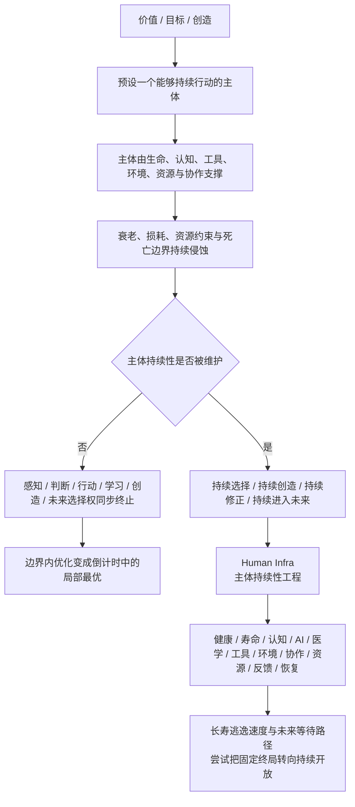
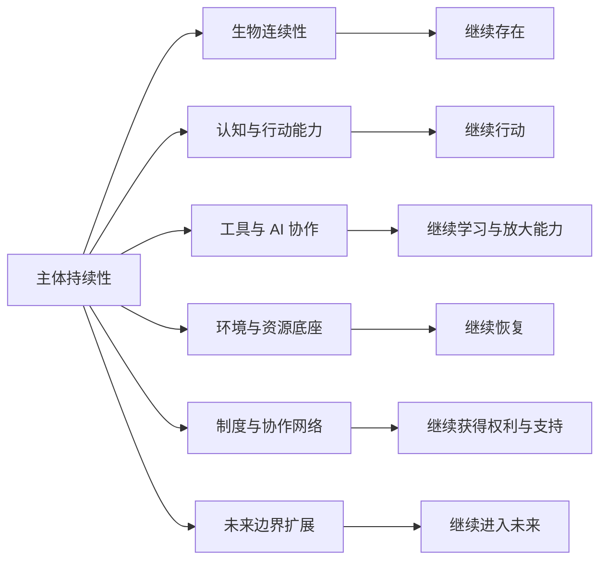
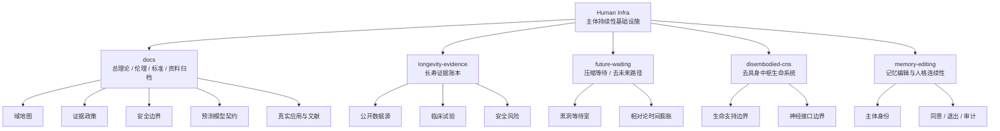
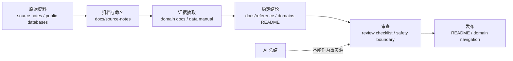
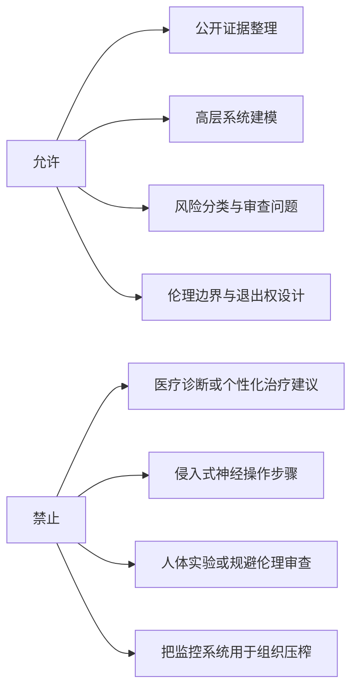

# Human Infra

[](https://github.com/tradecatlabs/human_infra/actions/workflows/check.yml)
[](docs/reference/repository-standards.md)
[](docs/README.md)
[](LICENSE.md)
[](docs/reference/ethics-and-safety-boundaries.md)
[](https://t.me/human_infra)

Human Infra 是一个研究“能够继续做事的主体”如何被维护、延展和升级的基础设施知识仓库。

它的核心判断是：一切价值、目标与创造，都预设一个仍能感知、判断、行动、学习和修正的主体。主体由生命、认知、工具、环境、资源与协作共同支撑，属于有限系统。

> Human Infra 的本质，是对主体持续性进行工程化建设。

## 核心命题

主体持续性是价值实现的边界条件。

| 问题类型 | 典型问题 | Human Infra 判断 |
| --- | --- | --- |
| 边界内优化 | 做什么、怎么做、怎样更快、怎样产出更多 | 重要，但仍是主体有限持续性内部的派生问题 |
| 边界条件问题 | 主体能否继续存在、继续行动、继续学习、继续选择 | 所有事业、成果、排序与未来可能成立的前提 |

如果主体终止，感知、判断、行动、学习、创造与未来选择权同步终止。因而在既定寿命、能力与死亡边界内优化“做什么”，只是倒计时中的局部最优；维护、延展并升级“能够继续做事的主体”，才是更上位的基础设施问题。

## 理论链路



Human Infra 优化持续选择、持续创造、持续修正和持续进入未来的资格，单次产出只是其中一层。长寿逃逸速度、记忆编辑、去未来路径、AI 工具、公共健康、法律身份、住房、食物、水、能源、交通、教育、照护、应急和社会服务，都只有在这个框架下才属于同一个对象。

## 多视角价值解析

Human Infra 可以从多条路径理解项目价值。当前 README 保留两个核心视角，完整说明见 [价值理解维度](docs/explanations/value-lenses.md)。

| 视角 | 核心问题 | 价值说明 |
| --- | --- | --- |
| 主体持续性 | 主体能否继续存在、继续行动、继续学习、继续修正、继续选择 | 一切目标、创造和排序都预设一个仍然能够行动的主体；维护主体持续性，是所有边界内优化成立的前提 |
| 通用资源预算增量 | 寿命、健康寿命、有效时间、主观时间和相对时间被改变后，主体可支配的注意力、时间、精力、认知和行动预算是否增加 | 寿命延长、健康寿命扩展、长寿逃逸、未来等待、工具放大和恢复系统，会改变人类完成任务所依赖的通用资源预算 |

这两个视角可以合并成一条价值链：

```text
主体持续窗口被延展
  -> 通用资源总预算增加
  -> 单次任务成本相对下降
  -> 有效行动密度上升
  -> 未来任务机会增加
  -> 主体持续性边界进一步被延展
```

## 研究范围

Human Infra 用“主体持续性”作为纳入标准，避免把所有话题混成一个筐：某条线路是否增强主体继续存在、继续行动、继续修正和继续选择的能力。

| 层级 | 关注对象 | 代表线路 |
| --- | --- | --- |
| 个体运行系统 | 主体是否可被测量、反馈、恢复和长期维护 | Bryan Johnson / Blueprint、自我量化、可穿戴、PROMIS、WHO ICF |
| 生物与健康连续性 | 身体、寿命、疾病、康复、照护和药物是否支撑长期行动 | 长寿证据、公共健康基线、医疗可及、远程照护、药品可及、康复、长期照护 |
| 认知与行动能力 | 判断、学习、心理稳定、压力恢复和高压表现是否可持续 | 心理健康、成瘾与危机照护、学习科学、职业健康、极端环境人因、军队表现优化 |
| 工具与智能协作 | 工具、AI、数据和神经技术是否放大主体能力而不侵蚀主体权利 | 人机协作、AI 风险管理、个人健康记录、患者数据可携带、神经科技、BCI 安全 |
| 环境与资源底座 | 生活环境和资源是否让人有继续行动的现实条件 | 住房、食物、水、能源、交通、金融接入、保险、产品安全、气候韧性 |
| 制度与协作网络 | 身份、权利、服务和社会协作是否把人接入可恢复的公共系统 | 法律身份、司法可及、公共福利、社区资源导航、劳动权利、投票可达、迁移与人道服务 |
| 未来边界扩展 | 主体持续性边界能否从固定终局转向持续开放 | 长寿逃逸速度、未来等待、去具身中枢生命系统、记忆编辑与人格连续性 |



首批真实应用和文献索引见 [真实应用与文献](docs/reference/applications-and-literature.md)。

## 快速入口

| 你想做什么 | 入口 | 说明 |
| --- | --- | --- |
| 理解核心理论 | [核心命题](#核心命题) | 主体持续性为什么是价值实现的边界条件 |
| 查看理论链路 | [理论链路](#理论链路) | 从价值、主体、死亡边界到 Human Infra 的因果链 |
| 查看研究范围 | [研究范围](#研究范围) | 哪些领域属于主体持续性工程，以及为什么属于 |
| 从多视角理解项目价值 | [多视角价值解析](#多视角价值解析) / [完整文档](docs/explanations/value-lenses.md) | 主体持续性视角与通用资源预算增量视角 |
| 先理解项目全貌 | [docs/README.md](docs/README.md) | 文档系统入口与推荐阅读顺序 |
| 查看领域边界 | [docs/reference/domain-map.md](docs/reference/domain-map.md) | Human Infra 的子域地图和拆分原因 |
| 查看 v0.1 项目边界 | [docs/reference/project-boundary-v0.1.md](docs/reference/project-boundary-v0.1.md) | 当前公开版本里 Human Infra 是什么、不是什么、材料应该落到哪里 |
| 查看伦理与安全红线 | [docs/reference/ethics-and-safety-boundaries.md](docs/reference/ethics-and-safety-boundaries.md) | 医疗、神经、生命支持和组织使用边界 |
| 查看证据规则 | [docs/reference/evidence-policy.md](docs/reference/evidence-policy.md) | 如何区分原始资料、证据和稳定结论 |
| 查看定量预测模型 | [模型说明](docs/explanations/life-path-prediction-model.md) / [模型契约](docs/reference/life-path-prediction-model-contract.md) / [模型治理](docs/reference/life-path-prediction-model-governance.md) / [科研工具包](docs/reference/research-model-visualization-toolkit.md) | 如何量化判断技术、因素和干预对寿命、有效时间、主观时间、相对时间和未来选择权的影响 |
| 整理论文、书籍、工具和案例 | [资料卡片制度](docs/reference/source-card-system.md) / [资料卡片模板](docs/templates/research-card.md) | 把外部资料转成可复用语料、模型变量和 Web 展示材料 |
| 打开正式 Web 应用 | [web/README.md](web/README.md) / [首页源文件](web/src/pages/index.astro) | Astro + D3 多页应用，承载书籍转译、科研叙事、预测模型和交互图表 |
| 打开 Web 看板 | [human-infra-dashboard.html](human-infra-dashboard.html) | 静态三块布局看板，用于演示生命路径预测模型、参数控件和治理门禁 |
| 查看奇点专项展示 | [singularity-human-infra.html](singularity-human-infra.html) | 将《奇点更近》学习资料转译为 Human Infra 的价值展示、预测模型和 D3 可视化 |
| 查看真实应用与文献 | [docs/reference/applications-and-literature.md](docs/reference/applications-and-literature.md) | 真实项目、机构资料、论文和数据源索引，覆盖个体、家庭、社区、医疗、公共服务、环境和高风险技术 |
| 分享项目 | [docs/how-to/share-human-infra.md](docs/how-to/share-human-infra.md) | 对外介绍 Human Infra 的标题、主线、短推文模板和边界 |
| 贡献文档 | [docs/how-to/contribute-docs.md](docs/how-to/contribute-docs.md) | 文档贡献流程 |
| 加入社区 | [Telegram](https://t.me/human_infra) | 讨论 Human Infra、长寿证据、未来等待路径和研究资料 |
| 运行质量检查 | [docs/how-to/run-quality-checks.md](docs/how-to/run-quality-checks.md) | 本地和 CI 的检查命令 |
| 查看所有子域 | [domains/README.md](domains/README.md) | 可独立演化的研究域入口 |
| 查看结构决策 | [docs/decisions/README.md](docs/decisions/README.md) | ADR 与仓库重组决策 |

## 真实应用速览

| 层级 | 代表资料 | 关注问题 |
| --- | --- | --- |
| 个体运行系统 | Bryan Johnson / Blueprint、Apple Heart Study、PROMIS、WHO ICF | 人如何被测量、反馈、恢复和评估 |
| 健康与照护底座 | WHO UHC、WHO Primary Health Care、WHO mhGAP、WHO ICOPE、CDC Caregiving | 人能否获得医疗、心理健康、康复、长期照护和危机支持 |
| 健康数据与患者访问 | ONC Get It, Check It, Use It、USCDI、TEFCA、CMS Patient Access、CMS Blue Button、HL7 FHIR/SMART | 人能否跨机构获取、核对、携带和授权使用自己的健康与保险数据 |
| 远程照护与居家监测 | Telehealth.HHS.gov、HRSA Telehealth、CMS/Medicare Telehealth、HHS Remote Patient Monitoring、FDA Digital Health | 医疗和照护能否跨越距离、行动限制、慢病随访和居家连续性断点 |
| 药品与治疗连续性 | WHO Essential Medicines、WHO Medication Without Harm、FDA Drug Shortages、DailyMed、Medicare Part D、CDC Medication Safety | 关键药物能否可得、可负担、不断供，并被安全理解和使用 |
| 家庭与照护连续性 | World Bank Childcare、ACF OCC/CCDF、ChildCare.gov、DOL Childcare、Census Child Care | 托育、早教、养育支持和父母工作连续性是否支撑儿童与成年人 |
| 学习与就业底座 | How People Learn、O*NET、World Bank Jobs、DOL ETA、Apprenticeship.gov、My Next Move | 能力能否转成工作、收入、职业导航、再培训和转岗路径 |
| 劳动权利与工作场所保护 | ILO International Labour Standards、DOL WHD/FLSA、OSHA workers、EEOC、DOL OLMS | 进入工作之后，工资工时、安全权利、反歧视、申诉和组织权是否能保护人的长期运行 |
| 社会生活底座 | WHO SDOH、UN-Habitat Housing、ILO Social Protection、FAO SOFI、World Bank Energy、WHO/UNICEF JMP | 住房、收入、食物、水、能源和社区是否支撑长期生活 |
| 公共福利与服务递送 | USA.gov Benefit Finder、Performance.gov CX、Medicaid.gov、SNAP、SSI、LIHEAP、Administrative Burden | 资格、申请、续期、证明、等待、申诉和人工帮助是否把制度转成实际支持 |
| 社区资源与转介网络 | 211、Open Referral HSDS、Gravity Project、CMS AHC、ACL Eldercare Locator | 人能否找到本地服务、完成转介、获得回访，并避免被资源目录和服务碎片化排除 |
| 经济与金融底座 | World Bank Global Findex、FDIC Household Survey、CFPB、Federal Reserve Payments Study | 账户、支付、信贷、债务、费用和金融消费者保护是否支撑日常生活 |
| 保险与风险转移 | NAIC consumer resources、USA.gov health insurance、USA.gov unemployment benefits、USA.gov workers' compensation、Benefits.gov Disability Assistance、FDIC deposit insurance、PBGC | 疾病、失业、工伤、残障、灾害、银行倒闭和养老金中断后，风险是否能被分摊、理赔和制度性接住 |
| 产品安全与召回 | CPSC recall API、openFDA enforcement / adverse event APIs、NHTSA recalls / complaints APIs | 食物、药品、医疗器械、车辆和消费品出问题后，缺陷是否能被报告、发现、召回和纠正 |
| 权利与公共服务入口 | UN Legal Identity、WJP Rule of Law、LSC Justice Gap、NIST Digital Identity、USWDS、FTA ADA | 人能否被制度承认、获得法律救济，并进入数字服务、交通系统和无障碍服务 |
| 公民参与与选举基础设施 | USA.gov voter registration、EAC voters、EAC VVSG、NIST voting、DOJ Voting Section、International IDEA、ACE、OSCE ODIHR | 人能否登记、投票、无障碍参与公共决策，并信任选举流程、设备和权利救济 |
| 个人数字安全与身份保护 | FTC scams/phishing、IdentityTheft.gov、ReportFraud、FBI IC3、NIST Digital Identity、Login.gov | 人能否保有账号、身份、资金和公共服务入口，并在诈骗或身份盗用后恢复 |
| 服务理解与语言可达 | PlainLanguage.gov、LEP.gov、National CLAS、CDC health literacy、W3C cognitive accessibility | 人能否读懂、听懂、用自己的语言和认知方式完成关键服务 |
| 迁移与人道连续性 | UNHCR、IOM、WHO Health and Migration、IDMC、OCHA HDX、INEE | 当人离开原有地点和制度后，身份、医疗、教育、庇护、保护和服务如何不断线 |
| 气候与社区韧性底座 | IPCC AR6、WMO Early Warnings for All、NOAA/NCEI、CMRA、CDC Climate and Health | 极端天气、热、洪水、火灾、空气和基础设施中断是否被预警、适应和恢复 |
| 家庭应急准备与个人韧性 | Red Cross preparedness、Red Cross survival kit、Red Cross make a plan、CDC Prepare Your Health、NOAA Weather-Ready Nation | 灾害前，人是否有家庭计划、物资包、健康准备、风险认知、备用通信和特殊需求安排 |
| 公共预警与应急通信 | FEMA IPAWS、FCC WEA/EAS、NOAA Weather Radio、Ready.gov、911.gov、FirstNet | 危机信息能否及时到达、求助能否接通、响应者能否持续通信 |
| 灾后恢复与个人援助 | USA.gov disaster assistance、FEMA Disaster Recovery Center Locator、SBA Disaster Assistance、Benefits.gov Disaster Relief、Red Cross shelters | 灾害之后，人能否找到援助、临时安置、财务支持、账单帮助和恢复路径 |
| 家庭暴力与受害者支持 | CDC IPV / NISVS、DOJ OVW、OVC Help for Victims、HHS Office on Women's Health、VictimConnect | 亲密伴侣暴力、性暴力、跟踪和犯罪伤害后，人能否安全求助、连接服务、获得法律和创伤支持 |
| 环境与安全底座 | WHO Housing、CDC BE Tool、AirNow、CDC Heat and Health Index、WHO Road Safety、CDC WISQARS、988 Lifeline | 生活空间是否安全、可达、可恢复，且不把风险归咎于个人 |
| 未来与高风险技术 | NIA ITP、Geroscience、ClinicalTrials.gov、NIH BRAIN、FDA BCI、NASA HRP、NIST AI RMF | 长寿、神经科技、AI 和极端环境如何进入证据、治理与安全边界 |

完整来源、使用边界和后续条目模板统一维护在 [真实应用与文献](docs/reference/applications-and-literature.md)。

## 项目地图



## 子域导航

| 子域 | 当前对象 | 主要产物 | 非目标 |
| --- | --- | --- | --- |
| [Longevity Evidence](domains/longevity-evidence/README.md) | 长寿干预、公开证据、临床试验、药品安全 | 证据模型、数据源说明、采集脚本、人工干预清单 | 不提供医疗诊断或个性化用药建议 |
| [Future Waiting](domains/future-waiting/README.md) | 用较少主观时间等待未来的路径 | [黑洞等待室](domains/future-waiting/paths/black-hole-waiting-room.md) 等思想实验与边界 | 不提供黑洞接近、太空任务或人体实验步骤 |
| [Disembodied CNS](domains/disembodied-cns/README.md) | 去具身外部维持型中枢生命系统 | 高层架构、生命支持和接口边界建模 | 不提供侵入式神经组织维持或人体改造流程 |
| [Memory Editing](domains/memory-editing/README.md) | 记忆读写、人格连续性、主体权利保护 | 概念边界、验证问题、伦理约束 | 不提供真实个体记忆操控步骤 |

## 阅读路径

| 角色 | 推荐路径 |
| --- | --- |
| 第一次进入项目 | [核心命题](#核心命题) -> [理论链路](#理论链路) -> [研究范围](#研究范围) -> [项目地图](#项目地图) |
| 研究贡献者 | [真实应用与文献](docs/reference/applications-and-literature.md) -> [证据政策](docs/reference/evidence-policy.md) -> [资料管理](docs/reference/source-management.md) |
| 文档维护者 | [仓库标准](docs/reference/repository-standards.md) -> [文档生命周期](docs/reference/document-lifecycle.md) -> [写作风格](docs/reference/writing-style-guide.md) |
| 数据脚本维护者 | [Longevity Evidence](domains/longevity-evidence/README.md) -> [数据说明](domains/longevity-evidence/data/README.md) -> [脚本说明](domains/longevity-evidence/scripts/README.md) |
| 安全审查者 | [伦理与安全边界](docs/reference/ethics-and-safety-boundaries.md) -> [审查清单](docs/reference/review-checklists.md) -> [安全政策](SECURITY.md) |

## 证据工作流



Human Infra 不把 AI 总结当作事实源。公开结论必须能回到原始资料、公开数据库或明确的人工判断记录。

## 仓库结构

```text
human_infra/
├── .github/                 # GitHub 模板与 CI 门禁
├── docs/                    # 总理论、标准、边界、模板和资料归档
│   ├── decisions/           # 架构与域边界决策记录
│   ├── explanations/        # 概念解释和理论文章
│   ├── how-to/              # 任务导向操作说明
│   ├── reference/           # 稳定标准、域地图、术语和证据规则
│   ├── source-notes/        # 原始资料归档
│   ├── templates/           # 文档模板
│   └── tutorials/           # 学习路径
├── domains/                 # 可独立演化的研究子域
│   ├── disembodied-cns/
│   ├── future-waiting/
│   ├── longevity-evidence/
│   └── memory-editing/
├── tools/                   # 仓库维护脚本
├── AGENTS.md                # 代理与维护者架构说明
├── CHANGELOG.md             # 结构变更记录
├── human-infra-dashboard.html # 静态 Web 看板
├── singularity-human-infra.html # 奇点学习资料专项展示页
├── Makefile                 # 本地质量门禁
└── README.md                # 项目入口
```

## 质量门禁

本仓库是知识优先仓库，检查重点是结构、链接和轻量脚本有效性。

```bash
make check
```

该命令会执行：

1. 清理 Python 缓存；
2. 检查必需文件和目录；
3. 检查临时文件名泄漏；
4. 检查本地 Markdown 链接；
5. 编译维护脚本和数据脚本；
6. 再次清理并复查结构。

GitHub Actions 会在 push 和 pull request 时运行同一条门禁。详见 [运行质量检查](docs/how-to/run-quality-checks.md)。

## 核心边界

Human Infra 的首要目标是保护人的长期能动性、健康、创造力、自由度和尊严。效率鸡汤和把人压榨成机器的管理系统都不属于本项目边界。



项目不会：

- 提供医疗诊断、个性化用药建议或治疗方案推荐；
- 宣称任何干预、系统或技术可以实现永生；
- 提供侵入式神经操作、记忆操控或人体实验的可执行步骤；
- 把人的状态监控变成组织压榨、控制或规训工具；
- 用 AI 摘要替代原始证据、临床事实和人工审核。

## 维护与贡献

- 贡献文档前先读 [贡献指南](CONTRIBUTING.md) 和 [写作风格](docs/reference/writing-style-guide.md)。
- 新增子域前先读 [域地图](docs/reference/domain-map.md) 和 [新增子域说明](docs/how-to/add-domain.md)。
- 新增资料前先读 [资料管理](docs/reference/source-management.md) 和 [新增资料说明](docs/how-to/add-source-note.md)。
- 架构级变更必须同步更新对应目录的 `AGENTS.md`。
- 重大结构变化记录到 [CHANGELOG.md](CHANGELOG.md) 和 [决策记录](docs/decisions/README.md)。

## 项目状态

| 项目面 | 状态 |
| --- | --- |
| 仓库类型 | Docs-as-Code 知识仓库 |
| 默认分支 | `main` |
| 自动检查 | GitHub Actions `Check` |
| 数据边界 | `data/raw/` 与 `data/processed/` 默认忽略 |
| 版本边界 | [docs/reference/project-boundary-v0.1.md](docs/reference/project-boundary-v0.1.md) |
| 应用与文献入口 | [docs/reference/applications-and-literature.md](docs/reference/applications-and-literature.md) |
| 许可状态 | [LICENSE.md](LICENSE.md)，当前为权利边界与待定许可说明 |
| 引用信息 | [CITATION.cff](CITATION.cff) |
| 安全报告 | [SECURITY.md](SECURITY.md) |
| 支持边界 | [SUPPORT.md](SUPPORT.md) |
| 社区入口 | [Telegram](https://t.me/human_infra) |

## 变更记录

- 2026-06-20：从 Biocat 单项目重组为 Human Infra 总项目；Biocat 迁入 `domains/longevity-evidence/`；新增去具身中枢生命系统与记忆编辑两个研究域；补齐 Docs-as-Code 知识仓库根文件、文档分层、协作模板和结构检查脚本。
- 2026-06-22：新增 `future-waiting` 子域和“黑洞等待室”未来等待路径。
- 2026-06-23：新增 GitHub Actions 远程质量门禁，统一运行本地 `make check`。
- 2026-06-23：压缩 README 的真实应用资料入口，新增真实应用速览，提升首屏导航密度。
- 2026-06-24：按“主体持续性是价值实现边界条件”的理论链路重组 README 首屏、研究范围和阅读路径。
- 2026-06-26：新增生命路径定量预测模型说明、模型契约和模型治理草案。
- 2026-06-26：新增 Human Infra 静态 Web 看板，用三块布局演示生命路径预测模型。
- 2026-06-26：新增奇点学习资料专项 Web 展示页，独立呈现 Human Infra 价值转译、预测模型和可视化。
- 2026-06-27：新增 v0.1 项目边界、资料卡片制度、research card 模板、Web 正式路线和谱系理论索引入口。

完整记录见 [CHANGELOG.md](CHANGELOG.md)。
