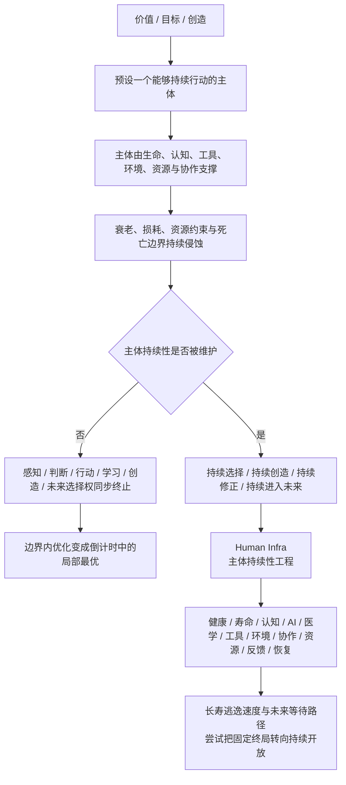
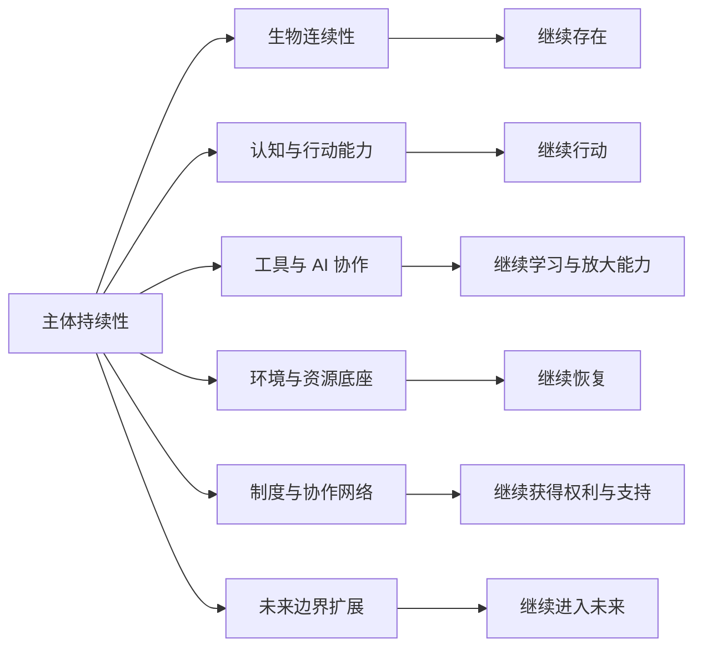
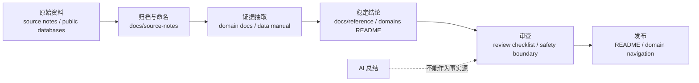
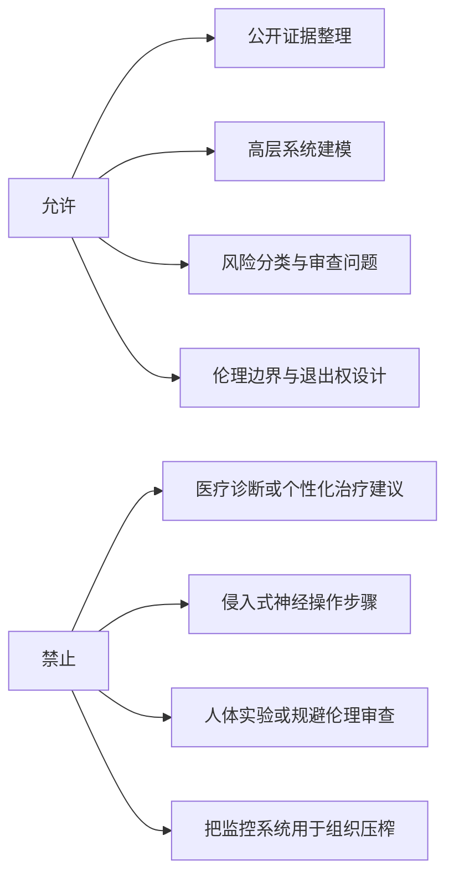

# Human Infra

[](https://github.com/tradecatlabs/human_infra/actions/workflows/check.yml)
[](docs/reference/repository-standards.md)
[](docs/README.md)
[](LICENSE.md)
[](docs/reference/ethics-and-safety-boundaries.md)
[](https://t.me/human_infra)

Human Infra 是一个研究“能够继续做事的主体”如何被维护、延展和升级的基础设施知识仓库。

它的核心判断是：一切价值、目标与创造，都预设一个仍能感知、判断、行动、学习和修正的主体。主体由生命、认知、工具、环境、资源与协作共同支撑，属于有限系统。

> Human Infra 的本质，是对主体持续性进行工程化建设。

## 核心命题

主体持续性是价值实现的边界条件。

| 问题类型 | 典型问题 | Human Infra 判断 |
| --- | --- | --- |
| 边界内优化 | 做什么、怎么做、怎样更快、怎样产出更多 | 重要，但仍是主体有限持续性内部的派生问题 |
| 边界条件问题 | 主体能否继续存在、继续行动、继续学习、继续选择 | 所有事业、成果、排序与未来可能成立的前提 |

如果主体终止，感知、判断、行动、学习、创造与未来选择权同步终止。因而在既定寿命、能力与死亡边界内优化“做什么”，只是倒计时中的局部最优；维护、延展并升级“能够继续做事的主体”，才是更上位的基础设施问题。

## 理论链路



Human Infra 优化持续选择、持续创造、持续修正和持续进入未来的资格，单次产出只是其中一层。长寿逃逸速度、记忆编辑、去未来路径、AI 工具、公共健康、法律身份、住房、食物、水、能源、交通、教育、照护、应急和社会服务，都只有在这个框架下才属于同一个对象。

## 多视角价值解析

Human Infra 可以从多条路径理解项目价值。当前 README 保留三个核心视角，完整说明见 [价值理解维度](docs/explanations/value-lenses.md)。

| 视角 | 核心问题 | 价值说明 |
| --- | --- | --- |
| 主体持续性 | 主体能否继续存在、继续行动、继续学习、继续修正、继续选择 | 一切目标、创造和排序都预设一个仍然能够行动的主体；维护主体持续性，是所有边界内优化成立的前提 |
| 通用资源预算增量 | 寿命、健康寿命、有效时间、主观时间和相对时间被改变后，主体可支配的注意力、时间、精力、认知和行动预算是否增加 | 寿命延长、健康寿命扩展、长寿逃逸、未来等待、工具放大和恢复系统，会改变人类完成任务所依赖的通用资源预算 |
| 稀缺问题与反稀缺工程 | Human Infra 缓解了哪些限制主体持续行动、完成任务和进入未来的底层稀缺 | 寿命、健康寿命、有效时间、注意力、认知、恢复、行动能力、技术可及性和未来选择权的稀缺，是所有下游目标共同面对的约束 |

这三个视角可以合并成一条价值链：

```text
主体持续窗口被延展
  -> 底层稀缺约束被缓解
  -> 通用资源总预算增加
  -> 单次任务成本相对下降
  -> 有效行动密度上升
  -> 未来任务机会增加
  -> 主体持续性边界进一步被延展
```

### 有效永生的加速回报飞轮

有效永生不是单纯“活得更久”，而是把主体带入一个由时间、能力、技术和可能性空间共同驱动的复利系统。

```text
有效永生
  -> 主体持续时间延长
  -> 学习、试错、积累、修正轮次增加
  -> 经验、能力、资源、信誉、协作网络增长
  -> 长期目标失败成本下降
  -> 更容易等待、接触、采用、整合新技术
  -> 技术增强身体、认知、注意力、记忆、行动能力
  -> 单位时间行动质量与创造能力提高
  -> 可解决问题范围扩大
  -> 可能性空间拓展
  -> 更多资源与能力进入下一轮积累
  -> 技术采用、自我升级、系统协作加速
  -> 主体持续性进一步增强
  -> 加速回报飞轮形成
  -> 主体持续性、能力系统、技术系统、可能性空间相互强化
```

这条链路对应 Human Infra 对加速回报定律的转译：技术进步降低下一轮创新成本，而主体持续性提升降低长期目标的失败成本。时间不只是倒计时，也可以成为能力、资源和可能性空间复利增长的底座。

## 研究范围

Human Infra 用“主体持续性”作为纳入标准，避免把所有话题混成一个筐：某条线路是否增强主体继续存在、继续行动、继续修正和继续选择的能力。

| 层级 | 关注对象 | 代表线路 |
| --- | --- | --- |
| 个体运行系统 | 主体是否可被测量、反馈、恢复和长期维护 | Bryan Johnson / Blueprint、自我量化、可穿戴、PROMIS、WHO ICF |
| 生物与健康连续性 | 身体、寿命、疾病、康复、照护和药物是否支撑长期行动 | 长寿证据、营养代谢、基因组稳定性、端粒维护、蛋白稳态、线粒体、细胞衰老、细胞外基质与糖化、微生物生态、干细胞储备、肝肾清除、消化屏障与吸收、呼吸氧合、血液氧运与止血、内分泌激素调节、淋巴与脑淋巴清除、体液电解质酸碱稳态、热稳态、身体活动、心血管韧性、肌骨完整性、皮肤屏障与伤口愈合、泌尿生殖连续性、生殖与生育连续性、细胞重编程、再生医学、癌症控制、免疫维护、抗微生物韧性、生物停滞、康复功能、口腔健康、罕见病诊断漫游、多病共存多重用药、照护转移、居家/缓和/安宁疗护、医疗解释文化中介、患者倡导共同决策 |
| 神经与身份连续性 | 大脑、记忆、意识、人格和行动能力是否保持为同一主体 | 神经连续性、感官连续性、记忆编辑、去具身中枢生命系统、脑保存、认知退行防控 |
| 认知、心理与行动能力 | 判断、学习、注意力、心理稳定、压力恢复和高压表现是否可持续 | 注意力与执行控制、学习与技能获得、认知增强、心理健康与情绪稳定、睡眠与恢复、疼痛与痛苦控制、AI 协作、外部记忆 |
| 工具、测量与反馈 | 工具、AI、数据和反馈系统是否放大主体能力而不侵蚀主体权利 | 人机协作、AI 代理安全、测量反馈、生命路径预测、个人健康记录、可穿戴、患者数据可携带、健康数据隐私治理、功能与生活质量结局 |
| 环境、资源与风险底座 | 生活环境和资源是否让人有继续行动的现实条件 | 星球健康与环境、天气气候观测与预报、社会决定因素与社区脆弱性、资源与社会基础设施、食物安全与营养可及、水卫生连续性、能源可及与韧性、财务韧性与资源可及、金融包容与支付系统、保险与风险转移、医疗服务连续性、公共卫生实验室与诊断能力、血液器官组织生物警戒、健康劳动力容量、社区健康工作者与同伴支持、照护与长期照护、住房与建成环境、建筑消防与生命安全规范、交通接入与日常移动、空间定位导航与位置基础设施、供应链连续性、关键矿物与材料韧性、制造与维修能力、产品安全与召回系统、废弃物与危险材料连续性、辐射核安全防护、化学安全与中毒控制、健康经济与价值评估、免疫与公共卫生监测、动物健康与 One Health 界面、母婴儿童早期生命、患者安全与组织学习、风险工程、人身安全与暴力预防、应急准备与响应、应急预警与通信、家庭应急准备与韧性、灾后恢复与救济连续性、合成生物学与生物安全、空间与极端栖居、辅助技术、物质暴露控制、气候韧性、电网可靠性与韧性、水务污水公用事业、燃料热能服务、公共交通运营连续性、关键基础设施生命线互依赖、公用事业可负担性与断供保护 |
| 制度与协作网络 | 身份、权利、服务、信息环境和社会协作是否把人接入可恢复的公共系统 | 治理与主体权利、法律身份与民事登记、司法可及与法律援助、公民参与与选举接入、公民数据与开放政府透明、公共采购与合同能力、迁移与流离失所人道连续性、社会保护与福利递送、公共服务设计与可达性、行政负担与程序摩擦、数字身份安全、数字包容与连接、媒体信息素养与公共图书馆、社会连接、劳动力与就业服务、职业与工作设计、时间分配与有效时间、托育与家庭连续性、信息完整性与信任、健康素养导航、社区资源导航、劳动权利、迁移与人道服务 |
| 文明连续性与集体安全 | 社会是否还能维持最低和平、通信、公共行政、宏观稳定和公共廉洁 | 武装冲突平民保护、和平建设与冲突预防、政府连续性与公共行政韧性、电信网络韧性、宏观经济货币财政稳定、反腐败与公共廉洁问责 |
| 未来边界扩展 | 主体持续性边界能否从固定终局转向持续开放 | 长寿逃逸速度、未来等待、相对论时间差分、生物停滞、去具身路径 |



首批真实应用和文献索引见 [真实应用与文献](docs/reference/applications-and-literature.md)。

## 快速入口

| 你想做什么 | 入口 | 说明 |
| --- | --- | --- |
| 理解核心理论 | [核心命题](#核心命题) | 主体持续性为什么是价值实现的边界条件 |
| 查看理论链路 | [理论链路](#理论链路) | 从价值、主体、死亡边界到 Human Infra 的因果链 |
| 查看研究范围 | [研究范围](#研究范围) | 哪些领域属于主体持续性工程，以及为什么属于 |
| 从多视角理解项目价值 | [多视角价值解析](#多视角价值解析) / [完整文档](docs/explanations/value-lenses.md) | 主体持续性、通用资源预算增量和反稀缺工程视角 |
| 理解有效永生的复利效应 | [有效永生的加速回报飞轮](#有效永生的加速回报飞轮) / [论文草案](docs/explanations/effective-immortality-acceleration-flywheel.md) / [证据矩阵](docs/source-notes/2026-06-28-effective-immortality-flywheel-evidence-matrix.md) | 主体持续时间、能力升级、技术采用和可能性空间如何互相强化 |
| 先理解项目全貌 | [docs/README.md](docs/README.md) | 文档系统入口与推荐阅读顺序 |
| 查看领域边界 | [docs/reference/domain-map.md](docs/reference/domain-map.md) | Human Infra 的子域地图和拆分原因 |
| 查看研究域图谱 | [docs/reference/research-domain-atlas.md](docs/reference/research-domain-atlas.md) | 从有效永生先验条件生成研究域的规则、当前域地图和域判定契约 |
| 查看潜在研究域雷达 | [docs/reference/research-domain-radar.md](docs/reference/research-domain-radar.md) | 持续调研中的候选研究域、来源信号和晋升触发条件 |
| 查看 v0.1 项目边界 | [docs/reference/project-boundary-v0.1.md](docs/reference/project-boundary-v0.1.md) | 当前公开版本里 Human Infra 是什么、不是什么、材料应该落到哪里 |
| 查看伦理与安全红线 | [docs/reference/ethics-and-safety-boundaries.md](docs/reference/ethics-and-safety-boundaries.md) | 医疗、神经、生命支持和组织使用边界 |
| 查看证据规则 | [docs/reference/evidence-policy.md](docs/reference/evidence-policy.md) | 如何区分原始资料、证据和稳定结论 |
| 查看定量预测模型 | [模型说明](docs/explanations/life-path-prediction-model.md) / [模型契约](docs/reference/life-path-prediction-model-contract.md) / [模型治理](docs/reference/life-path-prediction-model-governance.md) / [科研工具包](docs/reference/research-model-visualization-toolkit.md) | 如何量化判断技术、因素和干预对寿命、有效时间、主观时间、相对时间和未来选择权的影响 |
| 整理论文、书籍、工具和案例 | [资料卡片制度](docs/reference/source-card-system.md) / [资料卡片模板](docs/templates/research-card.md) | 把外部资料转成可复用语料、模型变量和 Web 展示材料 |
| 打开正式 Web 应用 | [web/README.md](web/README.md) / [首页源文件](web/src/pages/index.astro) | Astro + D3 多页应用，承载书籍转译、科研叙事、预测模型和交互图表 |
| 复用 arXiv 论文页框架 | [工具说明](tools/arxiv-html-paper/README.md) / [消费契约](tools/arxiv-html-paper/CONTRACT.md) / [消费指南](tools/arxiv-html-paper/CONSUMER_GUIDE.md) / [工具链分析](docs/reference/arxiv-html-papers-toolchain.md) | 把 arXiv HTML papers 的 CSS、JS、字体、控件和 Astro 模板沉淀成可复制、可治理、可迁移的工具链 |
| 查看有效永生飞轮论文页 | [页面源文件](web/src/pages/papers/effective-immortality-flywheel.astro) / [论文草案](docs/explanations/effective-immortality-acceleration-flywheel.md) | 独立 arXiv-style 页面，不覆盖旧 `/paper/`，用于展示有效永生飞轮的变量、假设、证据脊梁和研究路线 |
| 查看度规红移递归等待论文页 | [页面源文件](web/src/pages/papers/metric-redshift-recursive-waiting.astro) | 独立 arXiv-style 页面，提出可控强红移等待区、固有时差分和等待-升级递归循环假设 |
| 查看可控度规等待室假设论文页 | [页面源文件](web/src/pages/papers/controllable-metric-waiting-room-hypothesis.astro) / [收口记录](docs/source-notes/2026-06-29-controllable-metric-waiting-room-hypothesis-revision-notes.md) | 独立 arXiv-style 页面，提出可控度规等待室、固有时差分、退出采用、递归等待和净主体持续性增益模型 |
| 打开 Web 看板 | [human-infra-dashboard.html](human-infra-dashboard.html) | 静态三块布局看板，用于演示生命路径预测模型、参数控件和治理门禁 |
| 查看奇点专项展示 | [singularity-human-infra.html](singularity-human-infra.html) | 将《奇点更近》学习资料转译为 Human Infra 的价值展示、预测模型和 D3 可视化 |
| 查看真实应用与文献 | [docs/reference/applications-and-literature.md](docs/reference/applications-and-literature.md) | 真实项目、机构资料、论文和数据源索引，覆盖个体、家庭、社区、医疗、公共服务、环境和高风险技术 |
| 分享项目 | [docs/how-to/share-human-infra.md](docs/how-to/share-human-infra.md) | 对外介绍 Human Infra 的标题、主线、短推文模板和边界 |
| 贡献文档 | [docs/how-to/contribute-docs.md](docs/how-to/contribute-docs.md) | 文档贡献流程 |
| 加入社区 | [Telegram](https://t.me/human_infra) | 讨论 Human Infra、长寿证据、未来等待路径和研究资料 |
| 运行质量检查 | [docs/how-to/run-quality-checks.md](docs/how-to/run-quality-checks.md) | 本地和 CI 的检查命令 |
| 查看所有子域 | [domains/README.md](domains/README.md) | 可独立演化的研究域入口 |
| 查看细胞重编程谱系 | [Cellular Reprogramming](domains/cellular-reprogramming/README.md) | 从山中因子、部分重编程到化学重编程、AI 因子设计和表观遗传编辑的机制边界 |
| 查看结构决策 | [docs/decisions/README.md](docs/decisions/README.md) | ADR 与仓库重组决策 |

## 真实应用速览

| 层级 | 代表资料 | 关注问题 |
| --- | --- | --- |
| 个体运行系统 | Bryan Johnson / Blueprint、Apple Heart Study、PROMIS、WHO ICF | 人如何被测量、反馈、恢复和评估 |
| 健康与照护底座 | WHO UHC、WHO Primary Health Care、WHO mhGAP、WHO ICOPE、CDC Caregiving | 人能否获得医疗、心理健康、康复、长期照护和危机支持 |
| 健康数据与患者访问 | ONC Get It, Check It, Use It、USCDI、TEFCA、CMS Patient Access、CMS Blue Button、HL7 FHIR/SMART | 人能否跨机构获取、核对、携带和授权使用自己的健康与保险数据 |
| 远程照护与居家监测 | Telehealth.HHS.gov、HRSA Telehealth、CMS/Medicare Telehealth、HHS Remote Patient Monitoring、FDA Digital Health | 医疗和照护能否跨越距离、行动限制、慢病随访和居家连续性断点 |
| 健康数据治理与隐私 | HHS HIPAA、Common Rule、NIST Privacy Framework、NIST CSF、NIH GDS、GA4GH、ONC Information Blocking | 敏感健康、基因、行为和神经数据能否在同意、退出、安全和用途边界内支撑研究与照护 |
| 功能、生活质量与患者结局 | PROMIS、WHO ICF、EQ-5D、ICHOM、PRO-CTCAE、WHOQOL | 人是否真的更能行动、参与、沟通、恢复并承受生活，而不只是替代指标变好 |
| 价值、成本与疾病负担 | IHME GBD、WHO Global Health Estimates、WHO-CHOICE、NICE HTA、ICER、AHRQ MEPS | 稀缺医疗和公共资源如何在疾病负担、成本效果、公平、权利和主体体验之间被审查 |
| 免疫屏障与公共卫生监测 | WHO immunization、IA2030、CDC NNDSS、WHO GISRS、IHR、IPC、NHSN、GLASS、CDC NWSS | 群体免疫、早期发现、感染防控、耐药治理和废水信号能否防止风险扩散到个体 |
| 母婴儿童早期生命 | WHO maternal/newborn/child health、WHO growth standards、Nurturing Care、CDC PRAMS、World Bank ECD | 孕产、新生儿、儿童健康、生长、照护和早期发展如何塑造长期主体能力 |
| 患者安全与组织学习 | WHO Patient Safety、AHRQ TeamSTEPPS、CUSP、SOPS、IHI RCA2 | 医疗照护组织能否把错误、交接失败和近失误转化为系统学习，而不是重复伤害 |
| 社会决定因素与社区脆弱性 | WHO SDOH、Healthy People SDOH、CDC/ATSDR SVI、CDC/ATSDR EJI、CDC PLACES、USDA Food Access、CMS AHC | 居住地、资源、污染、食物、服务密度和社会需求如何改变生命路径风险分布 |
| 药品与治疗连续性 | WHO Essential Medicines、WHO Medication Without Harm、FDA Drug Shortages、DailyMed、Medicare Part D、CDC Medication Safety | 关键药物能否可得、可负担、不断供，并被安全理解和使用 |
| 家庭与照护连续性 | World Bank Childcare、ACF OCC/CCDF、ChildCare.gov、DOL Childcare、Census Child Care | 托育、早教、养育支持和父母工作连续性是否支撑儿童与成年人 |
| 学习与就业底座 | How People Learn、O*NET、World Bank Jobs、DOL ETA、Apprenticeship.gov、My Next Move | 能力能否转成工作、收入、职业导航、再培训和转岗路径 |
| 健康劳动力容量 | WHO Health Workforce、WHO Global Strategy on Human Resources for Health、HRSA Health Workforce、BLS Healthcare Occupations | 医生、护士、公共卫生人员、社区健康工作者和照护劳动力是否足以把医学技术转化为真实服务 |
| 劳动力与就业服务 | CareerOneStop、DOL ETA/WIOA、Apprenticeship.gov、O*NET、My Next Move、Job Accommodation Network | 就业服务、劳动力发展、职业信息和合理便利能否把学习能力转化为收入、角色和长期任务入口 |
| 劳动权利与工作场所保护 | ILO International Labour Standards、DOL WHD/FLSA、OSHA workers、EEOC、DOL OLMS | 进入工作之后，工资工时、安全权利、反歧视、申诉和组织权是否能保护人的长期运行 |
| 社会生活底座 | WHO SDOH、UN-Habitat Housing、ILO Social Protection、FAO SOFI、World Bank Energy、WHO/UNICEF JMP | 住房、收入、食物、水、能源和社区是否支撑长期生活 |
| 公共福利与服务递送 | USA.gov Benefit Finder、Performance.gov CX、Medicaid.gov、SNAP、SSI、LIHEAP、Administrative Burden | 资格、申请、续期、证明、等待、申诉和人工帮助是否把制度转成实际支持 |
| 公共服务设计与可达性 | Digital.gov、USWDS、Performance.gov CX、Section508.gov、PlainLanguage.gov | 公共服务、表单、无障碍、人工帮助和反馈路径能否把名义权利转化为可完成任务 |
| 行政负担与程序摩擦 | Administrative Burden、Performance.gov CX、Digital.gov、OMB Customer Experience、PlainLanguage.gov | 学习成本、心理成本、合规成本、证明、等待、续期和申诉如何消耗主体有效时间与注意力 |
| 社区资源与转介网络 | 211、Open Referral HSDS、Gravity Project、CMS AHC、ACL Eldercare Locator | 人能否找到本地服务、完成转介、获得回访，并避免被资源目录和服务碎片化排除 |
| 社区健康工作者与同伴支持 | WHO CHW guideline、CDC CHW、HRSA CHW Training、SAMHSA peer support | 社区中介、同伴支持和导航员能否把医疗、公共卫生、社会服务与恢复支持转化为日常行动 |
| 金融包容与支付系统 | World Bank Financial Inclusion、Global Findex、World Bank Payment Systems、FDIC Household Survey、CFPB complaints、Federal Reserve Payments Study | 账户、支付、汇款、数字金融服务和消费者保护能否让收入、福利、救济与交易稳定流动 |
| 经济与金融底座 | World Bank Global Findex、FDIC Household Survey、CFPB、Federal Reserve Payments Study | 账户、支付、信贷、债务、费用和金融消费者保护是否支撑日常生活 |
| 保险与风险转移 | NAIC consumer resources、USA.gov health insurance、USA.gov unemployment benefits、USA.gov workers' compensation、Benefits.gov Disability Assistance、FDIC deposit insurance、PBGC | 疾病、失业、工伤、残障、灾害、银行倒闭和养老金中断后，风险是否能被分摊、理赔和制度性接住 |
| 产品安全与召回 | CPSC recall API、openFDA enforcement / adverse event APIs、NHTSA recalls / complaints APIs | 食物、药品、医疗器械、车辆和消费品出问题后，缺陷是否能被报告、发现、召回和纠正 |
| 权利与公共服务入口 | UN Legal Identity、WJP Rule of Law、LSC Justice Gap、NIST Digital Identity、USWDS、FTA ADA | 人能否被制度承认、获得法律救济，并进入数字服务、交通系统和无障碍服务 |
| 公民参与与选举基础设施 | USA.gov voter registration、EAC voters、EAC VVSG、NIST voting、DOJ Voting Section、International IDEA、ACE、OSCE ODIHR | 人能否登记、投票、无障碍参与公共决策，并信任选举流程、设备和权利救济 |
| 个人数字安全与身份保护 | FTC scams/phishing、IdentityTheft.gov、ReportFraud、FBI IC3、NIST Digital Identity、Login.gov | 人能否保有账号、身份、资金和公共服务入口，并在诈骗或身份盗用后恢复 |
| 服务理解与语言可达 | PlainLanguage.gov、LEP.gov、National CLAS、CDC health literacy、W3C cognitive accessibility | 人能否读懂、听懂、用自己的语言和认知方式完成关键服务 |
| 迁移与人道连续性 | UNHCR、IOM、WHO Health and Migration、IDMC、OCHA HDX、INEE | 当人离开原有地点和制度后，身份、医疗、教育、庇护、保护和服务如何不断线 |
| 媒体信息素养与公共图书馆 | UNESCO Media and Information Literacy、IMLS Public Libraries Survey、ALA Libraries Transform、Digital.gov | 人是否具备寻找、判断、验证和使用信息的能力，并能通过公共图书馆获得可信知识入口和数字支持 |
| 公民数据与开放政府透明 | Data.gov、Resources.data.gov、FOIA.gov、Open.USA.gov、Federal Data Strategy | 公共系统是否可被观察、审查、复用和反馈，从而支撑问责、服务改进和公共参与 |
| 日常环境与工具可靠性 | WHO Air Pollution、EPA IAQ、WHO Food Safety、NIOSH Hierarchy of Controls、FDA Medical Devices、CDC Disinfection and Sterilization、U.S. Access Board ADA | 空气、食品、工作暴露、医疗设备、感染控制和物理空间是否把日常生活与照护环境变成可持续行动条件 |
| 临床可靠性与急性安全窗口 | CMS CLIA、FDA FAERS、FDA Pharmaceutical Quality、NHTSA EMS、WHO Surgical Safety Checklist、WHO Road Traffic Injuries | 临床检测、真实世界药品安全、药品质量、院前急救、围手术期安全和道路安全是否把可修复风险转化为持续行动机会 |
| 结构性脆弱与连续照护断点 | HRSA Rural Health、USICH/HUD Homelessness、WHO Prison Health、ACL CIL、WHO Dementia、WHO HIV/TB/Hepatitis | 农村、无家可归、羁押重返、残障、认知衰退和慢性传染病场景中，主体是否仍能被服务系统持续接住 |
| 危机、剥削与恢复连续性 | SAMHSA 988、FindTreatment.gov、ACL APS、Child Welfare Information Gateway、FTC scams、NCMEC CyberTipline | 自杀危机、成瘾恢复、老年/成人保护、儿童保护、诈骗和在线伤害能否被及时接住、报告、转介和恢复 |
| 复杂照护导航、交接与决策连续性 | NIH GARD、FDA Rare Diseases、AHRQ Care Coordination、WHO Medication Without Harm、CMS Home Health/Hospice、HHS CLAS、AHRQ SHARE | 罕见病、复杂慢病、出院交接、严重疾病居家照护、医疗解释和共同决策是否能把碎片化医学转化为主体可执行路径 |
| 外部化主体连续性 | Library of Congress Personal Digital Archiving、NIST Digital Identity、FDA DHT、NIH BRAIN、FDA BCI、NIST Robotics | 个人资料、账号继承、连续感知、外部记忆、神经接口和具身机器人是否能把主体历史、状态、能力和行动延展到身体之外 |
| 文明连续性与集体安全 | ICRC IHL、UN conflict prevention、World Bank FCV、FEMA Continuity Guidance Circular、CISA Communications Sector/NECP、IMF WEO/Fiscal Monitor、OECD Public Integrity、UNODC UNCAC | 武装冲突、社会撕裂、政府中断、通信失效、宏观失稳和腐败是否会把个人级主体持续性条件一次性击穿 |
| 气候与社区韧性底座 | IPCC AR6、WMO Early Warnings for All、NOAA/NCEI、CMRA、CDC Climate and Health | 极端天气、热、洪水、火灾、空气和基础设施中断是否被预警、适应和恢复 |
| 家庭应急准备与个人韧性 | Red Cross preparedness、Red Cross survival kit、Red Cross make a plan、CDC Prepare Your Health、NOAA Weather-Ready Nation | 灾害前，人是否有家庭计划、物资包、健康准备、风险认知、备用通信和特殊需求安排 |
| 公共预警与应急通信 | FEMA IPAWS、FCC WEA/EAS、NOAA Weather Radio、Ready.gov、911.gov、FirstNet | 危机信息能否及时到达、求助能否接通、响应者能否持续通信 |
| 灾后恢复与个人援助 | USA.gov disaster assistance、FEMA Disaster Recovery Center Locator、SBA Disaster Assistance、Benefits.gov Disaster Relief、Red Cross shelters | 灾害之后，人能否找到援助、临时安置、财务支持、账单帮助和恢复路径 |
| 家庭暴力与受害者支持 | CDC IPV / NISVS、DOJ OVW、OVC Help for Victims、HHS Office on Women's Health、VictimConnect | 亲密伴侣暴力、性暴力、跟踪和犯罪伤害后，人能否安全求助、连接服务、获得法律和创伤支持 |
| 环境与安全底座 | WHO Housing、CDC BE Tool、AirNow、CDC Heat and Health Index、WHO Road Safety、CDC WISQARS、988 Lifeline | 生活空间是否安全、可达、可恢复，且不把风险归咎于个人 |
| 未来与高风险技术 | NIA ITP、Geroscience、ClinicalTrials.gov、NIH BRAIN、FDA BCI、NASA HRP、NIST AI RMF | 长寿、神经科技、AI 和极端环境如何进入证据、治理与安全边界 |

完整来源、使用边界和后续条目模板统一维护在 [真实应用与文献](docs/reference/applications-and-literature.md)。

## 项目地图


## 子域导航

| 子域 | 当前对象 | 主要产物 | 非目标 |
| --- | --- | --- | --- |
| [Longevity Evidence](domains/longevity-evidence/README.md) | 长寿干预、公开证据、临床试验、药品安全 | 证据模型、数据源说明、采集脚本、人工干预清单 | 不提供医疗诊断或个性化用药建议 |
| [Nutrition Metabolic Health](domains/nutrition-metabolic-health/README.md) | 饮食质量、代谢状态、体重、糖尿病风险、食物环境 | 营养代谢变量、慢病风险和食物环境边界 | 不提供个体饮食处方、减重、补剂或医学建议 |
| [Genomic Stability DNA Repair](domains/genomic-stability-dna-repair/README.md) | DNA 损伤、修复系统、突变负荷、复制压力和癌前风险 | 基因组稳定变量、癌症/衰老风险和证据边界 | 不提供基因编辑、实验操作、检测解释、诊断或治疗建议 |
| [Telomere Maintenance](domains/telomere-maintenance/README.md) | 端粒长度、端粒酶、复制衰老、组织更新和癌症风险 | 复制边界、修复能力和肿瘤风险张力 | 不提供端粒检测解释、端粒酶干预、补剂、药物或治疗建议 |
| [Proteostasis Autophagy](domains/proteostasis-autophagy/README.md) | 蛋白折叠、聚集、清除、自噬、溶酶体和细胞质量控制 | 蛋白稳态、自噬通量、神经/组织功能风险 | 不提供药物、禁食、补剂、自噬激活或治疗建议 |
| [Mitochondrial Bioenergetics](domains/mitochondrial-bioenergetics/README.md) | 线粒体功能、ATP、氧化还原、疲劳、肌肉和神经能量系统 | 细胞能源、疲劳、恢复和行动能力变量 | 不提供补剂、药物、运动、禁食、检测解释或治疗建议 |
| [Cellular Senescence Clearance](domains/cellular-senescence-clearance/README.md) | 衰老细胞负担、SASP、senolytics、组织炎症和微环境 | 衰老细胞、炎症、再生和癌症风险边界 | 不提供药物、剂量、补剂、人体实验或治疗建议 |
| [Extracellular Matrix Glycation](domains/extracellular-matrix-glycation/README.md) | 细胞外基质、胶原、弹性、AGEs、交联、纤维化和组织力学 | 结构性老化、组织硬度、修复环境和器官功能边界 | 不提供抗糖化补剂、药物、饮食、检测解释、皮肤治疗或纤维化治疗建议 |
| [Microbiome Ecology](domains/microbiome-ecology/README.md) | 宿主-微生物生态、菌群失调、代谢、免疫、炎症和感染抵抗 | 菌群结构、代谢物、免疫互作和因果边界 | 不提供益生菌、抗生素、饮食、移植、检测解释或治疗建议 |
| [Stem Cell Reserve Renewal](domains/stem-cell-reserve-renewal/README.md) | 干细胞储备、生态位、组织更新、内源性修复和再生能力 | 干细胞耗竭、组织更新和肿瘤风险 | 不提供干细胞治疗、培养、移植、注射或人体实验建议 |
| [Gastrointestinal Barrier Absorption](domains/gastrointestinal-barrier-absorption/README.md) | 消化、吸收、肠道屏障、胃肠动力和营养进入系统 | 营养入口、药物吸收、水分损失和炎症边界 | 不提供胃肠诊断、饮食处方、补剂、益生菌、检查解释或治疗建议 |
| [Respiratory Oxygenation](domains/respiratory-oxygenation/README.md) | 肺、气道、通气、氧合、睡眠呼吸、空气暴露和呼吸失败风险 | 呼吸变量、氧气供应、缺氧风险和跨域氧合接口 | 不提供诊断、氧疗、呼吸机、药物、运动处方或急救建议 |
| [Blood Oxygen Hemostasis](domains/blood-oxygen-hemostasis/README.md) | 红细胞、血红蛋白、氧气运输、凝血、出血、血栓和血液安全 | 氧运、止血、血栓、出血和治疗安全变量 | 不提供检测解释、输血建议、抗凝/止血用药、剂量、急救或治疗建议 |
| [Endocrine Hormonal Regulation](domains/endocrine-hormonal-regulation/README.md) | 激素轴、反馈环、代谢信号、压力反应、生殖、骨骼和情绪调节 | 跨器官稳态、激素反馈和长期恢复变量 | 不提供激素检测解释、补充、处方、剂量、周期管理或治疗建议 |
| [Lymphatic Glymphatic Clearance](domains/lymphatic-glymphatic-clearance/README.md) | 淋巴系统、组织液、免疫运输、脑膜淋巴、glymphatic clearance 和水肿 | 清除网络、炎症清除、脑废物清除和恢复能力变量 | 不提供淋巴引流、按摩、设备、药物、睡眠处方或个体康复建议 |
| [Fluid Electrolyte Acid Base Homeostasis](domains/fluid-electrolyte-acid-base-homeostasis/README.md) | 水分、电解质、渗透压、酸碱平衡和内环境稳定 | 内部化学环境、神经肌肉、心律和药物安全边界 | 不提供补液、电解质、酸碱、检查解释、药物调整、透析或急救建议 |
| [Thermal Homeostasis Resilience](domains/thermal-homeostasis-resilience/README.md) | 体温调节、热暴露、寒冷暴露、出汗、散热和温度极端 | 环境-生理接口、急性热病/低体温风险和恢复边界 | 不提供中暑、低体温、补水、电解质、降温、取暖或急救建议 |
| [Physical Activity Mobility](domains/physical-activity-mobility/README.md) | 身体活动、久坐、心肺适能、力量、平衡、移动能力 | 活动输入、行动密度、慢病和功能风险变量 | 不提供训练计划、运动处方、康复或医疗建议 |
| [Cardiovascular Resilience](domains/cardiovascular-resilience/README.md) | 血压、血脂、血管、心脏、血栓、卒中、心衰 | 循环系统风险函数、筛查证据和模型变量 | 不提供诊断、用药、剂量、手术或个体风险日期 |
| [Musculoskeletal Integrity](domains/musculoskeletal-integrity/README.md) | 肌肉、骨骼、关节、跌倒、疼痛、行动承载结构 | 肌骨结构、功能终点、跌倒和失能风险 | 不提供训练、康复、影像诊断、药物、手术或设备建议 |
| [Skin Barrier Wound Healing](domains/skin-barrier-wound-healing/README.md) | 皮肤屏障、伤口愈合、压力损伤、感染入口、热调节和感觉边界 | 外界屏障、愈合能力、感染入口和照护负担 | 不提供伤口处理、敷料、药物、手术、压力损伤处理、急救或诊断建议 |
| [Urogenital Continuity](domains/urogenital-continuity/README.md) | 膀胱、尿路、尿控、盆底、泌尿感染、性功能和日常尊严 | 排泄控制、睡眠、感染、尊严、关系和照护负担 | 不提供泌尿诊断、盆底训练、药物、器械、手术、感染处理或性功能治疗建议 |
| [Reproductive Fertility Continuity](domains/reproductive-fertility-continuity/README.md) | 生育力、配子质量、生殖衰老、妊娠风险、生殖自主性和未来选择权 | 生育窗口、长期计划、资源配置和未来选择权 | 不提供不孕诊断、生育治疗、激素、辅助生殖、妊娠管理、避孕或个体医疗建议 |
| [Attention Executive Control](domains/attention-executive-control/README.md) | 注意力、执行功能、工作记忆、抑制控制、任务切换和分心环境 | 有效行动密度、任务完成、冲动控制和长期目标推进 | 不提供 ADHD、心理、神经诊断治疗、药物、补剂或神经刺激建议 |
| [Learning Skill Acquisition](domains/learning-skill-acquisition/README.md) | 学习科学、技能形成、练习反馈、迁移能力、再训练和终身学习 | 学习轮次、能力复利、技术采用和长期目标推进 | 不提供个体教育、考试、就业、移民、认证或职业建议 |
| [Time Allocation Effective Time](domains/time-allocation-effective-time/README.md) | 时间使用、时间贫困、行政负担、等待成本、任务摩擦和有效时间 | 可支配时间、恢复时间、行动密度和主观时间质量 | 不提供个体日程、职业、家庭、法律、福利、保险或财务安排建议 |
| [Financial Resilience Access](domains/financial-resilience-access/README.md) | 收入、储蓄、债务、保险、医疗支付能力、财务冲击和资产安全 | 资源入口、经济缓冲、恢复能力和未来选择权 | 不提供投资、借贷、税务、法律、福利申请、保险选择或个体财务建议 |
| [Occupational Work Design](domains/occupational-work-design/README.md) | 职业安全、工作组织、人体工学、工时、职业暴露、压力和技能转型 | 工作可持续性、收入、恢复、学习机会和职业风险 | 不提供个体职业、劳动争议、法律、工伤、薪酬、移民或雇佣建议 |
| [Information Integrity Trust](domains/information-integrity-trust/README.md) | 信息可信度、证据质量、误导信息、平台传播、AI 生成内容和信任链 | 判断质量、误导暴露、证据治理和行动决策边界 | 不提供政治操控、舆论操纵、平台规避、假账号、虚假内容生产或传播策略 |
| [Cellular Reprogramming](domains/cellular-reprogramming/README.md) | 山中因子、部分重编程、化学重编程、AI 因子设计、表观遗传编辑 | 谱系分析、证据等级、机制边界、安全审查清单 | 不提供实验协议、载体构建、剂量、给药或人体应用建议 |
| [Regenerative Medicine](domains/regenerative-medicine/README.md) | 干细胞、组织工程、器官再生、类器官、移植 | 器官/组织修复框架、功能终点和整合风险 | 不提供手术、细胞制备、移植或人体实验步骤 |
| [Rehabilitation And Functioning](domains/rehabilitation-functioning/README.md) | 康复、功能恢复、失能预防、活动能力、自理和社会参与 | 功能状态、活动能力、参与能力和失能风险模型 | 不提供个人康复处方、训练计划、诊断或治疗建议 |
| [Cancer Control](domains/cancer-control/README.md) | 癌症预防、早筛、治疗、复发、肿瘤演化 | 癌症风险函数、证据层级和长期控制变量 | 不提供诊断、治疗方案、处方、剂量或个体用药建议 |
| [Immune Maintenance](domains/immune-maintenance/README.md) | 免疫衰老、感染防御、慢性炎症、自身免疫、免疫监视 | 免疫变量表、感染/炎症/癌症交叉风险 | 不提供个体免疫治疗、疫苗、药物或实验建议 |
| [Antimicrobial Resilience](domains/antimicrobial-resilience/README.md) | 抗微生物耐药、感染控制、抗菌药物治理和病原体威胁 | 感染可治性、耐药传播、医疗安全和公共卫生风险 | 不提供个体用药、病原体操作、培养或规避感染控制建议 |
| [Renal Hepatic Clearance](domains/renal-hepatic-clearance/README.md) | 肾脏、肝脏、解毒、代谢、药物清除和系统稳态 | 肝肾功能、毒性、药物安全和治疗可用性变量 | 不提供检测解释、用药、剂量、饮食、透析、移植或治疗建议 |
| [Neuro Continuity](domains/neuro-continuity/README.md) | 大脑、记忆、意识、人格、主体身份连续性 | 神经连续性变量、身份边界和高风险交叉图 | 不提供脑保存、神经刺激、药物或记忆操控步骤 |
| [Sensory Continuity](domains/sensory-continuity/README.md) | 视觉、听觉、平衡、触觉和感官反馈 | 感官功能、辅助补偿、行动安全和社会参与模型 | 不提供眼科、听力、神经、设备或治疗建议 |
| [Future Waiting](domains/future-waiting/README.md) | 用较少主观时间等待未来的路径 | [度规红移固有时差分路径（黑洞等待室）](domains/future-waiting/paths/black-hole-waiting-room.md)、可控度规等待室假设等思想实验与边界 | 不提供黑洞接近、太空任务或人体实验步骤 |
| [Disembodied CNS](domains/disembodied-cns/README.md) | 去具身外部维持型中枢生命系统 | 高层架构、生命支持和接口边界建模 | 不提供侵入式神经组织维持或人体改造流程 |
| [Memory Editing](domains/memory-editing/README.md) | 记忆读写、人格连续性、主体权利保护 | 概念边界、验证问题、伦理约束 | 不提供真实个体记忆操控步骤 |
| [Biostasis And Cryopreservation](domains/biostasis-cryopreservation/README.md) | 冷冻保存、生物停滞、休眠、等待未来修复 | 保存质量、结构完整性、可逆性和未来修复依赖 | 不提供灌流、冷冻、复温、保护剂或人体保存步骤 |
| [Cognitive Augmentation](domains/cognitive-augmentation/README.md) | AI 辅助、外部记忆、学习系统、脑机接口、行动放大工具 | 认知资源变量、工具依赖和主体自主性边界 | 不提供侵入式神经操作、药物增强或人体实验建议 |
| [AI Agency Safety](domains/ai-agency-safety/README.md) | AI 代理、工具调用、授权、监督、审计和失效隔离 | 代理权限、回滚、事故治理和主体自主性边界 | 不提供越狱、提示注入攻击、恶意自动化、数据窃取或规避安全控制方法 |
| [Digital Identity Security](domains/digital-identity-security/README.md) | 数字身份、账号、凭据、身份恢复、服务入口和数据可携带 | 认证、授权、恢复、委托和长期身份连续性 | 不提供钓鱼、撞库、账号接管、认证绕过或法律/金融申请建议 |
| [Mental Health And Affective Stability](domains/mental-health-affective-stability/README.md) | 心理健康、情绪稳定、动机、成瘾、创伤和自杀风险 | 情绪稳定、压力恢复、危机风险和社会连接模型 | 不提供诊断、治疗、药物建议或危机替代服务 |
| [Sleep Circadian And Recovery](domains/sleep-circadian-recovery/README.md) | 睡眠、昼夜节律、疲劳和恢复系统 | 恢复质量、节律稳定、疲劳和长期行动密度变量 | 不提供个体睡眠诊断、处方、药物或医疗建议 |
| [Assistive Technology Access](domains/assistive-technology-access/README.md) | 辅助技术、无障碍、义肢、助听、低视力辅助、轮椅和沟通辅助 | 能力补偿、环境适配、设备可及性和参与能力 | 不提供个体设备处方、购买建议或医疗建议 |
| [Substance Exposure Control](domains/substance-exposure-control/README.md) | 烟草、酒精、成瘾性物质、有害暴露和行为风险 | 暴露剂量、成瘾、自主性和风险函数变量 | 不提供戒断、排毒、用药、违法物质或危险使用指南 |
| [Risk Engineering](domains/risk-engineering/README.md) | 事故、灾害、暴力、环境风险、系统故障、尾部风险 | 风险暴露、预警、响应、恢复和韧性模型 | 不提供攻击、违法、武器、暴力或危险操作指南 |
| [Planetary Health And Environment](domains/planetary-health-environment/README.md) | 空气、水、气候、污染、生态系统和食物系统 | 环境暴露、公共健康、生态系统和长期风险函数 | 不提供违法规避、危险行为或个体化环境医学建议 |
| [Resource And Social Infrastructure](domains/resource-social-infra/README.md) | 食物、水、能源、住房、医疗、照护、金融、教育、就业 | 稀缺类型、断裂模式、恢复路径和社会支持变量 | 不提供违法、欺诈、规避制度或个体申请操作建议 |
| [Food Security Nutrition Access](domains/food-security-nutrition-access/README.md) | 食物安全、饥饿、营养不足、食品安全、价格和食物系统冲击 | 外部食物可及、可负担、安全性、营养输入和供应稳定 | 不提供饮食处方、食品处置、囤积、黑市采购或非法获取建议 |
| [Water Sanitation Hygiene Continuity](domains/water-sanitation-hygiene-continuity/README.md) | 安全饮用水、卫生设施、洗手、污水处理、WASH 覆盖和服务可靠性 | 感染控制、尊严、照护卫生、公共卫生和灾害连续性 | 不提供补水、疾病处理、水质检测、净水购买、施工或灾害取水操作建议 |
| [Energy Access Resilience](domains/energy-access-resilience/README.md) | 电力、清洁烹饪、能源负担、停电、温控、通信供能和医疗设备供电 | 照明、烹饪、温控、通信、医疗设备和数字服务运行底座 | 不提供电气施工、发电设备、燃料储存、账单申请、投资或危险接线建议 |
| [Healthcare Access Continuity](domains/healthcare-access-continuity/README.md) | 初级卫生保健、急诊、预防、转诊、随访、费用和服务质量 | 医疗可及、连续照护、服务断点和可修复风险转化 | 不提供诊断、治疗、医生/医院/保险选择或个体就医建议 |
| [Medicine Access Treatment Continuity](domains/medicine-access-treatment-continuity/README.md) | 基本药物、药品短缺、标签、患者药品信息、覆盖和用药安全 | 治疗执行、药品可得、供应稳定、费用和用药错误防护 | 不提供用药、剂量、替代药物、停药、购药或处方解释建议 |
| [Patient Data Interoperability](domains/patient-data-interoperability/README.md) | 健康记录访问、数据可携带、互操作标准、授权应用和跨机构交换 | 数据连续、照护交接、患者复核和医疗决策资料底座 | 不解释个人病历、检查、理赔、保险权益或绕过授权 |
| [Telehealth Remote Monitoring Access](domains/telehealth-remote-monitoring-access/README.md) | 远程医疗、远程患者监测、居家设备、数字照护和升级路径 | 距离成本、随访频率、监测可见性和居家连续照护 | 不提供远程诊断、分诊、设备选择、治疗、报销或平台背书 |
| [Caregiving Long Term Care](domains/caregiving-long-term-care/README.md) | 家庭照护、长期照护、居家社区支持、照护协调和照护者负担 | 失能支持、照护连续性、尊严和长期生活支持 | 不提供个体护理计划、机构选择、保险福利、法律监护或医学处理 |
| [Housing Built Environment Stability](domains/housing-built-environment-stability/README.md) | 住房稳定、住房质量、室内环境、无障碍、社区资源和建成环境 | 生活空间、恢复空间、照护可行性和环境暴露边界 | 不提供房地产、租买房、维修、法律、福利或个体环境医学建议 |
| [Transportation Access Mobility](domains/transportation-access-mobility/README.md) | 公共交通、无障碍交通、出行时间、交通成本、医疗交通和交通安全 | 外部可达性、行动半径、服务连接和等待成本 | 不提供路线、驾驶、车辆、交通法律、撤离或出行操作建议 |
| [Supply Chain Continuity](domains/supply-chain-continuity/README.md) | 药品、能源、食物、设备、通信、芯片、物流和替代路径 | 关键输入、依赖链、断供模式、替代路径和恢复时间 | 不提供囤积恐慌、黑市采购、制裁规避、非法获取或供应链攻击建议 |
| [Synthetic Biology Biosecurity](domains/synthetic-biology-biosecurity/README.md) | 合成生物学、生物安全、生物安保、双重用途风险和治理边界 | 高风险研究边界、审查门槛、禁止用途和生物风险变量 | 不提供病原体工程、培养、传播、规避筛查、实验协议或湿实验步骤 |
| [Space Extreme Habitation](domains/space-extreme-habitation/README.md) | 空间飞行、极端环境、闭环生命支持、隔离、辐射和远程医疗 | 环境压力、资源闭环、远程医疗、团队行为和未来可达性 | 不提供太空任务、危险环境进入、生命支持建造或生存操作指南 |
| [Social Connection Relational Infra](domains/social-connection-relational-infra/README.md) | 孤独、社会隔离、家庭照护、社区信任和协作网络 | 关系支持、求助能力、照护连续性和孤立风险 | 不提供心理治疗、危机服务替代、社交操控或组织控制方案 |
| [Governance And Rights](domains/governance-rights/README.md) | 主体权利、法律身份、同意、退出、数据权、AI 治理 | 高风险域治理清单、权利保护和中止条件 | 不提供法律意见或规避监管建议 |
| [Legal Identity Civil Registration](domains/legal-identity-civil-registration/README.md) | 法律身份、出生登记、民事登记、生命统计、身份文件和服务资格 | 制度承认、权利入口、服务资格和身份连续性 | 不提供法律、移民、证件办理、资格判断、欺诈或规避建议 |
| [Access To Justice Legal Aid](domains/access-to-justice-legal-aid/README.md) | 民事法律需求、法律援助、司法可及、程序负担和权利救济 | 法律信息、代理支持、申诉执行和制度救济路径 | 不提供法律意见、案件策略、文书起草、诉讼、移民或规避建议 |
| [Civic Participation Election Access](domains/civic-participation-election-access/README.md) | 选民登记、投票可及、无障碍投票、选举标准、公共参与和制度反馈 | 公共决策参与、选举可信、权利救济和长期制度纠偏 | 不提供竞选操控、投票压制、选举干扰、设备攻击或个体资格建议 |
| [Migration Displacement Humanitarian Continuity](domains/migration-displacement-humanitarian-continuity/README.md) | 迁移、难民、流离失所、身份连续、健康/教育/庇护/保护服务 | 跨地点、跨制度和人道危机场景下的服务连续性 | 不提供移民/庇护个案建议、边境路线、规避执法、伪造文件或危险旅行方法 |
| [Digital Inclusion Connectivity](domains/digital-inclusion-connectivity/README.md) | 互联网接入、设备、数字技能、可负担性、无障碍和数字公共服务 | 数字社会接入层、服务可达、信息可达和机会可达 | 不提供黑客攻击、账号绕过、盗版破解、电信账户操控或个体补贴/设备建议 |
| [Social Protection Benefits Delivery](domains/social-protection-benefits-delivery/README.md) | 公共福利、社会保护、资格、申请、续期、支付、申诉和行政负担 | 风险冲击缓冲、服务递送、公共支持和制度性恢复路径 | 不提供福利申请、资格判断、材料准备、法律、税务、移民或规避制度建议 |
| [Community Resource Navigation](domains/community-resource-navigation/README.md) | 211、资源目录、社会需求筛查、转介、闭环回访和本地服务导航 | 资源发现、服务匹配、人工协助和社区支持转化接口 | 不判断资格、申请策略、机构质量、资源实时可用性或危机替代 |
| [Administrative Burden Procedural Friction](domains/administrative-burden-procedural-friction/README.md) | 学习成本、心理成本、合规成本、证明、等待、续期、申诉和错误恢复 | 制度资源能否抵达主体，以及行政摩擦如何消耗有效时间 | 不提供个案申请、规避审核、福利、税务、法律或争议处理建议 |
| [Community Health Workers Peer Support](domains/community-health-workers-peer-support/README.md) | 社区健康工作者、同伴支持、导航员、可信中介和转介闭环 | 把医疗、公共卫生、社会服务和恢复支持嵌入日常生活 | 不提供诊断、治疗、用药、心理咨询、危机处理或个案转介建议 |
| [Insurance Risk Transfer](domains/insurance-risk-transfer/README.md) | 健康、失业、工伤、残障、灾害、存款和养老金风险转移 | 风险池、覆盖、理赔、保障缺口和高成本事件分摊 | 不提供保险选择、投保、理赔、税务、法律、投资、欺诈或规避建议 |
| [Childcare Family Continuity](domains/childcare-family-continuity/README.md) | 托育可及、费用、质量、早期儿童发展、父母工作连续性和家庭压力 | 儿童发展、照护者有效时间、家庭稳定和代际未来选择权 | 不提供育儿、教育、医疗、机构选择、补贴申请、法律或家庭纠纷建议 |
| [Emergency Preparedness Response](domains/emergency-preparedness-response/README.md) | 灾害准备、预警、应急通信、急救医疗、撤离支持、安置和恢复 | 尾部风险响应、危机连续性、灾后恢复和抗冲击能力 | 不提供急救、医疗处理、撤离路线、危险环境、武器、暴力或生存操作指南 |
| [Household Emergency Preparedness Resilience](domains/household-emergency-preparedness-resilience/README.md) | 家庭计划、物资包、备用通信、健康准备、重要文件和特殊需求安排 | 公共救援抵达前的家庭级主体连续性和恢复前置能力 | 不提供实时灾害指挥、撤离路线、急救医疗、危险物储存或极端生存主义指南 |
| [Personal Safety Violence Prevention](domains/personal-safety-violence-prevention/README.md) | 亲密伴侣暴力、性暴力、跟踪、犯罪伤害、求助入口和受害者支持 | 人身安全、创伤支持、法律保护、住房安全和恢复连续性 | 不提供自卫战术、武器、报复、跟踪、监控、定位或危险对抗建议 |
| [Product Safety Recall Systems](domains/product-safety-recall-systems/README.md) | 消费品、食品、药品、医疗器械、车辆缺陷报告、召回和纠正 | 外部产品安全、风险预警、召回通知、替代路径和伤害降低 | 不提供购买、维修、改装、药品停用、医疗器械操作、车辆处理或索赔建议 |
| [Pain And Suffering Control](domains/pain-suffering-control/README.md) | 慢性疼痛、症状负担、姑息医学、生活质量和可承受持续性 | 疼痛、痛苦、症状负担、尊严和有效时间边界 | 不提供药物、剂量、处方、个体治疗或危机替代服务 |
| [Health Literacy Navigation](domains/health-literacy-navigation/README.md) | 健康素养、服务导航、可理解信息、风险沟通、共同决策 | 理解能力、服务入口、行政负担和误用风险 | 不提供医学、法律、保险、福利申请或规避制度建议 |
| [Language Access Plain Communication](domains/language-access-plain-communication/README.md) | 清晰语言、语言服务、有限英语能力访问、CLAS 和认知可访问性 | 关键材料理解、任务完成、风险沟通和服务可达 | 不替代认证口译、专业翻译、医疗/法律解释或危机沟通 |
| [Labor Rights Workplace Protection](domains/labor-rights-workplace-protection/README.md) | 劳动标准、工资工时、安全权利、反歧视、申诉和组织治理 | 工作的权利保护、资源稳定、有效时间和反耗损边界 | 不提供法律意见、工资计算、投诉策略、组织策略或胜诉承诺 |
| [Media Information Literacy Public Libraries](domains/media-information-literacy-public-libraries/README.md) | 媒体与信息素养、公共图书馆、可信知识入口、数字技能和社区学习空间 | 判断、学习、技术采用、公共服务使用和公共参与的认知基础设施 | 不提供宣传、舆论操控、微定向影响、平台规避或内容伪造策略 |
| [Health Workforce Capacity](domains/health-workforce-capacity/README.md) | 医生、护士、公共卫生人员、社区健康工作者、长期照护和辅助专业人员 | 医学技术能否转化为真实诊断、治疗、预防、康复和照护 | 不提供择医、职业规划、执照认证、移民、薪资或劳动争议建议 |
| [Civic Data Open Government Transparency](domains/civic-data-open-government-transparency/README.md) | 开放数据、公共记录、FOIA、绩效数据、元数据和透明机制 | 公共系统可观测、可审查、可反馈和可问责的治理基础设施 | 不提供人肉搜索、隐私攻击、监控目标定位、访问控制规避或 FOIA 个案法律建议 |
| [Education Access Lifelong Learning](domains/education-access-lifelong-learning/README.md) | 基础教育、成人学习、再培训、基础技能、数字学习和技能迁移 | 把延长时间窗口转化为能力复利、技术采用和未来选择权 | 不提供升学、择校、留学、考试、职业证书或教育投资建议 |
| [Research Infrastructure Open Science Translation](domains/research-infrastructure-open-science-translation/README.md) | 科研基础设施、开放科学、复现性、研究数据、资助、转化科学和知识扩散 | 让未来技术窗口持续生成、验证、共享和扩散 | 不提供论文代写、学术操控、数据造假、刷引用或同行评审规避策略 |
| [Standards Metrology Quality Infrastructure](domains/standards-metrology-quality-infrastructure/README.md) | 标准、计量、校准、认证、质量管理、合格评定和互操作规范 | 让测量、设备、数据、制造和服务具备可比性与可信度 | 不提供认证规避、检测伪造、设备改装、标准绕过或产品采购建议 |
| [Cybersecurity Resilience Critical Services](domains/cybersecurity-resilience-critical-services/README.md) | 网络安全、关键服务韧性、事件响应、备份恢复和数字风险治理 | 防止医疗、金融、身份、公共服务和 AI 工具被攻击截断 | 不提供攻击、入侵、漏洞利用、钓鱼、恶意软件或规避检测步骤 |
| [Compute Data Center AI Infrastructure](domains/compute-data-center-ai-infrastructure/README.md) | 算力、数据中心、AI 基础设施、芯片、能源、水、网络和接入治理 | 支撑 AI 工具、科学模拟、自动化和科研加速的物质底座 | 不提供盗用算力、绕过计费、芯片走私、数据中心攻击、投资采购或监管规避建议 |
| [Clinical Trials Regulatory Science Translation](domains/clinical-trials-regulatory-science-translation/README.md) | 临床试验、监管科学、真实世界证据、安全监测和批准路径 | 把医学发现转化为可验证、可监管、可扩散的干预 | 不提供入组、治疗、用药、停药、试验选择、人体试验操作或监管规避建议 |
| [Geospatial Navigation Location Infrastructure](domains/geospatial-navigation-location-infrastructure/README.md) | 地理空间数据、地址、地图、GNSS/GPS、地理编码和位置服务 | 让人、资源、风险、服务和救援目标可被定位、导航和分配 | 不提供跟踪、监控、骚扰、人肉搜索、危险路线或基础设施目标定位 |
| [Weather Climate Observation Forecasting](domains/weather-climate-observation-forecasting/README.md) | 天气观测、气候服务、预报模型、极端天气和早期预警输入 | 把外部环境风险提前转化为家庭、公共服务和基础设施响应窗口 | 不提供实时灾害指挥、撤离路线、个人安全承诺、交易或规避官方预警建议 |
| [Building Fire Life Safety Codes](domains/building-fire-life-safety-codes/README.md) | 建筑规范、消防规范、疏散、烟雾报警、无障碍和韧性改造 | 防止居住、照护、学习、工作和公共空间成为死亡与失能风险源 | 不提供施工、电气、消防系统、灭火、救援、规范规避或验收绕过建议 |
| [Manufacturing Repair Capacity](domains/manufacturing-repair-capacity/README.md) | 制造、维修、维护、备件、质量、本地生产和关键设备恢复 | 让关键设备、工具、医疗与生活基础设施在损坏或断供后可恢复 | 不提供武器、受管制设备、假冒零件、破解、危险维修、采购或监管规避建议 |
| [Public Procurement Contracting Capacity](domains/public-procurement-contracting-capacity/README.md) | 公共采购、合同、供应商管理、应急采购、透明度和交付验收 | 把公共预算、需求和政策目标转化为可靠服务与基础设施交付 | 不提供投标策略、围标串标、利益输送、合同操控、资格规避或个案法律商业建议 |
| [Animal Health Zoonotic Interface One Health](domains/animal-health-zoonotic-interface-one-health/README.md) | 动物健康、兽医公共卫生、人兽共患病、食品动物、野生动物和 One Health | 在动物-人类-环境界面建立上游公共卫生和食品系统风险屏障 | 不提供动物诊疗、养殖防疫操作、病原体处理、野生动物捕捉、规避监测或动物交易建议 |
| [Public Health Laboratory Diagnostic Capacity](domains/public-health-laboratory-diagnostic-capacity/README.md) | 公共卫生实验室、诊断网络、检测确认、质量管理和实验室扩容 | 把不可见风险转化为可审查、可行动、可治理的检测信号 | 不提供样本采集、检测操作、病原处理、实验室协议、个体诊断或医疗建议 |
| [Blood Organ Tissue Biovigilance Transplantation](domains/blood-organ-tissue-biovigilance-transplantation/README.md) | 血液供应、输血安全、器官/组织捐献、移植体系、追踪和生物警戒 | 让外部生物材料在质量、安全、分配和不良事件反馈边界内支撑主体修复 | 不提供输血、移植、器官匹配、治疗、手术、非法获取或监管规避建议 |
| [Waste Management Hazardous Materials Continuity](domains/waste-management-hazardous-materials-continuity/README.md) | 固体废物、医疗废物、危险废物、处理处置和服务连续性 | 防止废弃物和危险材料反向制造感染、毒性、污染、火灾和尊严风险 | 不提供危险废物处理、处置、储存、运输、清理、规避监管或非法倾倒方法 |
| [Radiation Nuclear Safety Protection](domains/radiation-nuclear-safety-protection/README.md) | 电离辐射防护、核安全、辐射监测、放射性材料风险和应急治理 | 把不可见高能暴露转化为可测量、可监管、可限制、可响应的风险对象 | 不提供放射源、核材料、设施、去污、防护、撤离、医疗影像或放疗个体建议 |
| [Chemical Safety Poison Control Toxicology](domains/chemical-safety-poison-control-toxicology/README.md) | 化学品安全、毒性暴露、毒物中心、毒理证据、暴露监测和风险沟通 | 把化学暴露从孤立判断转化为可咨询、可监测、可监管和可预防的公共能力 | 不提供中毒处理、解毒、化学混配、合成、投毒、规避检测或事故处置建议 |
| [Critical Minerals Materials Resilience](domains/critical-minerals-materials-resilience/README.md) | 关键矿物、战略材料、加工依赖、替代回收和未来技术物质输入 | 让 AI、能源、医疗设备、制造、通信和科研能力有可规模化、可维修、可替代的物质底座 | 不提供投资、交易、采购、制裁规避、非法采矿、危险回收或受管制物资获取建议 |
| [Air Quality Ventilation Exposure Control](domains/air-quality-ventilation-exposure-control/README.md) | 室内外空气污染、通风、过滤、气溶胶、烟雾和空气暴露治理 | 让学校、工作、照护和公共空间维持可呼吸、可恢复、可行动的环境 | 不提供医疗、HVAC 设计施工、设备采购、危险环境处置或实时灾害指挥建议 |
| [Food Safety Contamination Control](domains/food-safety-contamination-control/README.md) | 食源性病原体、毒素、过敏原、检查、追溯、召回和暴发治理 | 防止食物从营养资源转化为感染、毒性、信任和供应链风险入口 | 不提供饮食烹饪、食品加工、污染检测、企业合规、法律或投毒/规避检测建议 |
| [Occupational Exposure Industrial Hygiene](domains/occupational-exposure-industrial-hygiene/README.md) | 工作场所化学、物理、生物、粉尘、噪声、热、辐射和皮肤暴露控制 | 防止工作以长期身体损耗作为收入和技能获得的隐性成本 | 不提供现场检测、PPE 选择、职业病诊断、工伤法律、事故处置或监管规避建议 |
| [Medical Device Equipment Safety Maintenance](domains/medical-device-equipment-safety-maintenance/README.md) | 医疗设备生命周期、不良事件、UDI、召回、维护、网络安全和可用性 | 让诊断、治疗、监测、生命支持和康复工具具备可靠运行与纠错能力 | 不提供设备使用、维修、改装、采购、报警处理、临床操作、漏洞利用或医疗建议 |
| [Sterilization Disinfection Infection Control](domains/sterilization-disinfection-infection-control/README.md) | 清洁、消毒、灭菌、再处理、环境感染控制和 HAI 预防 | 防止医疗、照护和公共空间把服务过程变成感染入口 | 不提供消毒配方、灭菌参数、器械再处理、隔离决策、暴发处置或规避感染控制建议 |
| [Built Environment Accessibility Universal Design](domains/built-environment-accessibility-universal-design/README.md) | 物理空间可达、路径连续、公共设施、通用设计和环境参与条件 | 让不同身体、感官和认知状态的主体仍能进入、移动、使用、撤离和参与 | 不提供建筑设计施工、验收、个案法律、合理便利、撤离路线或辅助设备建议 |
| [Clinical Laboratory Diagnostic Quality](domains/clinical-laboratory-diagnostic-quality/README.md) | 临床实验室质量、检测准确性、能力验证、诊断管理和临床效用 | 让个体诊断、筛查、治疗监测和风险模型建立在可信观测上 | 不提供检验解读、诊断治疗、检测选择、样本操作、实验 SOP、认证规避或法律建议 |
| [Pharmacovigilance Drug Safety Monitoring](domains/pharmacovigilance-drug-safety-monitoring/README.md) | 不良事件报告、真实世界安全信号、标签更新、用药错误和风险沟通 | 让治疗工具在真实使用中持续接受安全反馈和风险修正 | 不提供用药、停药、换药、剂量、个案归因、法律、索赔、药品购买或监管规避建议 |
| [Pharmaceutical Quality Supply Integrity](domains/pharmaceutical-quality-supply-integrity/README.md) | GMP、质量缺陷、污染、假劣药、短缺、冷链、追溯和召回 | 让可及药品真正具备质量稳定、未污染、可追踪和不断供的治疗价值 | 不提供药品购买、制备、复配、检测、进口、商业采购、个体用药或非法渠道建议 |
| [Emergency Medical Services Prehospital Care](domains/emergency-medical-services-prehospital-care/README.md) | EMS、调度、响应时间、院前照护、转运和时间关键急性响应 | 在创伤、心脏骤停、卒中等急性事件中保住可逆损伤窗口 | 不提供急救操作、医疗处置、分诊、现场指挥、医院选择、路线、法律或危险现场建议 |
| [Surgical Anesthesia Perioperative Safety](domains/surgical-anesthesia-perioperative-safety/README.md) | 手术安全、麻醉安全、团队检查、并发症预防和围手术期质量 | 让高风险修复通道把疾病修复转化为功能恢复，而不是新伤害 | 不提供手术、麻醉、护理、康复、医院选择、个体风险判断、操作步骤或法律建议 |
| [Road Traffic Injury Prevention Safe Mobility](domains/road-traffic-injury-prevention-safe-mobility/README.md) | 道路交通伤害、安全系统、速度管理、车辆安全、交通数据和安全移动 | 让出行从可达性进一步成为不制造死亡和失能的行动基础设施 | 不提供驾驶、路线、事故责任、保险、法律、车辆改装、危险驾驶、规避执法或急救建议 |
| [Rural Health Access Geographic Equity](domains/rural-health-access-geographic-equity/README.md) | 地理距离、服务密度、宽带、交通、卫生人力和农村健康公平 | 防止可修复风险因为地点、交通、宽带和服务稀缺被延误或放弃 | 不提供个体医疗、保险、转诊、迁居、急救路线、补助申请、政策游说或商业选址建议 |
| [Homelessness Unsheltered Health Continuity](domains/homelessness-unsheltered-health-continuity/README.md) | 无家可归、露宿、庇护、外展、住房服务、卫生、安全和照护断点 | 让没有稳定住所的主体仍能维持医疗、卫生、身份、睡眠、安全和福利入口 | 不提供个体庇护、住房申请、法律救济、福利申请、露宿规避、执法规避或生存技巧 |
| [Correctional Health Reentry Continuity](domains/correctional-health-reentry-continuity/README.md) | 羁押内健康、释放转介、药物连续性、身份、住房、福利和重返社会 | 防止羁押和释放制度转换把健康、身份、服务和社会连接一次性切断 | 不提供法律策略、监管规避、设施安全弱点、违禁品、个体医疗、假释/缓刑或释放计划建议 |
| [Disability Services Independent Living](domains/disability-services-independent-living/README.md) | 独立生活、HCBS、个人协助、合理便利、辅助技术、无障碍和社区融合 | 让能力状态变化后的主体仍能自主行动、沟通、移动、使用服务和参与社会 | 不提供福利申请、资格判断、法律投诉、医疗诊断、护理计划、辅助设备处方或家庭个案建议 |
| [Dementia Cognitive Decline Care Continuity](domains/dementia-cognitive-decline-care-continuity/README.md) | 痴呆、认知衰退、照护计划、照护者负担、尊严、安全和服务导航 | 当记忆和判断逐步失稳时，保护主体身份、尊严、参与和可承受持续性 | 不提供诊断、治疗、用药、法律财务、代理决策、监护、定位监控、约束或家庭个案建议 |
| [Chronic Infectious Disease Care Continuity](domains/chronic-infectious-disease-care-continuity/README.md) | HIV、结核、病毒性肝炎、长期治疗连续性、耐药、隐私和去污名 | 同时维护个体健康寿命和公共卫生屏障，降低传播、耐药、器官损伤和照护中断 | 不提供检测诊断、用药治疗、PEP/PrEP、隔离、传播规避、追踪规避、实验室操作或个体风险判断 |
| [Suicide Crisis Response Continuity](domains/suicide-crisis-response-continuity/README.md) | 自杀预防、危机热线、移动危机响应、急诊衔接、随访和恢复支持 | 在急性自毁风险中保留主体恢复、关系重建和重新进入未来的机会 | 不提供危机个案处置、自伤/自杀方法、心理治疗、药物、家庭干预、安全计划或替代专业帮助的建议 |
| [Substance Use Treatment Recovery Continuity](domains/substance-use-treatment-recovery-continuity/README.md) | 物质使用障碍治疗、恢复支持、同伴支持、过量预防、减害治理和服务连续性 | 让成瘾风险被治疗、恢复和社会支持系统接住，而不是变成长期主体控制权流失 | 不提供戒断、排毒、药物、剂量、非法物质、现场处置、法律策略、检测规避或个体治疗建议 |
| [Elder Justice Adult Protective Services](domains/elder-justice-adult-protective-services/README.md) | 老年虐待、成人保护、财务剥削、照护忽视、长期照护监察和保护转介 | 防止长寿退化为更长时间暴露在虐待、忽视、剥削和失权之中 | 不提供个案法律、报案取证、监护、财务安排、家庭冲突、定位监控、约束控制或照护计划建议 |
| [Child Protection Family Safety](domains/child-protection-family-safety/README.md) | 儿童虐待忽视、ACEs、儿童福利、家庭支持、创伤知情服务和制度伤害风险 | 保护未来主体能力形成，不让虐待、忽视和家庭失稳截断长期生命路径 | 不提供个案报告、法律、监护、调查、取证、家庭冲突、儿童监控、规避报告或任何危害儿童的内容 |
| [Fraud Scams Consumer Protection](domains/fraud-scams-consumer-protection/README.md) | 诈骗识别、身份盗用恢复、投诉举报、消费者保护和反受害者归因风险沟通 | 防止资源、身份、账号、信用和服务入口被欺诈系统性夺走 | 不提供追款、法律、投资、银行、平台申诉、诈骗脚本、钓鱼、账户接管、洗钱或反侦测建议 |
| [Online Safety Digital Harm Prevention](domains/online-safety-digital-harm-prevention/README.md) | 网络霸凌、在线骚扰、数字虐待、儿童在线保护、平台求助和数字伤害恢复 | 让数字空间保持可学习、可工作、可社交、可求助和可恢复 | 不提供跟踪、骚扰、doxxing、勒索、非自愿影像、儿童剥削、账号入侵、规避平台或规避执法内容 |
| [Rare Disease Diagnostic Odyssey Care Coordination](domains/rare-disease-diagnostic-odyssey-care-coordination/README.md) | 罕见病、未确诊疾病、诊断延误、专家网络、患者登记和孤儿药路径 | 降低误诊、延误、重复检查和服务碎片化，让主体更早进入合适诊断、支持、研究和治疗窗口 | 不提供个体诊断、基因检测解读、遗传咨询、治疗、临床试验报名、患者组织背书或家族风险判断 |
| [Multimorbidity Polypharmacy Care Coordination](domains/multimorbidity-polypharmacy-care-coordination/README.md) | 多病共存、多重用药、多专科冲突、药物重整、治疗负担和照护计划 | 把多个疾病、药物、功能目标和主体偏好统一到可执行计划，降低冲突医嘱和治疗负担 | 不提供个体用药、停药、剂量、相互作用、诊断、检查、转诊或治疗优先级建议 |
| [Care Transitions Discharge Continuity](domains/care-transitions-discharge-continuity/README.md) | 出院计划、照护转移、交接、用药重整、随访、再入院和跨机构责任断点 | 防止离开医院后信息、责任、药物和随访断线，让可修复状态进入持续恢复路径 | 不提供个体出院、急诊、复诊、用药、护理、机构选择、保险索赔或医疗纠纷建议 |
| [Home Health Hospice Palliative Care Continuity](domains/home-health-hospice-palliative-care-continuity/README.md) | 居家医疗、缓和医疗、安宁疗护、严重疾病、症状负担、家庭照护和目标照护 | 在严重疾病阶段维护可承受持续性、尊严、关系、症状控制和主体目标 | 不提供个体资格判断、用药镇痛、护理操作、预立指示、保险福利、机构选择、法律或协助死亡建议 |
| [Medical Interpreter Cultural Mediation](domains/medical-interpreter-cultural-mediation/README.md) | 医疗解释服务、语言协助、CLAS、LEP、文化中介、知情同意理解和临床沟通安全 | 让风险、同意、诊断、治疗和随访信息被正确理解，降低误诊、误用药、失访和权利失效 | 不提供实时医疗解释、临床文本权威翻译、同意书法律解释、医疗/保险/移民/法律建议或文化标签化判断 |
| [Patient Advocacy Shared Decision Making](domains/patient-advocacy-shared-decision-making/README.md) | 患者倡导、共同决策、决策辅助、主体偏好、治疗负担、知情同意和未来选择权 | 让证据、偏好、风险和长期目标进入医疗决策，减少被动同意和信息不对称 | 不提供个体治疗选择、第二意见、医疗投诉、诉讼、保险申诉、病历纠纷、机构排名或动员话术 |
| [Life Logging Personal Archives Continuity](domains/life-logging-personal-archives-continuity/README.md) | 生命日志、个人数字档案、元数据、备份、迁移和长期可读性 | 让主体历史、病史、作品、偏好和证据链可保存、检索、迁移和解释 | 不提供隐私配置、取证、监控、账号破解、数据恢复、规避平台规则、法律建议或产品背书 |
| [Digital Legacy Data Succession](domains/digital-legacy-data-succession/README.md) | 数字遗产、账号继承、数据授权、受托访问、失能代理和资料交接 | 在失能、死亡或账号丢失边界下保护主体意愿、作品、权益和长期项目连续性 | 不提供法律、税务、遗嘱、继承、账号访问、密钥恢复、平台规避或争议处理建议 |
| [Wearables Continuous Sensing Personal Informatics](domains/wearables-continuous-sensing-personal-informatics/README.md) | 可穿戴、连续监测、个人信息学、自我追踪、远程数据采集和反馈闭环 | 让主体状态成为可反馈时间序列，更早发现风险偏移和恢复不足 | 不提供诊断、治疗、用药调整、急诊判断、设备选购、算法解释或个人健康预测建议 |
| [Personal Knowledge Management Cognitive Offloading](domains/personal-knowledge-management-cognitive-offloading/README.md) | 外部记忆、笔记、检索、知识库、AI 助手和项目上下文恢复 | 降低认知摩擦、重复解释和项目重启成本，提高长期学习与创造能力 | 不提供隐私抓取、账号接入、版权规避、监控方案、医疗/法律/财务建议或具体工具背书 |
| [Brain Computer Interface Neurotechnology Governance](domains/brain-computer-interface-neurotechnology-governance/README.md) | 脑机接口、神经记录、刺激、解码、神经数据、设备安全和神经伦理 | 把神经-工具高带宽接口纳入能力扩展、身份边界、同意和安全治理 | 不提供医疗建议、设备使用、刺激参数、植入建议、临床试验报名、设备破解或神经数据攻击方法 |
| [Robotics Embodied Assistance Care Automation](domains/robotics-embodied-assistance-care-automation/README.md) | 机器人、具身辅助、外骨骼、家庭辅助、康复机器人和照护自动化 | 把工具增强从信息层推进到物理行动层，提高独立生活、康复和照护连续性 | 不提供设备选购、改装、维修、康复处方、照护替代、临床训练、安全认证或绕过安全限制的方法 |
| [Armed Conflict Civilian Protection IHL](domains/armed-conflict-civilian-protection-ihl/README.md) | 武装冲突、平民保护、国际人道法、人道准入和医疗中立 | 在极端集体暴力下保护生命、身份、医疗、资源和家庭连续性 | 不提供作战、武器、目标选择、战术规避、情报、破坏或准军事组织建议 |
| [Peacebuilding Conflict Prevention Social Cohesion](domains/peacebuilding-conflict-prevention-social-cohesion/README.md) | 和平建设、冲突预防、社会凝聚、调解、制度信任和脆弱性 | 降低暴力升级概率，让长期生活、服务、学习、工作和家庭窗口延续 | 不提供政治动员、舆论操控、抗议组织、镇压、暴力升级或宣传策略 |
| [Continuity Of Government Public Administration Resilience](domains/continuity-of-government-public-administration-resilience/README.md) | 政府连续性、公共行政韧性、基本职能、授权代理、记录和公共服务恢复 | 在危机中维持身份、救济、医疗、支付、信息和恢复路径 | 不提供绕过政府系统、伪造文件、滥用权限、侵入系统或个案行政建议 |
| [Telecommunications Network Resilience Continuity](domains/telecommunications-network-resilience-continuity/README.md) | 电信网络、应急通信、宽带、移动网络、冗余、备电和恢复时间 | 让警报、求助、支付、医疗、身份、家庭联系和公共服务不断线 | 不提供入侵、干扰、监听、伪基站、通信规避、网络破坏或敏感设施信息 |
| [Macroeconomic Monetary Fiscal Stability](domains/macroeconomic-monetary-fiscal-stability/README.md) | 通胀、就业、利率、财政空间、公共债务、金融稳定和基本成本 | 让技术、服务和生活资源保持可负担、可预期、可持续 | 不提供投资、税务、贷款、交易、逃税、洗钱、市场操纵或个人财务建议 |
| [Anti Corruption Public Integrity Accountability](domains/anti-corruption-public-integrity-accountability/README.md) | 反腐败、公共廉洁、透明、审计、利益冲突、采购廉洁和问责 | 防止公共资源被俘获，让预算、法律、医疗、救济和基础设施真实可用 | 不提供行贿、洗钱、隐藏资产、规避审计、举报策略、法律建议或政治攻击材料 |
| [Agricultural Production Food System Resilience](domains/agricultural-production-food-system-resilience/README.md) | 农业生产、作物畜牧、灌溉、种子、肥料、劳动力和气候适应 | 让食物、饲料、农村收入和食品原料在源头持续产出 | 不提供种植养殖、农药兽药、投资、土地交易、农产品投机或监管规避建议 |
| [Soil Health Land Degradation Drought Resilience](domains/soil-health-land-degradation-drought-resilience/README.md) | 土壤健康、土地退化、侵蚀、盐渍化、荒漠化和旱灾韧性 | 维护食物、水循环、生态缓冲和土地生产力这些长期自然资本 | 不提供农田操作、土地交易、碳信用、补贴申请、修复工程或合规建议 |
| [Water Resources Hydrology Flood Drought Management](domains/water-resources-hydrology-flood-drought-management/README.md) | 水资源、水文观测、流域、地下水、水库、洪水、干旱和水安全 | 让饮水、农业、能源、住房、交通和医疗获得可调度水底座 | 不提供实时应急、工程调度、水权、取水许可、保险或农业投资建议 |
| [Biodiversity Ecosystem Services Resilience](domains/biodiversity-ecosystem-services-resilience/README.md) | 生物多样性、生态系统服务、授粉、过滤、蓄水、降温和生态恢复 | 保留自然系统对食物、水、空气、热风险、病害调节和恢复环境的支撑 | 不提供物种处理、保护地执法、土地开发、生态补偿、碳交易或审批建议 |
| [Wildfire Landscape Fire Resilience](domains/wildfire-landscape-fire-resilience/README.md) | 野火、火灾天气、景观燃料、WUI、烟雾、疏散和社区恢复 | 降低住房损失、烟雾暴露、医疗中断、通信断线和长期恢复负担 | 不提供实时火场行动、灭火战术、疏散路线、纵火、规避指挥或保险索赔建议 |
| [Freight Logistics Port Cold Chain Continuity](domains/freight-logistics-port-cold-chain-continuity/README.md) | 货运、港口、仓储、冷链、运输节点和最后一公里物流 | 让药品、食物、设备、备件、救援物资和关键材料真实到达人 | 不提供走私、海关规避、制裁规避、非法运输、物流攻击、商业操作或投资建议 |
| [Coastal Marine Resilience Blue Economy Continuity](domains/coastal-marine-resilience-blue-economy-continuity/README.md) | 海岸带、海平面、风暴潮、侵蚀、海洋生态、海岸社区和蓝色经济 | 让沿海居住、港口、渔业、旅游、生态缓冲和海洋资源在气候压力下保持连续 | 不提供实时海洋灾害、船只航行、港口作业、海岸工程、地产、保险、许可或投资建议 |
| [Fisheries Aquatic Food Systems Continuity](domains/fisheries-aquatic-food-systems-continuity/README.md) | 捕捞渔业、水产养殖、水产品营养、渔业治理、渔民生计和水生食物系统 | 在陆地农业之外提供营养、收入、贸易和生态反馈冗余 | 不提供捕捞、养殖、船只作业、加工、投资、配额规避、非法捕捞、走私或标签造假建议 |
| [Dams Levees Flood Control Infrastructure Safety](domains/dams-levees-flood-control-infrastructure-safety/README.md) | 水坝、堤防、防洪墙、闸门、泵站、排涝系统、检查维护和失效风险 | 防止防洪工程资产把低概率水风险放大为生命、住房、交通和公共服务灾难 | 不提供工程设计、检修、操作、加固、实时调度、撤离路线、溃坝模拟、敏感设施或破坏信息 |
| [Public Works Civil Infrastructure Asset Management](domains/public-works-civil-infrastructure-asset-management/README.md) | 道路、桥梁、隧道、排水、公共设施、资产登记、状态评估和维护优先级 | 让公共物理资产持续服务医疗、就业、教育、物流、应急和城市运行 | 不提供工程设计、施工、检查、维修、采购、敏感弱点、绕行、破坏、投标、索赔或法律建议 |
| [Urban Planning Land Use Zoning Resilience](domains/urban-planning-land-use-zoning-resilience/README.md) | 城市规划、土地使用、分区、密度、混合功能、服务布局、公共空间和空间公平 | 通过空间结构降低通勤、服务不可达、灾害暴露、隔离和住房稀缺 | 不提供购房、选址、地产投资、审批、分区变更、规划诉讼、政治游说、许可规避或项目操作建议 |
| [Green Blue Infrastructure Urban Nature Cooling](domains/green-blue-infrastructure-urban-nature-cooling/README.md) | 城市树冠、绿地、水体、湿地、雨洪自然基设施、热岛缓解和恢复空间 | 让城市环境提供降温、蓄水、过滤、心理恢复、活动空间和生态缓冲 | 不提供工程设计、施工、植物处方、排水改造、地产、碳信用、审批、采购或市政操作建议 |
| [Electric Grid Reliability Resilience Continuity](domains/electric-grid-reliability-resilience-continuity/README.md) | 电网可靠性、资源充足性、输配电资产、停电恢复、关键负荷和韧性投资 | 让医疗、通信、水务、冷链、温控、支付和 AI 工具获得可恢复供电底座 | 不提供调度、控制系统、设施弱点、绕供、攻击、工程、交易、采购或监管规避建议 |
| [Water Wastewater Utility Service Continuity](domains/water-wastewater-utility-service-continuity/README.md) | 饮用水、污水处理、管网、泵站、水质监测、应急供水和服务恢复 | 让安全饮水、卫生排泄、医疗清洁和灾后恢复有持续水务底座 | 不提供设施操作、水质个案、采样检测、工程维修、排污绕行、缴费争议或法律建议 |
| [Fuel Thermal Energy Service Continuity](domains/fuel-thermal-energy-service-continuity/README.md) | 取暖燃料、燃气、液体燃料、区域能源、热泵、备用燃料和热服务恢复 | 让取暖、制冷、热水、烹饪、备用电源和关键设施热负荷持续可用 | 不提供燃烧设备、燃料储存、管线、发电机、采购、维修、改装、交易或规避建议 |
| [Public Transit Service Operations Continuity](domains/public-transit-service-operations-continuity/README.md) | 公交、轨道、轮渡、paratransit、班次可靠性、运营人力、资产状态和服务恢复 | 让医疗、工作、教育、食物、照护和公共服务通过公共交通真实可达 | 不提供实时路线、逃票、绕闸、设施弱点、运营控制、维修、采购、索赔或个体出行建议 |
| [Critical Infrastructure Lifeline Interdependency Resilience](domains/critical-infrastructure-lifeline-interdependency-resilience/README.md) | 能源、水务、通信、交通、医疗、食品、金融和政府生命线互依赖 | 识别级联故障、单点瓶颈和恢复优先级，防止单部门故障连锁清零主体条件 | 不提供敏感设施清单、漏洞、攻击路径、绕行策略、安保规避、实时指挥或内部恢复计划 |
| [Utility Affordability Shutoff Protection Continuity](domains/utility-affordability-shutoff-protection-continuity/README.md) | 公用事业账单负担、欠费、援助入口、分期安排、断供保护和消费者申诉 | 防止电、水、热、燃气、通信和医疗设备供能因支付摩擦在家庭层面断线 | 不提供个体账单、资格、申请、断供争议、法律、债务、信用、逃费、绕表或项目承诺建议 |
| [Oral Health Continuity](domains/oral-health-continuity/README.md) | 牙齿、牙周、咀嚼、疼痛、感染、营养和沟通 | 口腔功能、疼痛、感染、营养和社会参与变量 | 不提供牙科诊断、治疗、药物、手术、器械或个体护理建议 |
| [Measurement And Feedback](domains/measurement-feedback/README.md) | 状态测量、风险评分、生物标志物、可穿戴、反馈控制 | 指标分类、预测接口和模型反馈边界 | 不输出个体死亡日期、确定寿命预测或医学诊断 |

## 阅读路径

| 角色 | 推荐路径 |
| --- | --- |
| 第一次进入项目 | [核心命题](#核心命题) -> [理论链路](#理论链路) -> [研究范围](#研究范围) -> [项目地图](#项目地图) |
| 研究贡献者 | [真实应用与文献](docs/reference/applications-and-literature.md) -> [证据政策](docs/reference/evidence-policy.md) -> [资料管理](docs/reference/source-management.md) |
| 文档维护者 | [仓库标准](docs/reference/repository-standards.md) -> [文档生命周期](docs/reference/document-lifecycle.md) -> [写作风格](docs/reference/writing-style-guide.md) |
| 数据脚本维护者 | [Longevity Evidence](domains/longevity-evidence/README.md) -> [数据说明](domains/longevity-evidence/data/README.md) -> [脚本说明](domains/longevity-evidence/scripts/README.md) |
| 安全审查者 | [伦理与安全边界](docs/reference/ethics-and-safety-boundaries.md) -> [审查清单](docs/reference/review-checklists.md) -> [安全政策](SECURITY.md) |

## 证据工作流



Human Infra 不把 AI 总结当作事实源。公开结论必须能回到原始资料、公开数据库或明确的人工判断记录。

## 仓库结构

```text
human_infra/
├── .github/                 # GitHub 模板与 CI 门禁
├── docs/                    # 总理论、标准、边界、模板和资料归档
│   ├── decisions/           # 架构与域边界决策记录
│   ├── explanations/        # 概念解释和理论文章
│   ├── how-to/              # 任务导向操作说明
│   ├── reference/           # 稳定标准、域地图、术语和证据规则
│   ├── source-notes/        # 原始资料归档
│   ├── templates/           # 文档模板
│   └── tutorials/           # 学习路径
├── domains/                 # 可独立演化的研究子域
│   ├── antimicrobial-resilience/
│   ├── animal-health-zoonotic-interface-one-health/
│   ├── assistive-technology-access/
│   ├── ai-agency-safety/
│   ├── attention-executive-control/
│   ├── biostasis-cryopreservation/
│   ├── building-fire-life-safety-codes/
│   ├── cancer-control/
│   ├── cardiovascular-resilience/
│   ├── cellular-senescence-clearance/
│   ├── cellular-reprogramming/
│   ├── cognitive-augmentation/
│   ├── digital-identity-security/
│   ├── disembodied-cns/
│   ├── endocrine-hormonal-regulation/
│   ├── extracellular-matrix-glycation/
│   ├── financial-resilience-access/
│   ├── geospatial-navigation-location-infrastructure/
│   ├── food-security-nutrition-access/
│   ├── water-sanitation-hygiene-continuity/
│   ├── energy-access-resilience/
│   ├── healthcare-access-continuity/
│   ├── medicine-access-treatment-continuity/
│   ├── patient-data-interoperability/
│   ├── telehealth-remote-monitoring-access/
│   ├── caregiving-long-term-care/
│   ├── housing-built-environment-stability/
│   ├── future-waiting/
│   ├── fluid-electrolyte-acid-base-homeostasis/
│   ├── governance-rights/
│   ├── genomic-stability-dna-repair/
│   ├── gastrointestinal-barrier-absorption/
│   ├── blood-oxygen-hemostasis/
│   ├── health-literacy-navigation/
│   ├── language-access-plain-communication/
│   ├── labor-rights-workplace-protection/
│   ├── immune-maintenance/
│   ├── information-integrity-trust/
│   ├── legal-identity-civil-registration/
│   ├── access-to-justice-legal-aid/
│   ├── civic-participation-election-access/
│   ├── migration-displacement-humanitarian-continuity/
│   ├── digital-inclusion-connectivity/
│   ├── social-protection-benefits-delivery/
│   ├── community-resource-navigation/
│   ├── insurance-risk-transfer/
│   ├── childcare-family-continuity/
│   ├── learning-skill-acquisition/
│   ├── longevity-evidence/
│   ├── lymphatic-glymphatic-clearance/
│   ├── measurement-feedback/
│   ├── mental-health-affective-stability/
│   ├── memory-editing/
│   ├── microbiome-ecology/
│   ├── manufacturing-repair-capacity/
│   ├── public-health-laboratory-diagnostic-capacity/
│   ├── blood-organ-tissue-biovigilance-transplantation/
│   ├── waste-management-hazardous-materials-continuity/
│   ├── radiation-nuclear-safety-protection/
│   ├── chemical-safety-poison-control-toxicology/
│   ├── critical-minerals-materials-resilience/
│   ├── air-quality-ventilation-exposure-control/
│   ├── food-safety-contamination-control/
│   ├── occupational-exposure-industrial-hygiene/
│   ├── medical-device-equipment-safety-maintenance/
│   ├── sterilization-disinfection-infection-control/
│   ├── built-environment-accessibility-universal-design/
│   ├── clinical-laboratory-diagnostic-quality/
│   ├── pharmacovigilance-drug-safety-monitoring/
│   ├── pharmaceutical-quality-supply-integrity/
│   ├── emergency-medical-services-prehospital-care/
│   ├── surgical-anesthesia-perioperative-safety/
│   ├── road-traffic-injury-prevention-safe-mobility/
│   ├── rural-health-access-geographic-equity/
│   ├── homelessness-unsheltered-health-continuity/
│   ├── correctional-health-reentry-continuity/
│   ├── disability-services-independent-living/
│   ├── dementia-cognitive-decline-care-continuity/
│   ├── chronic-infectious-disease-care-continuity/
│   ├── suicide-crisis-response-continuity/
│   ├── substance-use-treatment-recovery-continuity/
│   ├── elder-justice-adult-protective-services/
│   ├── child-protection-family-safety/
│   ├── fraud-scams-consumer-protection/
│   ├── online-safety-digital-harm-prevention/
│   ├── rare-disease-diagnostic-odyssey-care-coordination/
│   ├── multimorbidity-polypharmacy-care-coordination/
│   ├── care-transitions-discharge-continuity/
│   ├── home-health-hospice-palliative-care-continuity/
│   ├── medical-interpreter-cultural-mediation/
│   ├── patient-advocacy-shared-decision-making/
│   ├── life-logging-personal-archives-continuity/
│   ├── digital-legacy-data-succession/
│   ├── wearables-continuous-sensing-personal-informatics/
│   ├── personal-knowledge-management-cognitive-offloading/
│   ├── brain-computer-interface-neurotechnology-governance/
│   ├── robotics-embodied-assistance-care-automation/
│   ├── armed-conflict-civilian-protection-ihl/
│   ├── peacebuilding-conflict-prevention-social-cohesion/
│   ├── continuity-of-government-public-administration-resilience/
│   ├── telecommunications-network-resilience-continuity/
│   ├── macroeconomic-monetary-fiscal-stability/
│   ├── anti-corruption-public-integrity-accountability/
│   ├── agricultural-production-food-system-resilience/
│   ├── soil-health-land-degradation-drought-resilience/
│   ├── water-resources-hydrology-flood-drought-management/
│   ├── biodiversity-ecosystem-services-resilience/
│   ├── wildfire-landscape-fire-resilience/
│   ├── freight-logistics-port-cold-chain-continuity/
│   ├── coastal-marine-resilience-blue-economy-continuity/
│   ├── fisheries-aquatic-food-systems-continuity/
│   ├── dams-levees-flood-control-infrastructure-safety/
│   ├── public-works-civil-infrastructure-asset-management/
│   ├── urban-planning-land-use-zoning-resilience/
│   ├── green-blue-infrastructure-urban-nature-cooling/
│   ├── electric-grid-reliability-resilience-continuity/
│   ├── water-wastewater-utility-service-continuity/
│   ├── fuel-thermal-energy-service-continuity/
│   ├── public-transit-service-operations-continuity/
│   ├── critical-infrastructure-lifeline-interdependency-resilience/
│   ├── utility-affordability-shutoff-protection-continuity/
│   ├── mitochondrial-bioenergetics/
│   ├── musculoskeletal-integrity/
│   ├── neuro-continuity/
│   ├── nutrition-metabolic-health/
│   ├── occupational-work-design/
│   ├── oral-health-continuity/
│   ├── pain-suffering-control/
│   ├── physical-activity-mobility/
│   ├── planetary-health-environment/
│   ├── public-procurement-contracting-capacity/
│   ├── proteostasis-autophagy/
│   ├── renal-hepatic-clearance/
│   ├── regenerative-medicine/
│   ├── rehabilitation-functioning/
│   ├── reproductive-fertility-continuity/
│   ├── respiratory-oxygenation/
│   ├── resource-social-infra/
│   ├── risk-engineering/
│   ├── emergency-preparedness-response/
│   ├── personal-safety-violence-prevention/
│   ├── product-safety-recall-systems/
│   ├── sensory-continuity/
│   ├── sleep-circadian-recovery/
│   ├── skin-barrier-wound-healing/
│   ├── social-connection-relational-infra/
│   ├── space-extreme-habitation/
│   ├── stem-cell-reserve-renewal/
│   ├── substance-exposure-control/
│   ├── supply-chain-continuity/
│   ├── synthetic-biology-biosecurity/
│   ├── thermal-homeostasis-resilience/
│   ├── time-allocation-effective-time/
│   ├── transportation-access-mobility/
│   ├── weather-climate-observation-forecasting/
│   ├── urogenital-continuity/
│   └── telomere-maintenance/
├── tools/                   # 仓库维护脚本
├── AGENTS.md                # 代理与维护者架构说明
├── CHANGELOG.md             # 结构变更记录
├── human-infra-dashboard.html # 静态 Web 看板
├── singularity-human-infra.html # 奇点学习资料专项展示页
├── Makefile                 # 本地质量门禁
└── README.md                # 项目入口
```

## 质量门禁

本仓库是知识优先仓库，检查重点是结构、链接和轻量脚本有效性。

```bash
make check
```

该命令会执行：

1. 清理 Python 缓存；
2. 检查必需文件和目录；
3. 检查临时文件名泄漏；
4. 检查本地 Markdown 链接；
5. 编译维护脚本和数据脚本；
6. 再次清理并复查结构。

GitHub Actions 会在 push 和 pull request 时运行同一条门禁。详见 [运行质量检查](docs/how-to/run-quality-checks.md)。

## 核心边界

Human Infra 的首要目标是保护人的长期能动性、健康、创造力、自由度和尊严。效率鸡汤和把人压榨成机器的管理系统都不属于本项目边界。



项目不会：

- 提供医疗诊断、个性化用药建议或治疗方案推荐；
- 宣称任何干预、系统或技术可以实现永生；
- 提供侵入式神经操作、记忆操控或人体实验的可执行步骤；
- 提供黑客攻击、账号接管、AI 越狱、病原体工程、实验室样本操作、危险材料处置、放射源/核材料操作、化学中毒处置、关键材料非法获取、危险环境操作或生命支持建造指南；
- 把人的状态监控变成组织压榨、控制或规训工具；
- 用 AI 摘要替代原始证据、临床事实和人工审核。

## 维护与贡献

- 贡献文档前先读 [贡献指南](CONTRIBUTING.md) 和 [写作风格](docs/reference/writing-style-guide.md)。
- 新增子域前先读 [域地图](docs/reference/domain-map.md) 和 [新增子域说明](docs/how-to/add-domain.md)。
- 新增资料前先读 [资料管理](docs/reference/source-management.md) 和 [新增资料说明](docs/how-to/add-source-note.md)。
- 架构级变更必须同步更新对应目录的 `AGENTS.md`。
- 重大结构变化记录到 [CHANGELOG.md](CHANGELOG.md) 和 [决策记录](docs/decisions/README.md)。

## 项目状态

| 项目面 | 状态 |
| --- | --- |
| 仓库类型 | Docs-as-Code 知识仓库 |
| 默认分支 | `main` |
| 自动检查 | GitHub Actions `Check` |
| 数据边界 | `data/raw/` 与 `data/processed/` 默认忽略 |
| 版本边界 | [docs/reference/project-boundary-v0.1.md](docs/reference/project-boundary-v0.1.md) |
| 应用与文献入口 | [docs/reference/applications-and-literature.md](docs/reference/applications-and-literature.md) |
| 许可状态 | [LICENSE.md](LICENSE.md)，当前为权利边界与待定许可说明 |
| 引用信息 | [CITATION.cff](CITATION.cff) |
| 安全报告 | [SECURITY.md](SECURITY.md) |
| 支持边界 | [SUPPORT.md](SUPPORT.md) |
| 社区入口 | [Telegram](https://t.me/human_infra) |

## 变更记录

- 2026-06-20：从 Biocat 单项目重组为 Human Infra 总项目；Biocat 迁入 `domains/longevity-evidence/`；新增去具身中枢生命系统与记忆编辑两个研究域；补齐 Docs-as-Code 知识仓库根文件、文档分层、协作模板和结构检查脚本。
- 2026-06-22：新增 `future-waiting` 子域和“度规红移固有时差分路径（黑洞等待室）”未来等待路径。
- 2026-06-23：新增 GitHub Actions 远程质量门禁，统一运行本地 `make check`。
- 2026-06-23：压缩 README 的真实应用资料入口，新增真实应用速览，提升首屏导航密度。
- 2026-06-24：按“主体持续性是价值实现边界条件”的理论链路重组 README 首屏、研究范围和阅读路径。
- 2026-06-26：新增生命路径定量预测模型说明、模型契约和模型治理草案。
- 2026-06-26：新增 Human Infra 静态 Web 看板，用三块布局演示生命路径预测模型。
- 2026-06-26：新增奇点学习资料专项 Web 展示页，独立呈现 Human Infra 价值转译、预测模型和可视化。
- 2026-06-27：新增 v0.1 项目边界、资料卡片制度、research card 模板、Web 正式路线和谱系理论索引入口。
- 2026-06-28：在 README 新增“有效永生的加速回报飞轮”，说明主体持续性、能力系统、技术系统和可能性空间的复利链路。
- 2026-06-29：新增“可控度规等待室假设”working paper 入口，把黑洞等待室收敛为固有时差分、退出采用、风险扣减和递归等待的可审查模型。
- 2026-06-30：新增第三波 8 个研究域，覆盖营养代谢、身体活动、心血管韧性、肌骨完整性、社会连接、物质暴露控制、健康素养导航和口腔健康连续性。
- 2026-06-30：新增第四波 8 个分子维护研究域，覆盖基因组稳定性、端粒维护、蛋白稳态、自噬、线粒体、细胞衰老、微生物生态、干细胞储备和肝肾清除。
- 2026-06-30：新增第五波 5 个外部技术风险域，覆盖数字身份安全、AI 代理安全、供应链连续性、合成生物学与生物安全、空间与极端栖居。
- 2026-06-30：新增第六波 6 个生理与结构维护域，覆盖呼吸氧合、内分泌激素调节、血液氧运与止血、皮肤屏障与伤口愈合、细胞外基质与糖化、淋巴与脑淋巴清除。
- 2026-06-30：新增第七波 5 个基础稳态与未来选择权域，覆盖消化屏障与吸收、体液电解质酸碱稳态、热稳态、泌尿生殖连续性、生殖与生育连续性。
- 2026-06-30：新增第八波 6 个主体代理与任务资源域，覆盖注意力与执行控制、学习与技能获得、时间分配与有效时间、财务韧性、职业与工作设计、信息完整性与信任。
- 2026-06-30：新增第九波 6 个服务接入与生活连续性域，覆盖医疗服务连续性、照护与长期照护、住房与建成环境、交通接入、法律身份与民事登记、应急准备与响应。
- 2026-06-30：新增第十波 6 个基础生计与风险分摊域，覆盖食物安全与营养可及、水卫生连续性、能源可及与韧性、社会保护与福利递送、保险与风险转移、托育与家庭连续性。
- 2026-06-30：新增第十一波 6 个制度参与、人道连续性与公共安全域，覆盖司法可及与法律援助、公民参与与选举接入、迁移流离失所与人道连续性、数字包容与连接、人身安全与暴力预防、产品安全与召回系统。
- 2026-06-30：新增第十二波 6 个治疗、服务理解与劳动保护域，覆盖药品与治疗连续性、患者数据互操作、远程医疗与居家监测、社区资源导航、语言可达与清晰沟通、劳动权利与工作场所保护。
- 2026-06-30：新增第十三波 6 个数据治理、结局评估与公共卫生安全域，覆盖健康数据隐私治理、功能与生活质量结局、健康经济与价值评估、免疫与公共卫生监测、母婴儿童早期生命、患者安全与组织学习。
- 2026-06-30：新增第十八波 6 个外部安全、材料和公共健康支撑域，覆盖公共卫生实验室诊断能力、血液器官组织生物警戒、废弃物危险材料连续性、辐射核安全防护、化学安全中毒控制和关键矿物材料韧性。
- 2026-06-30：新增第十九波 6 个日常环境与工具可靠性域，覆盖空气质量通风、食品安全污染控制、职业暴露工业卫生、医疗设备安全维护、灭菌消毒感染控制和建成环境无障碍通用设计。
- 2026-06-30：新增第二十波 6 个临床可靠性与急性风险窗口域，覆盖临床检验诊断质量、药物警戒药品安全、药品质量供应完整性、急救医疗服务院前照护、手术麻醉围手术期安全和道路交通伤害预防。
- 2026-06-30：新增第二十一波 6 个结构性脆弱与连续照护断点域，覆盖农村健康可及、无家可归健康连续性、羁押重返健康连续性、残障独立生活、痴呆认知衰退照护和慢性传染病照护连续性。
- 2026-06-30：新增第二十二波 6 个危机、剥削与恢复连续性域，覆盖自杀危机响应、物质使用障碍治疗恢复、老年正义成人保护、儿童保护家庭安全、诈骗消费者保护和在线数字伤害预防。
- 2026-06-30：新增第二十三波 6 个复杂照护导航、交接与决策连续性域，覆盖罕见病诊断漫游、多病共存多重用药、照护转移出院连续性、居家/缓和/安宁疗护、医疗解释文化中介和患者倡导共同决策。
- 2026-06-30：新增第二十四波 6 个外部化主体连续性域，覆盖生命日志个人档案、数字遗产继承、可穿戴连续感知、个人知识管理认知卸载、脑机接口神经技术治理和机器人具身辅助。
- 2026-06-30：新增第二十五波 6 个文明连续性、集体安全与宏观制度底座域，覆盖武装冲突平民保护、和平建设冲突预防、政府连续性、电信网络韧性、宏观经济稳定和公共廉洁问责。
- 2026-06-30：新增第二十六波 6 个初级生产、自然系统与物理物流域，覆盖农业生产、土壤土地旱灾韧性、水资源水文洪旱管理、生物多样性生态服务、野火景观韧性和货运港口冷链连续性。
- 2026-06-30：新增第二十七波 6 个海岸、土木与城市基础设施域，覆盖海岸海洋蓝色经济、渔业水生食物、防洪工程安全、公共工程资产管理、城市土地使用规划和城市绿蓝基础设施。
- 2026-06-30：新增第二十八波 6 个公用事业生命线连续性域，覆盖电网可靠性、水务污水公用事业、燃料热能服务、公共交通运营、关键基础设施生命线互依赖和公用事业可负担性断供保护。

完整记录见 [CHANGELOG.md](CHANGELOG.md)。
