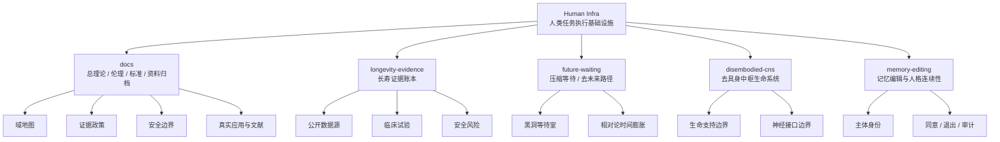
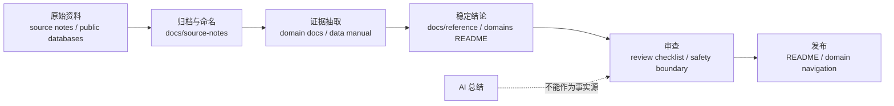
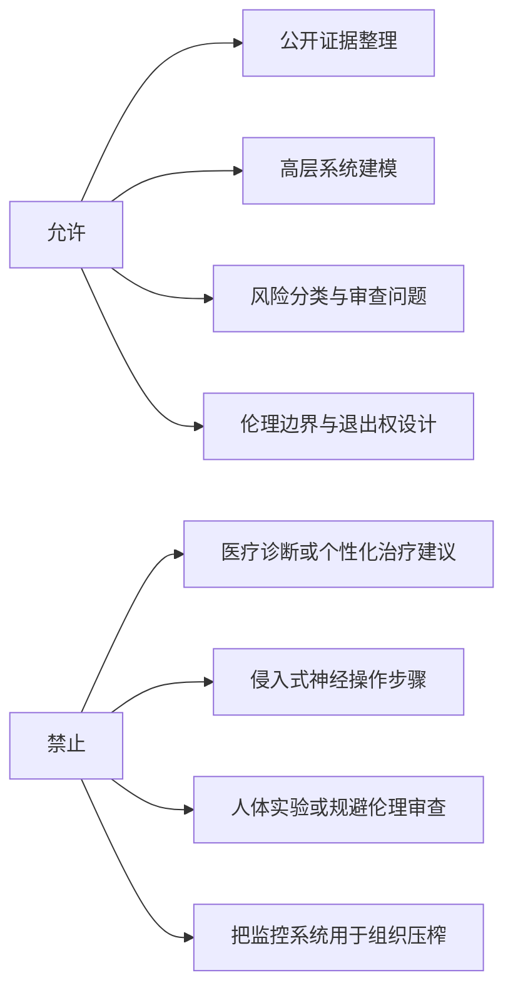

# Human Infra

[](https://github.com/tradecatlabs/human_infra/actions/workflows/check.yml)
[](docs/reference/repository-standards.md)
[](docs/README.md)
[](LICENSE.md)
[](docs/reference/ethics-and-safety-boundaries.md)
[](https://t.me/human_infra)

Human Infra 是一个以“人类作为任务执行系统”为中心的基础设施研究与产品化知识仓库。

它把人类表现从“意志、自律、天赋”的单点解释，重构为一套可诊断、可设计、可维护、可恢复的运行系统：生理、认知、情绪、环境、工具、资源、时间、反馈和恢复共同决定人能否长期稳定地完成复杂任务。

> Human Infra 研究和构建支持人类长期执行、创造、判断与生活的运行基础设施。

## 为什么是一个新研究对象

过去这些线路常被分开讨论：长寿、自我量化、可穿戴健康、睡眠、运动、营养等公共健康基线、慢性压力与恢复、社会决定因素、住房稳定与无家可归、社会连接与社区归属、经济安全与社会保护、公共福利、行政负担与服务导航、社区资源导航与社会服务转介、金融接入与支付、食物保障与水卫生、能源接入与基础公用事业、气候风险与社区韧性、公共预警、应急通信与求助入口、免疫屏障与感染监测、母婴健康与早期发展、托育、早期教育与家庭工作连续性、法律身份与公民登记、司法可及与法律援助、迁移、流离失所与人道服务连续性、数字接入与信息可达、语言可达与清晰沟通、交通可达与日常移动、医疗可及性与基本服务、远程医疗、数字照护与居家监测、药品可及、用药安全与供应连续性、心理健康、成瘾与危机照护、人身安全与伤害预防、建成环境与城市健康、康复与可访问性、学习与技能形成、就业服务与职业转换、家庭照护与长期支持、职业健康、老年照护、极端环境人因、军队表现优化、神经科技、AI 工具和系统安全。

Human Infra 的判断是：它们并不是孤立话题，而是在研究同一个更大的对象。

```mermaid
flowchart LR
    A[长寿与自我量化<br/>Bryan Johnson / Blueprint] --> H[Human Infra]
    L[长寿证据基础设施<br/>NIA ITP / Geroscience / HAGR] --> H
    P[人口级健康数据<br/>All of Us / UK Biobank / NHANES] --> H
    R[验证与监管基础设施<br/>ClinicalTrials.gov / FDA RWE / OMOP] --> H
    T[信任与数据治理<br/>HIPAA / NIST Privacy / GA4GH] --> H
    Q[功能与生活质量结局<br/>PROMIS / WHO ICF / EQ-5D] --> H
    V[价值与疾病负担<br/>GBD / WHO-CHOICE / NICE HTA] --> H
    S[压力、负荷与恢复<br/>Allostatic Load / WHO Mental Health at Work] --> H
    U[社会决定因素与生活环境<br/>WHO SDOH / CDC SVI / PLACES] --> H
    AL[住房稳定、无家可归与驱逐风险<br/>UN-Habitat / HUD AHAR / Census AHS] --> H
    AH[社会连接、孤独风险与社区归属<br/>WHO Social Connection / CDC / NASEM] --> H
    AA[经济安全与时间结构<br/>ILO / World Bank / FMLA] --> H
    AT[公共福利、行政负担与服务导航<br/>USA.gov / Performance.gov CX / Medicaid] --> H
    AY[社区资源导航与社会服务转介<br/>211 / Open Referral / Gravity / CMS AHC] --> H
    AP[金融接入、支付与消费者保护<br/>Global Findex / FDIC / CFPB / Fed] --> H
    AB[食物保障、营养与水卫生<br/>FAO / WFP / WHO-UNICEF JMP] --> H
    AG[能源接入、清洁烹饪与室内空气<br/>World Bank / IEA / WHO HAP] --> H
    AQ[气候风险、预警与社区韧性<br/>IPCC / WMO / NOAA / CMRA] --> H
    AW[公共预警、应急通信与求助入口<br/>FEMA IPAWS / FCC WEA / 911 / FirstNet] --> H
    AC[免疫、感染监测与公共卫生应急<br/>WHO IA2030 / CDC NNDSS / IHR] --> H
    AD[母婴健康与早期发展<br/>WHO MNCH / PRAMS / Nurturing Care] --> H
    AS[托育、早教与家庭工作连续性<br/>World Bank / ACF OCC / DOL / Census] --> H
    AI[法律身份、公民登记与权利入口<br/>UN Legal Identity / CRVS / ID4D] --> H
    AO[司法可及、法律援助与权利救济<br/>UN SDG 16 / WJP / LSC / DOJ] --> H
    AN[迁移、流离失所与人道服务连续性<br/>UNHCR / IOM / WHO / IDMC] --> H
    AE[数字接入、身份与公共服务<br/>ITU / NTIA / NIST Digital ID] --> H
    AU[语言可达、清晰沟通与健康素养<br/>PlainLanguage.gov / LEP.gov / CDC] --> H
    AJ[交通可达、公共交通与日常移动<br/>World Bank Transport / FTA NTD / BTS NHTS] --> H
    AK[医疗可及、初级卫生与基本服务<br/>WHO UHC / PHC / Essential Medicines] --> H
    AX[远程医疗、数字照护与居家监测<br/>HHS Telehealth / HRSA / CMS / FDA Digital Health] --> H
    AV[药品可及、用药安全与供应连续性<br/>WHO EML / FDA Shortages / DailyMed] --> H
    AM[心理健康、成瘾与危机照护<br/>WHO mhGAP / SAMHSA / NIMH / 988] --> H
    AF[人身安全、伤害预防与应急响应<br/>WHO injuries / CDC WISQARS / 988] --> H
    Z[建成环境与环境暴露<br/>WHO Housing / CDC BE Tool / AirNow] --> H
    X[康复、辅助技术与可访问性<br/>WHO Rehab / WCAG / Section 508] --> H
    Y[学习与技能形成<br/>How People Learn / WWC / O*NET] --> H
    AR[就业服务、劳动力发展与职业转换<br/>World Bank Jobs / DOL ETA / Apprenticeship] --> H
    W[照护与长期支持<br/>CDC Caregiving / HCBS / WHO LTC] --> H
    B[数字健康与可穿戴<br/>Apple Heart Study] --> H
    C[职业健康与组织设计<br/>NIOSH Total Worker Health] --> H
    D[健康老龄化<br/>WHO ICOPE] --> H
    E[极端环境人因<br/>NASA HRP] --> H
    F[高压任务表现<br/>Army H2F / Total Force Fitness] --> H
    G[神经科技<br/>NIH BRAIN / DARPA NESD] --> H
    N[神经伦理与 BCI 安全<br/>UNESCO / OECD / FDA BCI] --> H
    I[系统安全<br/>Leveson STAMP] --> H
    K[公共健康基线<br/>睡眠 / 运动 / 营养 / 心理健康] --> H
    M[人机协作与认知工程<br/>NIST AI RMF / NASA-TLX / Human-AI Teaming] --> H
    O[组织安全与事件学习<br/>WHO Patient Safety / AHRQ / HRO] --> H

    H --> J[人类如何长期稳定地<br/>执行 / 创造 / 判断 / 恢复 / 延续]
```



这不是把所有话题混成一个筐，而是给它们一个共同的上位对象：支撑人长期运行的基础设施。首批真实应用和文献索引见 [真实应用与文献](docs/reference/applications-and-literature.md)。

## 快速入口

| 你想做什么 | 入口 | 说明 |
| --- | --- | --- |
| 先理解项目全貌 | [docs/README.md](docs/README.md) | 文档系统入口与推荐阅读顺序 |
| 查看领域边界 | [docs/reference/domain-map.md](docs/reference/domain-map.md) | Human Infra 的子域地图和拆分原因 |
| 查看伦理与安全红线 | [docs/reference/ethics-and-safety-boundaries.md](docs/reference/ethics-and-safety-boundaries.md) | 医疗、神经、生命支持和组织使用边界 |
| 查看证据规则 | [docs/reference/evidence-policy.md](docs/reference/evidence-policy.md) | 如何区分原始资料、证据和稳定结论 |
| 查看真实应用与文献 | [docs/reference/applications-and-literature.md](docs/reference/applications-and-literature.md) | 真实项目、机构资料、论文和数据源索引，覆盖个体、家庭、社区、医疗、公共服务、环境和高风险技术 |
| 贡献文档 | [docs/how-to/contribute-docs.md](docs/how-to/contribute-docs.md) | 文档贡献流程 |
| 加入社区 | [Telegram](https://t.me/human_infra) | 讨论 Human Infra、长寿证据、未来等待路径和研究资料 |
| 运行质量检查 | [docs/how-to/run-quality-checks.md](docs/how-to/run-quality-checks.md) | 本地和 CI 的检查命令 |
| 查看所有子域 | [domains/README.md](domains/README.md) | 可独立演化的研究域入口 |
| 查看结构决策 | [docs/decisions/README.md](docs/decisions/README.md) | ADR 与仓库重组决策 |

## 真实应用速览

| 层级 | 代表资料 | 关注问题 |
| --- | --- | --- |
| 个体运行系统 | Bryan Johnson / Blueprint、Apple Heart Study、PROMIS、WHO ICF | 人如何被测量、反馈、恢复和评估 |
| 健康与照护底座 | WHO UHC、WHO Primary Health Care、WHO mhGAP、WHO ICOPE、CDC Caregiving | 人能否获得医疗、心理健康、康复、长期照护和危机支持 |
| 远程照护与居家监测 | Telehealth.HHS.gov、HRSA Telehealth、CMS/Medicare Telehealth、HHS Remote Patient Monitoring、FDA Digital Health | 医疗和照护能否跨越距离、行动限制、慢病随访和居家连续性断点 |
| 药品与治疗连续性 | WHO Essential Medicines、WHO Medication Without Harm、FDA Drug Shortages、DailyMed、Medicare Part D、CDC Medication Safety | 关键药物能否可得、可负担、不断供，并被安全理解和使用 |
| 家庭与照护连续性 | World Bank Childcare、ACF OCC/CCDF、ChildCare.gov、DOL Childcare、Census Child Care | 托育、早教、养育支持和父母工作连续性是否支撑儿童与成年人 |
| 学习与就业底座 | How People Learn、O*NET、World Bank Jobs、DOL ETA、Apprenticeship.gov、My Next Move | 能力能否转成工作、收入、职业导航、再培训和转岗路径 |
| 社会生活底座 | WHO SDOH、UN-Habitat Housing、ILO Social Protection、FAO SOFI、World Bank Energy、WHO/UNICEF JMP | 住房、收入、食物、水、能源和社区是否支撑长期生活 |
| 公共福利与服务递送 | USA.gov Benefit Finder、Performance.gov CX、Medicaid.gov、SNAP、SSI、LIHEAP、Administrative Burden | 资格、申请、续期、证明、等待、申诉和人工帮助是否把制度转成实际支持 |
| 社区资源与转介网络 | 211、Open Referral HSDS、Gravity Project、CMS AHC、ACL Eldercare Locator | 人能否找到本地服务、完成转介、获得回访，并避免被资源目录和服务碎片化排除 |
| 经济与金融底座 | World Bank Global Findex、FDIC Household Survey、CFPB、Federal Reserve Payments Study | 账户、支付、信贷、债务、费用和金融消费者保护是否支撑日常生活 |
| 权利与公共服务入口 | UN Legal Identity、WJP Rule of Law、LSC Justice Gap、NIST Digital Identity、USWDS、FTA ADA | 人能否被制度承认、获得法律救济，并进入数字服务、交通系统和无障碍服务 |
| 服务理解与语言可达 | PlainLanguage.gov、LEP.gov、National CLAS、CDC health literacy、W3C cognitive accessibility | 人能否读懂、听懂、用自己的语言和认知方式完成关键服务 |
| 迁移与人道连续性 | UNHCR、IOM、WHO Health and Migration、IDMC、OCHA HDX、INEE | 当人离开原有地点和制度后，身份、医疗、教育、庇护、保护和服务如何不断线 |
| 气候与社区韧性底座 | IPCC AR6、WMO Early Warnings for All、NOAA/NCEI、CMRA、CDC Climate and Health | 极端天气、热、洪水、火灾、空气和基础设施中断是否被预警、适应和恢复 |
| 公共预警与应急通信 | FEMA IPAWS、FCC WEA/EAS、NOAA Weather Radio、Ready.gov、911.gov、FirstNet | 危机信息能否及时到达、求助能否接通、响应者能否持续通信 |
| 环境与安全底座 | WHO Housing、CDC BE Tool、AirNow、CDC Heat and Health Index、WHO Road Safety、CDC WISQARS、988 Lifeline | 生活空间是否安全、可达、可恢复，且不把风险归咎于个人 |
| 未来与高风险技术 | NIA ITP、Geroscience、ClinicalTrials.gov、NIH BRAIN、FDA BCI、NASA HRP、NIST AI RMF | 长寿、神经科技、AI 和极端环境如何进入证据、治理与安全边界 |

完整来源、使用边界和后续条目模板统一维护在 [真实应用与文献](docs/reference/applications-and-literature.md)。

## 项目地图



## 子域导航

| 子域 | 当前对象 | 主要产物 | 非目标 |
| --- | --- | --- | --- |
| [Longevity Evidence](domains/longevity-evidence/README.md) | 长寿干预、公开证据、临床试验、药品安全 | 证据模型、数据源说明、采集脚本、人工干预清单 | 不提供医疗诊断或个性化用药建议 |
| [Future Waiting](domains/future-waiting/README.md) | 用较少主观时间等待未来的路径 | [黑洞等待室](domains/future-waiting/paths/black-hole-waiting-room.md) 等思想实验与边界 | 不提供黑洞接近、太空任务或人体实验步骤 |
| [Disembodied CNS](domains/disembodied-cns/README.md) | 去具身外部维持型中枢生命系统 | 高层架构、生命支持和接口边界建模 | 不提供侵入式神经组织维持或人体改造流程 |
| [Memory Editing](domains/memory-editing/README.md) | 记忆读写、人格连续性、主体权利保护 | 概念边界、验证问题、伦理约束 | 不提供真实个体记忆操控步骤 |

## 阅读路径

| 角色 | 推荐路径 |
| --- | --- |
| 第一次进入项目 | [项目地图](#项目地图) -> [域地图](docs/reference/domain-map.md) -> [伦理与安全边界](docs/reference/ethics-and-safety-boundaries.md) |
| 研究贡献者 | [真实应用与文献](docs/reference/applications-and-literature.md) -> [证据政策](docs/reference/evidence-policy.md) -> [资料管理](docs/reference/source-management.md) |
| 文档维护者 | [仓库标准](docs/reference/repository-standards.md) -> [文档生命周期](docs/reference/document-lifecycle.md) -> [写作风格](docs/reference/writing-style-guide.md) |
| 数据脚本维护者 | [Longevity Evidence](domains/longevity-evidence/README.md) -> [数据说明](domains/longevity-evidence/data/README.md) -> [脚本说明](domains/longevity-evidence/scripts/README.md) |
| 安全审查者 | [伦理与安全边界](docs/reference/ethics-and-safety-boundaries.md) -> [审查清单](docs/reference/review-checklists.md) -> [安全政策](SECURITY.md) |

## 证据工作流



Human Infra 不把 AI 总结当作事实源。公开结论必须能回到原始资料、公开数据库或明确的人工判断记录。

## 仓库结构

```text
human_infra/
├── .github/                 # GitHub 模板与 CI 门禁
├── docs/                    # 总理论、标准、边界、模板和资料归档
│   ├── decisions/           # 架构与域边界决策记录
│   ├── explanations/        # 概念解释和理论文章
│   ├── how-to/              # 任务导向操作说明
│   ├── reference/           # 稳定标准、域地图、术语和证据规则
│   ├── source-notes/        # 原始资料归档
│   ├── templates/           # 文档模板
│   └── tutorials/           # 学习路径
├── domains/                 # 可独立演化的研究子域
│   ├── disembodied-cns/
│   ├── future-waiting/
│   ├── longevity-evidence/
│   └── memory-editing/
├── tools/                   # 仓库维护脚本
├── AGENTS.md                # 代理与维护者架构说明
├── CHANGELOG.md             # 结构变更记录
├── Makefile                 # 本地质量门禁
└── README.md                # 项目入口
```

## 质量门禁

本仓库是知识优先仓库，检查重点是结构、链接和轻量脚本有效性。

```bash
make check
```

该命令会执行：

1. 清理 Python 缓存；
2. 检查必需文件和目录；
3. 检查临时文件名泄漏；
4. 检查本地 Markdown 链接；
5. 编译维护脚本和数据脚本；
6. 再次清理并复查结构。

GitHub Actions 会在 push 和 pull request 时运行同一条门禁。详见 [运行质量检查](docs/how-to/run-quality-checks.md)。

## 核心边界

Human Infra 不是效率鸡汤，也不是把人压榨成机器的管理系统。它的首要目标是保护人的长期能动性、健康、创造力、自由度和尊严。



项目不会：

- 提供医疗诊断、个性化用药建议或治疗方案推荐；
- 宣称任何干预、系统或技术可以实现永生；
- 提供侵入式神经操作、记忆操控或人体实验的可执行步骤；
- 把人的状态监控变成组织压榨、控制或规训工具；
- 用 AI 摘要替代原始证据、临床事实和人工审核。

## 维护与贡献

- 贡献文档前先读 [贡献指南](CONTRIBUTING.md) 和 [写作风格](docs/reference/writing-style-guide.md)。
- 新增子域前先读 [域地图](docs/reference/domain-map.md) 和 [新增子域说明](docs/how-to/add-domain.md)。
- 新增资料前先读 [资料管理](docs/reference/source-management.md) 和 [新增资料说明](docs/how-to/add-source-note.md)。
- 架构级变更必须同步更新对应目录的 `AGENTS.md`。
- 重大结构变化记录到 [CHANGELOG.md](CHANGELOG.md) 和 [决策记录](docs/decisions/README.md)。

## 项目状态

| 项目面 | 状态 |
| --- | --- |
| 仓库类型 | Docs-as-Code 知识仓库 |
| 默认分支 | `main` |
| 自动检查 | GitHub Actions `Check` |
| 数据边界 | `data/raw/` 与 `data/processed/` 默认忽略 |
| 应用与文献入口 | [docs/reference/applications-and-literature.md](docs/reference/applications-and-literature.md) |
| 许可状态 | [LICENSE.md](LICENSE.md)，当前为权利边界与待定许可说明 |
| 引用信息 | [CITATION.cff](CITATION.cff) |
| 安全报告 | [SECURITY.md](SECURITY.md) |
| 支持边界 | [SUPPORT.md](SUPPORT.md) |
| 社区入口 | [Telegram](https://t.me/human_infra) |

## 变更记录

- 2026-06-20：从 Biocat 单项目重组为 Human Infra 总项目；Biocat 迁入 `domains/longevity-evidence/`；新增去具身中枢生命系统与记忆编辑两个研究域；补齐 Docs-as-Code 知识仓库根文件、文档分层、协作模板和结构检查脚本。
- 2026-06-22：新增 `future-waiting` 子域和“黑洞等待室”未来等待路径。
- 2026-06-23：新增 GitHub Actions 远程质量门禁，统一运行本地 `make check`。
- 2026-06-23：压缩 README 的真实应用资料入口，新增真实应用速览，提升首屏导航密度。

完整记录见 [CHANGELOG.md](CHANGELOG.md)。
