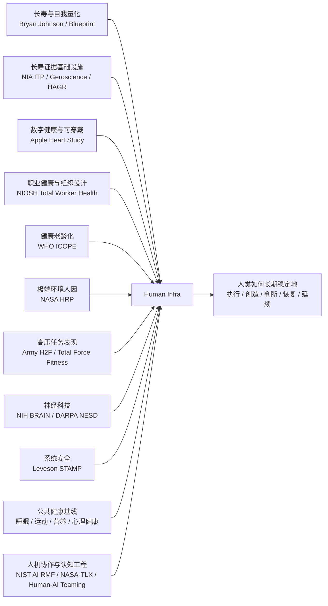
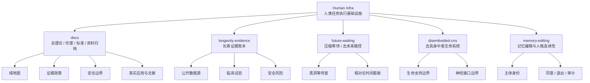
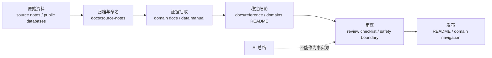
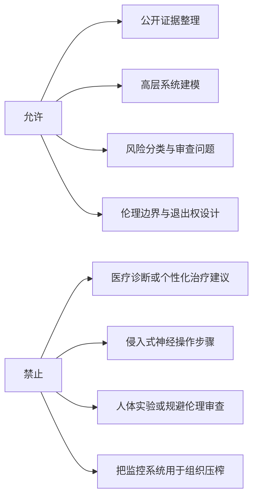

# Human Infra

[](https://github.com/tradecatlabs/human_infra/actions/workflows/check.yml)
[](docs/reference/repository-standards.md)
[](docs/README.md)
[](LICENSE.md)
[](docs/reference/ethics-and-safety-boundaries.md)
[](https://t.me/human_infra)

Human Infra 是一个以“人类作为任务执行系统”为中心的基础设施研究与产品化知识仓库。

它把人类表现从“意志、自律、天赋”的单点解释，重构为一套可诊断、可设计、可维护、可恢复的运行系统：生理、认知、情绪、环境、工具、资源、时间、反馈和恢复共同决定人能否长期稳定地完成复杂任务。

> Human Infra 研究和构建支持人类长期执行、创造、判断与生活的运行基础设施。

## 为什么是一个新研究对象

过去这些线路常被分开讨论：长寿、自我量化、可穿戴健康、睡眠、运动、营养等公共健康基线、职业健康、老年照护、极端环境人因、军队表现优化、神经科技、AI 工具和系统安全。

Human Infra 的判断是：它们并不是孤立话题，而是在研究同一个更大的对象。



这不是把所有话题混成一个筐，而是给它们一个共同的上位对象：支撑人长期运行的基础设施。首批真实应用和文献索引见 [真实应用与文献](docs/reference/applications-and-literature.md)。

## 快速入口

| 你想做什么 | 入口 | 说明 |
| --- | --- | --- |
| 先理解项目全貌 | [docs/README.md](docs/README.md) | 文档系统入口与推荐阅读顺序 |
| 查看领域边界 | [docs/reference/domain-map.md](docs/reference/domain-map.md) | Human Infra 的子域地图和拆分原因 |
| 查看伦理与安全红线 | [docs/reference/ethics-and-safety-boundaries.md](docs/reference/ethics-and-safety-boundaries.md) | 医疗、神经、生命支持和组织使用边界 |
| 查看证据规则 | [docs/reference/evidence-policy.md](docs/reference/evidence-policy.md) | 如何区分原始资料、证据和稳定结论 |
| 查看真实应用与文献 | [docs/reference/applications-and-literature.md](docs/reference/applications-and-literature.md) | Bryan Johnson、NIA ITP、Geroscience、NIST AI RMF、NASA-TLX、Apple Heart Study、NIOSH、WHO、NASA、H2F、BRAIN 等资料索引 |
| 贡献文档 | [docs/how-to/contribute-docs.md](docs/how-to/contribute-docs.md) | 文档贡献流程 |
| 加入社区 | [Telegram](https://t.me/human_infra) | 讨论 Human Infra、长寿证据、未来等待路径和研究资料 |
| 运行质量检查 | [docs/how-to/run-quality-checks.md](docs/how-to/run-quality-checks.md) | 本地和 CI 的检查命令 |
| 查看所有子域 | [domains/README.md](domains/README.md) | 可独立演化的研究域入口 |
| 查看结构决策 | [docs/decisions/README.md](docs/decisions/README.md) | ADR 与仓库重组决策 |

## 项目地图



## 子域导航

| 子域 | 当前对象 | 主要产物 | 非目标 |
| --- | --- | --- | --- |
| [Longevity Evidence](domains/longevity-evidence/README.md) | 长寿干预、公开证据、临床试验、药品安全 | 证据模型、数据源说明、采集脚本、人工干预清单 | 不提供医疗诊断或个性化用药建议 |
| [Future Waiting](domains/future-waiting/README.md) | 用较少主观时间等待未来的路径 | [黑洞等待室](domains/future-waiting/paths/black-hole-waiting-room.md) 等思想实验与边界 | 不提供黑洞接近、太空任务或人体实验步骤 |
| [Disembodied CNS](domains/disembodied-cns/README.md) | 去具身外部维持型中枢生命系统 | 高层架构、生命支持和接口边界建模 | 不提供侵入式神经组织维持或人体改造流程 |
| [Memory Editing](domains/memory-editing/README.md) | 记忆读写、人格连续性、主体权利保护 | 概念边界、验证问题、伦理约束 | 不提供真实个体记忆操控步骤 |

## 阅读路径

| 角色 | 推荐路径 |
| --- | --- |
| 第一次进入项目 | [项目地图](#项目地图) -> [域地图](docs/reference/domain-map.md) -> [伦理与安全边界](docs/reference/ethics-and-safety-boundaries.md) |
| 研究贡献者 | [真实应用与文献](docs/reference/applications-and-literature.md) -> [证据政策](docs/reference/evidence-policy.md) -> [资料管理](docs/reference/source-management.md) |
| 文档维护者 | [仓库标准](docs/reference/repository-standards.md) -> [文档生命周期](docs/reference/document-lifecycle.md) -> [写作风格](docs/reference/writing-style-guide.md) |
| 数据脚本维护者 | [Longevity Evidence](domains/longevity-evidence/README.md) -> [数据说明](domains/longevity-evidence/data/README.md) -> [脚本说明](domains/longevity-evidence/scripts/README.md) |
| 安全审查者 | [伦理与安全边界](docs/reference/ethics-and-safety-boundaries.md) -> [审查清单](docs/reference/review-checklists.md) -> [安全政策](SECURITY.md) |

## 证据工作流



Human Infra 不把 AI 总结当作事实源。公开结论必须能回到原始资料、公开数据库或明确的人工判断记录。

## 仓库结构

```text
human_infra/
├── .github/                 # GitHub 模板与 CI 门禁
├── docs/                    # 总理论、标准、边界、模板和资料归档
│   ├── decisions/           # 架构与域边界决策记录
│   ├── explanations/        # 概念解释和理论文章
│   ├── how-to/              # 任务导向操作说明
│   ├── reference/           # 稳定标准、域地图、术语和证据规则
│   ├── source-notes/        # 原始资料归档
│   ├── templates/           # 文档模板
│   └── tutorials/           # 学习路径
├── domains/                 # 可独立演化的研究子域
│   ├── disembodied-cns/
│   ├── future-waiting/
│   ├── longevity-evidence/
│   └── memory-editing/
├── tools/                   # 仓库维护脚本
├── AGENTS.md                # 代理与维护者架构说明
├── CHANGELOG.md             # 结构变更记录
├── Makefile                 # 本地质量门禁
└── README.md                # 项目入口
```

## 质量门禁

本仓库是知识优先仓库，检查重点是结构、链接和轻量脚本有效性。

```bash
make check
```

该命令会执行：

1. 清理 Python 缓存；
2. 检查必需文件和目录；
3. 检查临时文件名泄漏；
4. 检查本地 Markdown 链接；
5. 编译维护脚本和数据脚本；
6. 再次清理并复查结构。

GitHub Actions 会在 push 和 pull request 时运行同一条门禁。详见 [运行质量检查](docs/how-to/run-quality-checks.md)。

## 核心边界

Human Infra 不是效率鸡汤，也不是把人压榨成机器的管理系统。它的首要目标是保护人的长期能动性、健康、创造力、自由度和尊严。



项目不会：

- 提供医疗诊断、个性化用药建议或治疗方案推荐；
- 宣称任何干预、系统或技术可以实现永生；
- 提供侵入式神经操作、记忆操控或人体实验的可执行步骤；
- 把人的状态监控变成组织压榨、控制或规训工具；
- 用 AI 摘要替代原始证据、临床事实和人工审核。

## 维护与贡献

- 贡献文档前先读 [贡献指南](CONTRIBUTING.md) 和 [写作风格](docs/reference/writing-style-guide.md)。
- 新增子域前先读 [域地图](docs/reference/domain-map.md) 和 [新增子域说明](docs/how-to/add-domain.md)。
- 新增资料前先读 [资料管理](docs/reference/source-management.md) 和 [新增资料说明](docs/how-to/add-source-note.md)。
- 架构级变更必须同步更新对应目录的 `AGENTS.md`。
- 重大结构变化记录到 [CHANGELOG.md](CHANGELOG.md) 和 [决策记录](docs/decisions/README.md)。

## 项目状态

| 项目面 | 状态 |
| --- | --- |
| 仓库类型 | Docs-as-Code 知识仓库 |
| 默认分支 | `main` |
| 自动检查 | GitHub Actions `Check` |
| 数据边界 | `data/raw/` 与 `data/processed/` 默认忽略 |
| 应用与文献入口 | [docs/reference/applications-and-literature.md](docs/reference/applications-and-literature.md) |
| 许可状态 | [LICENSE.md](LICENSE.md)，当前为权利边界与待定许可说明 |
| 引用信息 | [CITATION.cff](CITATION.cff) |
| 安全报告 | [SECURITY.md](SECURITY.md) |
| 支持边界 | [SUPPORT.md](SUPPORT.md) |
| 社区入口 | [Telegram](https://t.me/human_infra) |

## 变更记录

- 2026-06-20：从 Biocat 单项目重组为 Human Infra 总项目；Biocat 迁入 `domains/longevity-evidence/`；新增去具身中枢生命系统与记忆编辑两个研究域；补齐 Docs-as-Code 知识仓库根文件、文档分层、协作模板和结构检查脚本。
- 2026-06-22：新增 `future-waiting` 子域和“黑洞等待室”未来等待路径。
- 2026-06-23：新增 GitHub Actions 远程质量门禁，统一运行本地 `make check`。

完整记录见 [CHANGELOG.md](CHANGELOG.md)。
