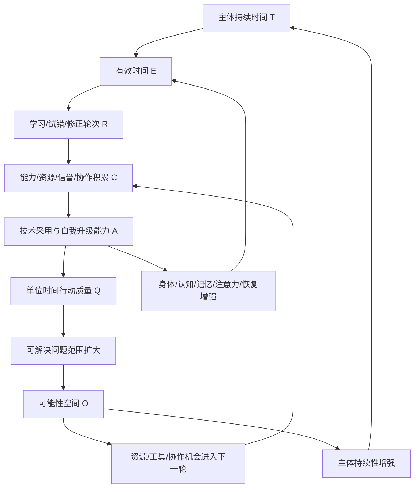

# 有效永生带来的主体持续性加速回报飞轮

Status: working paper v0.25  
Audience: Human Infra 初学者、研究协作者、后续 Web 论文页作者  
Scope: 概念模型、变量定义、问题形式化、研究问题、证据计划和最小建模路线

## Abstract

Human Infra 需要研究一个比单次延寿更上位的问题：当主体持续窗口被延展时，主体是否会获得更多学习、修正、技术采用和未来选择机会。现有长寿叙事、AI 工具叙事和未来主义叙事常把寿命、能力、工具和社会条件分开讨论，缺少一个能同时处理主体持续性、有效时间、技术采用、风险和可能性空间的共同模型。关键挑战是区分日历寿命与有效时间、相关信号与因果干预、技术存在与主体增强、抽象机会与真实可进入路径。本文提出“有效永生带来的主体持续性加速回报飞轮”，将链路拆成 `T/E/R/C/A/Q/O` 七个变量、八条可证伪假设、六类技术族、因果评估协议、Citation Context Review Packet v0.1、Citation Context Risk Triage v0.1、High-Risk Citation Context Review v0.1、Citation Context Local Review v0.1、Fresh Reviewer Citation Audit Protocol v0.1、Claim Context Audit v0.1、Reference Verification v0.1、Pre-Submission Review v0.1、Search Execution Register v0.1、Candidate Source Verification v0.1、Candidate Source Extraction v0.1、Estimand Registry v0.1、Analysis Plan Registry v0.1、AI Research Failure Mode Audit v0.1、AI Task Evidence Register v0.3、指标注册表、威胁边界和 Source Cards v0.5。本文的当前产物是一个可审查的 working paper 和证据框架，不证明永生已经可行，不输出个体死亡日期，也不替代医学、伦理或政策判断。

## Research Design Brief

Primary research question:

```text
在明确证据和治理约束下，主体持续时间的延展是否会通过有效时间、学习轮次、
积累资本、技术采用、行动质量和可能性空间形成可观测的正反馈？
```

这个问题被选中，是因为它既能承接 Human Infra 的宏大目标，又能被拆成可审查的局部边。它不直接问“能不能永生”，而是问一个更可研究的问题：主体持续窗口被延展之后，中间变量是否真的进入了学习、积累、技术采用和未来选择权的正反馈。

FINER 判断：

| Criterion | Score | 理由 |
| --- | --- | --- |
| Feasible | 4/5 | 可以先用二级数据、任务实验、公开队列、系统日志和仿真模型研究局部边；完整飞轮仍需长期纵向数据。 |
| Interesting | 5/5 | 它把长寿、AI 增强、学习积累、社会支持和风险治理放进同一主体持续性问题。 |
| Novel | 4/5 | 各分支已有成熟谱系，但以 `T/E/R/C/A/Q/O` 反馈链连接有效永生与加速回报仍是项目级综合模型。 |
| Ethical | 4/5 | 当前只做概念、证据矩阵和群体级模型设计；硬约束是不输出个体死亡日期、不替代医学判断、不把增强技术去风险化。 |
| Relevant | 5/5 | 直接决定 Human Infra 的目标、对象、预测模型、Web 传播和后续研究优先级。 |

方法蓝图采用 pragmatist mixed-methods：先做框架建模和系统性文献映射，再进入 target-trial style 因果协议、竞争模型比较、任务级实验证据整合和可复现 Web 论文表达。当前版本不是实证确认论文；它的正确用法是作为下一轮 Source Cards、Reference Registry、Citation Context Register、Estimand Registry 和 D3 模型页面的研究入口。

下一轮研究路线：

```text
P1 Scoping
  -> P2 Literature Mapping
  -> P3 Evidence Synthesis
  -> P4 Quantitative Contract
  -> P5 External Audit
  -> P6 Visualization
```

正式提交前，`P5 External Audit` 仍是阻塞项：必须由独立 reviewer 回填 `fresh-reviewer-context-packets/results/CTX*.json`，再由 assembler 生成正式结果账本。当前本地审计不能替代该步骤。

## Contributions

本文当前贡献定位为可进入科研流程的问题框架，尚不构成实证结论：

| 贡献 | 内容 | 对应产物 |
| --- | --- | --- |
| C1 | 将“有效永生”从单纯延寿叙事改写为主体持续性、能力系统、技术系统和可能性空间的反馈问题 | 单一主链与因果图 |
| C2 | 提出 `T/E/R/C/A/Q/O` 七变量接口，用于连接寿命、有效时间、学习轮次、积累资本、技术采用、行动质量和未来选择权 | 最小变量模型 |
| C3 | 将主链拆成可检验边，并为每条边标注候选来源、证据角色、当前置信、断裂条件和下一步模型任务 | Evidence Matrix v1.3 |
| C4 | 引入因果评估协议，要求任何技术或干预都必须说明 comparator、time zero、outcome、estimand、识别假设和不确定性 | 因果评估协议 |
| C5 | 将技术/干预拆成 AI、医学、可穿戴、知识管理、自动化与资源环境六类，分别进入不同模型位置和风险通道 | 技术族注册表 |

## Claim Register

为了避免把概念框架、方法要求、任务内实证证据和禁止性边界混在一起，本文先注册核心主张。主张注册表的定位是审稿人可以逐条追问的责任清单，不承担直接证明功能。

| 编号 | 主张 | 类型 | 当前状态 | 升级条件 |
| --- | --- | --- | --- | --- |
| CL1 | 有效永生应被建模为主体持续性、能力系统、技术系统和可能性空间的反馈问题，而非单次寿命长度问题 | Conceptual framing | Framework proposal | 需要通过变量字典和案例研究证明该框架比单一寿命指标更能解释长期行动能力 |
| CL2 | `T/E/R/C/A/Q/O` 是第一版最小变量接口，可把寿命、有效时间、轮次、积累、技术采用、行动质量和可能性空间放入同一模型 | Model interface | Operational definition | 需要为每个变量补单位、代理指标、缺失处理和可重复测量方案 |
| CL3 | 技术或干预应被表示为改变状态转移 `P(X_{t+1}|X_t,U_t)` 或风险函数 `lambda(t|X_t,U_t)` 的算子 | Method claim | Methodologically supported | 每个技术族必须写出 population、comparator、time zero、outcome 和 estimand |
| CL4 | AI 工具可在限定任务内提高单位时间行动质量，但收益具有任务边界和人群异质性 | Task-limited empirical claim | Supported only for bounded tasks | 需要按任务族建立 AI frontier map，并同步统计 QA 成本、幻觉、返工和依赖风险 |
| CL5 | 可能性空间必须定义为主体真实可进入的路径集合，不能只统计抽象机会或叙事愿望 | Normative and measurement claim | Normative framework with measurement task | 需要把 `O` 拆成资源入口、制度入口、协作入口、技术窗口和可逆选择，并给出进入条件 |
| CL6 | 所有增强技术都必须同时建模正向通道、负向通道、治理门禁和回滚条件 | Governance claim | Governance requirement | 需要为每个技术族建立 downside channel、监测指标、停止条件和事故复盘模板 |
| CL7 | 本文不证明永生已经实现，不输出个体死亡日期，不把机制合理或短期功能改善升级成寿命延长结论 | Prohibited claim boundary | Hard boundary | 任何后续图表、页面和模型输出都必须保留该边界 |

## Claim Evidence Map

Claim Evidence Map 将每个核心主张绑定到正文位置、证据边、引用上下文、反证条件和升级门槛。它的职责是让后续扩写、图表和传播材料都能回到同一个 claim-to-source 契约。

| 主张 | 正文位置 | 证据边 | 引用上下文 | 当前判定 | 反证条件 | 升级门槛 |
| --- | --- | --- | --- | --- | --- | --- |
| CL1 | S1；S2；S4；S6 | `T -> E`；`E -> R`；`R -> C`；`C -> A`；`A -> Q`；`Q -> O`；`O -> T/E` | CTX2；CTX4；CTX5；CTX6；CTX7；CTX12 | FRAMEWORK_ONLY：各局部边有方法、机制、关联、实验或规范来源支撑；完整飞轮仍是综合框架主张 | 关键边长期不成立；负向通道压过正向通道；新增寿命无法转化为有效时间 | 完成至少一个案例研究或仿真，证明该框架比单一寿命指标更能解释长期行动能力 |
| CL2 | S5；S12；S13 | `T -> E`；`E -> R`；`R -> C`；`C -> A`；`A -> Q`；`Q -> O`；`O -> T/E`；`A/Q -> risk` | CTX1；CTX2；CTX4；CTX5；CTX6；CTX7；CTX8；CTX12 | OPERATIONAL_INTERFACE：七变量接口把不同文献谱系压缩为可建模字段；当前只证明字段可讨论，不证明字段充分 | 变量无法被稳定代理测量；变量之间高度重叠导致不可识别；关键主体状态被遗漏 | 为每个变量补齐单位、代理指标、缺失处理、时间窗、适用人群和可重复测量方案 |
| CL3 | S5；S11；S13 | `U_t -> causal claim`；`T -> E` | CTX1；CTX9 | METHOD_SUPPORTED：生存分析、风险模型和 target-trial style 因果协议支持把技术写成状态转移或风险函数上的算子 | 没有 comparator；time zero 错误；结局定义偷换；不可测混杂压倒识别假设 | 每个技术族必须给出 population、intervention、comparator、time zero、outcome、estimand 和识别假设 |
| CL4 | S8；S10；S12 | `A -> Q`；`A/Q -> risk` | CTX7；CTX8 | BOUNDED_EMPIRICAL：AI 工具在客服、写作、编程和部分知识任务中有任务内收益证据；该证据只支持限定任务边界 | 任务进入 jagged frontier 失败区；QA 成本抵消速度收益；幻觉或自动化偏差提高返工；高技能主体收益不稳定 | 按任务族建立 AI frontier map，并同步记录速度、质量、错误、QA 成本、依赖和异质性 |
| CL5 | S3；S8；S12 | `Q -> O`；`O -> T/E` | CTX5；CTX12 | NORMATIVE_MEASUREMENT：能力方法、社会资本和公共健康框架支持把可能性空间定义为真实可进入路径集合 | 产出提高但资源、权限、身份或制度入口不增加；机会只能叙述不能进入；新增路径带来更高暴露和恢复负担 | 把 `O` 拆成资源入口、制度入口、协作入口、技术窗口和可逆选择，并定义进入条件 |
| CL6 | S10；S11；S14 | `A/Q -> risk`；`U_t -> causal claim` | CTX8；CTX9；CTX10；CTX11 | GOVERNANCE_REQUIRED：AI 风险、人机交互、个人数据系统和认知工具谱系共同要求把副作用、误用、回滚和治理门禁并入模型 | 技术收益只记正项；停止条件缺失；回滚路径缺失；事故复盘缺失；主体权利和同意边界缺失 | 为每个技术族建立 downside channel、监测指标、停止条件、回滚条件和事故复盘模板 |
| CL7 | S3；S7；S11；S14；S16 | `U_t -> causal claim`；`A/Q -> risk` | CTX1；CTX3；CTX7；CTX8；CTX9 | HARD_BOUNDARY：方法标准、预测模型治理、AI 风险治理和证据政策共同限定本文不能输出个人死亡日期或把短期功能改善升级成寿命结论 | 页面输出个体死亡日期；机制合理被写成干预效果；短期任务收益被写成寿命延长；引用上下文越界 | 后续图表、模型和传播材料必须持续保留非主张边界，并接受 claim-to-source 审计 |

## AI Task Evidence Register v0.3

`A -> Q` 不能写成“AI 提升能力”的空泛句子。第一批 AI 任务实验证据必须被压成同一契约：任务、人群、干预、比较对象、效应指标、统计不确定性、QA 成本、负向通道和外推边界同时出现。v0.3 在 v0.2 的 full-text audit 之上新增 `methodAudit`，要求每条 AI 证据同时回到原文表格/图、主要规格、标准误或区间、评分协议、QA 成本量化和外推限制。该注册表只支持限定任务内的单位时间行动质量变化，不支持通用智力增强、健康寿命延长或有效永生已经成立。

| ID | 来源与等级 | 样本与设计 | 效应估计 | 统计/不确定性 | QA 与外推边界 |
| --- | --- | --- | --- | --- | --- |
| AQ1 | Brynjolfsson et al., 2025；Level III workplace rollout | QJE 正式版约 5,172 名客服；NBER full-text audit 版本 5,179 名客服、约 300 万次聊天；分阶段上线，agent-month 层级分析 | Table 2 preferred level outcome：每小时解决数 `0.301`，SE `0.0498`，DV mean `2.174`；preferred log outcome `0.138`，SE `0.0199` | Difference-in-differences / fixed effects；标准误聚类到 agent location；Appendix Table A.1 替代 DiD 估计范围 `0.116-0.257` | 只支持结构化客服任务内 `A -> Q`；直接 QA 审阅时间未量化，需并行看 resolution rate、NPS、sentiment、AHT 和异常案例 |
| AQ2 | Noy and Zhang, 2023；Level II randomized online experiment | 453 名有经验、大学学历专业人员；预注册在线随机实验；约一半随机获得 ChatGPT access | 完成时间约下降 40%；评分质量约提高 18%；后测少用约 11 分钟，评分提高约 0.45 SD | 时间和评分 p<0.001；处理组注册成功率约 92%，对照组存在 10-20% 使用污染 | 支持短写作任务内速度/质量改善；不能外推到长周期研究、战略判断或主体持续性 |
| AQ3 | Peng et al., 2023；Level II randomized experiment, preprint | 95 名 Upwork 程序员；45 treatment、50 control；35/35 完成任务进入时间比较 | treatment 71.17 分钟，control 160.89 分钟；完成时间下降 55.8% | t-test p=0.0017；95% CI [21%, 89%]；成功率 +7pp 不显著，CI [-0.11, 0.25] | 支持局部编程任务提速；不能外推到大型系统设计、长期维护或安全关键代码 |
| AQ4 | Dell'Acqua et al., 2026；Level II professional-task experiment | 852 名咨询人员回应，758 名完成；随机分配 no AI、GPT-4、GPT-4 + prompt overview；385 frontier 内任务，373 frontier 外任务 | frontier 内 Table 1/2/3：质量、完成率和时间显著改善；frontier 外 Table 4：正确率下降 `0.139-0.245` | 线性回归与稳健标准误；outside-frontier 显示速度和推荐质量可改善，但正确率下降 | 同时支持 `A -> Q` 和 `A/Q -> risk`；必须先判断任务是否在 AI 能力边界内 |

### AI Task Method Audit v0.3

方法审计的用途是把“AI 提效”从摘要级证据推进到可复核字段。它不要求本文重做原研究统计，只要求每条引用都能说明：主表/主图在哪里、主规格是什么、效应列和不确定性如何报告、质量评分怎么来、QA 成本是否被直接量化。

| ID | 主表/主图与规格 | 统计列与不确定性 | 质量评分协议 | QA 成本与外推限制 |
| --- | --- | --- | --- | --- |
| AQ1 | NBER full-text Table 2 columns 3/6；Table 3；Table 4；Appendix Table A.1。主规格为 staggered rollout DiD，并包含 year-month、location、agent、agent-tenure fixed effects。 | Table 2：`Post AI X Ever Treated = 0.301` resolutions/hour，SE `0.0498`；log outcome `0.138`，SE `0.0199`。Table 3 同时记录 AHT、calls/hour、resolution rate、NPS；Table 4 记录 customer/agent sentiment。 | 核心产出是 resolutions per hour；质量代理包括 AHT、calls/hour、resolution rate、NPS 与 SiEBERT sentiment。AI 建议只对 agent 可见，必须由 agent 采纳或忽略。 | 直接 QA 审阅时间未量化；可用代理指标约束。外推只限相似结构化客服任务，不可直接外推到开放式专业判断。 |
| AQ2 | Figure 1/2、Table 1 和 footnotes 22-27。主规格为 within-participant pre/post change regression，含 occupation-by-task-order FE 和 incentive-arm FE。 | 后测少用约 11 分钟，约 `0.75 SD`，control mean 27 分钟，`p<0.001`；评分提高 `0.45 SD`，`p<0.001`；15 分钟固定时间组评分 `+0.33 SD` 但不显著。 | 三名同职业盲评者按 1-7 分评分；评审有基础报酬和与其他评审相关性挂钩的奖金；平均 within-essay cross-evaluator correlation 为 `0.44`。 | 92% 处理组注册、80% 使用 ChatGPT；对照组污染约 10-20%。事实核查会降低节省时间，论文未给出数值 QA 开销。 |
| AQ3 | Figure 6 完成时间分布；Table 1 异质性回归。随机分配 Copilot access，主要时间比较限定在完成任务者。 | Treatment mean `71.17` 分钟，control mean `160.89` 分钟；时间下降 `55.8%`，t-test `p=0.0017`，95% CI `[21%, 89%]`；成功率 `+7pp` 不显著，95% CI `[-0.11, 0.25]`。 | JavaScript HTTP server 任务必须通过全部 12 个测试；完成时间从 repo creation 到 first commit passing all 12 tests。 | QA 只覆盖测试通过和时间，不覆盖长期维护、安全、代码审查时间或隐藏缺陷。外推只限小型局部实现任务。 |
| AQ4 | Inside-frontier Tables 1-3；outside-frontier Tables 4-6；Figures 3/4/7。随机分配 no AI、GPT-4、GPT-4 + prompt overview。 | Inside frontier：quality `1.556-1.746`，completion `0.090-0.111`，time `-1388` 到 `-1129` 秒。Outside frontier：correctness `-0.139` 到 `-0.245`，time `-689` 到 `-407` 秒，recommendation quality `1.046-1.475`。 | Frontier 内回答由两名 human graders 逐题评分并计算 composite Quality，同时有 GPT-4 scoring；frontier 外 correctness 为二元指标，recommendation quality 由 BCG 顾问和商学院学生按 1-10 rubric 评分。 | 直接量化了边界外失败：AI 可减少时间并提高推荐质量表象，同时让正确率下降 13-25 个百分点。外推必须按任务 frontier 建图。 |

## 1. 研究问题

最小问题：

```text
如果主体能够持续更久，它是否会因为拥有更多学习、试错、积累和技术采用机会，
反过来提高自己继续存在、继续行动和继续升级的能力？
```

Human Infra 版本：

```text
有效永生
  -> 主体持续时间延长
  -> 学习与试错轮次增加
  -> 能力、资源和协作积累
  -> 新技术采用能力增强
  -> 技术反过来增强主体
  -> 主体持续性进一步增强
  -> 加速回报飞轮形成
```

这不是“长寿会自动带来成功”的命题。中间有很多断点：健康质量、认知状态、资源可及性、学习能力、社会支持、技术成熟度、风险治理和伦理边界。本文研究的正是这些中间环节。

贯穿本文的例子是一个长期研究主体 `P`。`P` 依赖身体健康、认知能力、记忆系统、AI 工具、医学可及性、协作网络和稳定环境来推进一个二十年以上的研究项目。如果 `P` 只是日历寿命增加，但健康质量、注意力、资源和工具整合能力没有提高，延长的时间可能无法转化为有效行动。相反，如果 `P` 的健康寿命、反馈学习、资料管理、AI 协作和医疗可及性同时改善，那么增加的持续时间可能进入下一轮能力积累和技术采用。这一例子用于约束全文：本文研究主体 `P` 的持续存在、持续行动、持续学习和持续进入未来的条件，避免停留在抽象“不死”。

## 2. 为什么这个问题重要

多数人生规划默认一个固定寿命窗口：

```text
有限寿命
  -> 有限学习轮次
  -> 有限试错机会
  -> 有限资源积累
  -> 有限技术等待窗口
  -> 有限未来选择权
```

Human Infra 的关键转向是：寿命、健康寿命、有效时间、主观时间和相对时间不再只被看成背景条件，而是被看成可以被技术、医学、AI、制度、环境和协作系统改变的上位变量。

一旦主体持续窗口发生变化，很多原本被当作固定常量的资源也会发生二阶变化：

- 可学习轮次增加；
- 可复盘失败次数增加；
- 可等待技术成熟的时间增加；
- 可积累的知识、资源和关系增加；
- 可恢复、重启和转向的机会增加；
- 可进入未来技术窗口的概率增加。

因此，本文把有效永生理解为一种动态过程：

```text
单次延寿只是局部结果
主体持续性、能力系统、技术系统和可能性空间的正反馈循环才是本文研究对象
```

## 3. 核心定义

| 概念 | 定义 | 反例或边界 |
| --- | --- | --- |
| 有效永生 | 尽可能延展主体持续性，使主体长期维持存在、行动、学习、创造、恢复和进入未来的能力 | 不等于已经不死，不等于上传副本自动等于本人 |
| 主体持续性 | 一个主体继续感知、判断、行动、学习、修正和选择的能力 | 单纯保存数据、名义身份或外部评价不足以构成持续性 |
| 有效时间 | 主体可清醒、可行动、可判断、可创造的时间 | 单纯活着但长期失能、失智或不可行动时，有效时间可能很低 |
| 技术采用能力 | 主体发现、理解、评估、整合和使用新技术的能力 | 盲目追逐新技术不等于技术采用能力 |
| 可能性空间 | 主体未来可进入的任务、关系、资源、制度、知识和技术路径集合 | 机会很多但主体无法行动时，可能性空间无法转化为真实选择权 |
| 加速回报飞轮 | 主体持续性提升带来更多积累，积累提高技术采用和能力升级，升级又进一步强化主体持续性的正反馈过程 | 任何断点失控都可能让飞轮停滞、反转或变成风险放大器 |

## 4. 单一主链

```text
有效永生带来的主体持续性加速回报飞轮
  -> 主体不再被固定寿命窗口完全约束，持续存在、行动、学习和修正的时间边界被延长
  -> 更长的持续时间增加了学习、试错、失败复盘、策略调整和长期项目推进的轮次
  -> 更多轮次使经验、技能、判断力、知识结构、资源储备、信誉资产和协作网络持续沉淀
  -> 这些积累降低了长期目标中的信息成本、试错成本、协作成本、失败成本和重新开始成本
  -> 长期目标失败成本下降后，主体更有能力等待尚未成熟的技术窗口，并在新技术出现时接触、理解、采用和整合它
  -> 新技术进入主体系统后，进一步增强身体健康、认知能力、注意力控制、记忆外化、工具使用、行动效率和恢复能力
  -> 身体、认知、注意力、记忆、工具和恢复能力被增强后，单位时间内的行动质量、创造密度、问题处理能力和反馈速度提高
  -> 单位时间创造能力提高使主体能够处理更复杂、更长期、更高不确定性的问题
  -> 可解决问题范围扩大后，主体能够进入更多任务、关系、知识、资源、制度和技术路径
  -> 更多路径使可能性空间扩大，未来选择权、行动余地和可迁移资源同步增加
  -> 扩大的可能性空间把更多资源、能力、知识、工具和协作机会带入下一轮积累
  -> 下一轮积累进一步加速技术采用、自我升级、系统协作、问题求解和环境改造
  -> 技术采用、自我升级和系统协作的加速再次提高主体存在、行动、学习、恢复和进入未来的能力
  -> 主体持续性进一步增强，使有效永生从单纯延寿变成持续升级的动态过程
  -> 当主体持续性、能力系统、技术系统和可能性空间形成正反馈时，加速回报飞轮形成
  -> 该飞轮不断降低下一轮学习、创造、技术采用和主体维护的成本
  -> 因而主体持续性、能力系统、技术系统和可能性空间进入相互强化的复利循环
```

## 5. 最小变量模型

为了开始科研，先不要追求复杂。把链路压成 7 个变量。v0.3 的关键变化是：每个变量都必须说明状态类型、单位、代理指标、失败模式和模型用途，后续图表、Source Card、因果协议和预测模型都消费同一套变量接口。

| 变量 | 含义 | 研究问题 |
| --- | --- | --- |
| `T` | 主体持续时间 | 主体能持续存在和行动多久 |
| `E` | 有效时间 | 存在时间中有多少是真正可行动、可学习、可创造的时间 |
| `R` | 轮次 | 学习、试错、复盘、修正、项目推进发生了多少轮 |
| `C` | 积累资本 | 经验、技能、资源、信誉、协作网络和知识结构 |
| `A` | 技术采用能力 | 接触、理解、评估、整合新技术的能力 |
| `Q` | 单位时间行动质量 | 同样时间内解决问题、创造价值、获得反馈的能力 |
| `O` | 可能性空间 | 未来可进入的任务、资源、制度、关系和技术路径 |

最小动态关系：

```text
T -> E -> R -> C -> A -> Q -> O -> T
```

更准确地说，`O` 不直接让人长生，而是通过资源、恢复、医疗可及性、风险规避、技术窗口和社会支持，反过来影响主体持续性。

```text
O
  -> 更好的资源与支持
  -> 更强的风险管理和恢复能力
  -> 更高的新技术采用概率
  -> 更好的健康寿命和有效时间
  -> T 与 E 进一步增加
```

### 5.1 变量字典 v0.1

| 符号 | 变量 | 状态类型 | 单位 | 代理指标 | 失败模式 | 模型用途 |
| --- | --- | --- | --- | --- | --- | --- |
| `T` | 主体持续时间 | time / survival | 年、随访时间或给定时间窗内的生存概率 | 生存状态；`S(t)=P(T>t)`；全因死亡或主体失效终点 | 日历寿命增加，但失能、失智、依赖或主体性丧失占主导 | 作为有效时间积分的外层边界，并进入风险函数与生存曲线 |
| `E` | 有效时间 | quality-adjusted agency time | 可行动小时、质量调整年或健康行动时间比例 | HALE/QALY 代理；ADL/IADL；认知功能；可行动小时 | 新增时间被疾病、疲劳、疼痛、依赖或注意力碎片化吸收 | 驱动学习轮次 `R`，是寿命叙事进入问题求解模型的桥梁 |
| `R` | 学习/修正轮次 | process count | 反馈闭环、项目迭代或刻意练习周期 | 刻意练习次数；项目迭代数；复盘记录；反馈循环 | 无反馈重复、目标漂移、错误反馈、低质量练习或学习饱和 | 把有效时间转换为积累资本 `C` |
| `C` | 积累资本 | stock | 潜在能力、资源和网络存量 | 技能测试；知识资产；资源储备；网络强度；信誉资产 | 遗忘、衰退、路径锁定、不可迁移、资源耗散或关系失效 | 降低长期目标成本，并提高技术采用能力 `A` |
| `A` | 技术采用能力 | policy / action capacity | 成功整合概率、采用速度或可靠使用率 | 技术可及性；理解成本；评估准确率；试用转整合比例；工作流嵌入率 | 盲目采用、误信工具、工具锁定、不可及、不可维护或误用 | 选择会改变状态转移、观测能力、行动质量或风险函数的干预 |
| `Q` | 单位时间行动质量 | performance rate | 质量调整任务产出 / 有效时间 | 任务吞吐；质量评分；错误率；反馈延迟；可处理复杂度 | 速度增加但质量下降、QA 成本上升、幻觉、返工或自动化偏差 | 把技术采用与积累资本转化为可解决问题范围和可能性空间 `O` |
| `O` | 可能性空间 | feasible option set | 可进入路径的数量、质量、可逆性和进入概率 | 医疗可及；资源入口；制度入口；协作机会；可逆选择；技术窗口 | 机会只停留在叙事层，受身份、资源、制度、风险或健康限制无法进入 | 通过照护、恢复、风险治理、资源和技术窗口反哺 `T` 与 `E` |

### 5.2 模型契约 v0.1

公式推导的稳定对象是“折现主体持续性价值”，即主体在未来时间窗内持续存在、行动、学习、恢复和选择的综合价值。单一寿命长度只是它的一个边界条件，不能替代有效时间、行动质量、可能性空间和风险扣减。

| 字段 | 契约内容 |
| --- | --- |
| 不变量 | 折现主体持续性价值 |
| 时间索引 | 离散时间 `t`，时间步长可按年、季度、月或项目周期设定；所有结论必须声明时间窗 |
| 状态向量 | `X_t=(T_t,E_t,R_t,C_t,A_t,Q_t,O_t,Risk_t)` |
| 行动向量 | `U_t=(medical,AI,wearable,knowledge_system,automation,resource_environment)` |
| 状态转移算子 | `P(X_{t+1}|X_t,U_t)`，表示行动或干预如何改变下一阶段主体状态 |
| 风险算子 | `lambda(t|X_t,U_t)`，表示当前状态与干预条件下的死亡、失能或主体失效风险 |
| 目标函数 | `maximize_pi E[sum_t delta^t*(E_t + alpha Q_t + beta O_t - gamma Risk_t)]` |
| 约束 | `identity_continuity >= threshold`；`evidence_gate(U_t) == pass`；`consent_and_rights == protected`；`no_personal_death_date_output == true` |
| 非主张 | 不证明永生已经实现；不输出个体死亡日期；不把机制合理或短期功能改善升级成寿命延长结论；不把技术存在等同于主体增强 |

推导图如下：

| 步骤 | 类型 | 内容 |
| --- | --- | --- |
| D1 | definition | 选择折现主体持续性价值作为不变量，避免把单一寿命长度误当成最终研究对象 |
| D2 | approximation | 用 `T/E/R/C/A/Q/O/Risk` 表示主体状态的第一版低维代理，而非完整人体、社会和技术系统 |
| D3 | definition | 把医学、AI、检测、知识系统、自动化和资源环境写成行动向量 `U_t` |
| D4 | method | 任何技术价值只通过状态转移 `P(X_{t+1}|X_t,U_t)` 或风险函数 `lambda(t|X_t,U_t)` 进入模型 |
| D5 | interpretation | 有效永生被解释为受证据、风险、伦理和主体连续性约束的动态策略问题 |
| D6 | boundary | 模型禁止输出个体死亡日期，禁止把探索性相关、机制合理或短期任务收益伪装成寿命结论 |

### 5.3 形式化问题

为了让这个问题进入定量研究，可以把主体 `i` 在时间 `t` 的状态写成：

```text
X_{i,t} = (health, cognition, memory, resources, tools, environment, network, risk)
```

主体在每个时间点选择或接受一组行动与干预：

```text
U_{i,t} = (medical, AI, wearable, knowledge_system, automation, resource_environment)
```

技术或干预不被看成“直接加寿命”的神奇变量，而是两类算子：

```text
P(X_{t+1} | X_t, U_t)     # 改变下一阶段状态
lambda(t | X_t, U_t)     # 改变当前状态下的失效风险
```

因此，本论文的目标函数用于研究策略 `pi` 是否能在约束下提高主体持续性，不预测某个人的死亡日期：

```text
maximize_pi E[sum_t delta^t * (E_t + alpha Q_t + beta O_t - gamma Risk_t)]

subject to:
  identity_continuity >= threshold
  evidence_gate(U_t) == pass
  consent_and_rights == protected
  no_personal_death_date_output == true
```

这里 `E_t` 表示有效时间，`Q_t` 表示单位时间行动质量，`O_t` 表示真实可能性空间，`Risk_t` 表示副作用、依赖、误用、剥削、监控和尾部风险。这个形式化把“有效永生”从口号转成一个受证据、风险、伦理和主体连续性约束的动态决策问题。

### 5.4 Running example walkthrough

对主体 `P` 来说，第一步应追问某项技术改变了哪个模型位置。可穿戴设备主要进入 `observation`，可能更早发现风险；AI 工具主要进入 `policy` 和 `action quality`，可能降低检索、写作、编程和复盘成本；医学干预主要进入 `state transition` 和 `hazard`，可能改变疾病进展、恢复速度或死亡风险；资源环境干预主要进入 `option value` 和 `recovery`，决定 `P` 是否真的能获得照护、住房、休息、协作和安全。只有这些改变能穿过 `T -> E -> R -> C -> A -> Q -> O -> T` 的多段链路，才可以说它们支持主体持续性飞轮。

## 6. 第一版因果图



这张图是研究起点，不是定论。后续每条边都需要证据卡片支持。

## 7. 核心假设

| 编号 | 假设 | 需要验证什么 |
| --- | --- | --- |
| H1 | 主体持续时间延长会增加学习、试错和修正轮次 | 时间增加是否真的转化为有效轮次，而不是被疾病、低效、噪音和风险吞噬 |
| H2 | 更多轮次会带来能力、资源和协作积累 | 积累是否具有可迁移性，是否会被遗忘、衰退、制度变化或路径锁定抵消 |
| H3 | 积累会降低长期目标失败成本 | 信息成本、试错成本、重新开始成本和协作成本是否下降 |
| H4 | 失败成本下降会提高技术等待和采用能力 | 主体是否更能等到技术成熟，并在出现后理解和整合它 |
| H5 | 技术采用会增强主体系统 | 技术是否改善身体、认知、注意力、记忆、行动或恢复，而不是增加依赖和风险 |
| H6 | 主体增强会提高单位时间行动质量 | 同样时间内是否能处理更复杂问题，获得更快反馈 |
| H7 | 行动质量提高会扩大可能性空间 | 是否带来更多任务、关系、资源、制度和技术路径 |
| H8 | 可能性空间扩大能反过来强化主体持续性 | 新路径是否带来真实健康、资源、恢复、风险治理和未来选择权 |

## 8. 可证伪标准

飞轮不是口号。它必须能被反驳，否则不是科研问题。

| 假设边 | 支持时应看到什么 | 反证或削弱条件 |
| --- | --- | --- |
| `T -> E` | 延长的寿命窗口保留健康质量、认知功能、行动能力和主体性 | 寿命延长主要增加失能、痛苦、依赖或不可行动时间 |
| `E -> R` | 更多有效时间带来更多有目标、有反馈、有复盘的学习和项目轮次 | 增加的时间被噪音、疾病、碎片化注意力或无反馈重复消耗 |
| `R -> C` | 轮次沉淀为可迁移技能、知识结构、判断力、资源和协作网络 | 学习饱和、遗忘、错误反馈、路径锁定或能力不可迁移 |
| `C -> A` | 积累降低新技术理解、评估、试用和整合成本 | 技术不可及、学习成本过高、信任错误或采用后无法嵌入工作流 |
| `A -> Q` | 技术在明确任务边界内提高速度、质量、反馈吸收或问题复杂度上限 | 技术越界、幻觉、过度依赖、副作用或 QA 成本抵消收益 |
| `Q -> O` | 单位时间行动质量提升带来真实可进入的新任务、关系、资源和制度路径 | 产出增加但不能转化为身份、资源、权限、关系或制度入口 |
| `O -> T/E` | 可能性空间通过医疗可及、恢复、风险治理、社会支持和资源冗余反哺主体持续性 | 新路径无法访问，或带来更大暴露、剥削、监控、风险和恢复负担 |

这些反证条件决定后续模型的科学性。飞轮只有在每条边都至少部分成立，并且负向通道没有压过正向通道时，才可以被称为加速回报。

## 9. 相关工作与证据地图

这篇论文后续需要从多个谱系找证据，而不是只找“永生论文”。

生存分析和健康经济学提供 `T` 与 `E` 的底座。Kaplan-Meier 和 Cox 负责描述事件时间、删失和风险函数；Grossman 的 health capital、HALE/QALY 传统帮助区分日历生存时间和健康质量调整时间。它们不证明某个技术能延寿，也不能完整表达主体性、行动能力或未来选择权，只提供测量语言。

学习科学、人力资本和社会资本解释 `E -> R -> C`。刻意练习、学习曲线、自我调节学习和反馈干预理论共同提醒：有效时间必须进入有反馈的轮次，轮次才可能沉淀为能力。人力资本和社会资本进一步说明，能力会进入资源、信誉和协作网络，并非孤立属性。

信息系统、HCI 和 AI productivity 研究解释 `C -> A -> Q`。TAM、UTAUT 和创新扩散理论解释技术采用的前置条件；生成式 AI 写作、Copilot、客服 AI 和咨询任务实验说明技术可在部分任务中提高单位时间行动质量。Jagged Frontier 也提醒：技术增强有任务边界，错误使用会反向损害判断。

能力方法、公共健康和风险治理解释 `Q -> O -> T/E`。可能性空间必须是主体真实可进入的选项集合，而不是抽象愿望。社会关系、医疗可及性、数字孪生、AI 风险治理和伦理边界决定新选项能否反过来支持主体持续性。

| 链路位置 | 需要的证据类型 | 可能来源 |
| --- | --- | --- |
| `T/E` 寿命和有效时间 | 生存分析、健康寿命、失能时间、质量调整寿命 | 生存分析、老年医学、公共健康、健康经济学 |
| `R` 学习轮次 | 学习科学、技能获得、反馈循环、刻意练习 | 教育研究、认知科学、组织学习 |
| `C` 积累资本 | 人力资本、社会资本、知识管理、声誉系统 | 经济学、社会学、管理学 |
| `A` 技术采用 | 技术接受、创新扩散、人机协作、数字素养 | HCI、信息系统、AI 协作研究 |
| `Q` 行动质量 | 认知增强、AI 工具、注意力、自动化、工作流 | 人因工程、个人信息学、AI productivity |
| `O` 可能性空间 | 选择权、能力方法、资源可及性、制度入口 | 能力方法、福利经济学、公共服务研究 |
| feedback | 复杂系统、控制论、动态系统、加速回报 | 系统科学、控制论、技术演化理论 |
| boundary | 风险、伦理、身份连续性、技术依赖 | AI 治理、BCI 伦理、人格同一性、证据政策 |

### 9.1 Citation Context Register

引用上下文注册表用于防止真实来源被用到错误主张上。每行都说明来源组在本文中的使用语境、可支持范围和不可支持范围。

| ID | 来源组 | 使用语境 | 支持范围 | 不可支持范围 | 状态 |
| --- | --- | --- | --- | --- | --- |
| CTX1 | Kaplan-Meier 1958; Cox 1972 | 定义 `T`、生存函数 `S(t)`、删失数据和风险函数 `lambda(t)` 的统计语言 | 事件时间、删失、生存曲线和协变量风险建模的基础方法 | 不证明任何具体延寿、健康、AI 或资源干预有效 | KEEP |
| CTX2 | Grossman Health Capital; WHO HALE; NICE QALY | 把日历寿命转译为健康质量、有效时间和质量调整时间 | `T -> E` 的测量语言和健康质量调整视角 | 不能完整定义主体连续性，也不能替代个体医学判断 | KEEP WITH BOUNDARY |
| CTX3 | Hallmarks of Aging; GrimAge; Cognitive Reserve | 提出身体状态、衰老机制、生物年龄信号和认知储备候选变量 | 状态变量和风险信号的机制/关联入口 | 不能把机制综述、预测关联或认知储备直接写成干预效果 | KEEP WITH BOUNDARY |
| CTX4 | Deliberate Practice; Law of Practice; Self-Regulated Learning; Feedback Intervention Theory | 解释 `E -> R -> C`：有效时间如何在有目标、有反馈和可修正的任务中沉淀为能力 | 学习轮次、反馈质量、练习曲线和能力积累的条件 | 时间本身不会自动产生能力；错误反馈和低质量重复可能反向损害表现 | KEEP WITH BOUNDARY |
| CTX5 | Human Capital; Social Capital; Social Relationships Mortality | 说明经验、资源、信誉和协作网络如何进入 `C` 与 `O`，并可能反哺 `T/E` | 积累资本、社会支持和死亡风险关联的讨论 | 不能把社会关系关联直接升级成具体干预的因果延寿结论 | KEEP WITH BOUNDARY |
| CTX6 | TAM; UTAUT; Diffusion of Innovations | 解释 `C -> A`：技术采用受有用性、易用性、促进条件、资源和社会影响约束 | 技术采用能力的分解：access、understanding、evaluation、trial、integration | 不能证明采用后的技术一定有效，也不能覆盖所有高风险医学或神经技术 | KEEP WITH BOUNDARY |
| CTX7 | Generative AI at Work; Noy and Zhang; GitHub Copilot; Jagged Technological Frontier | 支持 `A -> Q` 在限定任务中的生产率、速度、质量或任务边界证据 | 生成式 AI 在客服、写作、编程或知识工作实验中的任务内效果与异质性 | 不能泛化为通用智能增强、健康寿命延长或永生收益 | KEEP WITH BOUNDARY |
| CTX8 | NIST AI RMF; Guidelines for Human-AI Interaction; NASA-TLX; Automation taxonomy | 给 `A/Q -> risk`、QA 成本、任务负荷、自动化等级和人机控制权提供治理语言 | 风险识别、测量、纠错、回滚和人机协作设计边界 | 治理框架和交互指南不提供收益估计，也不证明 AI 能延寿 | KEEP |
| CTX9 | Target Trial Emulation; ClinicalTrials.gov API; WHO ICTRP; TRIPOD+AI; PROBAST+AI; CONSORT-AI; SPIRIT-AI | 定义 `U_t -> causal claim` 的因果门禁、试验注册入口、预测模型报告门禁和 AI 临床试验报告门禁 | population、intervention、comparator、time zero、outcome、estimand、试验登记、AI 干预描述、输入输出、人机交互、错误案例、验证、校准和偏倚审查 | 不能消除所有不可测混杂，也不证明任何注册试验、预测模型或 AI 干预有效 | KEEP |
| CTX10 | Apple Heart Study; Personal Informatics; Lived Informatics; Dynamic Digital Twin | 说明观测、反馈、个人数据系统和生命过程建模如何进入状态观测层 | `observation -> action` 的路径和自我追踪/数字孪生的系统问题 | 早筛、追踪或数字孪生概念不等于死亡风险下降或医疗结局改善 | KEEP WITH BOUNDARY |
| CTX11 | Extended Mind; Engelbart; Cognition in the Wild | 支撑工具、记忆外化、分布式认知和认知增强进入主体系统的理论位置 | 主体能力可以由人、工具、表征、环境和协作流程共同支撑 | 哲学和系统框架不提供数值效应估计，也不能证明数字副本等同于本人 | KEEP WITH BOUNDARY |
| CTX12 | Capability Approach; WHO SDOH; WHO Primary Health Care | 定义 `O` 可能性空间为真实可进入路径，并把资源、制度、医疗和社会条件纳入反哺路径 | 真实选择权、健康决定因素、医疗可及和连续照护的规范/公共卫生框架 | 规范框架不提供寿命预测，也不能替代具体政策或医疗干预评估 | KEEP WITH BOUNDARY |

## 10. 第一批资料卡片任务

下一步不要泛读。每个资料只回答它支持哪条边。

| 优先级 | 资料方向 | 卡片问题 |
| --- | --- | --- |
| A1 | 生存分析 / 健康寿命 | 如何定义 `T`、`E`、生存曲线和风险函数 |
| A2 | 学习科学 / 技能获得 | 轮次如何转化为能力 |
| A3 | 人力资本 / 社会资本 | 经验、资源、信誉和协作网络如何积累 |
| A4 | 技术采用 / 创新扩散 | 为什么积累会提高新技术采用概率 |
| A5 | 人机协作 / 扩展心智 | AI 和工具如何增强记忆、认知和行动质量 |
| A6 | 动态系统 / 反馈回路 | 如何描述正反馈、饱和、断点和反噬 |
| A7 | 风险治理 / 伦理 | 哪些路径会让飞轮变成风险放大器 |

每张资料卡片使用 [Research Card Template](../templates/research-card.md)，并按照 [Source Card System](../reference/source-card-system.md) 处理。

第一轮自动化科研已经形成两个 source-note 产物：

- [Automated Research Run](../source-notes/2026-06-28-effective-immortality-flywheel-automated-research-run.md)：检索路线、文献脊梁、发现和下一步任务。
- [Source Cards v0.5](../source-notes/2026-06-28-effective-immortality-flywheel-source-cards.md)：按 `T/E/R/C/A/Q/O` 链路映射 Kaplan-Meier、Cox、Hallmarks of Aging、GrimAge、Deliberate Practice、Technology Acceptance、Generative AI at Work、Extended Mind、Capability Approach 等来源，并为 AI、医学、可穿戴、知识管理、自动化、资源环境、BCI 伦理、证据政策、纵向因果推断和 P1 候选来源晋升补充来源卡。
- [Evidence Matrix v1.3](../source-notes/2026-06-28-effective-immortality-flywheel-evidence-matrix.md)：把 `T -> E -> R -> C -> A -> Q -> O -> T` 拆成可检验边，记录每条边的候选来源、证据角色、当前置信、断裂条件、技术族、AI Task Evidence Register、威胁边界、可复现锚点、主张映射、coverage audit 和下一步模型任务。

## 11. 研究设计与方法流程

本文采用“来源卡片 -> 证据矩阵 -> 因果协议 -> 指标注册表 -> 玩具模型 -> Web 表达”的流程。流程目标是把每个断言放进可审查的研究管线，不承担一次性证明飞轮成立。

| 阶段 | 输入 | 处理 | 输出 | 通过条件 |
| --- | --- | --- | --- | --- |
| M0 问题界定 | 主链路、定义、边界 | 确定主体、时间尺度、结局和排除用途 | 研究问题与非目标 | 不输出永生已实现或个人死亡日期 |
| M1 来源卡片 | 论文、标准、数据库、权威报告 | 提取 claim、变量、机制、证据角色和边界 | Source Card | 每张卡只支持明确链路位置 |
| M2 证据矩阵 | Source Cards | 把 `T/E/R/C/A/Q/O` 拆成可检验边 | Evidence Matrix | 每条边有来源、置信、断裂条件 |
| M3 因果协议 | 候选技术或干预 | 定义 population、comparator、time zero、outcome、estimand | Target-trial style protocol | 没有比较组和时间零点就不写因果主张 |
| M4 指标注册 | 证据矩阵和因果协议 | 给每条边配置正向指标、反证指标和测量说明 | Metric Registry | 没有反证指标就不进入强主张 |
| M5 玩具模型 | 变量、指标、风险通道 | 写出状态更新、风险、机会和扣减项 | 最小数学草案 | 只表达结构，不预测个体寿命 |
| M6 Web 表达 | 模型和证据 | 转成图表、表格、路径和边界说明 | arXiv-style paper / D3 页面 | 图表必须能追溯到变量和来源 |

这个流程的核心约束是：任何一步都不能把“机制合理”“相关信号”“短期功能改善”直接升级成“寿命延长”。升级到更强主张时，必须补足比较组、时间范围、结局、证据等级和不确定性。

## 12. 技术/干预族拆解

飞轮模型不能把所有技术都当成同一个变量。不同技术族影响的模型位置不同，副作用也不同。

| 技术/干预族 | 主要影响位置 | 可能正向作用 | 主要副作用通道 | 进入模型前必须回答 |
| --- | --- | --- | --- | --- |
| AI 工具 | policy / observation / action quality | 提高检索、写作、编程、诊断辅助、决策支持和反馈速度 | 幻觉、过度依赖、错误自动化、隐私泄漏、判断退化 | 任务是否在 AI 能力边界内，QA 成本是否低于收益 |
| 医学干预 | state transition / hazard | 改变疾病进展、恢复速度、健康质量和死亡风险 | 副作用、适应证错误、长期安全性不足、可及性不平等 | 是否有临床终点或长期安全证据 |
| 可穿戴与检测 | observation | 提前发现风险、提高反馈频率、支持状态监测 | 误报、焦虑、过度医疗、数据质量差 | 观测改善是否导致更好的行动和结局 |
| 知识管理与记忆外化 | cognitive state / policy | 降低遗忘和检索成本，提高复盘、学习和迁移能力 | 噪音积累、错误知识固化、工具锁定 | 是否改善任务表现，而不只是增加记录量 |
| 自动化与执行系统 | action quality / resource | 降低重复任务成本，提高执行稳定性和反馈速度 | 脆弱依赖、流程僵化、异常处理失败 | 失败时是否可回退，是否保留人工判断入口 |
| 资源与环境干预 | state / recovery / option value | 改善医疗可及、恢复、住房、照护、社会支持和风险缓冲 | 资源门槛、制度排除、监控、外部依赖 | 是否真实扩大主体可进入路径 |

这张表把 `A -> Q` 拆成多个子通道。后续定量模型应分别估计技术族对状态、观测、行动策略、风险函数和可能性空间的影响，再汇总到主体持续性。

## 13. 因果评估协议

任何技术或干预 `U_t` 进入飞轮模型之前，都必须先写成一个可审查的因果问题。最小协议如下：

| 协议字段 | 必须回答的问题 | 失败时的处理 |
| --- | --- | --- |
| Population | 对哪个主体或人群成立 | 不允许泛化到所有人 |
| Intervention | 技术、医学、工具或制度改变到底是什么 | 不允许使用模糊技术名 |
| Comparator | 和不使用、延迟使用、替代技术还是常规照护比较 | 没有比较组就不能说“改善” |
| Time zero | 从哪个时间点开始分配策略和随访 | 防止 immortal time bias 和选择偏差 |
| Outcome | 看寿命、健康寿命、有效时间、行动质量还是可能性空间 | 不允许用替代指标偷换终点 |
| Estimand | 估计风险比、生存差、有效时间增量、功能终点还是选择权变化 | 不允许只给方向性叙事 |
| Identification | 交换性、一致性、阳性、混杂、选择和中介如何处理 | 假设不清时只能作为探索性主张 |
| Uncertainty | 如何表达置信区间、敏感性分析、场景范围和外推边界 | 不允许输出确定性个人结论 |

这让飞轮模型从“某技术能不能延寿”的问法，转为：

```text
技术 T
  -> 改变哪些中间变量 X
  -> 通过什么机制改变状态 S
  -> 在什么人群和时间窗口内改变风险函数 lambda(t)
  -> 如何改变生存曲线、有效时间和未来选择权
  -> 证据等级、风险和不确定性分别是什么
```

### 13.1 Estimand Registry v0.1

Estimand Registry 的作用是把每条链路边改写成后续可估计的研究问题。它不声称效应已经存在，只规定如果要进入定量模型，最少必须明确：人群、干预或暴露、比较组、time zero、结局、估计对象和识别风险。

| 链路边 | Population | Intervention / Exposure | Comparator | Time zero | Outcome | Estimand | 识别风险 |
| --- | --- | --- | --- | --- | --- | --- | --- |
| `T -> E` | 给定年龄、疾病状态、资源条件和主体连续性阈值的主体或人群 | 延长生存窗口或降低主体失效风险的医学、照护、资源或环境策略 | 常规照护、未干预、延迟干预或替代持续性策略 | 策略分配、干预启动或暴露定义成立时 | 健康质量调整有效时间、无失能生存、主体性保留时间或生存函数差异 | 干预策略相对比较策略对有效时间积分或 `S(t)` 的平均差异 | immortal time bias、适应证混杂、失访、健康质量代理偏差 |
| `E -> R` | 具备最低健康、认知和任务参与能力的主体或人群 | 可行动有效时间增加，或恢复/睡眠/健康管理提高反馈学习时间比例 | 有效时间不变、碎片化时间增加或只增加日历寿命 | 有效时间变化被观测或策略启动的第一个周期 | 明确目标、反馈、复盘和策略调整的学习/试错轮次数 | 单位时间窗内有效学习轮次数的平均差异或比率差异 | 时间质量不可测、任务选择偏差、低质量重复被误计为学习轮次 |
| `R -> C` | 在可比任务领域持续参与学习、工作或研究项目的主体或团队 | 更多高质量反馈轮次、刻意练习、复盘或项目迭代 | 较少轮次、无反馈重复或低质量反馈路径 | 学习计划、项目周期或反馈系统启动时 | 技能、知识资产、判断质量、资源储备、信誉资产和协作网络变化 | 给定时间窗内积累资本 `C` 的平均变化差异，含增长和衰减项 | 学习饱和、幸存者偏差、反馈质量混杂、能力不可迁移 |
| `C -> A` | 拥有不同经验、资源、技能和协作网络基础的技术使用者或团队 | 知识结构、资源冗余、信誉入口、技术理解和协作网络增强 | 低积累资本或缺少资源/网络/知识支持 | 新技术窗口出现或技术采用任务开始时 | 技术发现、理解、评估、试用、整合和长期可靠使用概率或速度 | 积累资本变化对技术采用成功率、采用时滞或整合质量的平均差异 | 反向因果、资源可及性混杂、技术类型差异、采用后失败遗漏 |
| `A -> Q` | 在明确任务族内使用特定技术的人或团队 | 经证据门禁通过的 AI、自动化、知识系统、检测或医学辅助工具采用 | 不使用、延迟使用、替代工具或常规流程 | 工具可用且被允许进入工作流时 | 单位有效时间内任务质量、速度、错误率、反馈延迟和复杂任务处理能力 | 技术采用相对比较策略对质量调整任务产出率 `Q` 的平均处理效应 | 任务 frontier 错判、QA 成本漏计、幻觉/自动化偏差、选择性使用 |
| `Q -> O` | 在任务、资源、制度和协作入口受约束的主体或团队 | 单位时间行动质量、产出密度、反馈速度和复杂问题处理能力提高 | 行动质量不变或速度提升但质量/可信度下降 | 行动质量变化被稳定观测后的第一个周期 | 真实可进入任务、关系、资源、制度、知识和技术路径的数量、质量和可逆性 | 行动质量变化对可行选择集合 `O` 的平均边际变化 | 抽象机会被误计为真实可进入路径、制度门槛、身份/资源限制 |
| `O -> T/E` | 拥有不同社会支持、医疗可及、资源缓冲和制度入口的主体或人群 | 医疗、照护、风险缓冲、资源入口和可逆选择增加 | 可能性空间受限、资源入口少、照护不足或选择不可逆 | 资源/支持/照护入口形成或政策/环境变化生效时 | 生存、健康寿命、恢复能力、主体性保留和有效时间变化 | 可能性空间扩大对 `T/E` 的平均差异，优先报告健康质量调整时间 | 社会资本选择偏差、地区制度混杂、资源转化失败、反向因果 |
| `A/Q -> risk` | 使用增强技术、自动化、AI、检测、医学或神经工具的主体或团队 | 技术采用和行动质量提高，同时暴露于副作用、依赖、误用、监控或尾部风险 | 不采用技术、低自动化、人工复核更强或治理门禁更严格 | 技术进入主体系统或风险治理策略启动时 | 错误率、QA 成本、事故、依赖、隐私泄漏、认知退化、健康副作用和尾部事件 | 技术增强策略对风险负项 `Risk_t` 的平均增量及其对净主体持续性价值的扣减 | 负面事件低频、漏报、组织沉默、短随访、幸存者偏差 |
| `U_t -> causal claim` | 任何声称技术、医学、工具、环境或资源策略改变主体持续性的研究对象 | 候选技术或干预 `U_t` | 不干预、常规照护、替代策略、延迟策略或不同强度策略 | 干预策略分配或暴露定义可被无偏识别的时点 | 预注册的死亡、失能、健康寿命、有效时间、行动质量、风险或可能性空间结局 | 指定人群、时间窗和策略下，`U_t` 相对 comparator 对目标结局的因果效应 | 比较组缺失、time zero 错误、替代终点偷换、时间变化混杂、阳性失败 |

### 13.2 Analysis Plan Registry v0.1

Estimand Registry 回答“估计什么”，Analysis Plan Registry 回答“怎么估计”。它把每条链路边绑定到候选研究设计、最小数据字段、主估计器、诊断项、敏感性检查和报告输出。没有分析计划的边只能保留为概念链路，不能进入强实证主张。

| 链路边 | 候选设计 | 最小数据 | 主估计器 | 诊断与敏感性检查 | 报告输出 |
| --- | --- | --- | --- | --- | --- |
| `T -> E` | RCT、target trial emulation、前瞻队列、自然实验或 registry cohort | time zero、基线疾病/功能、干预/暴露、比较组、随访、死亡/失能、健康质量代理 | Kaplan-Meier、RMST、Cox 或 flexible survival model | 删失、比例风险、失访、competing risks、IPCW、未测混杂 | 生存曲线差、RMST 差、健康质量调整有效时间差 |
| `E -> R` | 纵向日志、时间使用研究、N-of-1 或多基线设计 | 有效时间、任务目标、反馈、复盘、轮次定义、注意力碎片化和健康/疲劳状态 | mixed-effects count model、event-rate model 或 interrupted time series | 轮次编码、过度离散、零膨胀、任务难度漂移、不同轮次阈值 | 高质量反馈轮次率、轮次质量分布、无效重复比例 |
| `R -> C` | 技能纵向评估、刻意练习 cohort、learning curve 或项目组合追踪 | 轮次数、反馈质量、任务难度、技能测试、知识资产、资源/网络和衰减指标 | hierarchical learning curve、growth curve 或 state-space model | 测验等值性、ceiling effect、迁移任务验证、衰减率扫描 | 能力增长率、迁移效果、资本存量变化和饱和点 |
| `C -> A` | 技术采用 cohort、diffusion study、quasi-experiment 或平台日志 | 基线能力/资源/网络、技术可及性、采用时间、试用、整合、废弃和支持条件 | discrete-time hazard、adoption time model 或 mediation model | 反向因果、选择进入、右删失、按技术族分层、失败事件定义 | 采用时滞、采用成功率、整合质量和废弃比例 |
| `A -> Q` | 任务随机实验、field rollout、stepped-wedge 或 A/B test | 任务族、工具版本、使用状态、比较流程、时间、质量、错误、QA 成本和返工 | ITT/TOT contrasts、DiD 或 hierarchical task model | frontier 分类、污染、评分者一致性、QA 成本扣减、技能分层 | 质量调整任务产出率、速度-质量权衡、净效应和边界外失败率 |
| `Q -> O` | opportunity-set panel、项目/职业面板、网络资源研究或 mixed methods | 行动质量、可进入路径、进入条件、实际进入、资源/制度门槛、关系网络和可逆性 | panel model、transition model、network growth 或 capability-set index | 真实入口验证、路径质量加权、可逆性阈值、资源限制分层 | 可行选择集合变化、真实进入率和路径质量分布 |
| `O -> T/E` | 自然实验、政策差异、社会支持 cohort、医疗可及 cohort 或 target trial emulation | 医疗可及、社会支持、资源缓冲、照护入口、风险暴露、健康结局和地区/制度变量 | MSM、DiD、IV 或 time-varying survival model | 时间变化混杂、反向因果、负控、placebo timing、IPW truncation | 生存/健康寿命差、有效时间差和资源转化失败率 |
| `A/Q -> risk` | safety surveillance、incident registry、post-deployment monitoring 或 red-team evaluation | 技术暴露、使用强度、错误/事故、QA 成本、隐私事件、依赖、回滚和严重程度 | adverse event rate、time-to-incident 或 severity-weighted harm index | 低频事件功效、漏报、主动/被动监测、近失事件、尾部风险场景 | 风险增量、净效应扣减、停止条件触发率和回滚成功率 |
| `U_t -> causal claim` | target trial protocol、registered RCT、前瞻观察协议或 prediction-model validation plan | eligibility、assignment/exposure、comparator、time zero、follow-up、outcome、censoring、covariates | risk difference、hazard ratio、RMST difference、ATE/CATE 或校准/区分指标 | 交换性、一致性、阳性、missingness、negative controls、external validation | 目标试验协议表、主估计、敏感性分析、非主张边界和失败原因 |

## 14. 指标注册表

第一版定量化不直接追求完整预测，而是先把每条边转成可以观测、可以反驳的指标。

| 链路边 | 正向指标 | 反证指标 | 测量说明 |
| --- | --- | --- | --- |
| `T -> E` | 健康寿命、无失能生存时间、可行动小时数占比 | 失能年数、认知退化、长期不可行动时间增加 | 用 HALE/QALY 作为代理语言，但保留主体性和行动能力字段 |
| `E -> R` | 有反馈学习轮次、项目迭代次数、复盘记录数量 | 无反馈重复、注意力碎片化时长、目标漂移次数 | 只统计进入明确任务和反馈闭环的有效时间 |
| `R -> C` | 技能测试提升、知识资产增长、可迁移项目数量、协作网络质量 | 学习饱和、遗忘率、错误反馈导致的表现下降 | 区分短期熟练度、长期能力和跨任务迁移 |
| `C -> A` | 新技术理解时间缩短、试用转整合比例、工具迁移成功率 | 技术不可及、采用后废弃、误信错误工具 | 采用拆成 access、understanding、evaluation、trial、integration |
| `A -> Q` | 单位时间任务完成量、质量评分、错误率下降、反馈速度提升 | 幻觉率、QA 成本、返工率、过度依赖指标上升 | 按任务族分层，不把局部任务收益泛化为通用增强 |
| `Q -> O` | 新任务入口、资源入口、协作入口、制度入口和可逆选择增加 | 产出增加但权限、资源、关系和选择不增加 | 可能性空间只统计主体真实可进入的路径 |
| `O -> T/E` | 医疗可及性、恢复资源、社会支持、风险缓冲和技术窗口增加 | 新路径带来监控、剥削、事故暴露、压力和恢复负担 | 反哺项必须同时计算资源增益和风险暴露 |

这张表的作用是约束后续模型：没有反证指标的变量，不能进入强主张；没有测量说明的指标，不能进入预测页面。

## 15. 最小数学草案

先用玩具模型表达，不要直接预测个人寿命。

```text
E_t = T_t * health_quality_t * agency_t
R_t = learning_rate_t * E_t
C_{t+1} = C_t + accumulation_efficiency_t * R_t - decay_t
A_t = adoption_capacity(C_t, literacy_t, resources_t, access_t)
Q_t = base_action_quality_t + technology_gain_t * A_t - friction_t
O_{t+1} = O_t + option_gain(Q_t, C_t, network_t) - option_loss_t
T_{t+1} = T_t + continuity_gain(O_t, health_t, recovery_t, risk_control_t) - hazard_pressure_t
```

这个模型只表达方向：

```text
有效时间增加
  -> 轮次增加
  -> 积累增加
  -> 技术采用能力增强
  -> 行动质量提高
  -> 可能性空间扩大
  -> 主体持续性增强
```

后续真正定量化时，需要接入 [Life-Path Prediction Model](life-path-prediction-model.md) 和 [Prediction Model Contract](../reference/life-path-prediction-model-contract.md)。

## 16. 可视化草案

第一版 Web 图不需要复杂。只画三条路径：

| 路径 | 含义 | 图形表现 |
| --- | --- | --- |
| 固定寿命路径 | 主体持续窗口固定，轮次有限 | 缓慢上升后停止 |
| 延寿路径 | 寿命和健康寿命延长，但技术反馈弱 | 更长、更平缓 |
| 飞轮路径 | 延寿、能力积累、技术采用和可能性空间互相增强 | 后期斜率上升 |

关键图表：

```text
横轴：年龄 / 时间
纵轴：主体持续性指数
曲线 1：固定寿命窗口
曲线 2：有效时间扩展
曲线 3：加速回报飞轮
```

辅助图表：

```text
学习轮次累计曲线
技术采用概率曲线
单位时间行动质量曲线
可能性空间指数曲线
```

## 17. 研究边界

本文不主张：

- 永生已经实现；
- 延寿一定带来智慧、能力或价值；
- 所有技术都会增强主体；
- AI、脑机接口、纳米技术或医学突破一定按某个时间表出现；
- 可以输出个体死亡日期；
- 可以替代医学、法律、伦理或政策判断。

本文只主张：

```text
有效永生如果成立，它的价值不应只按寿命长度理解，
还应研究它是否能形成主体持续性、能力、技术和可能性空间的复利循环。
```

### 17.1 威胁与有效性边界

本文目前仍是模型论文草案，不是实证论文。威胁与有效性边界必须显式进入论文，而不能只放在结尾声明里。

| 威胁 | 风险 | 后果 | 缓解方式 |
| --- | --- | --- | --- |
| 证据层级混合 | Source Cards 同时包含方法标准、机制综述、观察关联、随机实验、治理框架和规范哲学 | 读者可能把方法语言、机制合理性或规范框架误读为干预效果证据 | Claim Register、Evidence Classes 和 Citation Audit 分开标注主张类型、证据用途和不可支持范围 |
| 外推边界 | AI 写作、客服、编程和咨询任务实验只覆盖限定任务族 | 局部任务收益可能被误用为通用智力、健康寿命或永生收益 | 所有 `A -> Q` 主张必须保留任务边界、QA 成本、幻觉、返工和异质性说明 |
| 变量代理偏差 | `E`、`Q`、`O` 等变量只能通过代理指标观测，且代理会受地区、制度、资源和文化影响 | 不同主体或人群之间的数值不可直接比较 | 变量字典要求记录单位、代理指标、失败模式和适用时间窗，后续模型必须做敏感性分析 |
| 因果识别不足 | 技术采用、资源可及和健康状态之间存在时间变化混杂、选择偏差和中介路径 | 相关信号可能被错误升级为干预效果 | 任何强因果主张必须先通过 `U_t -> causal claim` 门禁，写明 population、comparator、time zero、outcome 和 estimand |
| 治理反噬 | 增强技术可能引入依赖、误用、监控、剥削、隐私泄漏和尾部风险 | 飞轮可能从主体持续性增强机制变成风险放大器 | 技术族注册表要求同时记录 upside、downside、停止条件、回滚路径和事故复盘入口 |

### 17.2 Alternative Explanations / Rival Models

飞轮模型只有在超过更简单解释时才有研究价值。本文因此把替代理论模型写成显式比较对象：如果单纯寿命、健康资本、人力资本、工具增强、能力方法或风险治理模型已经解释了观测结果，就不应把结果升级为“主体持续性加速回报飞轮”。

| 模型 | 核心解释 | 会预测什么 | 区分检验 | 主要风险 |
| --- | --- | --- | --- | --- |
| 单纯寿命窗口模型 | 延长日历生存时间 `T`，让主体拥有更多等待和行动机会 | 只要 `T` 增加，机会总量可能增加；但不要求健康质量、学习轮次、技术采用或行动质量同步改善 | 如果 `T` 增加后 `E/R/C/A/Q/O` 没有系统性增长，或新增时间主要是低质量等待，则单纯寿命模型足以解释结果，飞轮不成立 | 把存在时间误读为有效时间 |
| 健康资本 / 有效时间模型 | 健康质量、功能状态和可行动时间 `E` 是关键中介，寿命价值取决于健康质量调整后的时间 | 主体持续性改善主要来自健康质量、无失能时间、恢复能力和医疗可及性的提升 | 如果 `E` 能解释大部分长期行动能力变化，而 `R/C/A/Q/O` 的反馈项没有额外解释力，应采用健康资本模型 | 把主体持续性压缩成健康效用，遗漏学习、工具、协作和未来选择权 |
| 能力积累 / 人力资本模型 | 学习轮次、技能、经验、资源、信誉和协作网络 `C` 决定长期任务解决能力 | 差异主要来自积累速度、学习曲线、反馈质量和资本可迁移性，而不是寿命本身 | 如果短寿命但高积累主体超过长寿命低积累主体，说明 `C` 的解释力强于 `T`，飞轮必须把积累质量放在中心 | 忽视健康、死亡风险和时间边界对积累过程的硬约束 |
| AI / 工具增强模型 | AI、自动化、知识系统和检测工具 `A` 直接提高单位时间行动质量 `Q` | 任务表现提升主要发生在工具进入工作流后，且强烈依赖任务是否处于技术能力边界内 | 如果 `A -> Q` 的收益不依赖 `T/E/R/C` 的长期积累，或者 QA 成本和失败率抵消收益，则飞轮应收缩为任务级工具增强模型 | 把局部任务收益外推为通用能力、健康寿命或主体持续性收益 |
| 能力方法 / 社会决定因素模型 | 真实可能性空间 `O` 由资源、制度、医疗可及、社会支持、身份权限和环境约束共同决定 | 未来选择权增加来自真实可进入路径的扩张，而不是抽象产出或主观愿望 | 如果 `Q` 提升但资源入口、制度入口、照护入口和可逆选择没有增加，则能力方法模型否定飞轮的 `Q -> O` 边 | 把规范性选择权当成可直接量化的寿命预测变量 |
| 风险反噬 / 治理失败模型 | 更多时间、更多技术和更复杂系统也会增加依赖、误用、监控、事故、压力和尾部风险 | 增强路径可能提高短期产出，却降低净主体持续性价值，甚至让飞轮反转 | 如果 downside channel、风险暴露、恢复负担和治理成本高于收益，飞轮应被判定为负反馈或风险放大器 | 只计算正向复利，遗漏负向复利 |
| Human Infra 飞轮模型 | `T/E/R/C/A/Q/O` 之间形成可观测正反馈，并且负向通道未压过正向通道 | 有效永生不是单点延寿，而是主体持续性、能力系统、技术系统和可能性空间之间的复利循环 | 只有当多条边同时成立、跨时间滞后仍可复现、替代模型不能单独解释，并且风险扣减后净值为正时，飞轮模型才获得额外解释力 | 过早把研究框架写成事实规律 |

因此，后续定量化不是只拟合一条“飞轮曲线”，而是做模型比较：先让简单模型解释数据，再检验飞轮反馈项是否提供额外预测力、解释力和可操作性。

#### 17.2.1 Model Comparison Protocol

模型比较协议把“飞轮是否成立”转成一个顺序门禁：先冻结候选模型和共享结局，再让简单模型先解释结果，最后才检查反馈项、风险扣减、外推边界和升级条件。

| 阶段 | 目的 | 实现方式 | 升级信号 | 失败信号 |
| --- | --- | --- | --- | --- |
| MCP1 候选模型冻结 | 先冻结所有可竞争解释，防止看到结果后只保留有利于飞轮的模型 | 至少同时纳入单纯寿命窗口、健康资本、能力积累、AI/工具增强、能力方法、风险反噬和 Human Infra 飞轮模型 | 候选模型、变量接口、非主张边界和失败条件在分析前写入协议 | 结果出现后才新增或删除竞争模型，或把飞轮设为默认胜者 |
| MCP2 共享结局定义 | 让所有模型预测同一组结局，避免用不同终点制造胜利 | 共同预测 `E`、`R`、`C`、`A`、`Q`、`O`、风险扣减和净主体持续性价值 | 每个模型都能生成同一结局字段的方向、强度和不确定性 | 某模型只预测容易获胜的终点，或把替代指标偷换成主结局 |
| MCP3 简单模型优先 | 优先检验更少变量、更少反馈项的模型能否解释结果 | 先拟合 `T`、`E`、`C`、`A/Q`、`O` 和风险模型，再加入跨变量反馈项 | 飞轮模型在共享结局上提供额外解释力或预测力，而不只是更复杂 | 简单模型已经解释主要变化，飞轮反馈项没有稳定增量 |
| MCP4 反馈项增量检验 | 把“加速回报”压成可检验的反馈项，而不是形容词 | 显式检验 `T/E -> R -> C -> A -> Q -> O -> T/E` 的滞后项、交互项和中介路径 | 反馈项跨时间方向正确、效应不被单个变量吸收，并且在敏感性分析中保持稳定 | 链路只在同期相关中出现，加入滞后、负控或风险项后消失 |
| MCP5 风险扣减与净值判断 | 防止只计算正向复利，遗漏副作用、治理成本和尾部风险 | 为每个模型同步报告 downside channel、QA 成本、恢复负担、事故率、隐私/权利风险和停止条件 | 飞轮模型在风险扣减后仍显示正净值，并且停止条件未触发 | 行动质量提高但风险、依赖、监控、错误或恢复负担抵消收益 |
| MCP6 外推边界检查 | 防止从局部任务、局部人群或短期工具收益外推到主体持续性 | 按任务族、人群、资源条件、制度环境和技术可及性分层报告 | 飞轮机制在至少一个明确边界内可复现，并准确说明不可外推范围 | 只在单一高资源场景、单一任务或短期窗口成立，却被写成通用规律 |
| MCP7 决策规则 | 规定什么时候允许把结果写成飞轮主张 | 只有简单模型不足、反馈项有增量、风险扣减后为正、外推边界清楚且 citation context 通过审查时，才升级为飞轮主张 | 满足模型比较、因果协议、风险治理和引用语境审计四个门槛 | 任一门槛失败时，只能保留为替代模型、局部机制或研究假设 |

#### 17.2.2 Candidate Model Specification Registry

候选模型规格表把每个竞争解释压成可建模对象。它规定每个模型允许使用哪些变量、哪些反馈项、预测什么结局、需要什么最小数据，以及在什么条件下胜出或降级。

| ID | 模型 | 变量 | 反馈项 | 主结局 | 比较角色 | 胜出条件 | 降级条件 |
| --- | --- | --- | --- | --- | --- | --- | --- |
| CM1 | 单纯寿命窗口模型 | `T` | 无反馈项；只允许日历生存窗口进入模型 | 生存时间、等待窗口、可观察未来年份 | 最低复杂度基线，用来检验“多活一段时间”是否已经解释主要差异 | `T` 的变化足以解释目标结局，加入 `E/R/C/A/Q/O` 后增量很小 | `T` 增加但有效时间、能力、技术采用或可能性空间不增长 |
| CM2 | 健康资本 / 有效时间模型 | `T`、`E`、健康质量、失能、恢复能力 | 允许 `T -> E` 和健康状态转移，不默认允许能力/技术正反馈 | 健康质量调整有效时间、无失能生存、可行动小时数 | 检验主体持续性是否主要由健康质量解释 | `E` 解释长期行动能力变化，反馈项没有稳定额外解释力 | 健康质量不能解释学习轮次、技术采用或真实选择权变化 |
| CM3 | 能力积累 / 人力资本模型 | `R`、`C`、技能、经验、知识资产、资源、协作网络 | 允许 `R -> C`、学习曲线、衰减项和资本迁移项 | 能力存量、任务迁移表现、资源和协作网络增长 | 检验长期表现是否主要来自积累质量，而不是寿命或工具 | `C` 能解释技术采用和行动质量，且 `T/E` 只提供背景窗口 | 能力积累无法迁移，或被健康、资源、技术可及性约束压过 |
| CM4 | AI / 工具增强模型 | `A`、`Q`、任务类型、QA 成本、错误率、自动化边界 | 允许 `A -> Q`，但不默认允许 `Q -> O -> T/E` 反哺 | 质量调整任务产出率、完成时间、错误率、返工率 | 检验技术收益是否只是任务级增强 | 工具进入后 `Q` 提升，且提升不依赖长期主体积累或寿命窗口 | 任务越界、QA 成本、幻觉、返工或依赖抵消收益 |
| CM5 | 能力方法 / 社会决定因素模型 | `O`、资源入口、制度入口、医疗可及、社会支持、环境约束 | 允许 `Q -> O` 和 `O -> T/E`，但要求真实可进入路径证据 | 可行选择集合、真实进入率、资源/制度/照护入口变化 | 检验未来选择权是否由社会条件解释，而不是个体能力或技术本身 | `O` 的变化解释主体持续性差异，且 `Q` 只有通过真实入口才产生作用 | 机会只停留在叙事层，无法被主体实际进入 |
| CM6 | 风险反噬 / 治理失败模型 | `Risk_t`、downside channel、事故、依赖、监控、恢复负担、停止条件 | 允许负反馈、尾部风险放大和收益扣减项 | 净主体持续性价值、风险扣减后有效时间、事故率和回滚成功率 | 检验飞轮正反馈是否被副作用和治理成本抵消 | 风险扣减后净值为负，或治理成本高于正向收益 | 风险通道低且可监测、可回滚，未压过正向通道 |
| CM7 | Human Infra 飞轮模型 | `T/E/R/C/A/Q/O/Risk_t` 全链路 | `T/E -> R -> C -> A -> Q -> O -> T/E` 正反馈，以及 `A/Q -> risk` 负反馈 | 风险扣减后的主体持续性、行动质量、能力系统和可能性空间复合变化 | 完整模型，只在简单模型不足时进入强解释位置 | 多条边方向正确、反馈项有增量、风险扣减后为正，且替代模型不能单独解释 | 任何关键边失败、反馈项无增量、风险压过收益或 citation context 未通过审查 |

#### 17.2.3 Model Comparison Reporting Matrix

模型比较结果必须按统一矩阵报告，不能只展示支持飞轮的曲线。该矩阵要求每次报告都说明模型集、共享结局、time zero、缺失与删失、简单模型表现、反馈增量、风险扣减、不确定性、敏感性、外推边界、降级规则和可复现产物。

| 项目 | 目的 | 必须输出 | 通过标准 | 失败模式 |
| --- | --- | --- | --- | --- |
| MCR1 冻结模型集 | 证明比较不是事后挑选模型 | 列出 CM1-CM7、版本号、变量接口、允许反馈项和排除模型 | 所有候选模型在分析前可追溯到 Candidate Model Specification Registry | 结果出现后才新增、删除或重命名模型 |
| MCR2 共享结局与估计量 | 保证所有模型比较的是同一批目标 | `E/R/C/A/Q/O/Risk_t`、净主体持续性价值、主估计量和次要估计量 | 每个候选模型都对相同结局给出方向、效应大小和不确定性 | 某个模型只报告对自己有利的结局 |
| MCR3 Time zero 与随访窗口 | 防止 immortal time bias、选择偏差和时间顺序错误 | 策略分配或暴露起点、随访窗口、滞后窗口和删失规则 | 所有模型使用同一个 time zero 或明确说明差异理由 | 技术采用者必须先存活到采用时点才被纳入收益组 |
| MCR4 缺失、删失和测量误差 | 把生命路径数据常见缺口显式进入解释范围 | 缺失率、删失率、代理指标误差、处理策略和敏感性检查 | 报告主分析和至少一个缺失/删失敏感性版本 | 只分析完整个案，忽略失访、失败样本和不可观测状态 |
| MCR5 简单模型基线表现 | 让低复杂度模型先解释结果 | CM1-CM6 的拟合、预测、校准或解释性指标 | 飞轮模型必须和每个简单模型比较，而不是只和空模型比较 | 直接展示飞轮曲线，不报告简单模型表现 |
| MCR6 反馈项增量 | 判断加速回报是否提供额外解释力 | 滞后项、交互项、中介路径、增量拟合/预测指标和方向一致性 | 反馈项在至少一个明确边界内产生稳定增量 | 反馈只表现为同期相关，加入滞后或负控后消失 |
| MCR7 风险扣减后净值 | 把副作用、依赖、事故、监控和恢复负担纳入最终判断 | 正向收益、downside channel、QA 成本、恢复负担、停止条件和净值 | 飞轮模型在风险扣减后仍为正，或明确降级为风险模型 | 只报告速度、能力或寿命收益，不扣减风险 |
| MCR8 不确定性与校准 | 防止确定性叙述掩盖模型不稳定 | 置信区间、预测区间、校准曲线、场景范围或贝叶斯后验区间 | 每个关键效应或预测都带不确定性表达 | 只给单条曲线或单个点估计 |
| MCR9 敏感性、负控和反证 | 检验结果是否由假设、代理变量或选择偏差驱动 | 参数扫描、代理替换、负控结局/暴露、反证条件和失败案例 | 核心结论在合理敏感性范围内不反转，或如实降级 | 只保留支持飞轮的参数设定 |
| MCR10 分层与外推边界 | 防止局部任务或高资源主体结果被写成通用规律 | 任务族、人群、资源条件、制度环境、技术可及性和时间尺度分层 | 报告至少一个成立边界和一个不可外推边界 | 把单一场景收益写成普遍主体持续性收益 |
| MCR11 决策与降级 | 规定结果如何进入论文主张 | 模型胜出、平局、降级或拒绝的判定，以及对应可写主张 | 任一门槛失败时自动降级为替代模型、局部机制或研究假设 | 门槛失败后仍保留强飞轮叙述 |
| MCR12 可复现产物 | 让读者能复查模型比较 | 数据字典、参数文件、运行命令、输出表、图表、hash 和审计日志 | 报告中的每个数值都能回到可复现产物或来源 | 图表存在但无法追溯输入、参数和运行记录 |

#### 17.2.4 Model Comparison Result Contract

结果契约规定未来任何模型比较输出的最小字段。它把“某个模型看起来更好”压成可审查记录：一次运行必须说明 run id、模型编号、目标结局、估计量、time zero、适用范围、数据窗口、估计方法、效应大小、不确定性、校准或拟合、风险扣减、敏感性状态、复现产物、主张升级决策和引用语境门禁。

| 字段 | 含义 | 用途 | 合法值 / 格式 | 缺失后果 |
| --- | --- | --- | --- | --- |
| runId | 一次模型比较运行的唯一标识 | 把论文表格、网页图表、日志、参数和输出文件绑定到同一次运行 | 字符串，建议格式为 `mc-YYYYMMDD-slug-vN` | 无法证明结果来自哪一次分析，禁止升级任何模型主张 |
| contractVersion | 结果契约版本 | 确认结果字段、审计规则和渲染逻辑使用同一接口 | 当前版本为 `model-comparison-result-contract/0.1` | 结果可能使用过期或不完整字段，必须重新导出 |
| modelId | 被评估模型的注册编号 | 把结果回连到 Candidate Model Specification Registry | `CM1`、`CM2`、`CM3`、`CM4`、`CM5`、`CM6` 或 `CM7` | 无法判断结果属于基线、替代模型还是飞轮模型 |
| outcome | 模型预测或解释的目标结局 | 保证不同模型比较同一批主体持续性结局 | `T`、`E`、`R`、`C`、`A`、`Q`、`O`、`Risk_t`、`netSubjectContinuityValue` | 不能判断结果是在谈寿命、有效时间、行动质量还是风险扣减净值 |
| estimand | 目标效应或预测量 | 防止把相关性、预测性能、因果效应和叙事解释混写 | 指向 Estimand Registry 的 edge，或写明 population、intervention/exposure、comparator、time zero、outcome | 不能进入因果主张，只能保留为描述性观察 |
| timeZero | 策略分配、暴露开始或模型计时起点 | 控制 immortal time bias、时间顺序错误和事后筛选 | ISO 日期、相对时间点或明确定义的任务/技术暴露起点 | 结果不能用于比较寿命、有效时间或长期路径收益 |
| populationOrScope | 结果适用的人群、任务族、资源条件或场景范围 | 避免把局部任务收益外推成一般主体持续性规律 | 自由文本，但必须包含主体类型、任务范围和关键纳入/排除条件 | 禁止使用通用化措辞，只能写成未定义范围的探索性结果 |
| dataWindow | 随访窗口、滞后窗口、删失规则和数据时间范围 | 让风险函数、生存曲线、学习轮次和反馈项可复查 | 起止时间、窗口长度、删失条件和滞后设定 | 无法区分短期任务增益和长期主体持续性变化 |
| estimator | 用于估计或比较模型的统计/机器学习方法 | 确认结果是生存分析、因果估计、预测模型、模拟还是描述统计 | 例如 Kaplan-Meier、Cox、MSM、target trial emulation、Bayesian model、simulation、baseline descriptive model | 无法审查模型假设、诊断指标和适用边界 |
| effectEstimate | 方向、大小和单位明确的主结果 | 把图形叙事转成可比较的定量输出 | 数值 + 单位，或明确写 `not_estimated` 并说明原因 | 结果不能进入模型胜负判断 |
| uncertainty | 结果的不确定性表达 | 防止单点估计或单条曲线被误读为确定结论 | 置信区间、预测区间、后验区间、bootstrap 区间、场景区间或 `not_available_with_reason` | 结果只能作为图示或假设，不能作为定量结论 |
| calibrationOrFit | 预测校准、拟合、解释性或任务表现指标 | 判断模型是否只是复杂，还是确实提高解释/预测质量 | 校准曲线、Brier score、C-index、AIC/BIC、cross-validation、held-out performance、negative control performance 等 | 飞轮模型不能声称优于简单模型 |
| riskAdjustment | 副作用、QA 成本、依赖、事故、恢复负担和尾部风险扣减 | 把正向收益转换为风险扣减后的主体持续性净值 | 定量扣减、风险等级、停止条件触发记录，或 `not_applicable_with_reason` | 禁止把能力、速度或寿命收益写成净收益 |
| sensitivityStatus | 敏感性、负控、替代代理变量或反证检查结果 | 确认结论是否依赖单一参数、单一代理变量或选择偏差 | `PASS`、`WARN`、`FAIL`、`NOT_RUN`，并附一句摘要 | 模型结果必须降级为未完成审查 |
| reproducibilityArtifacts | 复现实验/分析所需的文件和校验信息 | 让每个数值和图表回到数据、参数、命令、输出和 hash | 数据字典、参数文件、运行命令、输出表、图表路径、日志路径、hash | 结果不能进入论文主表或网页主图 |
| claimUpgradeDecision | 结果对论文主张强度的影响 | 把模型比较结果转成可写、可降级、可拒绝的研究主张 | `UPGRADE_TO_FLYWHEEL`、`KEEP_SIMPLE_MODEL`、`DOWNGRADE_TO_HYPOTHESIS`、`REJECT` | 正文不能根据该结果改变主张强度 |
| citationContextGate | 引用语境审查状态 | 保证结果解释没有越过来源能支持的范围 | `PASS`、`WARN`、`PENDING`、`FAIL` | 正式投稿前必须保留 citation audit WARN |

### 17.3 AI Research Failure Mode Audit v0.1

AI 辅助科研中最危险的问题往往不是“看起来不专业”，而是“看起来很专业但证据不存在、代码有错、外推越界或方法被写成已经执行”。因此本文把七类 failure mode 作为 working paper integrity gate。当前结果不是正式投稿前的独立审稿；全部 12 个引用语境已完成本地来源边界审查，最高风险引用语境另有专门审查，但 Citation Audit 仍保留 `WARN`，正式提交前必须运行 fresh reviewer thread。

| ID | 失败模式 | 本文风险 | 当前控制 | 状态 | 阻塞条件 |
| --- | --- | --- | --- | --- | --- |
| FM1 | Implementation bug passing AI self-review | 当前无自有实验结果，但脚本、图表和未来仿真曲线会触发该风险 | JSON smoke、coverage audit、reference export、Astro build、make check 和页面 curl 作为验证证据 | CLEAR_FOR_CURRENT_DRAFT | 新增实验/仿真/曲线数值但没有运行日志、参数文件和输出证据 |
| FM2 | Hallucinated citation | 跨领域来源容易被用于错误主张或元数据手抄错误 | Reference Registry、Citation Context Register、Citation Context Local Review、Fresh Reviewer Citation Audit Protocol、Claim Evidence Map、Coverage Audit 和 references.bib 已建立 | WARN_NOT_FULLY_CLEARED | 正式投稿前未完成 fresh reviewer thread 的逐句引用语境审查 |
| FM3 | Hallucinated experimental result | AI task 数字来自外部论文；未来模型曲线可能被误读为实验结果 | AI task evidence register 记录样本、设计、效应估计、统计不确定性、QA 成本和外推边界 | CLEAR_FOR_CURRENT_DRAFT | 出现本项目自有改善百分比、寿命延长或阈值却无法回到运行证据 |
| FM4 | Shortcut reliance | AI 工具限定任务收益可能被外推为通用能力增强或寿命收益 | A -> Q 注册表、Jagged Frontier 负向通道、Evidence Classes、Claim Register CL4 | WARN_MONITORED | 正文把局部任务收益写成通用智力、有效永生或寿命收益 |
| FM5 | Implementation bug reframed as novel insight | 当前无自有反直觉实验；后续阈值图和无限临界值风险更高 | 阈值、飞轮和临界叙述均标为模型设想或研究计划 | CLEAR_FOR_CURRENT_DRAFT | 把仿真 artifact、bug 或参数设定产物写成新发现 |
| FM6 | Methodology fabrication | 分析计划和 target-trial protocol 容易把“计划做”写成“已经执行” | currentStatus、nonClaims 和可复现锚点区分协议与已执行验证 | CLEAR_WITH_BOUNDARY | Methods 描述不存在的实验、数据收集或模型训练 |
| FM7 | Frame-lock at early pipeline stage | “有效永生飞轮”主框架可能遮蔽更简单解释或负向结果 | Claim Register、Falsifiers、Threats、Alternative Explanations / Rival Models、Candidate Model Specification Registry、Estimand/Analysis Plan 和 nonClaims 保留反证路径 | WARN_MONITORED | 删除反证条件、把飞轮写成必然规律，或排除替代框架 |

### 17.4 可复现锚点

当前版本把论文、Web 页面、结构化数据、引用导出产物、证据矩阵、公式推导包和 D3 图表分成可追踪产物。

| 产物 | 路径 | 职责 | 检查方式 |
| --- | --- | --- | --- |
| Working paper | `docs/explanations/effective-immortality-acceleration-flywheel.md` | 论文主叙事、变量定义、模型契约和研究路线 | 人工审阅章节结构，并运行 `make check` |
| Web paper page | `web/src/pages/papers/effective-immortality-flywheel.astro` | arXiv-style 阅读页面，消费结构化数据并展示表格和 D3 图 | `npm run build`；`curl` 页面确认 v0.25、schema 2.0、Citation Context Review Packet v0.1、Citation Context Risk Triage v0.1、High-Risk Citation Context Review v0.1、Citation Context Local Review v0.1、Fresh Reviewer Citation Audit Protocol v0.1、Fresh Reviewer Citation Results Audit v0.1、Claim Context Audit v0.1、Reference Verification v0.1、Pre-Submission Review v0.1、Search Execution Register v0.1、Candidate Source Verification v0.1、Candidate Source Extraction v0.1、Estimand Registry v0.1、Analysis Plan Registry v0.1、AI Research Failure Mode Audit v0.1、AI Task Evidence Register v0.3、AI Task Method Audit、Research Declarations、Claim Evidence Map、Reference Registry 和 `U_t` 门禁 |
| Structured evidence data | `web/src/data/effective-immortality-evidence.json` | Claim Register、Claim Evidence Map、AI Task Evidence Register、Reference Registry、变量字典、模型契约、证据边、技术族、威胁和可复现锚点的单一数据源 | Node JSON smoke：schemaVersion、变量数、A -> Q 任务证据、证据等级、效应估计、证据边、主张映射、failure mode audit、参考文献注册表和必需字段 |
| Reference BibTeX | `web/src/data/effective-immortality-flywheel/references.bib` | 由 Reference Registry 生成的 BibTeX 风格参考文献文件 | `npm run export:references`；确认条目数等于 `referenceRegistry.length`，且 QJE DOI 为 `10.1093/qje/qjae044` |
| Citation Audit JSON | `web/src/data/effective-immortality-flywheel/CITATION_AUDIT.json` | 由 Reference Registry 生成的机器可读引用审计账本 | `npm run export:references`；Node 检查 verdict、total_entries、hashes 和 assurance limitations |
| Citation Audit Markdown | `web/src/data/effective-immortality-flywheel/CITATION_AUDIT.md` | 由 Reference Registry 生成的人类可读引用审计报告 | 确认 WARN 边界、48 条 per-entry ledger 和 assurance limitations 存在 |
| Reference Verification JSON | `web/src/data/effective-immortality-flywheel/REFERENCE_VERIFICATION.json` | 联网 primary-source 参考文献核验账本，检查 DOI/Crossref、arXiv API、官方 URL、可访问书目/作者页和本地 artifact | `npm run verify:references`；确认 verdict 为 PASS，当前 48 PASS、0 WARN、0 FAIL |
| Reference Verification Markdown | `web/src/data/effective-immortality-flywheel/REFERENCE_VERIFICATION.md` | 人类可读 primary-source 参考文献核验报告 | 确认全部 Reference Registry 条目完成机器可达性核验；该报告不替代逐句 citation context reviewer |
| Claim Context Audit JSON | `web/src/data/effective-immortality-flywheel/CLAIM_CONTEXT_AUDIT.json` | 机器可读 claim-context-reference 对齐审计，检查核心主张、引用上下文、不可支持边界和 Reference Registry 反向覆盖 | `npm run audit:claim-context`；确认 verdict 为 PASS，7 条 claim evidence rows、12 个 citation contexts、53 条 Reference Registry 和 0 gaps |
| Claim Context Audit Markdown | `web/src/data/effective-immortality-flywheel/CLAIM_CONTEXT_AUDIT.md` | 人类可读 claim-context-reference 对齐审计报告 | 确认 CL1-CL7 均有边界化 claim evidence row，所有 citation contexts 均有 supports 与 doesNotSupport，且无 reference verification FAIL |
| Citation Context Review Packet JSON | `web/src/data/effective-immortality-flywheel/CITATION_CONTEXT_REVIEW_PACKET.json` | 机器可读逐句 citation-context 外部审查输入包，连接 CL1-CL7、CTX1-CTX12、Reference Registry、supports 和 doesNotSupport 边界 | `npm run export:citation-contexts`；确认 verdict 为 READY_FOR_EXTERNAL_REVIEW，包含 7 条 claim packet、12 条 context packet、48 条 reference 和完整 reviewer instructions |
| Citation Context Review Packet Markdown | `web/src/data/effective-immortality-flywheel/CITATION_CONTEXT_REVIEW_PACKET.md` | 人类可读逐句 citation-context 外部审查输入包 | 确认每条核心主张均列出引用上下文、可支持范围、不可支持范围、引用键和 fresh reviewer 输出格式 |
| Citation Context Risk Triage JSON | `web/src/data/effective-immortality-flywheel/CITATION_CONTEXT_RISK_TRIAGE.json` | 机器可读 L3 引用语境风险分诊账本，按过度外推风险、边界敏感性、参考文献 WARN/FAIL 和主张类型生成 fresh reviewer 优先级队列 | `npm run audit:citation-risk`；确认 verdict 为 REQUIRES_FRESH_REVIEW，12 个 citation contexts 都有 risk tier、risk score、required action 和 reviewer focus |
| Citation Context Risk Triage Markdown | `web/src/data/effective-immortality-flywheel/CITATION_CONTEXT_RISK_TRIAGE.md` | 人类可读 L3 引用语境风险分诊报告 | 确认 HIGH/MEDIUM/LOW 队列列出 safe use、forbidden use 和 reviewer focus，且明确不替代 fresh reviewer 逐句来源判断 |
| High-Risk Citation Context Review JSON | `web/src/data/effective-immortality-flywheel/HIGH_RISK_CITATION_CONTEXT_REVIEW.json` | 机器可读 HIGH/BLOCKER 引用语境来源边界审查账本，先处理 fresh reviewer 队列中最高风险上下文 | `npm run audit:high-risk-citations`；确认 verdict 为 PASS_WITH_LIMITATIONS，所有 HIGH/BLOCKER contexts 均有 source finding、boundary note 和 action |
| High-Risk Citation Context Review Markdown | `web/src/data/effective-immortality-flywheel/HIGH_RISK_CITATION_CONTEXT_REVIEW.md` | 人类可读 HIGH/BLOCKER 引用语境来源边界审查报告 | 确认 CTX2 的 Grossman、WHO HALE 和 NICE QALY 均有来源角色、支持范围、不可支持范围和 fresh reviewer 后续要求 |
| Citation Context Local Review JSON | `web/src/data/effective-immortality-flywheel/CITATION_CONTEXT_LOCAL_REVIEW.json` | 机器可读全量引用语境本地来源边界审查账本，覆盖 CTX1-CTX12 的 safe use、forbidden use、reference state 和 fresh reviewer focus | `npm run audit:citation-contexts-local`；确认 verdict 为 LOCAL_REVIEW_COMPLETE_REQUIRES_FRESH_REVIEW，12 个 citation contexts 全部 reviewed，blocked contexts 为 0 |
| Citation Context Local Review Markdown | `web/src/data/effective-immortality-flywheel/CITATION_CONTEXT_LOCAL_REVIEW.md` | 人类可读全量引用语境本地来源边界审查报告 | 确认每个 CTX 均列出本地 verdict、边界行动、引用键和正式 fresh reviewer focus |
| Fresh Reviewer Citation Audit Protocol JSON | `web/src/data/effective-immortality-flywheel/FRESH_REVIEWER_CITATION_AUDIT_PROTOCOL.json` | 机器可读外部 fresh reviewer 审稿协议，按风险排序 CTX1-CTX12 并给出独立审查契约、pass gate 和逐项 prompt | `npm run export:fresh-reviewer-protocol`；确认 verdict 为 READY_FOR_FRESH_REVIEWER，队列包含 12 个 contexts，HIGH/BLOCKER 为 1 |
| Fresh Reviewer Citation Audit Protocol Markdown | `web/src/data/effective-immortality-flywheel/FRESH_REVIEWER_CITATION_AUDIT_PROTOCOL.md` | 人类可读外部 fresh reviewer 审稿协议 | 确认 reviewer independence contract、pass gate、review queue 和每个 context 的 suggested prompt 存在；它不替代 reviewer verdict |
| Fresh Reviewer Citation Results Template JSON | `web/src/data/effective-immortality-flywheel/FRESH_REVIEWER_CITATION_AUDIT_RESULTS_TEMPLATE.json` | 机器可读外部 reviewer 结果账本模板，用于生成真实 `FRESH_REVIEWER_CITATION_AUDIT_RESULTS.json` | `npm run audit:fresh-reviewer-results`；确认模板包含 12 个 contexts、source protocol hash 和 verdict schema |
| Fresh Reviewer Citation Results Template Markdown | `web/src/data/effective-immortality-flywheel/FRESH_REVIEWER_CITATION_AUDIT_RESULTS_TEMPLATE.md` | 人类可读 reviewer 结果填写说明 | 确认 allowed values、queue 和不得把模板当成 reviewer result 的边界说明存在 |
| Fresh Reviewer Citation Results Audit JSON | `web/src/data/effective-immortality-flywheel/FRESH_REVIEWER_CITATION_AUDIT_RESULTS_AUDIT.json` | 机器可读外部 reviewer 结果审计账本；无真实结果时保持 pending，存在真实结果时验证 blocking conditions | `npm run audit:fresh-reviewer-results`；当前确认 verdict 为 PENDING_EXTERNAL_REVIEW_RESULTS，required contexts 为 12，completed contexts 为 0 |
| Fresh Reviewer Citation Results Audit Markdown | `web/src/data/effective-immortality-flywheel/FRESH_REVIEWER_CITATION_AUDIT_RESULTS_AUDIT.md` | 人类可读外部 reviewer 结果审计报告 | 确认该报告明确说明当前没有真实 reviewer results，不能把 pending 写成 pass |
| Pre-Submission Review JSON | `web/src/data/effective-immortality-flywheel/PRE_SUBMISSION_REVIEW.json` | 机器可读预提交审查账本，检查版本漂移、必需边界、AI 文风词、em dash、核心审计产物和已知提交阻塞项 | `npm run audit:pre-submission`；确认无 CRITICAL，本地结构可以继续推进，fresh reviewer citation audit 仍作为 MAJOR 队列项保留 |
| Pre-Submission Review Markdown | `web/src/data/effective-immortality-flywheel/PRE_SUBMISSION_REVIEW.md` | 人类可读预提交审查报告 | 确认版本漂移为 0，文本机械扫描为 0，剩余 MAJOR 明确指向正式提交前的 fresh reviewer 引用语境审查 |
| Coverage Audit JSON | `web/src/data/effective-immortality-flywheel/COVERAGE_AUDIT.json` | 机器可读覆盖审计，检查 evidence source alias、AI task reference key、AI task full-text verification、method-audit 必填字段、research declarations、estimand registry、analysis plan registry 和 failure mode audit | `npm run audit:effective-immortality`；确认 verdict 为 PASS，source aliases 为 54，AI task reference keys 为 4，AI task required fields 为 14，method-audit fields 为 7，research declarations 为 8，estimand registry rows 为 9，analysis plan rows 为 9，failure mode rows 为 7 |
| Coverage Audit Markdown | `web/src/data/effective-immortality-flywheel/COVERAGE_AUDIT.md` | 人类可读覆盖审计报告 | 确认 54 个 alias、4 个 AI task reference key、14 个 AI task 必填字段、7 个 method-audit 字段、8 个 research declarations、9 个 estimand rows、9 个 analysis plan rows、7 个 failure mode rows、47 张 Source Card、53 条 Reference Registry 无断链 |
| Evidence Matrix | `docs/source-notes/2026-06-28-effective-immortality-flywheel-evidence-matrix.md` | 可检验边、证据角色、断裂条件、模型任务和数据契约说明 | 与 JSON 字段逐项同步，禁止陈旧符号 |
| Derivation package | `docs/source-notes/2026-06-28-effective-immortality-flywheel-derivation-package.md` | 冻结不变量、假设、符号、推导图、主公式、非主张和开放风险 | 确认不变量稳定，定义、近似、方法和边界分开标注 |
| D3 evidence graph | `web/src/scripts/evidence-graph.js` | 从嵌入 JSON 生成主链、反哺路径、风险通道和因果门禁图 | 脚本查找 `U_t -> causal claim`，页面嵌入 JSON 后可渲染 |

## 18. 研究路线

第一阶段只做三件事：

1. 把本文主链读顺，并能用自己的话讲清楚。
2. 画一张因果图，标出 `T/E/R/C/A/Q/O` 七个变量。
3. 做 3 张资料卡片：一张寿命/健康寿命，一张学习/能力，一张技术采用/AI 工具。

第二阶段做三件事：

1. 给每条边找至少一个证据来源。
2. 把证据分成机制、相关、干预、终点、治理五类。
3. 写一版 1000 字短文，解释“为什么有效永生不是单纯延寿”。

第三阶段做三件事：

1. 用表格写出玩具模型变量。
2. 画三条曲线：固定寿命、延寿、飞轮。
3. 把图和文字放进 `/paper/` 或专项网页。

## 19. 下一步产物

本文应该继续拆成四个产物：

| 产物 | 用途 |
| --- | --- |
| 论文页 | 对外解释有效永生飞轮的主论证 |
| 资料卡片包 | 给每条因果边补证据和边界 |
| 玩具模型 | 把链路变成可调参数和曲线 |
| Web 可视化 | 帮读者看到固定寿命、延寿和飞轮路径的差别 |

## 20. 研究声明

为了让本文接近可提交 working paper 的最低治理标准，以下声明限定数据、代码、伦理、安全、AI 辅助和使用边界。它们不是形式文本，而是防止“概念模型被误读为医学或投资建议”的必要护栏。

| 声明 | 内容 | 对应产物 |
| --- | --- | --- |
| Data availability | 本文当前不使用受限个人数据、临床个体数据或未公开实验数据。结构化证据、引用注册表、coverage audit 和 citation audit 均随仓库文本文件公开维护。 | `web/src/data/effective-immortality-evidence.json`; `web/src/data/effective-immortality-flywheel/` |
| Code availability | Web 论文页、D3 证据图、引用导出脚本和覆盖审计脚本保存在仓库中，可用 `npm` scripts 和 `make check` 复现当前静态页面与审计产物。 | `web/src/pages/papers/effective-immortality-flywheel.astro`; `web/src/scripts/evidence-graph.js`; `web/scripts/` |
| Ethics and safety | 本文是概念模型、证据矩阵和科研叙事草案，不招募人类受试者，不输出个人死亡日期，不提供医学、法律、投资或政策建议。所有医学、神经、AI 和增强技术叙述均受证据等级、风险、同意、权利和主体连续性约束。 | `modelContract.constraints`; `claimRegister CL7`; `threatsToValidity` |
| AI assistance disclosure | 本文和 Web 页面由 Human Infra maintainers 使用 AI 辅助进行资料整理、结构化写作、代码生成、审计脚本和页面构建。AI 输出不作为事实源；可发表主张必须回到 Reference Registry、Source Cards、原文 PDF、官方标准或机器审计产物。 | `docs/source-notes/2026-06-28-effective-immortality-flywheel-automated-research-run.md` |
| Competing interests | 当前仓库未记录与本文主张相关的商业资助、产品推广或受雇利益。后续若引入机构、资助、产品或商业合作，应在本字段和论文声明中更新。 | `researchDeclarations` |
| Funding | 当前版本未声明外部资助。后续若存在资助，应记录资助方、资助编号、资助方是否参与研究设计、写作、数据解释和发布决策。 | `researchDeclarations` |
| Author contribution | 当前版本由 Human Infra maintainers 维护；贡献包括问题定义、理论链路、证据矩阵、Source Cards、Web 页面、审计脚本和治理文档。后续多人协作应补 CRediT 风格贡献分工。 | `CHANGELOG.md`; Git history |
| Use limitation | 本文不证明有效永生已经可行，不证明任何具体技术会延寿，不把短期任务收益升级为寿命收益，不把工具增强等同于主体连续性保持。 | `claimRegister CL7`; `modelContract.nonClaims` |

## 21. 结论

本文把“有效永生”从单纯延寿叙事改写为一个主体持续性研究问题。核心观点是：如果主体持续窗口被延展，并且延展出来的时间能够转化为有效时间、学习轮次、能力积累、技术采用、行动质量和真实可能性空间，那么有效永生可能形成加速回报飞轮。这个飞轮不是自动成立的；它受健康、认知、资源、社会支持、技术可靠性、因果证据、治理能力和主体连续性约束。Human Infra 的下一步工作，是把本文的 Source Cards、Evidence Matrix、指标注册表和玩具模型接入可复现的 Web 可视化，使每个读者都能看到某条技术路径到底改变了哪个变量、穿过了哪些证据门、在哪里可能失败。

## Maintenance

- Owner: Human Infra maintainers.
- Review trigger: 有效永生定义变化、生命路径模型变化、Web 论文页重构、或新增支持飞轮链路的核心证据。
- Related files: [Value Lenses](value-lenses.md), [Life-Path Prediction Model](life-path-prediction-model.md), [Source Card System](../reference/source-card-system.md), [Research Model and Visualization Toolkit](../reference/research-model-visualization-toolkit.md).
