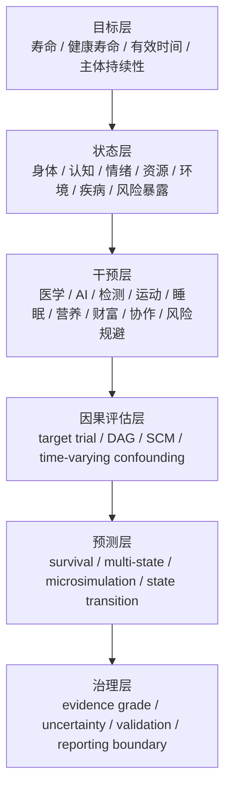

# Life-Path Prediction Model

Human Infra 的前一层工作是定性框架：定义主体持续性、子域边界、证据边界和技术位置。本文件定义下一层定量方向：用预测模型描述干预如何改变主体未来生命路径的概率分布。

## Core Idea

技术、资源、制度、医学、AI、环境和个人行为不应被直接标成“延寿变量”。它们应被看成干预算子：通过改变中间变量、状态转移和风险函数，改变寿命、健康寿命、有效时间、主观时间、相对时间和未来选择权。

```text
intervention A_t
  -> intermediate variables X_t
  -> subject state S_t
  -> state transition P(S_{t+1} | S_t, A_t)
  -> hazard lambda(t | S_t, A_t)
  -> survival curve P(T > t)
  -> lifespan, effective time, subjective time, relative time, option value
```

这个模型关注以下问题：

- 它改变哪些变量？
- 这些变量处于生物、认知、资源、工具、环境还是恢复层？
- 它改变的是当前状态、状态转移、观测能力还是行动能力？
- 它通过什么因果路径改变风险函数？
- 它以多大效应和不确定性改变未来生命路径分布？
- 它是否在可接受风险下扩大主体持续性和未来选择权？

## Time Types

| 时间类型 | 含义 | 典型问题 |
| --- | --- | --- |
| 寿命 | 死亡时间 `T` 的分布 | 干预是否降低死亡风险并右移生存曲线 |
| 健康寿命 | 存活且健康质量足够高的时间 | 干预是否推迟疾病、衰弱和失能 |
| 有效时间 | 主体可清醒、可行动、可判断、可创造的时间 | 干预是否增加可用认知和行动窗口 |
| 主观时间 | 主体实际体验到的时间成本和时间密度 | 休眠、等待、时间膨胀或沉浸体验如何改变等待成本 |
| 相对时间 | 主体时间相对外部世界推进速度的位置 | Future Waiting 路径是否让主体用较少固有时间抵达更远未来 |
| 未来选择权 | 主体未来仍可选择、修正和进入新技术窗口的能力 | 干预是否保留可逆性、学习能力、资源和制度入口 |

## Model Stack



## Reusable Model Families

| 模型族 | 可复用能力 | Human Infra 用法 |
| --- | --- | --- |
| 生存分析 | 建模死亡、疾病、失能和竞争风险事件时间 | 定义 `T`、`S(t)`、`lambda(t)` 和终点 |
| 多状态模型 | 建模健康、疾病、失能、恢复、死亡之间的转移 | 表达健康寿命、失能时间和恢复能力 |
| 动态健康影响模型 | 把风险因素变化映射到疾病、死亡和寿命变化 | 评估环境、行为、公共健康和资源干预 |
| 微观仿真 | 在个体或队列层面模拟长期状态路径 | 评估异质人群、政策、资源和慢病路径 |
| 因果推断 | 区分相关性和干预效果 | 约束每个技术主张的可识别性和偏差风险 |
| 动态决策模型 | 处理连续时间点上的状态、行动和反馈 | 建模策略序列，覆盖连续决策 |
| 有效时间度量 | 把生命长度和健康质量合成 | 连接寿命、健康质量、能力状态和价值函数 |

## Boundary

本模型当前是研究契约和治理草案。医疗器械、诊断系统、治疗推荐系统、保险核保模型、雇佣筛选模型和个体命运评分系统均在排除范围内。

任何输出都必须保留：

- 适用人群；
- 时间尺度；
- 证据等级；
- 因果假设；
- 不确定性；
- 负面影响；
- 个体差异；
- 机会成本；
- 不能作为医疗或人生决策自动化结论的边界。

## Source Traceability

- DYNAMO-HIA: dynamic modeling for health impact assessment. <https://journals.plos.org/plosone/article?id=10.1371/journal.pone.0033317>
- Future Elderly Model. <https://schaeffer.usc.edu/data/future-elderly-model/>
- Target trial emulation. <https://pubmed.ncbi.nlm.nih.gov/26994063/>
- OHDSI patient-level prediction. <https://www.ohdsi.org/web/wiki/doku.php?id=projects:workgroups:patient-level_prediction>
- NICE economic evaluation and QALY reference. <https://www.nice.org.uk/process/pmg36/chapter/economic-evaluation-2>
- WHO HALE metadata. <https://www.who.int/data/gho/indicator-metadata-registry/imr-details/7752>

## Maintenance

- Owner: Human Infra maintainers.
- Review trigger: new quantitative model, new model output type, new data source class, or new predictive claim.
- Related files: [Prediction Model Contract](../reference/life-path-prediction-model-contract.md), [Prediction Model Governance](../reference/life-path-prediction-model-governance.md), [Evidence Policy](../reference/evidence-policy.md).
