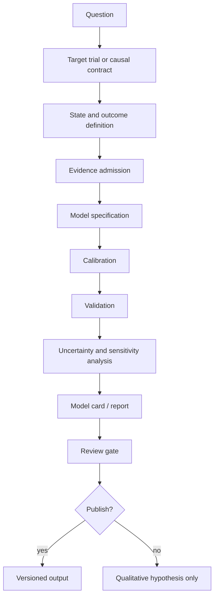

# Life-Path Prediction Model Governance

## Purpose

This document governs how Human Infra may create, review, publish, and revise quantitative predictions about lifespan, healthspan, effective time, subjective time, relative time, and future option value.

The governance target is not model sophistication. The target is preventing false certainty, unsafe recommendations, biased claims, and misuse of prediction outputs.

## Governance Principle

A quantitative prediction is acceptable only when all four layers are explicit:

```text
1. Conceptual model: what life-path mechanism is being modeled
2. Causal model: why the intervention is expected to change the outcome
3. Statistical model: how the effect is estimated or simulated
4. Use boundary: what decisions the output may and may not support
```

If any layer is missing, the output must be downgraded to qualitative hypothesis or research note.

## Model Lifecycle



## Required Artifacts

Any quantitative prediction artifact must include:

| Artifact | Required content |
| --- | --- |
| Model question | Population, intervention, comparator, outcome, horizon |
| Model contract | Variables, intervention operator, model family, output schema |
| Evidence table | Source, evidence type, grade, endpoint, limitations |
| Causal note | Target trial, DAG assumptions, confounding, selection, mediation |
| Validation note | Internal validation, external validation, calibration, backtest, or reason unavailable |
| Uncertainty note | Parameter uncertainty, structural uncertainty, sensitivity analysis, scenario range |
| Model card | Intended use, prohibited use, data limits, subgroup limits, update trigger |
| Review record | Reviewer, date, open risks, publication decision |

## Evidence Admission Rules

Evidence can enter a quantitative model only if it declares:

- source and retrieval date;
- population or organism;
- intervention or exposure definition;
- comparator;
- measured endpoint;
- follow-up duration;
- effect size or qualitative direction;
- uncertainty;
- bias risk;
- transferability limit.

The following are not sufficient as quantitative evidence by themselves:

- marketing claims;
- AI summaries;
- mechanism-only narratives;
- animal-only lifespan results for human effect estimates;
- biomarker-only results for mortality claims;
- cross-sectional correlations without causal qualification.

## Bias And Uncertainty Review

Reviewers must check:

| Risk | Required question |
| --- | --- |
| Confounding | Could baseline health, wealth, access, education, motivation, or care quality explain the effect? |
| Selection bias | Who enters the dataset, study, cohort, platform, or trial? |
| Survivor bias | Are only people who survived long enough to receive or report the intervention included? |
| Time-varying confounding | Does earlier treatment change later risk and later treatment choice? |
| Measurement bias | Are wearable, lab, survey, or administrative variables measuring the intended state? |
| Endpoint substitution | Is a biomarker being treated as disease, healthspan, or mortality evidence? |
| Transportability | Can evidence from one population, country, system, age, sex, or species transfer? |
| Tail risk | Could rare harm dominate average benefit for some subgroups? |
| Opportunity cost | What safer, cheaper, or higher-certainty intervention is displaced? |

## Validation Requirements

| Model stage | Minimum validation |
| --- | --- |
| Draft conceptual model | Check against contract and evidence policy |
| First quantitative prototype | Unit checks for formulas, simulated sanity checks, explicit assumptions |
| Research model | Calibration against known baseline mortality, disease incidence, or health expectancy |
| Comparative model | Sensitivity analysis and scenario comparison |
| Prediction model | Internal validation, calibration, discrimination if applicable, and external validation plan |
| Public-facing model | Model card, prohibited-use statement, uncertainty display, and human review |

No model may claim readiness for personal decision support without external validation, safety review, and explicit clinical or ethical governance beyond this repository.

## Reporting Rules

Allowed wording:

```text
Under assumptions A, evidence grade G, and population P,
the model estimates intervention I may shift outcome O by range R
over horizon H, with uncertainty U and risks K.
```

Forbidden wording:

```text
This technology extends your life by N years.
This model predicts your death date.
This intervention is optimal for you.
This biomarker improvement proves longevity benefit.
This AI output replaces clinical judgment.
```

## Review Gate

A quantitative prediction must not be published unless all checklist items pass.

| Gate | Pass condition |
| --- | --- |
| Contract completeness | Population, intervention, comparator, outcome, horizon, uncertainty are present |
| Causal clarity | Target trial or causal graph assumptions are stated |
| Evidence separation | Mechanism, biomarker, clinical endpoint, mortality, and safety evidence are separate |
| Model location | Claim identifies state transition, hazard, observation, or policy effect |
| Uncertainty | At least one uncertainty representation is provided |
| Misuse boundary | Prohibited uses and non-medical-advice boundary are explicit |
| Traceability | Sources link back to original evidence or standards |
| Review status | Draft, reviewed, blocked, or published status is visible |

## Source Traceability

- TRIPOD statement for prediction model reporting. <https://www.tripod-statement.org/>
- PROBAST risk-of-bias tool for prediction models. <https://www.probast.org/>
- OHDSI patient-level prediction. <https://www.ohdsi.org/web/wiki/doku.php?id=projects:workgroups:patient-level_prediction>
- NICE economic evaluation guidance. <https://www.nice.org.uk/process/pmg36/chapter/economic-evaluation-2>
- Target trial emulation. <https://pubmed.ncbi.nlm.nih.gov/26994063/>
- ISPOR-SMDM modeling good research practices landing page. <https://www.ispor.org/heor-resources/good-practices>

## Maintenance

- Owner: Human Infra maintainers.
- Review trigger: model contract changes, new quantitative output, new evidence grade, new data class, or new public-facing claim.
- Related files: [Prediction Model Contract](life-path-prediction-model-contract.md), [Evidence Policy](evidence-policy.md), [Ethics And Safety Boundaries](ethics-and-safety-boundaries.md), [Review Checklists](review-checklists.md).
